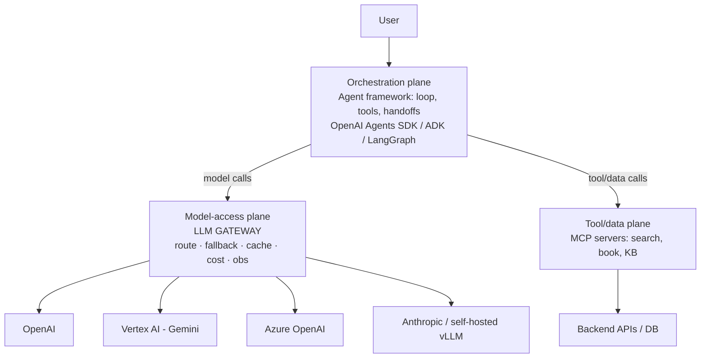

# Chapter 41 — LLM Gateway (AI Gateway / Model Router)

> **Why this chapter exists:** Any serious production LLM system that talks to more than one model — or that needs cost control, reliability, and observability — puts an **LLM Gateway** in front of the providers. It's a core LLMOps building block and a frequent interview topic for senior AI roles. It's especially relevant to multi-provider JDs: the **Rakuten Travel AI Application Engineer** role (Ch. 40) literally says *"implement using LLM APIs (e.g., OpenAI, Vertex AI, Azure OpenAI)"* — a gateway is exactly how you make three providers look like one and govern them in production. This chapter pairs with Ch. 34 (MCP — the *tool* plane), Ch. 10 (MLOps/LLMOps), and Ch. 13 (frameworks — the *orchestration* plane).

---

## 41.1 What an LLM Gateway is (one paragraph)

An **LLM Gateway** is a proxy / control plane that sits between your applications (and agents) and one or more LLM providers. Clients call the gateway through a **single, unified API** (usually OpenAI-compatible); the gateway decides **which** model/provider/region to route to, handles **retries and fallbacks** on failure, applies **rate limits and budgets**, **caches** responses, **redacts/guards** content, and emits **logs, traces, token and cost metrics** — all centrally, so individual apps don't each reinvent it. Think **"API gateway, but specialized for LLM traffic."**

```
        WITHOUT a gateway                         WITH a gateway
   app ─▶ OpenAI  (own keys, own retry)      app ─┐
   app ─▶ Azure   (own keys, own logging)    app ─┼─▶ [ LLM GATEWAY ] ─▶ OpenAI / Azure / Vertex / vLLM
   agent ▶ Vertex (own cost tracking)        agent┘   route · fallback · cache · limit · log · cost
   (N apps × M providers = N×M glue)              (one place to govern all LLM traffic)
```

---

## 41.2 Where it sits — the three planes of an agent system

A common senior-level confusion is mixing up the gateway, the agent framework, and MCP. They are **different layers**:



- **Orchestration plane** (agent framework): the *loop* — decides what to do, calls tools, manages state.
- **Model-access plane** (LLM gateway): *how* model calls are made — which provider, fallback, cache, budget. **This chapter.**
- **Tool/data plane** (MCP, Ch. 34): *what* the agent can act on — tools and data sources.

**One-liner for the interview:** *"MCP standardizes the tool/data layer; the LLM gateway standardizes the model-access layer. The agent framework sits on top and uses both."*

---

## 41.3 What a gateway does — the feature checklist

| Capability | What it solves | Why it matters in production |
|---|---|---|
| **Unified API** (OpenAI-compatible) | One SDK/endpoint for all providers | Swap `gpt-4.1` → `gemini-2.5-pro` → `claude-opus-4-8` with a string; no app rewrites |
| **Routing** | Pick model by cost, latency, capability, or rules | Cheap model for routing/slot-filling, strong model for hard reasoning |
| **Fallback + retry** | Provider outage, 429s, timeouts | If OpenAI is down/rate-limited, transparently retry on Azure/Vertex — uptime ↑ |
| **Load balancing** | Spread across keys/regions/deployments | Beat per-key rate limits; use multiple Azure deployments |
| **Rate limiting & quotas** | Per team/user/key TPM/RPM caps | Stop one app from starving others or blowing the budget |
| **Caching** (exact + semantic) | Repeated/near-duplicate prompts | Latency ↓ and cost ↓ on FAQ-like traffic |
| **Cost tracking & budgets** | Per-key/team spend, hard caps, chargeback | Finance visibility; kill runaway agents |
| **Observability** | Logs, traces, token counts, latency | Debug agents, feed eval (Ch. 40 §40.9), SLOs |
| **Key / secret management** | Real provider keys hidden; issue **virtual keys** | Apps never see raw keys; rotate/revoke centrally |
| **Guardrails / PII** | Redact PII, block unsafe content | Compliance (APPI/GDPR), safety — some gateways only |
| **Prompt mgmt / versioning** | Central prompt registry, A/B prompts | Treat prompts as versioned artifacts — some gateways |
| **Streaming passthrough** | SSE/stream relayed to client | Don't break token streaming through the proxy |

---

## 41.4 The landscape — pick the right tool

| Gateway | Type | Notable strengths |
|---|---|---|
| **LiteLLM** | OSS proxy + Python SDK | 100+ providers, OpenAI-compatible, router/fallback/budgets/caching; the de-facto OSS default |
| **Portkey** | SaaS + OSS | Routing, guardrails, prompt mgmt, observability; strong enterprise features |
| **Cloudflare AI Gateway** | SaaS (edge) | Caching, rate limiting, analytics at the edge; provider-agnostic |
| **Kong AI Gateway** | API-gateway plugin | For teams already on Kong; AI-specific plugins |
| **Databricks / MLflow AI Gateway** | Platform | If you're on Databricks/MLflow; unifies routes |
| **AWS Bedrock** | Managed | Multi-model behind one API on AWS (gateway-*ish*); + Bedrock Guardrails |
| **Azure API Management** (for Azure OpenAI) | Managed | Token-based throttling, multi-deployment load balancing on Azure |
| **OpenRouter** | SaaS | One API key to many hosted models; quick experimentation |
| **Helicone** | SaaS/OSS | Lightweight proxy focused on observability + caching |

**On GCP/Vertex (Rakuten context):** Vertex AI exposes many models behind one API and integrates with Apigee for gateway-style governance; you can also run **LiteLLM/Portkey** in front of Vertex + OpenAI + Azure to unify all three.

---

## 41.5 Code — using a gateway (LiteLLM examples)

### 41.5.1 SDK: one interface, many providers

```python
from litellm import completion   # pip install litellm

# Identical call shape; only the model string changes:
r1 = completion(model="gpt-4.1",                    messages=[{"role":"user","content":"Plan a Kyoto trip"}])
r2 = completion(model="vertex_ai/gemini-2.5-pro",   messages=[{"role":"user","content":"Plan a Kyoto trip"}])
r3 = completion(model="azure/my-gpt4-deployment",   messages=[{"role":"user","content":"Plan a Kyoto trip"}])
r4 = completion(model="anthropic/claude-opus-4-8",  messages=[{"role":"user","content":"Plan a Kyoto trip"}])
print(r1.choices[0].message.content)
```

### 41.5.2 Router: load balancing + fallback + strategy

```python
from litellm import Router

router = Router(
    model_list=[
        # Two deployments behind one logical name → load-balanced
        {"model_name": "travel-llm", "litellm_params": {"model": "openai/gpt-4.1"}},
        {"model_name": "travel-llm", "litellm_params": {"model": "azure/gpt4-tokyo"}},
    ],
    # If "travel-llm" fails (outage / 429), fall back to Gemini on Vertex:
    fallbacks=[{"travel-llm": ["vertex_ai/gemini-2.5-pro"]}],
    routing_strategy="latency-based-routing",   # or "usage-based", "cost-based"
    num_retries=3,
    timeout=30,
)
resp = router.completion(model="travel-llm",
                         messages=[{"role": "user", "content": "Find a ryokan in Kyoto under ¥35,000"}])
```

### 41.5.3 Self-hosted proxy: a YAML control plane (no app code changes)

Run `litellm --config config.yaml`; apps then point their **OpenAI base URL** at the proxy and use a **virtual key**.

```yaml
model_list:
  - model_name: travel-llm                 # logical name apps call
    litellm_params: { model: openai/gpt-4.1, api_key: os.environ/OPENAI_API_KEY }
  - model_name: travel-llm                 # second backend → load-balanced
    litellm_params: { model: azure/gpt4-tokyo, api_base: os.environ/AZURE_BASE, api_key: os.environ/AZURE_KEY }

litellm_settings:
  num_retries: 3
  request_timeout: 30
  cache: true                               # response caching

router_settings:
  routing_strategy: latency-based-routing
  fallbacks: [{ "travel-llm": ["vertex_ai/gemini-2.5-pro"] }]

general_settings:
  master_key: os.environ/LITELLM_MASTER_KEY
  database_url: os.environ/DATABASE_URL     # for virtual keys, budgets, spend logs
```

```python
# Apps don't know there are 3 providers — they just call the gateway:
from openai import OpenAI
client = OpenAI(base_url="http://llm-gateway.internal:4000", api_key="sk-virtual-team-travel")
resp = client.chat.completions.create(model="travel-llm",
                                       messages=[{"role":"user","content":"..."}])
```

---

## 41.6 Code — the internals (build a minimal gateway)

Interviewers love "could you build one?" Show you understand the mechanics: a thin async proxy that **routes → tries primary → falls back → logs cost**.

```python
from fastapi import FastAPI, Request, HTTPException
import time

app = FastAPI()

# Ordered route per logical model: primary first, then fallbacks
ROUTES = {
    "travel-llm": ["openai/gpt-4.1", "azure/gpt4-tokyo", "vertex_ai/gemini-2.5-pro"],
}
PRICE_PER_1K = {"openai/gpt-4.1": 0.01, "azure/gpt4-tokyo": 0.01, "vertex_ai/gemini-2.5-pro": 0.007}

async def call_provider(provider: str, body: dict) -> dict:
    ...  # provider-specific client call (translate to its API, return normalized response)

def log_spend(provider, usage, latency_ms, virtual_key):
    cost = usage["total_tokens"] / 1000 * PRICE_PER_1K.get(provider, 0)
    # emit metric: cost, tokens, latency, provider, key  -> Prometheus / Langfuse / DB
    print(f"key={virtual_key} provider={provider} tokens={usage['total_tokens']} "
          f"cost=${cost:.4f} latency={latency_ms}ms")

@app.post("/v1/chat/completions")
async def proxy(req: Request):
    body = await req.json()
    vkey = req.headers.get("authorization", "")
    # (here: authN virtual key, enforce rate limit + budget, check cache) ...
    last_err = None
    for provider in ROUTES.get(body["model"], []):       # routing + fallback
        try:
            t0 = time.time()
            resp = await call_provider(provider, body)    # retry inside if transient
            log_spend(provider, resp["usage"], int((time.time() - t0) * 1000), vkey)
            return resp                                   # success → return immediately
        except Exception as e:                            # 429 / 5xx / timeout
            last_err = e
            continue                                      # try next provider
    raise HTTPException(503, f"all providers failed: {last_err}")
```

**Talking points on this code:** routing table per logical model; **fallback = try the next provider on failure**; cost computed from token usage × price; spend logged per **virtual key** for chargeback + budgets; in real life you'd add **rate limiting** (token bucket per key), **caching** (hash of normalized request → response; semantic cache via embeddings), and **streaming passthrough** (relay SSE chunks rather than buffering).

---

## 41.7 Design considerations (the senior-level nuances)

- **Latency overhead & SPOF:** the gateway adds a hop and is a single point of failure → run it **stateless + horizontally scaled behind a load balancer**, health-check it, and keep an SDK-side direct fallback for the rare case the gateway itself is down.
- **Streaming:** must **pass through** SSE/streamed tokens, not buffer the whole response — otherwise you kill perceived latency for chat UIs.
- **Caching correctness:** exact-match cache is safe; **semantic cache** (embed the prompt, serve a near-duplicate's answer) needs a similarity threshold and is unsafe for personalized/stateful prompts — scope it to stateless FAQ-like traffic.
- **Security:** apps hold **virtual keys**, never raw provider keys; rotate/revoke centrally; audit every call. The gateway is a natural place for **PII redaction** before prompts leave your network.
- **Multi-region / data residency:** route Japan traffic to Tokyo-region deployments (Vertex `asia-northeast1`, Azure Japan East) for **APPI** compliance and latency (ties to Ch. 40 §40.28.4).
- **Consistency traps:** providers differ in tokenizers, max context, tool-call formats, and stop-sequence behavior — a good gateway **normalizes** these, but you must test that fallbacks produce comparable output quality, not just a 200 response.
- **Cost vs reliability:** cost-based routing can send traffic to a cheaper-but-weaker model; pair it with the **eval gate** (Ch. 40 §40.9) so a routing change can't silently degrade quality.

---

## 41.8 Interview Q&A

1. **"What's an LLM gateway and why use one?"** → §41.1 + §41.3: unified API, routing, fallback, rate limit, cache, cost, observability — centralized so N apps don't each reinvent it.
2. **"Gateway vs MCP vs agent framework?"** → §41.2: model-access plane vs tool/data plane vs orchestration plane.
3. **"How do you keep the agent up if OpenAI is rate-limiting you?"** → fallback chain to Azure/Vertex + retries + load-balanced keys/deployments (§41.5.2).
4. **"How would you cut LLM cost in production?"** → model tiering via routing, exact + semantic caching, prompt caching, per-key budgets, token tracking — all gateway-enforced (§41.3).
5. **"How do you stop one team blowing the whole LLM budget?"** → virtual keys with per-key budgets + rate limits + spend dashboards (§41.5.3).
6. **"Build vs buy?"** → Buy/adopt OSS (LiteLLM/Portkey) for standard needs; build a thin proxy only for unusual routing/compliance. Don't hand-roll N×M provider glue (§41.4, §41.6).
7. **"Downsides of a gateway?"** → extra hop/latency, SPOF, a cache-correctness and output-consistency surface to manage (§41.7).
8. **"How do you route between models?"** → rules (capability), latency-based, cost-based, or usage-based; cheap model for routing, strong for reasoning (§41.5.2).
9. **"How does the gateway help evaluation/observability?"** → it logs every call (tokens, cost, latency, prompt/response) → feed eval harness + SLOs (Ch. 40 §40.9, Ch. 10).
10. **"Where do guardrails/PII redaction fit?"** → at the gateway, before prompts leave your network and before responses return — a single chokepoint for policy.
11. **"Caching pitfalls?"** → semantic cache on personalized/stateful prompts returns wrong answers; scope to stateless FAQ traffic with a tuned threshold (§41.7).
12. **"Streaming through a proxy?"** → relay SSE chunks; never buffer — otherwise latency regresses (§41.7).

---

## 41.9 Red-flag traps

- **"Just hard-code OpenAI."** → Single-provider lock-in: no fallback, no cost control, painful migration. The Rakuten JD names three providers for a reason.
- **"Cache everything."** → Semantic-caching personalized/booking prompts serves another user's answer. Scope caching carefully.
- **"The gateway makes us reliable."** → It's also a SPOF; you must HA it and keep a direct-call fallback.
- **"Cheaper model via routing = free win."** → Not without an eval gate; a routing change can silently degrade quality.
- **Confusing gateway with MCP.** → Model plane ≠ tool plane. Know the difference cold (§41.2).

---

## 41.10 Resume tie-ins (Sachin)

- **Multi-provider reality:** you run **Claude in production** *and* are fluent in OpenAI — frame it as *"I'd put a gateway (LiteLLM/Portkey) in front so OpenAI, Vertex, and Azure OpenAI look like one API, with fallback and per-team budgets."* Directly answers the Rakuten JD's multi-provider line.
- **Cost & reliability:** tie to your production instincts (p99 latency, cost-aware serving) — the gateway is where you'd enforce token budgets and provider fallback for a customer-facing travel agent.
- **Observability:** your Datadog drift dashboards → same instinct, applied to LLM traffic (tokens/cost/latency per call) feeding the eval harness (Ch. 40 §40.9).
- **Claude Solution Architect cert trajectory:** gateways are core LLMOps; mentioning LiteLLM/Portkey/Bedrock + the build-vs-buy reasoning shows current, hands-on LLMOps depth.

---

Continue to **[Chapter 40 — Rakuten Travel AI Office](40_rakuten_travel_ai_intel.md)** for how this plugs into a real role, or **[Chapter 34 — MCP](34_mcp_deep_dive.md)** for the tool plane.
