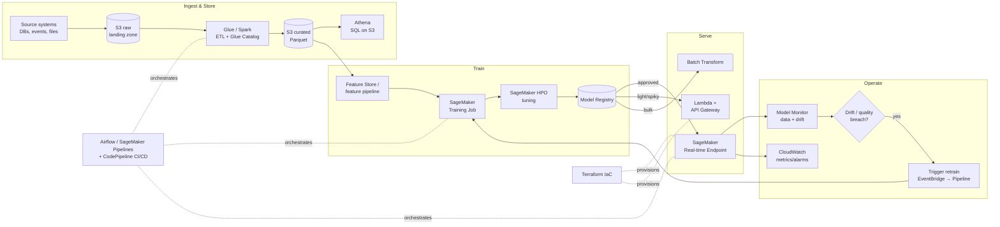

# Chapter 44 — Cognine: Senior Machine Learning Engineer (AWS) — First-Round Technical Prep

> **Why this chapter exists:** You have the **first-round technical interview with Cognine** for a **Senior Machine Learning Engineer (AWS)** role (recruiter: Kiran Bejjanki, Microsoft Teams call). Generic ML prep gets you a generic score. This chapter is the company-specific + AWS-specific layer that makes you sound like someone who *already works the way Cognine works*. Read Section 1–5 slowly the night before, drill Section 6–9 (the technical meat), and skim Section 11 (rapid-fire) + Section 12 (cheatsheet) the morning of.
>
> **Pairs with:** Ch.10 (MLOps/LLMOps), Ch.11 (AWS & Azure), Ch.14 (Monitoring & Drift), Ch.16 (System Design), Ch.24 (Airflow), Ch.38 (Lambda cold-start ML). This chapter assumes those and adds the Cognine framing.

---

## 1. The 60-second situation brief

| Item | Detail |
|------|--------|
| **Company** | Cognine (Cognine Technologies Pvt Ltd) |
| **Role** | Senior Machine Learning Engineer — **AWS** focus |
| **Round** | First round — **technical screen** (Teams) |
| **Recruiter/organizer** | Kiran Bejjanki (kiran.bejjanki@cognine.com) |
| **Format** | ~45–60 min video call; expect a mix of resume walkthrough, AWS ML depth, one or two applied/design questions, maybe a small live-coding or "explain this" moment |
| **Your edge** | 8 yrs production ML in **banking + healthcare**, current **Senior MLE at TrueBalance**, deep **AWS MLOps** (SageMaker, Lambda, S3, Athena, CloudWatch), IaC with Terraform, Spark + Airflow, TensorFlow-certified + PyTorch |

**The single sentence that frames your whole interview:**
> "I build and operate production ML on AWS end-to-end — from data pipelines on Spark/Airflow and features in S3/Athena, to training and serving on SageMaker, to CI/CD, drift monitoring, and cost control in production."

First rounds are **filters, not deep dives**. The interviewer is checking three things: (1) Can you actually do the AWS ML work, or are you a résumé? (2) Do you communicate cleanly? (3) Are you a low-risk, senior-level hire who won't need hand-holding. Aim to be *concrete and calm*, not exhaustive.

---

## 2. Cognine in a few paragraphs (read this slowly once)

Cognine is an **AI-driven technology services and product-engineering company**, founded in **2018** by **Pradeep Pavuluri** and **Sudhir Gundala**, with a **dual-HQ footprint**: a US front office in **Schaumburg, Illinois** (Chicago metro) and its primary engineering center in **Hyderabad, India** (Kavuri Hills / Madhapur). Headcount is in the **~150–200 engineer** range — big enough to run serious client programs, small enough that a senior engineer is visible and expected to deliver from month one. It is **bootstrapped / unfunded**, which is the most important cultural fact: like Avrioc, this means they care about **real client margin and billable delivery**, not growth-at-all-costs. They hire people who bill senior rates and justify them.

Structurally, Cognine is a **services + GCC (Global Capability Center) company**, not a single-product startup. That means the ML work is **client-facing and project-shaped**: you are dropped into a client's problem (a logistics firm, a healthcare payer, a bank/insurer, a manufacturer) and expected to stand up a working ML system on *their* cloud — very often **AWS** — under real delivery deadlines. This is the opposite of "research a model for two quarters." It rewards engineers who can **scope, ship, and operate** quickly and safely. Your ResMed/TrueBalance profile — platform that hosted many models fast, integrated with real enterprise systems — is *exactly* this shape. Say so.

Their stated capability areas are: **AI Development** (machine & deep learning, Generative AI, intelligent process automation, RPA), **Data & Analytics** (data engineering, predictive analytics, visualization, data quality), **Digital Engineering** (app/product engineering, integrations, QA), **Cloud Development** (architecture advisory across **AWS, Azure, GCP**), and **GCC-as-a-Service** (standing up offshore capability centers for clients). They hold **ISO 27001** and are **Great Place to Work** certified, and they name **AWS, Microsoft, Google Cloud, Oracle, MuleSoft, Salesforce, UiPath** as technology partners. **Industries: freight & logistics, healthcare, financial services (banking / payments / insurance), and manufacturing.**

> **How to say this in the interview (opening rapport):**
> "I like that Cognine is a delivery-focused engineering shop across logistics, healthcare and financial services — that's the exact world I've shipped in: banking and healthcare ML at TrueBalance and earlier at ResMed. And since a lot of the delivery is on AWS, that maps directly to how I've built — SageMaker, Lambda, S3/Athena, with Terraform and Airflow around it."

---

## 3. What Cognine's ML work actually looks like (and your talking points per industry)

Because Cognine is services-led, the interviewer may probe **breadth**: "have you done X in domain Y?" Here is the map from their industries to concrete ML systems, so you always have a relevant example ready.

| Industry | Representative ML problems | Your hook |
|----------|---------------------------|-----------|
| **Freight & logistics** | ETA prediction, route/load optimization, demand forecasting per lane, OCR on bills-of-lading/PODs, exception detection | Time-series + geospatial features; you've done real-time inference + drift monitoring — see the system-design in §9 |
| **Healthcare** | Claims adjudication, clinical document extraction (NLP), readmission/risk prediction, medical coding assist, prior-auth automation | **You have direct healthcare ML experience (ResMed)** — lead with HIPAA-aware pipelines, PII handling |
| **Financial services** | Credit risk / PD-LGD, fraud & AML, transaction categorization, churn, KYC document extraction, underwriting assist | **You have direct banking ML (TrueBalance)** — lead with imbalanced-class handling, explainability, model governance |
| **Manufacturing** | Predictive maintenance, defect detection (vision), yield optimization, forecasting | Sensor time-series + anomaly detection; frame as the same MLOps loop |
| **Cross-cutting (all)** | **GenAI / RAG** copilots, intelligent document processing (IDP), RPA + ML hybrids | Bedrock/Claude + RAG; you run a Claude-powered ML workspace today |

**Rule:** whenever they ask an abstract question, *answer it, then anchor it to a Cognine-relevant domain*. "Here's how I'd detect drift in general… and for a logistics ETA model specifically, the sharpest drift signal is usually a distribution shift in the traffic/seasonality features after a holiday."

---

## 4. The role decoded — "Senior ML Engineer (AWS)"

The recruiter thread emphasized: *8 yrs production ML, strong AWS + MLOps (SageMaker, Lambda, S3, Athena, CloudWatch), CI/CD, containerized deployment, drift monitoring, Terraform IaC, production Python, TensorFlow/PyTorch, Spark + Airflow.* Reverse-engineer that into what they will test:

```
                     "Senior ML Engineer (AWS)" — what they actually want
   ┌───────────────────────────────────────────────────────────────────────────┐
   │                                                                             │
   │   40%  AWS ML ENGINEERING          30%  MLOps / PRODUCTION                   │
   │   • SageMaker train/tune/serve     • CI/CD for models                        │
   │   • Lambda + API for inference     • Model registry & versioning             │
   │   • S3 / Athena / Glue data        • Drift + data-quality monitoring         │
   │   • Cost & autoscaling             • Terraform IaC, containers               │
   │                                                                             │
   │   20%  CORE ML DEPTH               10%  COMMUNICATION / SENIORITY            │
   │   • Framing, metrics, validation   • Mentoring, scoping, trade-offs          │
   │   • Imbalance, leakage, drift      • Client-facing clarity                   │
   │   • Classic ML + some GenAI/RAG    • "I'd de-risk it this way"               │
   └───────────────────────────────────────────────────────────────────────────┘
```

**Senior ≠ "knows more algorithms."** Senior = *judgment under constraints*: you pick the boring, reliable option; you talk about failure modes, monitoring, cost, and rollback before they ask; you scope down to ship. Every answer should carry a whiff of "…and here's how it breaks in production and how I'd catch it."

---

## 5. Positioning Sachin — resume → role, and 3 signature stories

Map each résumé pillar to what Cognine buys:

| You have | Cognine hears | One-line proof |
|----------|---------------|----------------|
| 8 yrs, Senior MLE @ TrueBalance | Can own delivery end-to-end | "I own models from data to production and their monitoring." |
| Banking + healthcare | Fits their two biggest verticals + compliance instincts | "PII/HIPAA-aware pipelines are muscle memory for me." |
| AWS SageMaker/Lambda/S3/Athena/CloudWatch | Immediately billable on AWS accounts | "I've built the full SageMaker loop plus Lambda inference." |
| Terraform, CI/CD, containers | Reproducible, hand-offable delivery | "Infra is code; a teammate can stand up my stack from the repo." |
| Spark + Airflow | Can build the data layer, not just the model | "I don't wait for a data team; I build the pipeline." |
| Drift monitoring | Thinks past the demo | "The model isn't done until Model Monitor + alerts are live." |

**Three signature stories** (rehearse each as **STAR**, 90 seconds each — keep numbers honest):

1. **The MLOps platform story** — the ResMed/TrueBalance platform that let *many* models ship fast on shared infra (feature store, registry, monitoring). *Signal: platform thinking, exactly Cognine's "reuse across clients" need.*
2. **The AWS production story** — one model taken from notebook → SageMaker training → endpoint/Lambda → CloudWatch alarms → drift monitor, with a concrete latency/cost number. *Signal: the core competency of this role.*
3. **The "it broke and I caught it" story** — a drift/data-quality incident you detected via monitoring and remediated (retrain / rollback / feature fix). *Signal: seniority = operating, not just building.*

> Keep a fourth in your pocket: a **stakeholder/scoping** story (said no to a fancy model, shipped the simple one that hit the SLA) — perfect for a services company.

---

## 6. The AWS ML reference architecture you MUST be able to draw

If you can whiteboard this from memory and narrate the data flow, you pass the AWS portion. Practice drawing it in 90 seconds.



**Narration script (say this out loud):**
> "Raw data lands in S3. Glue or Spark curates it to Parquet, registered in the Glue Catalog so Athena can query it with SQL. Features are computed and versioned. SageMaker trains and tunes; the approved model goes into the Model Registry. From there I choose a serving pattern — a real-time endpoint for steady low-latency traffic, Lambda + API Gateway for spiky or lightweight models, or Batch Transform for offline scoring. In production, Model Monitor watches data quality and drift, CloudWatch holds latency/error/throughput and alarms, and a drift breach fires EventBridge to kick off a retraining pipeline. The whole thing is Terraform-provisioned and orchestrated by Airflow or SageMaker Pipelines with CI/CD in CodePipeline."

**The serving-pattern decision table (a favorite senior question):**

| Pattern | Use when | Latency | Cost model | Gotcha |
|---------|----------|---------|-----------|--------|
| **Real-time endpoint** | Steady traffic, <100 ms, always-on | Low, predictable | Pay for instance-hours (idle cost) | Right-size + autoscaling; else you burn money idle |
| **Serverless endpoint / Lambda** | Spiky/low volume, tolerate cold starts | Cold-start hit | Pay per request | Cold starts (see Ch.38); package/model size limits |
| **Batch Transform** | No online need, score millions offline | N/A (throughput) | Job duration only | Not for interactive use |
| **Multi-model endpoint (MME)** | Many small models, one fleet | Low (warm) | Shared instances | Cold model load on first hit; noisy-neighbor |
| **Async endpoint** | Large payloads / long inference | Seconds–minutes | Instance + queue | Client must poll/callback |

---

## 7. Deep technical topics — with worked examples

### 7.1 SageMaker end-to-end (the thing they'll poke at most)

**Training job** = you hand SageMaker a container (built-in algo, framework container like TF/PyTorch, or your own), an S3 input path, an instance type, and hyperparameters. It spins up instances, runs your `train.py`, writes the model artifact to S3, and tears down. You pay only for the job duration.

**Hyperparameter tuning (HPO)** = a tuning job launches many training jobs over a search space (Bayesian by default, or random/grid), optimizing an objective metric your script emits. Set `max_jobs` and `max_parallel_jobs`; parallel jobs speed wall-clock but make Bayesian less efficient (fewer sequential learnings).

**Deployment** = register artifact → create model → endpoint config (instance type, count, variants) → endpoint. **Production variants** let you A/B or canary by weight.

```python
# Minimal, honest SageMaker sketch you could whiteboard/pseudocode
from sagemaker.sklearn.estimator import SKLearn

est = SKLearn(
    entry_point="train.py",
    role=ROLE,
    instance_type="ml.m5.xlarge",
    framework_version="1.2-1",
    hyperparameters={"n_estimators": 400, "max_depth": 8},
)
est.fit({"train": "s3://bucket/curated/train/",
         "validation": "s3://bucket/curated/val/"})

# Deploy with autoscaling + a canary weight
predictor = est.deploy(initial_instance_count=2,
                       instance_type="ml.m5.large")
# then attach Application Auto Scaling target-tracking on
# SageMakerVariantInvocationsPerInstance
```

> **Senior signal:** mention **Spot instances for training** (checkpoint to S3 so interruptions are cheap), **local mode** for fast debugging, and **`ml.*` right-sizing** — training on GPU when it's CPU-bound is a classic waste.

### 7.2 Feature engineering & the feature store problem

The interviewer may ask "how do you avoid **training/serving skew**?" The clean answer:

```
   Offline (training)                 Online (serving)
   ┌───────────────┐                  ┌───────────────┐
   │ Spark/Athena  │  same logic →    │ same transform│
   │ computes feat │  ONE definition  │ at request time│
   └──────┬────────┘                  └──────┬────────┘
          └──────────► Feature Store ◄───────┘
                     (offline + online)
```

- **Skew** happens when the training feature and the serving feature are computed by *different code paths*. Fix: a single feature definition (feature store like **SageMaker Feature Store**, or shared transform library) feeding both.
- **Point-in-time correctness / leakage:** when building training rows, only use feature values **as of the label timestamp** — never join "latest" values. This is the #1 subtle bug in real ML systems; naming it flags seniority.

### 7.3 A fully worked classic-ML example — fraud/credit-risk (their fintech vertical)

They may ask you to *reason through a real model*, not just recite. Here's a compact worked example you can reproduce.

**Problem:** flag fraudulent transactions. **Key property:** extreme class imbalance (~0.2% positive).

1. **Metric choice** — accuracy is useless (99.8% by predicting "not fraud"). Use **PR-AUC** (precision-recall) as the headline; report **precision@k / recall@fixed-precision** because Ops can only review N alerts/day. ROC-AUC is fine but optimistic under heavy imbalance.
2. **Validation** — **time-based split** (train on past, test on future). Random K-fold leaks future info in fraud/time-series. **Group by customer** so the same account isn't in train and test.
3. **Imbalance handling** — class weights or focal loss beat naive oversampling in production; if resampling, do it **inside the CV fold only** (else leakage). SMOTE looks great offline and often disappoints online — say that.
4. **Leakage traps** — a feature like `is_chargeback` or `account_closed` is populated *after* the fraud is known → leaks the label. Audit features for "would I actually have this at prediction time?"
5. **Threshold** — pick it from the PR curve to hit the business constraint (e.g., "review budget = 500 alerts/day → set threshold to the score at rank 500").
6. **Explainability** — SHAP values per alert so a fraud analyst sees *why*; regulators and Ops both demand this in fintech.
7. **Serving** — real-time endpoint behind the payments flow, p99 budget maybe 50 ms → keep the model small (gradient-boosted trees, not a giant net), cache stable features.
8. **Monitoring** — fraud patterns drift *adversarially and fast*; watch feature drift (PSI) **and** the precision of confirmed alerts weekly; schedule frequent retrains.

> **The math they might ask:** "Why PR-AUC over ROC-AUC under imbalance?" — ROC's x-axis is FPR = FP/(FP+TN); with a huge TN (all the legit txns), FPR barely moves even when false positives are large in *absolute* terms, so ROC looks rosy. Precision = TP/(TP+FP) directly exposes that pain. That one paragraph reliably impresses.

### 7.4 CI/CD for ML (MLOps loop)

```
   commit ──► CodePipeline / GitHub Actions
                     │
      ┌──────────────┼───────────────────────────┐
      ▼              ▼                             ▼
   unit tests    data validation             build container
   (code)        (schema, ranges,            (ECR image)
                  drift on new data)
                     │
                     ▼
             SageMaker Pipeline:
             process → train → evaluate ──► metrics gate?
                                              │ pass
                                              ▼
                                    register model (Registry)
                                              │ manual/auto approve
                                              ▼
                                    deploy canary → monitor → promote
```

Key senior points: **a metrics gate** (don't auto-deploy a model worse than prod), **model + data + code all versioned** (reproducibility), **canary/shadow deploy** before full traffic, and **automated rollback** on CloudWatch alarm. "Model registry approval" is the human-in-the-loop control clients love.

### 7.5 Drift & monitoring (see Ch.14 for the deep version)

- **Data drift** — input distribution shifts. Detect with **PSI** (Population Stability Index; >0.2 = investigate, >0.25 = act) or **KS test** per feature.
- **Concept drift** — the X→y relationship changes (fraud tactics evolve). You only see it via **label feedback / performance decay**; hence you need a ground-truth loop.
- **Data quality** — nulls, schema changes, range violations — often the *real* production killer, catch it before drift math.
- On AWS: **SageMaker Model Monitor** (baseline → scheduled monitoring → violations to CloudWatch → EventBridge → retrain).

> **PSI in one formula:** `PSI = Σ (actual% − expected%) · ln(actual% / expected%)` over bucketed feature values. Memorize the 0.1 / 0.2 thresholds.

### 7.6 GenAI / RAG on AWS (breadth insurance)

Cognine sells GenAI. Have a crisp answer: **Amazon Bedrock** for managed foundation models (Claude, Titan), **OpenSearch / pgvector / Kendra** for retrieval, **RAG** to ground answers in client docs, guardrails for PII, and evaluation with RAGAS-style metrics (see Ch.07/27). One sentence on **intelligent document processing** (Textract → chunk → embed → RAG) covers their logistics/healthcare doc-extraction use cases.

---

## 8. Likely live-coding / "write this" moments (Python)

First rounds sometimes include a *small* coding or "talk through code" task. Two high-probability ones:

**(a) Vectorized metric from scratch** — proves you know the math and NumPy.
```python
import numpy as np

def precision_recall_at_threshold(y_true, y_score, thr):
    y_pred = (y_score >= thr).astype(int)
    tp = np.sum((y_pred == 1) & (y_true == 1))
    fp = np.sum((y_pred == 1) & (y_true == 0))
    fn = np.sum((y_pred == 0) & (y_true == 1))
    precision = tp / (tp + fp) if (tp + fp) else 0.0
    recall    = tp / (tp + fn) if (tp + fn) else 0.0
    return precision, recall
```

**(b) A clean, testable transform** (they value production Python):
```python
from dataclasses import dataclass

@dataclass(frozen=True)
class FeatureConfig:
    log_cols: tuple[str, ...]
    clip_upper: float = 0.99  # winsorize quantile

def transform(df, cfg: FeatureConfig):
    """Deterministic, no leakage: fit-params must be passed in, not learned here."""
    out = df.copy()
    for c in cfg.log_cols:
        out[c] = np.log1p(out[c].clip(lower=0))
    return out
```
> **What they're grading:** naming, small functions, no hidden global state, deterministic transforms (so training == serving), and that you *mention tests*. Don't over-engineer; write clean and talk about edge cases (nulls, empty input, dtype).

**Classic DSA warm-up they might toss in:** two-sum, group-anagrams, sliding-window-max, or a pandas group-by/rolling question. Keep Ch.20 (live-coding bank) warm.

---

## 9. One full system design — tailored to Cognine (freight ETA)

**Prompt (likely form):** "A logistics client wants real-time ETA predictions for shipments. Design it on AWS."

**Step 1 — Clarify (always do this first):** volume (shipments/day)? latency SLA for an ETA call? update frequency? is ground-truth (actual arrival) available for training? geographic scope? This *is* the senior signal — never dive into a design cold.

**Step 2 — Framing:** regression (minutes-to-arrival), evaluated by **MAE / p90 absolute error** (business cares about tail lateness, not average). Baseline first: "distance / historical average speed on lane" — beat that before ML.

**Step 3 — Architecture:**
```
 GPS/event stream ─► Kinesis ─► Lambda (feature enrich: traffic, weather, lane hist)
                                     │
                          online features (DynamoDB/Feature Store)
                                     │
 Client API ─► API Gateway ─► SageMaker real-time endpoint (GBM/LightGBM) ─► ETA
                                     │
 batch: S3 history ─► Glue/Spark ─► training ─► Model Registry ─► endpoint
                                     │
 actual arrivals ─► label store ─► Model Monitor (MAE decay, PSI on traffic feats)
                                     │ breach → EventBridge → retrain pipeline
```

**Step 4 — Features:** distance remaining, historical lane speed by hour/day, live traffic, weather, carrier, load type, time-of-day/seasonality, current dwell time. Watch **point-in-time correctness** (don't use the actual arrival to build features).

**Step 5 — Model:** gradient-boosted trees (LightGBM) — fast, tabular-friendly, cheap to serve at p99<50 ms; only reach for deep learning if you have sequence/geo-spatial richness that trees can't capture. Say *why the simple model wins here*.

**Step 6 — Ops:** drift on traffic/seasonality features (holidays shift everything), retrain cadence weekly + on-breach, canary new models, CloudWatch alarms on latency and MAE. Cost: right-size endpoint, autoscale on invocations, batch-score where real-time isn't needed.

> This single walkthrough demonstrates *every* competency in §4 — framing, AWS, MLOps, and judgment. If they ask "design something," steer to this shape.

---

## 10. Behavioral & first-round specifics

Expect 2–4 soft questions. Keep them tight (Ch.17 has the full bank). Cognine-specific angles:

- **"Walk me through your background."** → 60–90 s, funnel: 8 yrs → banking/healthcare → current Senior MLE → AWS MLOps → "which is why this role fits." Don't narrate every job; land on relevance.
- **"Tell me about a hard production ML problem."** → use signature story #3 (drift/incident).
- **"How do you work with non-ML stakeholders / clients?"** → services company: emphasize scoping, expectation-setting, shipping the simple thing, explainability for business users.
- **Notice period / location / logistics** → be transparent and brief (you're in Bangalore/India; standard notice; open to their model). Don't over-explain.

**Questions you should ask them (have 3 ready — asking good questions reads as senior):**
1. "Is this role embedded with one client/domain, or platform work reused across engagements?"
2. "What does the AWS ML stack look like today — SageMaker-centric, or more Lambda/EKS + custom?"
3. "Where's the biggest current gap — model delivery speed, MLOps maturity, or GenAI adoption?"
4. "What does success look like in the first 90 days for this role?"

---

## 11. Rapid-fire Q&A bank (drill these out loud)

1. **SageMaker training job vs processing job?** Training runs your model-fit container and outputs a model artifact; processing runs arbitrary data jobs (ETL, eval, Model Monitor baselining).
2. **Real-time endpoint vs Batch Transform vs Serverless?** Steady low-latency / offline bulk / spiky low-volume. (See §6 table.)
3. **How do you autoscale a SageMaker endpoint?** Application Auto Scaling, target-tracking on `SageMakerVariantInvocationsPerInstance`; set min/max, cooldowns.
4. **Cheapest way to train a big model on AWS?** Managed **Spot** with checkpointing to S3; right-size instance; use `ml.g/p` only when GPU-bound.
5. **Athena vs Redshift?** Athena = serverless SQL on S3, pay-per-scan, great for ad-hoc/curated Parquet; Redshift = provisioned MPP warehouse for heavy repeated BI. Use partitioning + columnar (Parquet) to cut Athena cost.
6. **Why Parquet over CSV?** Columnar → column pruning + compression → far less scanned data → cheaper/faster Athena/Spark.
7. **PSI thresholds?** <0.1 stable, 0.1–0.2 moderate shift, >0.2 significant — investigate/retrain.
8. **Data drift vs concept drift?** Input distribution shift vs X→y relationship shift; concept drift needs label feedback to detect.
9. **Training/serving skew — cause & fix?** Different code computing features offline vs online; fix with a shared feature definition / feature store.
10. **Leakage example?** Using a post-outcome field (chargeback flag, discharge status) as a feature; or scaling before the train/test split.
11. **Imbalanced classes — what do you actually do?** Class weights/focal loss, PR-AUC metric, threshold from PR curve, resample *inside folds only*; be skeptical of SMOTE in prod.
12. **How to serve <50 ms p99?** Small model (GBM), feature caching, warm endpoint, avoid cold starts, keep payload small, colocate.
13. **Lambda for inference — main risk?** Cold starts + size limits (see Ch.38); mitigate with provisioned concurrency / smaller artifacts / SnapStart-style tricks.
14. **Terraform in ML — what do you IaC?** Buckets, IAM roles, endpoints, pipelines, alarms, VPC — so any env is reproducible and reviewable.
15. **Blue/green vs canary for models?** Blue/green swaps whole fleet; canary shifts a small traffic % (production variant weights) and watches metrics before promoting.
16. **How do you version a model?** Registry with lineage: code (git SHA) + data snapshot + hyperparams + metrics + container image digest.
17. **Feature store — why?** Reuse, consistency (offline=online), point-in-time correctness, governance.
18. **Airflow vs SageMaker Pipelines?** Airflow = general orchestration across many systems; SageMaker Pipelines = ML-native, tighter registry/lineage integration. Often Airflow triggers/oversees.
19. **How do you evaluate a RAG system?** Retrieval (recall@k, MRR) + generation (faithfulness/groundedness, answer relevance) via RAGAS/LLM-as-judge; watch hallucination.
20. **Handling PII/HIPAA on AWS?** Encryption at rest (KMS) + in transit, VPC isolation, least-privilege IAM, tokenization/masking, no PII in logs, audit trails; scope data access per engagement.
21. **When NOT to use ML?** When a rule/heuristic hits the SLA, when there's no ground truth, or when the cost of errors + monitoring exceeds the value. Senior answer.
22. **Model too slow in prod — debug order?** Profile: feature computation vs model inference vs network; then quantize/distill/smaller model, batch, cache, or scale out.
23. **Precision vs recall trade-off in fraud?** High precision spares Ops; high recall catches more fraud but floods review. Pick via business review budget on the PR curve.
24. **What's in a good post-deployment dashboard?** Latency (p50/p90/p99), error rate, throughput, input drift (PSI), prediction distribution, business metric (e.g., alert precision), data-quality violations.
25. **Reduce SageMaker endpoint cost with many small models?** Multi-model endpoint (shared fleet) or serverless inference.
26. **Spark tuning basics?** Right partition count, avoid shuffles/skew, broadcast small joins, cache reused DataFrames, Parquet + predicate pushdown.
27. **TensorFlow vs PyTorch — your take?** Both fine; PyTorch dominant for research/flexibility, TF strong for TF-Serving/TFLite/edge; you're comfortable in both (TF-certified). Pick per team/serving target.
28. **How do you handle a client asking for 99% accuracy?** Reframe to the right metric + business cost, set expectations with a baseline, and agree on a metric tied to their decision, not vanity accuracy.
29. **EventBridge in the ML loop?** Event bus to trigger retraining/deploys on schedule or on a Model Monitor violation.
30. **Shadow deployment?** Send real traffic to a new model *without* using its output, compare against prod offline before promoting — zero user risk.

---

## 12. Morning-of cheatsheet (skim 10 min before the call)

**Say early:** "I build/operate production ML on AWS end-to-end — data on Spark/Athena, train/serve on SageMaker, Lambda for spiky inference, Terraform + CI/CD + drift monitoring around it."

**Numbers to have:** PSI 0.1/0.2 thresholds · fraud ~0.2% positive → PR-AUC not accuracy · p99 latency budgets you've hit · a real cost/latency figure from your work.

**Draw-able diagrams:** the §6 AWS reference architecture; the §9 freight-ETA design.

**Decision tables in your head:** serving pattern (§6); Athena vs Redshift; drift type → detection method.

**Anchors, per industry:** banking → fraud/credit + explainability; healthcare → claims/NLP + HIPAA; logistics → ETA/forecasting; manufacturing → predictive maintenance.

**Behavioral:** 3 STAR stories (platform, AWS-production, incident) + 3 questions to ask them.

**Tone:** senior = calm, concrete, failure-mode-aware, scopes to ship. Answer → anchor to a Cognine domain → mention how it's monitored.

**Logistics:** Teams link works, camera/mic tested, resume open (`Sachin_Singh_Resume.pdf`), quiet room, water. Be honest about location/notice if asked.

---

> **Disclaimer:** Company facts (founders, HQ, headcount ~150–200, verticals, tech partners) are from public sources as of July 2026 — verify live before quoting exact figures. The role scope is reverse-engineered from the recruiter thread ("Senior ML Engineer – AWS"), not an official JD; confirm specifics with the interviewer. Adapt all stories to your genuine experience. Not affiliated with Cognine.
