# 45 — Google · Staff AI/ML Engineer, YouTube Create — Complete Interview Prep

> **Role:** Staff AI/ML Engineer, **YouTube Create** (Google) · Level **L6 (Staff)** · **Bengaluru / Hyderabad, India**
> **Job req:** `142537696034595526` · [live posting](https://www.google.com/about/careers/applications/jobs/results/142537696034595526-staff-aiml-engineer/)
> **This pack:** ~60 printed pages. Concepts + math + diagrams + code + worked ML system designs + a coding bank + behavioral scripts, all mapped to *this* role and *this* candidate's résumé.

---

## Table of contents

| # | Section | What it gives you |
|---|---------|-------------------|
| 0 | [How to use this pack](#0--how-to-use-this-pack) | Reading order, the 80/20, the honesty contract |
| 1 | [The role & JD decode](#1--the-role--jd-decode) | Every qualification & responsibility, deconstructed |
| 2 | [Candidate → JD fit map](#2--candidate--jd-fit-map) | Résumé mapped to each requirement; strengths & the degree gap |
| 3 | [YouTube Create — product & tech intel](#3--youtube-create--product--tech-intel) | Every feature and the ML that powers it |
| 4 | [The interview loop](#4--the-interview-loop) | GHA → recruiter → phone → onsite → committee → comp |
| 5 | [Coding / DSA round](#5--coding--dsa-round) | Google patterns + a curated worked bank |
| 6 | [ML foundations refresher](#6--ml-foundations-refresher) | Metrics, calibration, evaluation, experimentation |
| 7 | [Computer vision & video ML](#7--computer-vision--video-ml) | CNN → ViT → video understanding → segmentation |
| 8 | [Generative video & diffusion](#8--generative-video--diffusion) | Diffusion math, Imagen, Veo, control, SynthID |
| 9 | [ASR & audio ML](#9--asr--audio-ml) | Captions, forced alignment, denoising, beat detection |
| 10 | [On-device / mobile ML](#10--on-device--mobile-ml) | TFLite/LiteRT, quantization, distillation, latency |
| 11 | [ML system design — framework + 6 worked designs](#11--ml-system-design) | The star section for L6 |
| 12 | [LLMs, multimodal & agents](#12--llms-multimodal--agents) | Gemini, prompt-driven editing, grounding |
| 13 | [Behavioral · Googleyness & Leadership](#13--behavioral--googleyness--leadership) | 18 questions with STAR scripts from the résumé |
| 14 | [Staff-level leadership & influence](#14--staff-level-leadership--influence) | Scope, ambiguity, cross-functional stories |
| 15 | [Questions to ask them](#15--questions-to-ask-them) | Per-round, signal-sending questions |
| 16 | [Cheatsheet — morning-of revision](#16--cheatsheet--morning-of-revision) | Formulas, numbers, names, one-liners |
| 17 | [Study plan](#17--study-plan) | A 3-week schedule |
| A | [Mock system-design dialogue](#appendix-a--mock-system-design-dialogue--edit-with-ai) | A worked interviewer↔candidate transcript |
| B | [Résumé project deep-dive drills](#appendix-b--résumé-project-deep-dive-drills-the-mlrrk-round) | Per-project Q&A for the ML/RRK round |
| C | [Rapid-fire ML/AI Q&A (40)](#appendix-c--rapid-fire-mlai-qa-40) | Cover-and-recall bank |
| D | [More worked coding problems](#appendix-d--more-worked-coding-problems) | 5 extra solutions |
| E | [Attention & transformer refresher](#appendix-e--attention--transformer-refresher-30-minute-version) | 30-minute version |
| F | [Glossary](#appendix-f--glossary) | Every acronym in one place |
| 18 | [Sources & disclaimer](#18--sources--disclaimer) | Every URL used |

---

## 0 · How to use this pack

**Reading order by time available**

- **You have 3 weeks →** follow the [study plan](#17--study-plan) linearly.
- **You have 1 week →** §1–4 (know the role cold), §11 (system design — do 3 mock designs out loud), §10 (on-device — the single most *differentiated* topic for this role), §13–14 (behavioral), §16 (cheatsheet).
- **You have 1 night →** §2 (your fit + how you'll answer the degree gap), §3 (product), §11 designs D1/D2/D3, §16.

**The 80/20 for this specific role.** This is not a generic ML role. It is a **Staff (L6)** role on an **Android-first, GenAI-heavy consumer video-editing app**. The five things that will most move your result:

1. **System design at L6.** Two design rounds carry the most weight. Coding well but designing at L5 level gets you *down-levelled*. §11.
2. **On-device / mobile ML.** The app is Android-first and does real-time editing aids. This is where you can *out-prepare* a generic candidate. §10.
3. **The GenAI editing story.** Veo, Imagen, diffusion, SynthID, safety. The JD explicitly names "Generative AI and AI editing frameworks." §8.
4. **Staff leadership signal.** Every round is also scoring scope, ambiguity, cross-functional/matrixed delivery, and mentoring. §13–14.
5. **The honesty contract (below).** You have a strong, *true* story. Don't inflate it — inflation is the fastest way to fail a Google loop, where interviewers drill relentlessly.

**Honesty contract (carry this into every round).** State only what you own:

- **Owned & claim freely:** the withdrawal-prediction service + the train/serve feature-parity fix; the SMS knowledge-graph layer; lender-ID matching 29.7%→68%; the production MLOps hardening on the recommendation *service* (operate/harden/debug/containerize); the CV/YOLO/OCR ID-verification system at Sopra Steria; the NatWest MLOps platform; Anthropic Education certs.
- **Careful framing:** the internal Claude/MCP developer platform is *the team's* — you built specific components (first Slack integration, a Google Docs skill, a PR-automation skill) + mentored. The recommendation *model* is a colleague's; you operate/harden the *service*. Guardrails / LLM-as-judge belong to teammates — you authored the deep-dives.
- **Never claim:** you built/trained the recommender model; GCP/Vertex production depth (your cloud is AWS + Azure — say so, then pivot to transferable fundamentals); video-editing ML or diffusion models *in production* (you have CV + productionization fundamentals — frame them as transferable, which is honest and still strong).

---

## 1 · The role & JD decode

### 1.1 About the job (as posted)

> "YouTube Create is a dedicated, Artificial Intelligence (AI)-powered video editing app designed to help engaged and purposeful creators in creating, editing, enhancing and crafting their videos for publishing on YT and beyond, utilizing Google's deep Machine Learning (ML) and Generative AI expertise."

Read that sentence like an interviewer will read your answers. Four verbs — **create, edit, enhance, craft** — each maps to a family of ML features (generation, editing ops, enhancement/restoration, and assisted composition). "Google's deep ML and GenAI expertise" = **Veo / Imagen / Gemini** under the hood.

### 1.2 Minimum qualifications (reconstructed — verify on the live page)

| # | Requirement | Plain-English meaning |
|---|-------------|-----------------------|
| M1 | **Master's degree or PhD** in Engineering, CS, or related | ⚠️ **No "Bachelor's or equivalent practical experience" alternative was found for this req.** See §2.4 for strategy. |
| M2 | **8 years** experience with **data structures & algorithms** | You must pass coding rounds cold. §5. |
| M3 | Experience **training, optimizing, and productionizing ML models** | The whole point of the role. §6–§11. |
| M4 | Experience with the **entire ML stack**: data prep, training, evaluation, performance benchmarking | End-to-end ownership, not just modeling. |
| M5 | **3 years** in a **technical leadership** role — leading teams, setting technical direction | L6 signal. §14. |
| M6 | **3 years** in a **complex, matrixed** organization — cross-functional / cross-business | L6 signal. §14. |

> **Sourcing caveat.** Google Careers is a JS SPA that truncates on fetch; the above is reconstructed from multiple job-board mirrors of req `142537696034595526`. Mirrors disagreed on whether M4/M5/M6 sit under *Minimum* or *Preferred*; Google's standard L6 template lists the leadership/matrixed items as Minimum, so they're grouped there. **Open the live posting and confirm** — especially whether any Bachelor's path exists.

### 1.3 Preferred qualifications (partially recoverable)

Only partly verifiable. Expect the usual L6-media-ML preferred set: **GenAI experience, on-device/mobile ML, large-scale media/video systems, cross-functional prototyping**. The "entire ML stack" bullet showed up under *Preferred* in at least one mirror. Treat the exact list as **unverified** — check the live page.

### 1.4 Responsibilities (recovered from mirrors)

| Responsibility | What they're really testing for | Where you prepare |
|----------------|--------------------------------|-------------------|
| Influence & **coach a distributed team**; align across teams to define product strategy, influence roadmaps, drive rapid prototyping & delivery of new creator workflows | Staff-level influence *without formal authority*; product sense | §14, §13 |
| **Manage project priorities, deadlines, deliverables** | Delivery ownership | §14 |
| Direct **technical collaboration with the Advanced Capabilities team** — bridge specialized **research ↔ rapid prototyping ↔ robust production** | Can you take research (Veo/Imagen) and *productionize* it reliably? This is your sweet spot. | §8, §11 |
| Provide technical leadership on high-impact projects; guide adoption of **Generative AI and AI editing frameworks** | GenAI depth + judgment | §8, §12 |
| **Design, develop, test, deploy, maintain, enhance** large-scale software | Full lifecycle ownership | §11 |

**The single most important line** for your positioning: *"bridging the gap between highly specialized research, rapid prototyping, and robust production infrastructure."* That is literally what you do — you take models and make them survive production (train/serve skew, OOM crashes, drift, CI). Lead with it.

### 1.5 What "Staff / L6" means at Google

L6 is the first "**scope beyond your own project**" level. The bar is not "writes great code" (that's L4/L5) — it's:

- **Technical leadership:** you set direction, make architecture calls, and are trusted on high-impact, ambiguous problems.
- **Scope & influence:** your decisions affect *multiple* teams; you build consensus without authority.
- **Ambiguity:** you turn a vague mandate ("make editing feel magical") into a concrete, staged technical plan.
- **Multiplier:** you make other engineers better (mentoring, standards, deep-dives, reviews).

> ⚠️ **Down-levelling risk.** The most common L6 failure is a candidate who codes cleanly but only shows L5-level design (single service, no cross-team thinking, no cost/scale/reliability trade-offs). Every design answer must zoom out to *org-level* impact and trade-offs.

---

## 2 · Candidate → JD fit map

*(This section is written for Sachin Singh — 8 yrs ML/SWE across TrueBalance, ResMed, Tiger Analytics, Sopra Steria. Adapt to your own résumé if you're reusing this pack.)*

### 2.1 Requirement-by-requirement scorecard

| JD requirement | Your evidence | Fit | How to say it |
|----------------|---------------|-----|---------------|
| **8 yrs DS&A** (M2) | Google Code Jam qualifier; national coding-championship winner; 8 yrs shipping code | 🟢 Strong | "DS&A is my foundation — Code Jam qualifier, championship winner — and I still reach for it in production (7-strategy confidence-ranked matcher, temporal clustering)." |
| **Train / optimize / productionize ML** (M3) | Withdrawal-prediction service (train→serve, ROC-AUC 0.84); CV models (CNN/YOLO/OCR); recsys *service* hardening; NatWest platform | 🟢 Strong | Lead with the *train/serve parity gap* — it shows all three verbs. |
| **Entire ML stack** (M4) | Data prep (Snowflake feature store, Airflow), training, eval (ROC-AUC/PR-AUC/calibration), benchmarking, serving, drift | 🟢 Strong | "I own the boring 80% that decides production success — data quality, feature coverage, eval, monitoring." |
| **3 yrs technical leadership** (M5) | Mentoring at TrueBalance; set team best practices; authored canonical deep-dives; built shared platform components | 🟡 Solid, frame carefully | Emphasize *setting direction & standards* and *multiplier* effects, not headcount. |
| **3 yrs matrixed / cross-functional** (M6) | NatWest (FCA banking, cross-border, showcased at re:Invent); ResMed (HIPAA, clinicians + eng + compliance) | 🟢 Strong | "I've delivered where engineers, data scientists, and compliance had to agree first." |
| **GenAI / AI editing frameworks** (resp.) | Production RAG, multi-agent/MCP tooling, LLM eval; **but not generative *video*/diffusion in prod** | 🟡 Partial | Claim GenAI *systems* depth; be honest diffusion/video-gen is *new* and frame CV + productionization as the bridge. |
| **On-device / mobile ML** (preferred) | TensorFlow Developer cert; CV models; **no shipped on-device story** | 🔴 Gap | Study §10 hard so you can *reason* about it even without having shipped it. |
| **Master's / PhD** (M1) | **B.Tech CS only** | 🔴 Gap | §2.4 strategy. |

### 2.2 Your five signature stories (memorize these — one per L6 signal)

1. **The train/serve parity gap** (technical depth + productionization). *"A loan-withdrawal model looked great offline but collapsed live. I found the cause: 4,001 offline features vs 28 real-time keys — a train/serve skew. I rebuilt the serving feature path to parity, kept the old version hot for rollback, and got out-of-time ROC-AUC to 0.84."* → maps to **M3, M4** and "find the failure mode first."
2. **The recsys reliability rescue** (reliability at scale + root-cause). OOM in the model-load path; a host-Python ABI failure breaking releases (fixed by containerizing); KMS-encrypting the data loader; then I authored the team deep-dive. → **reliability, ownership, multiplier.**
3. **The knowledge-graph replacing a regex parser** (design judgment). 7 entities, 29 predicates, 100% field coverage on 169,879/169,879 fields, 107 tests, migrated to a CI-guarded repo. → **design + ambiguity + rigor.**
4. **The NatWest MLOps platform** (matrixed delivery). End-to-end on SageMaker under FCA regulation, cross-border teams, showcased at AWS re:Invent. → **M5, M6.**
5. **The internal AI developer platform** (leadership multiplier). Built the first Slack integration, a Docs skill (34/34 tests), a PR-automation skill; mentored the team on the patterns; set best practices. → **technical leadership.**

### 2.3 Your honest gaps and how to hold them

- **Diffusion / generative video in production.** True gap. *Never* fake it. Say: *"I haven't shipped a diffusion model, but I understand the mechanics — forward/reverse process, latent diffusion, classifier-free guidance — and my edge is the *productionization* half: taking a research model like Veo and making it reliable, observable, and cost-bounded in serving. That's exactly the research→production bridge this role names."* Then show §8 knowledge.
- **On-device ML shipped.** Gap. Study §10 so you can *design* it. Say: *"I've optimized serving for latency/cost on the server side; on-device adds quantization, distillation, and hardware-accel constraints — here's how I'd reason about it…"*
- **GCP / Vertex.** Your depth is AWS + Azure. Don't bluff. *"My cloud depth is AWS and Azure — SageMaker, Lambda, the works. The primitives map: managed training, model registry, autoscaled serving. I ramp fast; the fundamentals transfer."*

### 2.4 ⚠️ The degree gap — read this before you apply

The minimum surfaced as **Master's or PhD**, and no "Bachelor's + equivalent experience" alternative was found for this specific req. You hold a **B.Tech**. Options, in order of recommendation:

1. **Get a referral + ask the recruiter directly.** The cleanest path. A Googler referral plus a recruiter who confirms "8 yrs + Staff-level impact counts as equivalent" neutralizes the filter. Many Google reqs enforce the degree loosely for senior/staff hires with strong track records; some genuinely don't. *Ask, don't assume.*
2. **Apply anyway with the referral** — the résumé leads with 8 yrs, Code Jam, and Staff-level impact. Recruiters can and do push strong non-degree profiles through, but a hard MS/PhD gate can auto-filter, so #1 matters.
3. **Don't hide it, don't apologize for it.** If asked, own it: *"I don't hold a Master's; I have 8 years building and productionizing ML at Staff scope. Happy to walk through the equivalent experience."*

> **Recommended action:** Before or right after applying, message a Google employee for a referral and have the recruiter confirm the degree requirement in writing. If it's a hard gate with no exception, this specific req may not clear ATS regardless of fit — redirect energy to sibling reqs (there are several **Staff SWE, AI/ML, YouTube** postings) that *do* list a Bachelor's path.

---

## 3 · YouTube Create — product & tech intel

You will be expected to *know the product* and reason about the ML behind it. This section is your product brief.

### 3.1 What it is

**YouTube Create** is Google/YouTube's **free, mobile-first, AI-powered video-editing app**, aimed at creators making Shorts and long-form for YouTube. It's YouTube's answer to **CapCut** (ByteDance/TikTok). Direct publish-to-channel is built in.

- **Launched:** Sept 2023, beta on **Android**, 8 markets incl. **India**, Germany, France, UK, Indonesia, Korea, Singapore.
- **2024:** expanded to ~21 countries.
- **June 2025:** came to **iOS** after a year+ of Android exclusivity.
- **Competition:** CapCut (dominant, reported ~10× the MAUs), InShot, KineMaster.

> **Interview implication of "Android-first":** it strongly implies an **on-device/mobile ML** story — latency, battery, model size, offline. Be ready to discuss it (§10). This is the most reliable "differentiated" thread you can pull.

### 3.2 Feature → ML map (memorize this table)

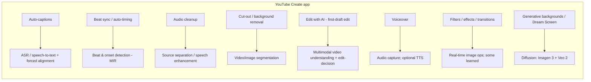

| Feature | The ML behind it | On-device or cloud? |
|---------|------------------|---------------------|
| **Auto-captions** | ASR (Google USM/Chirp-family is the natural backbone — *exact model unpublished*) + forced alignment for timing | Likely hybrid; short clips plausibly on-device |
| **Beat sync / auto-timing** | Beat/onset detection, tempo estimation (music information retrieval) | Lightweight → good on-device candidate |
| **Audio cleanup** | Speech enhancement / source separation (clean-vs-noisy trained) | Candidate for on-device DSP+NN |
| **Cut-out / background removal** | Semantic/instance **video segmentation**, temporally consistent | On-device for real-time preview; cloud for heavy |
| **Edit with AI** (first-draft edit: auto-trim, arrange, add music/captions/voiceover) | Multimodal **video understanding** → shot detection, highlight/saliency, edit-decision policy | Cloud-heavy (understanding), some on-device |
| **Voiceover** | Audio capture; optional TTS | On-device capture |
| **Filters / effects / transitions** | GPU image ops; some learned (style, relighting) | On-device |
| **Generative backgrounds / Dream Screen** | **Diffusion**: **Imagen 3** (text→image, 4 candidates) → **Veo 2** (image/text→6s video) | **Cloud** (heavy generative) |

> **Explicitly unverified:** Google has *not* published which Create features run on-device vs cloud, nor the exact ASR/segmentation/denoise model names. Say "I'd expect…" and reason from first principles — that's the correct interview posture.

### 3.3 The generative stack (the strategic direction)

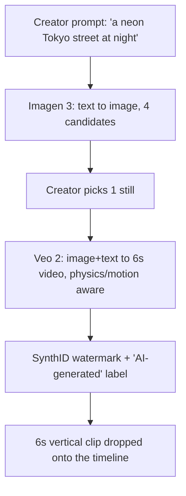

- **Veo 2** — DeepMind text/image→video; vertical clips, 6-second backgrounds, control over lighting/style, understands real-world physics & motion. Rolling into Create on mobile (AU/CA/India/NZ/US at time of reporting).
- **Imagen 3** — text→image; generates 4 candidate images the creator chooses from.
- **Dream Screen** (Shorts) — Imagen 3 (pick still) → Veo (animate to 6s background); expanding to standalone 6s clips.
- **Gemini "Nano Banana"** — Gemini-powered image editing surfaces appearing in Create/Shorts.
- **SynthID** — invisible watermark on all generative outputs, plus an explicit "AI-generated" label (provenance & policy).
- **Foundations Google cites:** the Transformer + years of **diffusion-model** research.

**Why this matters for you:** the JD's "bridge research → production" line is *about this stack*. Veo/Imagen are research-grade; someone has to make them reliable, safe (SynthID/labels), cost-bounded, and fast enough for a mobile app. That "someone" is this role.

### 3.4 Talking points that signal product sense

- "Create's north star is **time-to-first-good-edit** for a non-expert creator. Every AI feature should collapse minutes of manual work into one tap — and the failure mode isn't a crash, it's a *bad* auto-edit that erodes trust."
- "The hard constraint is **mobile**: an effect that takes 5s on a server is unusable if it stalls the timeline. That forces the on-device/cloud split and a good caching/pre-compute strategy."
- "Generative features need **provenance and safety by construction** — SynthID + labels — because creator trust and platform policy depend on it."
- "The competitive reality is **CapCut**, so the bar is *delight + speed*, not feature-count parity."

---

## 4 · The interview loop

### 4.1 The pipeline end to end


| Stage | Format | What to bring |
|-------|--------|---------------|
| **Google Hiring Assessment (GHA)** | Online, ~50 behavioral/values Qs | Answer consistently; it's a values filter, not a puzzle |
| **Recruiter screen** | ~30 min | Leveling, logistics, salary expectations, **the degree question (§2.4)** |
| **Phone screen** | ~2 × 45 min coding on a shared editor | Clean DS&A, talk out loud, tests |
| **Onsite (virtual)** | ~5–6 × 45–60 min | See §4.2 |
| **Hiring Committee** | Async packet review by senior engineers *outside* the team | Nothing — but every interviewer writes detailed notes, so *be quotable* |
| **Team match** | Chats with the team | For a team-specific req like this, may be lighter/pre-aligned |
| **Offer** | Comp + level | §4.4 negotiation |

### 4.2 The onsite rounds (for a Staff AI/ML role)

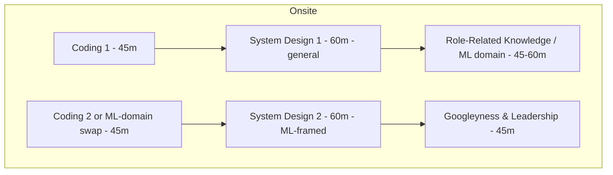

- **Coding (1–2 rounds).** Still expected at Staff, but fewer than junior loops; for ML roles one coding slot may be swapped for ML-domain interviewing. §5.
- **System Design (2 rounds).** *Highest weight at L6.* Expect one general and one **ML-framed** design. §11.
- **Role-Related Knowledge / ML domain (1).** ML fundamentals + a deep drill into *your* projects: modeling choices, trade-offs, pipelines, retraining, experimentation. §6, §2.2.
- **Googleyness & Leadership (1).** Behavioral, scored as its own dimension. §13.

> **ML-design prompts reported at Google:** design YouTube recommendations; multimedia policy/violation detection; mobile autocomplete/spell-check; fraud/spam pipelines. Expect a **Create-flavored** twist (auto-captions, cut-out, generative backgrounds). §11 has all of these worked.

### 4.3 Compensation — L6, India (indicative; Levels.fyi)

| Component | Approx (USD/yr) | Notes |
|-----------|-----------------|-------|
| Base | ~$98K | ≈ ₹80–85 L |
| Stock / yr | ~$90K (~43% of total) | Equity-heavy; 4-yr vest, often front-loaded refreshers |
| Bonus | ~$21K | Target ~15% |
| **Total (avg)** | **~$210K** | **≈ ₹1.7 crore**; Levels.fyi India L6 headline range **₹1.74 cr – ₹2.61 cr+** |

- Independent corroboration: L6 India band ~**₹1.5–2.2 crore**.
- For reference, US L6 is far higher (~$481K–$728K+). India L6 sample sizes on Levels.fyi are smaller — treat as indicative; this GenAI team may skew above median.
- **This clears the ₹55 L floor comfortably.** Comp is not the risk here — the degree gate and the Staff-design bar are.

### 4.4 Negotiation notes

- Anchor on **total comp**, not base; Google's lever is **equity + sign-on**, not base.
- Get **competing signal** if you can (another offer / a strong current comp) — it's the single biggest lever.
- **Leveling** is worth more than any single-year number: L6 vs L5 is a career-long delta. If they try to down-level to L5, that's the negotiation that matters most.
- Recruiters expect a counter; a polite, specific counter (with a number and a reason) rarely backfires.

---

## 5 · Coding / DSA round

Even at Staff, coding is a **hard gate**. The bar: pick the right structure, get to optimal (or justify the trade-off), write clean, bug-free code, test it, and *narrate* your reasoning. Google grades **problem-solving + coding + communication**, not just a passing solution.

### 5.1 The Google coding rubric (what the interviewer scores)

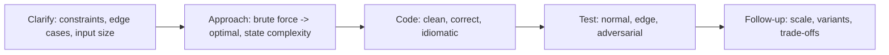

1. **Clarify first.** Never code on assumptions. Ask about size, ranges, duplicates, sortedness, memory limits, streaming vs batch.
2. **State brute force → optimize.** Say the naive solution and its complexity, *then* improve. Silence loses points even with a correct answer.
3. **Complexity out loud.** Time + space, before and after.
4. **Test as you go.** Dry-run one normal + one edge case.
5. **Follow-ups scale up.** "Now the input doesn't fit in memory" / "now it's a stream" — this is where Staff shows.

### 5.2 The pattern checklist (know which to reach for)

| Pattern | Trigger words | Canonical problems |
|---------|---------------|--------------------|
| Two pointers / sliding window | "subarray", "substring", "window", "sorted" | longest substring w/o repeat; min window substring |
| Hashing / freq map | "count", "seen before", "pairs" | two-sum; group anagrams; top-K |
| Heap / quickselect | "K largest/smallest/most frequent", "stream median" | top-K frequent; merge K lists; median of stream |
| Binary search | "sorted", "min that satisfies", "rotated" | search rotated; koko eating bananas; median of two sorted |
| BFS/DFS/union-find | "grid", "connected", "islands", "shortest unweighted" | number of islands; word ladder; accounts merge |
| Dijkstra / topo sort | "weighted shortest", "dependencies", "schedule" | network delay; course schedule |
| DP | "count ways", "min/max cost", "longest ...", "can you reach" | edit distance; LIS; coin change; word break |
| Intervals | "meetings", "merge", "overlap" | merge intervals; meeting rooms II |
| Tries | "prefix", "dictionary", "autocomplete" | implement trie; word search II |
| Monotonic stack | "next greater", "histogram", "spans" | daily temperatures; largest rectangle |

### 5.3 Worked problem 1 — Top-K frequent (heap + quickselect)

*Trigger:* "most-used effects", "trending hashtags". Very Google, very Create-relevant.

```python
import heapq
from collections import Counter

def top_k_frequent(nums: list[int], k: int) -> list[int]:
    # Count: O(n). Heap of size k: O(n log k). Space O(n).
    freq = Counter(nums)
    # nlargest is a bounded heap under the hood.
    return heapq.nlargest(k, freq, key=freq.get)
```

**Follow-up you must handle:** *"n is a stream of billions of events, k=100 (trending effects)."* → You can't hold all counts exactly in memory. Answer: **Count-Min Sketch** (probabilistic frequency, sub-linear memory) + a **min-heap of size k** of the current top candidates; accept small over-counts. State the accuracy/memory trade-off — *that's the Staff signal.*

### 5.4 Worked problem 2 — Merge K sorted streams (heap)

*Trigger:* merging timestamped caption/subtitle tracks, or K sorted event logs from shards.

```python
import heapq

def merge_k_sorted(lists: list[list[int]]) -> list[int]:
    # K lists, N total elements: O(N log K) time, O(K) heap space.
    heap = [(lst[0], i, 0) for i, lst in enumerate(lists) if lst]
    heapq.heapify(heap)
    out = []
    while heap:
        val, li, ei = heapq.heappop(heap)
        out.append(val)
        if ei + 1 < len(lists[li]):
            heapq.heappush(heap, (lists[li][ei + 1], li, ei + 1))
    return out
```

### 5.5 Worked problem 3 — Interval merge (timeline edits)

*Trigger:* merging overlapping clip selections / caption segments on a timeline.

```python
def merge_intervals(intervals: list[list[int]]) -> list[list[int]]:
    # Sort O(n log n); sweep O(n).
    intervals.sort(key=lambda x: x[0])
    merged = [intervals[0]]
    for s, e in intervals[1:]:
        if s <= merged[-1][1]:          # overlap
            merged[-1][1] = max(merged[-1][1], e)
        else:
            merged.append([s, e])
    return merged
```

### 5.6 Worked problem 4 — Edit distance (DP; also *the* alignment primitive)

*Trigger:* fuzzy matching; and conceptually the cousin of **forced alignment** for captions (§9).

```python
def edit_distance(a: str, b: str) -> int:
    m, n = len(a), len(b)
    dp = list(range(n + 1))              # O(n) space rolling row
    for i in range(1, m + 1):
        prev, dp[0] = dp[0], i
        for j in range(1, n + 1):
            cur = dp[j]
            dp[j] = min(
                dp[j] + 1,               # delete
                dp[j - 1] + 1,           # insert
                prev + (a[i-1] != b[j-1])# replace / match
            )
            prev = cur
    return dp[n]                          # O(m*n) time
```

### 5.7 Worked problem 5 — Autocomplete (trie)

*Trigger:* effect/song search box in the app. Classic Google.

```python
class TrieNode:
    __slots__ = ("kids", "end")
    def __init__(self):
        self.kids: dict[str, "TrieNode"] = {}
        self.end = False

class Autocomplete:
    def __init__(self):
        self.root = TrieNode()
    def add(self, word: str) -> None:
        node = self.root
        for ch in word:
            node = node.kids.setdefault(ch, TrieNode())
        node.end = True
    def _walk(self, prefix: str) -> TrieNode | None:
        node = self.root
        for ch in prefix:
            if ch not in node.kids:
                return None
            node = node.kids[ch]
        return node
    def suggest(self, prefix: str, limit: int = 5) -> list[str]:
        node = self._walk(prefix)
        out: list[str] = []
        def dfs(n: TrieNode, path: str):
            if len(out) >= limit: return
            if n.end: out.append(prefix + path)
            for ch in sorted(n.kids):
                dfs(n.kids[ch], path + ch)
        if node: dfs(node, "")
        return out
```

**Follow-up:** rank suggestions by popularity → store a frequency at each terminal and use a heap; or precompute top-K per node (space/latency trade-off). For mobile, cap the trie and fall back to server search — an on-device/cloud split you can call out.

### 5.8 Coding-round tactics

- **Talk continuously.** A correct silent solution scores worse than a slightly-imperfect narrated one.
- **Name the complexity before and after.** Interviewers write it down.
- **Write real code**, not pseudocode, and **run it in your head** on an example.
- **Handle the empty / single / duplicate / overflow** cases without being asked.
- If stuck, **verbalize the invariant** you're missing — interviewers hint on good reasoning, not on silence.

---

## 6 · ML foundations refresher

Concise, and slanted toward *this* role's media/eval realities. If you want the deep LLM/RAG/optimization background, this pack lives alongside chapters [01–14](00_index.md); here we hit what an ML-domain round for Create will actually probe.

### 6.1 Bias–variance, and why "it worked offline" lies

The withdrawal-prediction story *is* a bias–variance-plus-distribution-shift story. Underfit (high bias) → more capacity/features; overfit (high variance) → regularize/more data. But the killer in production is neither — it's **distribution shift** and **train/serve skew**: the offline features simply weren't reproducible online (4,001 vs 28). *Metrics on the wrong distribution are confident and wrong.*

### 6.2 The metric you pick is the product decision

| Task type | Primary metric | Why / gotcha |
|-----------|----------------|--------------|
| Binary classification, imbalanced | **PR-AUC**, not ROC-AUC | ROC-AUC looks great on rare positives; PR-AUC tells the truth |
| Ranking / retrieval | **MRR, nDCG, Recall@K** | position matters; Recall@K for candidate gen |
| Calibrated probabilities | **ECE, Brier score** | a "0.9" must mean 90% — matters for thresholds/policy |
| Segmentation (cut-out) | **IoU / mIoU, boundary F1**, + **temporal consistency** | per-frame IoU misses flicker; measure across frames |
| ASR (captions) | **WER** (+ CER for some langs) | substitutions+insertions+deletions / #words |
| Generative image | **FID, CLIP-score**, human eval | FID = distribution distance; CLIP = prompt adherence; humans decide |
| Generative video | FID/FVD + human pref + **temporal coherence** | FVD adds temporal; humans still decisive |
| Detection (YOLO) | **mAP @ IoU thresholds** | precision/recall across thresholds |

> **Staff-level point:** offline metrics are *proxies*. The real metric for Create is **creator behavior** — did they keep the AI edit, publish, retain? Always tie an offline metric to an **online metric** and an **A/B test**.

### 6.3 Evaluation done right

- **Split by the unit that generalizes.** For video, split by *creator*, not by clip, or you leak style across train/test.
- **Out-of-time evaluation.** Trends drift; evaluate on a *later* time window (you did exactly this — "out-of-time ROC-AUC 0.84").
- **Slice metrics.** Aggregate hides harm: measure captions WER *per language/accent*, segmentation IoU *per skin tone / lighting*. Fairness is a Google-explicit bar.
- **Golden sets + human eval** for generative — no scalar captures "does this look good."

### 6.4 Calibration (you have a real story here — the LLM PoD write-up)

A model that outputs probabilities used for a *threshold* (auto-apply vs suggest an edit) must be **calibrated**. Tools: **temperature scaling** (1-param, post-hoc, cheap, effective), Platt scaling, isotonic regression. Measure with **ECE / reliability diagrams**. Say: *"For any feature that auto-acts vs suggests, I calibrate the confidence and set the threshold from the reliability curve, not from the raw score."*

### 6.5 Experimentation / A/B at Google scale

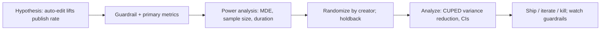

- **Primary metric** (publish rate) + **guardrail metrics** (crash rate, latency, retention, complaint rate) — never optimize one and wreck another.
- **Randomize by the right unit** (creator, not session) to avoid contamination.
- **Power** before you run: minimum detectable effect → sample size → duration.
- **Variance reduction** (CUPED) to read effects faster.
- **Novelty effects**: new AI features spike then settle — run long enough.

### 6.6 Retraining & drift (your ResMed/NatWest wheelhouse)

- **Detect drift:** PSI / KS / Wasserstein on features; monitor prediction distributions and, when labels lag, proxy signals.
- **Trigger retraining:** scheduled + drift-triggered; always **shadow/canary** before promotion; keep the prior version hot for **rollback** (you did this).
- **Close the loop:** creator accept/reject of an AI edit is a *free label* — feed it back (with fairness slicing).

---

## 7 · Computer vision & video ML

This is where your *real* CV background (CNN + YOLO + OCR + ViT) becomes an asset. This section takes you from image models → video understanding → segmentation (the cut-out feature).

### 7.1 CNN → Vision Transformer (the arc, and when each wins)

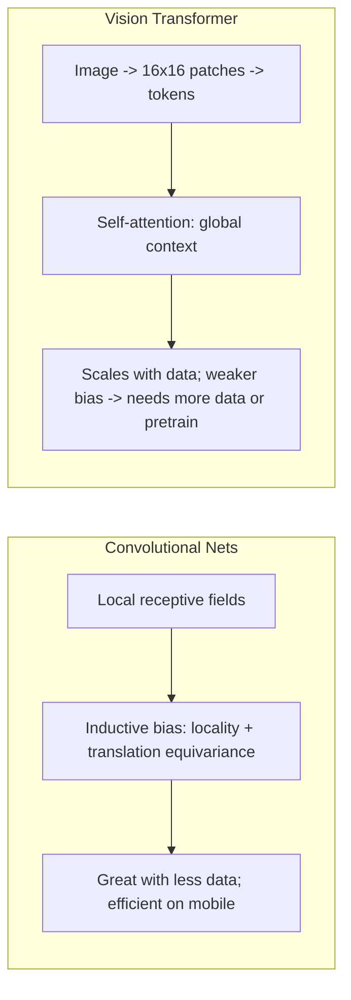

- **CNNs** bake in locality and translation equivariance → data-efficient, cheap, still the default for **on-device** vision (MobileNet, EfficientNet-Lite).
- **ViT** splits an image into patches → tokens → self-attention gives **global** context from layer 1. Needs large data or strong pretraining (or hybrids like ConvNeXt / MobileViT that reintroduce conv bias for mobile).
- **For Create's mobile constraints:** you'd reach for MobileNet/EfficientNet-Lite or MobileViT class models, not a giant ViT — *say why* (latency/battery/size). This links directly to §10.

**Interview-ready one-liner:** *"ViT trades the CNN's built-in locality bias for flexibility and global context; on a phone I usually want the bias back — MobileViT or an EfficientNet-Lite — because I'm paying for every millisecond and megabyte."*

### 7.2 Detection & OCR (your Sopra Steria system)

- **YOLO** = single-shot detector: one forward pass predicts boxes + classes on a grid → real-time. Contrast with two-stage (Faster R-CNN): more accurate, slower. For real-time on-device (face/object framing, sticker placement), single-shot wins. Metric: **mAP** across IoU thresholds.
- **OCR** = detection (find text regions) + recognition (CRNN/transformer + CTC decode). Relevant to Create for **caption/text overlay** understanding and auto-styling.
- Be ready to whiteboard the YOLO loss (localization + objectness + classification) and *why* anchor boxes / anchor-free (FCOS, YOLOX) exist.

### 7.3 Video understanding — the "Edit with AI" brain

Video = images + **time**. The features Create needs from raw footage:

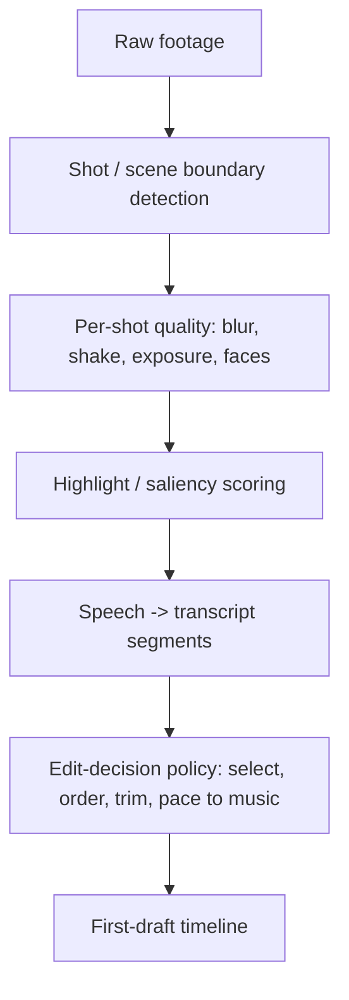

Modeling building blocks:

- **Temporal models:** 3D CNNs (C3D, I3D, SlowFast), or **video transformers** (ViViT, TimeSformer) with spatial + temporal attention (often *factorized* to cut cost). Two-stream (RGB + optical flow) is the classic motion-aware design.
- **Shot/scene detection:** frame-embedding distance + threshold, or a learned boundary model. Cheap, high-leverage.
- **Highlight / saliency:** score segments for "interestingness" (faces, motion, audio energy, speech). This is what makes an auto-edit feel curated.
- **Edit-decision policy:** given scored shots + a music track, choose/order/trim clips and cut on the beat (§9). Can be rules → learned-to-rank → RL from creator accept/reject.

**Efficiency reality:** you never run a heavy model on every frame. **Sample keyframes** (e.g., 1–2 fps or shot-representative frames), run the expensive model there, interpolate. Saying this unprompted is a strong signal.

### 7.4 Segmentation — the cut-out / background-removal feature

- **Semantic** (per-pixel class) vs **instance** (per-object) vs **panoptic** (both). Cut-out is typically **person/foreground vs background** → binary/semantic + matting for soft edges (hair!).
- **Matting** (alpha, not hard mask) is what makes hair/edges look good — the perceptual quality bar. Real apps use a segmentation backbone + a matting refinement head.
- **Temporal consistency is the whole game on video.** Per-frame segmentation *flickers*. Fixes: propagate masks with optical flow, add a temporal-smoothness loss, or use a video-object-segmentation model (memory of prior frames). Metric: mIoU **plus** a temporal-stability/flicker metric.
- **On-device:** MobileNet/BlazePose-class backbones, INT8-quantized, running on GPU/NNAPI to hit real-time preview; heavy refinement can be deferred to export time (an on-device/cloud split).

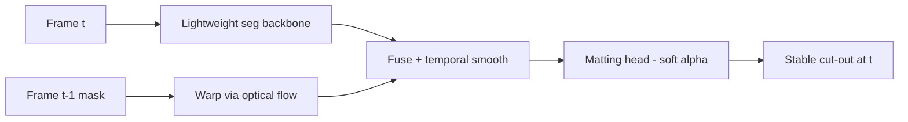

### 7.5 CV interview drill (be ready to answer these)

1. *Why does per-frame segmentation flicker, and three ways to fix it?* (flow propagation, temporal loss, VOS memory)
2. *IoU vs boundary-F1 — when does IoU lie?* (large region, bad edges → high IoU, ugly hair)
3. *Real-time person segmentation on a mid-range Android — your design?* (MobileNet backbone, INT8, GPU delegate, keyframe + track, defer refinement)
4. *ViT vs CNN for a mobile filter model — which and why?* (CNN/hybrid; data efficiency + latency)
5. *How do you build a highlight detector without labeled highlights?* (proxy signals: replays, retention, audio energy, faces; weak supervision; then learn-to-rank from creator keeps)

---

## 8 · Generative video & diffusion

The JD names "Generative AI and AI editing frameworks," and the product's headline direction is **Imagen 3 + Veo 2**. You don't need to have *shipped* diffusion — you need to reason about it fluently and, crucially, own the **research→production** half. This section gives you both.

### 8.1 Diffusion in one mental model

Diffusion learns to **reverse a gradual noising process**. Forward: add Gaussian noise over T steps until the image is pure noise. Reverse: train a network to denoise one step at a time; sampling starts from noise and walks back to a clean image.

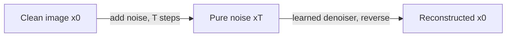

- **Forward process:** `x_t = √(ᾱ_t)·x_0 + √(1−ᾱ_t)·ε`, with `ε ~ N(0, I)` and `ᾱ_t` a noise schedule. Closed-form, no training.
- **Training objective (DDPM):** predict the noise. `L = E_{t, x_0, ε} [ ‖ ε − ε_θ(x_t, t) ‖² ]`. That's it — a regression on noise.
- **Sampling:** iteratively denoise `x_T → x_0`. DDPM = many steps; **DDIM / higher-order / distillation** cut it to a handful (matters for latency/cost).

### 8.2 Latent diffusion — why it's affordable

Running diffusion on raw pixels is brutally expensive. **Latent diffusion** (the Stable Diffusion / Imagen-style trick) runs the whole process in a **compressed latent space** from a VAE, then decodes once at the end.

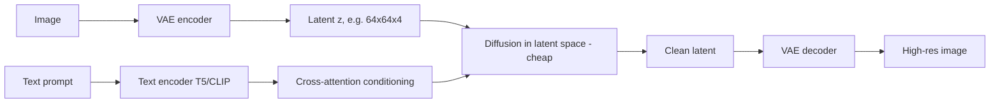

- **~8–48× cheaper** than pixel space → the reason mobile-adjacent generative products are viable at all (though heavy gen still runs in the **cloud**).
- **Text conditioning** enters via **cross-attention** from a text encoder (T5/CLIP-style). Imagen famously showed a big frozen text encoder matters more than a bigger image model.

### 8.3 Control: classifier-free guidance, and conditioning

- **Classifier-free guidance (CFG):** train the model both conditioned and unconditioned (randomly drop the prompt); at sampling, extrapolate: `ε = ε_uncond + s·(ε_cond − ε_uncond)`. The scale `s` trades **prompt adherence vs diversity/quality** — a knob you'll be asked about.
- **Conditioning beyond text:** image (Imagen→Veo: pick a still, animate it), depth/pose/edges (**ControlNet**-style), mask (**inpainting** = regenerate only a masked region — directly relevant to *editing* existing footage), reference style.
- **Inpainting/outpainting** is the *editing* primitive: "replace the sky," "extend the frame." This is more product-relevant to Create than pure text-to-image.

### 8.4 From image to video — Veo and the extra axis

Video generation adds **temporal coherence** — frames must be consistent (an object can't flicker or morph). Approaches:

- **Video latent diffusion** with 3D/factorized spatio-temporal attention.
- **Cascades:** generate keyframes → interpolate; or low-res → super-resolve in space and time.
- **Image-to-video** conditioning (Veo animating an Imagen still) constrains the first frame → more controllable, the Dream Screen pattern.
- Metrics: **FVD** (video FID), human preference, and explicit **temporal-coherence** checks.

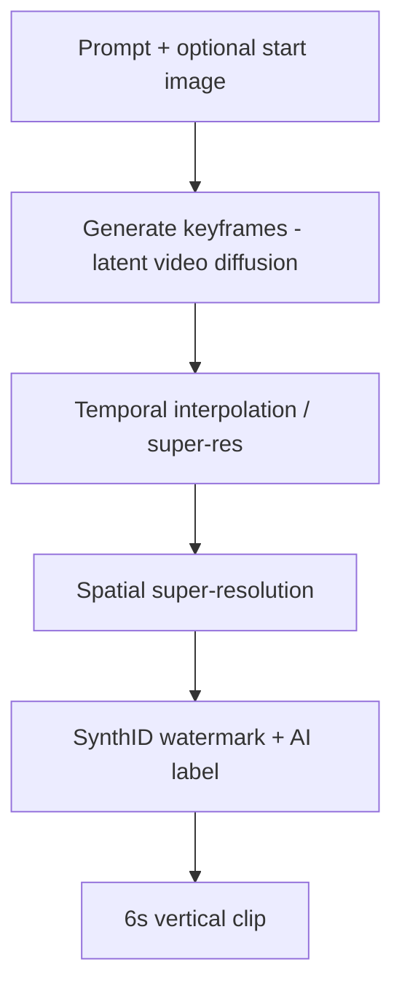

### 8.5 The part that's *your* job — productionizing generative

This is your differentiator per §2.3. For a research model like Veo/Imagen to live in a shipping app, someone owns:

- **Latency & cost:** step-reduction (DDIM, **distillation** to few-step/one-step models), batching, caching identical prompts, autoscaling GPU/TPU pools, a queue with backpressure, and **graceful degradation** (lower-res preview → full-res on export).
- **Reliability:** timeouts, retries, idempotency, circuit breakers; the generative call must never freeze the timeline.
- **Safety & provenance by construction:** **SynthID** watermark on every output, an "AI-generated" **label**, and **safety filters** on prompts (blocklists, classifiers) and outputs (NSFW/violence/likeness). This is *policy-critical* at Google scale.
- **Evaluation harness:** golden prompts, automatic FID/CLIP/FVD + a **human-eval** pipeline + a **red-team** set; regression-gate model updates. (You've built eval harnesses for RAG — same muscle.)
- **Observability:** track acceptance rate, regen rate, latency P50/P95/P99, cost/clip, safety-filter hit rate; alert on drift.

**Say this in the room:** *"The generative model is upstream research; my job is the wrapper that makes it a product — few-step distillation for latency, a queue with backpressure and graceful degradation so the UI never stalls, SynthID + labels + safety filters by construction, and an eval harness that regression-gates every model bump. That's the same research→production bridge I've done for RAG and prediction services, applied to diffusion."*

### 8.6 Diffusion interview drill

1. *What does the network actually predict?* (the noise ε — a regression)
2. *Why latent diffusion?* (8–48× cheaper; run in VAE latent, decode once)
3. *What does classifier-free guidance scale control?* (prompt adherence vs diversity)
4. *How would you cut a 50-step model to interactive latency?* (DDIM/fewer steps, progressive/consistency **distillation**, caching, cloud GPU batching)
5. *How do you keep generated video temporally coherent?* (spatio-temporal attention, keyframe+interpolate, image-to-video conditioning; measure FVD + coherence)
6. *How do you make generative safe & attributable in a consumer app?* (SynthID watermark, AI label, prompt+output safety classifiers, red-team eval gate)
7. *Inpainting vs text-to-image — which matters more for an editing app, and why?* (inpainting — it edits *existing* footage, the actual use case)

---

## 9 · ASR & audio ML

Two Create features live here: **auto-captions** (ASR + timing) and **beat-sync / audio cleanup** (audio ML). India is a launch market, so **multilingual + code-switching** is a real, product-shaping constraint you should raise.

### 9.1 The ASR pipeline (auto-captions)

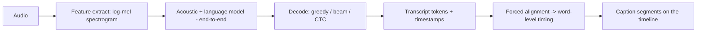

- **Front end:** waveform → **log-mel spectrogram** (a time × frequency image — note the tie-in to CV).
- **Modern ASR is end-to-end:** **CTC**, **RNN-Transducer (RNN-T)** (the streaming workhorse on mobile), or **attention/Transformer** (Whisper/USM-style). Google's **USM / Chirp** family is the natural backbone for Google products (*exact model in Create is unpublished*).
- **Streaming vs batch:** RNN-T streams (low latency, partial results) — good for live; attention models are batch (whole clip, higher accuracy) — good for post-hoc captioning of a finished clip. Create captions a *recorded* clip → batch is fine and more accurate. Say the trade-off.
- **Metric: WER** = (S + I + D) / N. For Indic scripts, also **CER**. Slice by language/accent.

### 9.2 Forced alignment — the timing half people forget

Auto-captions need each word placed at the right *time*. **Forced alignment** takes the audio + the (known/predicted) transcript and finds the optimal time-to-token mapping — a **dynamic-programming** alignment (Viterbi / CTC segmentation). It's the audio cousin of §5.6 edit distance: monotonic alignment of two sequences.

*Interview gold:* connecting forced alignment to DP alignment shows you see the algorithmic unity under the ML. Say it.

### 9.3 Multilingual & code-switching (India-specific, product-shaping)

- India = many languages + heavy **code-switching** (Hinglish mid-sentence). A monolingual model fails; you need a multilingual model and/or **language ID** front-end, and a script/transliteration decision (Roman vs native script captions).
- Data reality: low-resource languages → self-supervised pretraining (wav2vec-2.0/USM style) + fine-tune; measure per-language WER and *don't* let the average hide a bad language.
- This is a great place to show **product + fairness** judgment: "captions that are great in English and broken in Tamil aren't shipped."

### 9.4 Audio cleanup — speech enhancement / source separation

- **Task:** separate speech from background noise/music; suppress noise while preserving speech quality.
- **Approach:** operate on the spectrogram — predict a **time-frequency mask** (which bins are speech) or map noisy→clean directly; models range from lightweight U-Net-on-spectrogram to learned separators (Conv-TasNet-style in the time domain).
- **Metrics:** SDR/SI-SDR (separation), PESQ/STOI (perceptual quality). Watch for **over-suppression** artifacts (robotic speech) — the product failure mode.
- **On-device candidate:** small enough to run in real time with a quantized model + classic DSP — a good on-device/cloud discussion.

### 9.5 Beat detection / MIR — the beat-sync feature

- **Beat & onset detection + tempo (BPM) estimation:** find the rhythmic grid of the soundtrack so clips cut *on the beat*.
- **Classic + learned:** onset-strength envelope + autocorrelation for tempo (librosa-style), or a small learned beat tracker for robustness across genres.
- **Product tie:** the edit-decision policy (§7.3) snaps cut points to detected beats → the "auto-timing" magic. Lightweight → on-device friendly.

### 9.6 Audio interview drill

1. *RNN-T vs attention ASR — which for live captions, which for a finished clip?* (RNN-T streams; attention is more accurate for batch — Create's case)
2. *What is forced alignment and what algorithm underlies it?* (map transcript→time via DP/Viterbi — cousin of edit distance)
3. *India captions: what breaks and how do you handle code-switching?* (multilingual model + LID; per-language WER; script choice)
4. *Audio cleanup failure mode?* (over-suppression → robotic speech; measure PESQ/STOI, not just SDR)
5. *How does beat-sync actually cut on the beat?* (onset/tempo detection → snap edit points to the beat grid)

---

## 10 · On-device / mobile ML

**This is the highest-leverage differentiated topic for this role.** The app is Android-first and does real-time editing on a phone. A generic candidate hand-waves here; you can *own* it. Study this section until you can design an on-device feature end to end.

### 10.1 Why on-device at all (and the trade-off)

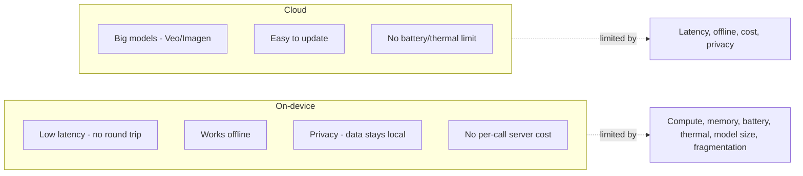

**The split rule for Create:** lightweight, latency-sensitive, privacy-touching, always-available aids **on-device** (segmentation preview, beat detection, some captions, denoise); heavy generative (Veo/Imagen) and understanding **in the cloud**; **hybrid** with graceful degradation (on-device preview → cloud full-quality on export).

### 10.2 The mobile toolchain

- **LiteRT** (formerly **TensorFlow Lite / TFLite**) — Google's on-device runtime. (Also ML Kit / MediaPipe for turnkey vision/audio, and the newer AICore / Gemini Nano for on-device GenAI.)
- **Delegates / accelerators:** CPU (XNNPACK) → **GPU delegate** → **NNAPI** → vendor NPU/DSP (Qualcomm Hexagon, Google Tensor). The same model runs very differently across the Android fleet — **fragmentation** is a real design constraint.
- **Format:** train in TF/PyTorch → convert (`.tflite`) → validate numerics → benchmark on real devices, not just an emulator.

### 10.3 The four compression levers (know the mechanism + the cost)

| Lever | Mechanism | Typical win | Cost / risk |
|-------|-----------|-------------|-------------|
| **Quantization** | FP32 → INT8/FP16 weights (& activations) | ~4× smaller, 2–4× faster, less power | small accuracy drop; needs calibration or QAT |
| **Pruning** | Zero out unimportant weights (mag./structured) | smaller; structured→real speedup | unstructured needs sparse kernels to help |
| **Knowledge distillation** | Small "student" learns from big "teacher" logits | big model's quality at student's cost | training complexity; not free lunch |
| **Architecture** | Mobile-first nets (MobileNet, EfficientNet-Lite, MobileViT) | efficient by design | may cap peak accuracy |

**Quantization detail worth knowing:**

- **Post-training quantization (PTQ):** quantize a trained model; needs a small **calibration set** to pick activation ranges. Fast, sometimes lossy.
- **Quantization-aware training (QAT):** simulate quantization *during* training so the model adapts → recovers most of the accuracy. Use when PTQ drops too much.
- **INT8** is the mobile sweet spot; **FP16** on GPU when accuracy-sensitive.

**Distillation** is *your* bridge for the generative story too: a 50-step teacher diffusion → a few-step student (§8.5). Same idea, different domain.

### 10.4 A worked on-device design mindset

*"Real-time background cut-out on a mid-range Android"* — reason like this out loud:

1. **Budget first.** 30 fps preview → ~33 ms/frame *including* rendering → the model gets maybe ~10–15 ms. That budget dictates everything.
2. **Model:** MobileNet/BlazePose-class segmentation backbone, **INT8 (QAT)**, **GPU/NNAPI delegate**.
3. **Don't run every frame at full cost:** segment keyframes, **track/warp** between (optical flow), fuse for temporal stability (§7.4).
4. **Fragmentation:** capability-tier the fleet — NPU path, GPU path, CPU fallback with a smaller model; **degrade gracefully** (lower res / lower fps) instead of dropping the feature.
5. **Thermal/battery:** cap sustained fps, back off under thermal pressure.
6. **Quality bar for export:** run the heavier, temporally-refined (or cloud) model at *export* time, when latency matters less than final quality.
7. **Measure on real devices:** P50/P95 latency per device tier, battery/thermal, plus quality (IoU + flicker).

### 10.5 On-device interview drill

1. *When on-device vs cloud vs hybrid?* (latency/offline/privacy/cost vs model-size/updatability; hybrid + graceful degradation)
2. *PTQ vs QAT?* (PTQ fast + calibration set; QAT recovers accuracy by simulating quant in training)
3. *You lose 4% accuracy going INT8 — options?* (QAT, keep sensitive layers FP16/mixed, distill, or partial cloud fallback)
4. *Android fragmentation — how do you ship one feature across the fleet?* (delegate tiers + capability detection + fallback models + graceful degradation)
5. *Distillation for a diffusion model on a latency budget?* (progressive/consistency distillation to few-step student; keeps cloud but cuts steps/cost)
6. *How do you update an on-device model safely?* (versioned model download, staged rollout, on-device A/B, rollback, size/bandwidth budget)

---

## 11 · ML system design

**This is the section that decides your level.** Two design rounds, highest weight, and the down-levelling trap lives here. Below: a reusable framework, then **6 fully worked designs** aimed at Create.

### 11.0 The framework — a repeatable 8-step spine

Use the same spine every time so you never freeze. Spend the first 5–8 minutes on 1–2 (clarify + metrics) — jumping to boxes is an L5 tell.

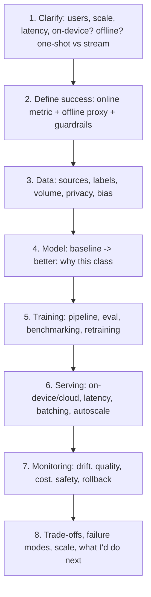

**Staff-level moves to weave through every design:**
- Always give a **baseline** before the fancy model ("rules/heuristic first, then learn").
- Name **numbers** (QPS, latency budget, model size, cost/inference) even if estimated — quantify.
- Call the **on-device vs cloud** split explicitly for Create.
- Tie every offline metric to an **online metric + A/B + guardrail**.
- End with **failure modes + graceful degradation + rollback** — reliability is your brand.
- Zoom out: **cross-team dependencies, cost at scale, and a phased rollout** — that's the L6 signal.

---

### 11.1 Design D1 — Auto-captions at scale

**Prompt:** *"Design auto-captions for YouTube Create."*

**1. Clarify.** Captioning a *recorded* clip (seconds–minutes), not live → **batch** is acceptable and more accurate. Multilingual incl. Indic + code-switching. Editable by the creator. Target: captions ready in a few seconds for a 60s clip; works on mid-range Android; some offline support desirable.

**2. Success.** Online: caption **acceptance/edit rate** (did they keep it?), publish rate with captions. Offline: **WER/CER per language**, timing error (median word-offset ms). Guardrails: latency P95, crash rate, per-language WER floor (fairness).

**3. Data.** Paired audio↔transcript across languages; timestamped for alignment; augment with noise/reverb; low-resource langs via self-supervised pretraining. Privacy: creator audio is sensitive → on-device or ephemeral cloud with consent.

**4. Model.** ASR: attention/Transformer (USM/Chirp-class) for batch accuracy; multilingual + language-ID front end for code-switching; **forced alignment** (DP/Viterbi) for word timing. Baseline: an off-the-shelf ASR API, then specialize.

**5. Training/eval.** Fine-tune multilingual base; eval per-language WER on a **sliced** golden set; regression-gate model updates; human spot-check for Indic scripts.

**6. Serving.**

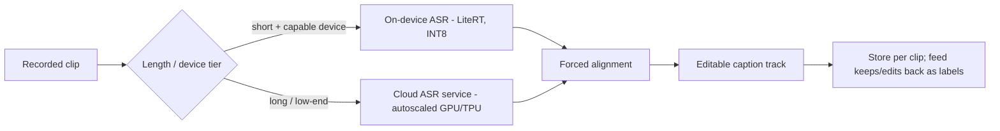

Hybrid: short clips on capable devices run on-device (offline, private, free); otherwise cloud. Batch the audio; stream partial captions to the UI for perceived speed.

**7. Monitoring.** Per-language WER drift, timing error, latency P50/P95, on-device vs cloud mix, acceptance rate. Creator edits are **free labels** → close the loop (fairness-sliced).

**8. Trade-offs / failure modes.** Music/noise → run cleanup (§9.4) first. Code-switching → multilingual + LID; script choice per locale. Wrong timing worse than wrong word (feels broken) → weight alignment quality. Degrade: if ASR low-confidence, offer "tap to add captions manually" rather than shipping garbage.

---

### 11.2 Design D2 — "Edit with AI" (first-draft auto-editor)

**Prompt:** *"Design the feature that turns raw footage into a polished first-draft edit."* The flagship, hardest, most Staff-y design.

**1. Clarify.** Input: N raw clips (+ optional music, prompt/style). Output: a **timeline** — selected/ordered/trimmed clips, cut to the beat, with captions + optional voiceover. It must be **editable** (a draft, not a black box). Latency: tens of seconds acceptable (it's a big action); mostly cloud, some on-device.

**2. Success.** Online: **draft-kept rate** (published with ≤X edits), publish rate, retention. Offline: human-rated edit quality on a golden set; component metrics (shot-detection F1, highlight AUC, beat-alignment error). Guardrail: never produce an *empty*/broken timeline.

**3. Data.** Hard part = "what's a good edit?" Sources: (a) **professionally edited videos** as positive exemplars; (b) **creator accept/reject/edit** of AI drafts (the flywheel); (c) weak signals (retention/replays on published Shorts). Start with heuristics; learn as data accrues.

**4. Model — a pipeline, not one model.**

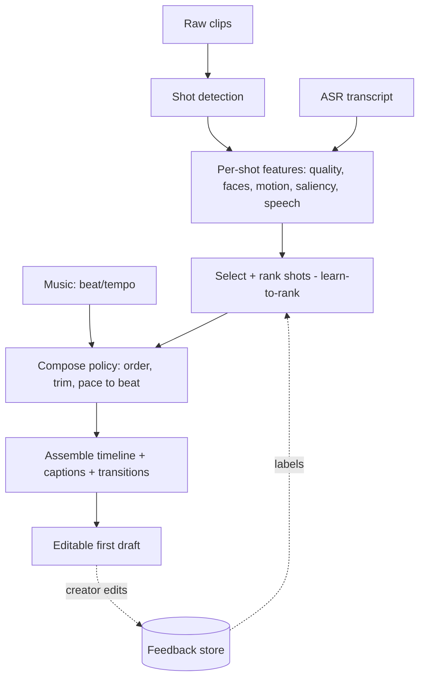

- **Shot detection** (embedding-distance/boundary model) → **per-shot scoring** (highlight/saliency, quality, faces, speech) → **selection & ordering** (learn-to-rank; baseline = heuristics) → **compose policy** (trim + snap cuts to beats from §9.5) → assemble with captions/transitions.
- Evolution: rules → learned scoring → **RL from creator feedback** on the compose policy (reward = kept/published).

**5. Training/eval.** Train components separately + evaluate end-to-end with **human eval** on a golden set. A/B the whole feature; watch the flywheel improve draft-kept rate.

**6. Serving.** Cloud pipeline (understanding is heavy); orchestrate as a **DAG of services** with a job queue (a big action, async, progress UI). Cache per-clip features so re-generating a draft is cheap. On-device: cheap bits (beat detection, basic quality) can pre-compute while the creator films.

**7. Monitoring.** Draft-kept rate, edits-per-draft, time-to-publish, component health, cost/draft, latency. Alert if kept-rate drops after a model bump → rollback.

**8. Trade-offs / failure modes.** **Trust is the real metric** — a confidently bad edit is worse than a modest one; bias toward safe, conservative drafts early. Always editable + easy undo. Cold start (no feedback) → heuristics + exemplars. Cost: full pipeline per draft is expensive → cache, pre-compute, and gate on capable tiers. Fairness: don't only "highlight" certain faces — slice saliency by demographics.

*This design shows everything L6 wants: a multi-component system, a data flywheel, a phased model evolution, explicit cost/latency, cross-team dependencies (ASR, music, generative), and reliability/trust framing.*

---

### 11.3 Design D3 — On-device background cut-out

**Prompt:** *"Design real-time person segmentation / background removal on-device."* (Ties §7.4 + §10.)

**1. Clarify.** Real-time **preview** at ~30 fps on mid-range Android; high-quality **export** can be heavier/cloud. Soft edges (hair) matter. Offline-capable, private.

**2. Success.** Online: feature use + keep rate; export quality complaints. Offline: **mIoU + boundary-F1 + a flicker/temporal-stability metric**, per lighting/skin-tone slice. Guardrail: preview fps floor; no crashes on low-end.

**3. Data.** Person-segmentation datasets + matting data (alpha mattes); heavy augmentation (lighting, backgrounds, motion blur); synthetic compositing. Slice-balanced for fairness.

**4. Model.** Preview: MobileNet/BlazePose-class backbone, **INT8 (QAT)**, GPU/NNAPI delegate, keyframe + optical-flow track (§7.4). Export: heavier matting refinement (on-device if device allows, else cloud).

**5. Serving (the split):**

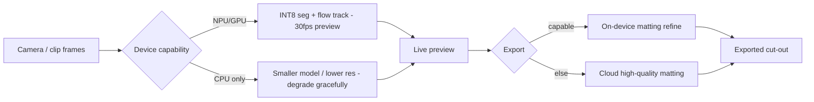

**6. Monitoring.** Per-tier fps (P50/P95), thermal/battery, quality (IoU/flicker) via sampled opt-in telemetry, crash rate by device model.

**7. Trade-offs / failure modes.** Flicker (fix: temporal fusion). Hair/edges (fix: matting head). Fragmentation (fix: tiered delegates + fallback + graceful degradation). Thermal throttling (fix: fps cap + backoff). Privacy → keep frames on-device.

**8. Extensions.** Update model via staged download + on-device A/B + rollback; distill a bigger cloud model into the on-device student.

---

### 11.4 Design D4 — Generative backgrounds (Imagen/Veo integration)

**Prompt:** *"Design the generative-background feature (text/image → 6s clip) for Create."* (Ties §8.5.)

**1. Clarify.** Creator types a prompt (or picks a still) → gets a short generated clip for the timeline. Heavy generative → **cloud**. Latency: seconds–tens of seconds with a progress UI; must never freeze the app. Safety + provenance mandatory.

**2. Success.** Online: generation **acceptance/keep rate**, regen rate, publish rate. Offline: FID/CLIP/FVD on golden prompts + human eval + **safety pass rate**. Guardrails: latency P95, cost/clip, **safety-filter recall**, zero un-watermarked outputs.

**3. Serving architecture:**

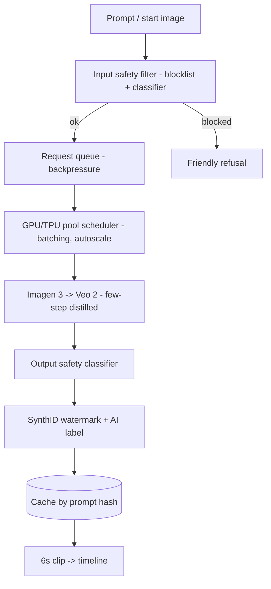

**4. Latency/cost levers.** Few-step **distilled** samplers; **batch** requests on the GPU/TPU pool; **cache** identical prompts; low-res fast **preview** then full-res on accept (graceful degradation); a **queue with backpressure** so spikes don't melt the pool or freeze clients.

**5. Safety & provenance (non-negotiable at Google).** Input **and** output safety classifiers (NSFW, violence, real-person likeness, minors); **SynthID** watermark on every output; explicit **"AI-generated" label**; a red-team eval set that **gates** model updates; audit logging.

**6. Monitoring.** Acceptance/regen rate, P50/P95/P99 latency, **cost/clip**, GPU utilization, safety-filter hit rate + false-negative audits, queue depth.

**7. Trade-offs / failure modes.** Cost explosion (fix: distillation, caching, quotas, preview-then-commit). Safety false-negatives (fix: layered filters + human review + fast model-patch path). Pool saturation (fix: backpressure + autoscale + degrade to preview-only). Model regressions (fix: eval-gate + rollback).

**8. Staff framing.** This is the *research→production bridge* the JD names: DeepMind ships Veo/Imagen; **this role wraps it into a reliable, safe, cost-bounded product**. Own that sentence.

---

### 11.5 Design D5 — Beat-sync / audio-driven auto-timing

**Prompt:** *"Design beat-sync — automatically cut clips to the music."* (Ties §9.5.)

**1. Clarify.** Given selected clips + a chosen track, place cut points on the beat and trim clips to fit musical phrases. Lightweight → mostly **on-device**. Real-time-ish.

**2. Success.** Online: beat-sync feature keep/publish rate. Offline: **beat-detection F1**, tempo error (BPM), alignment error (ms between cut and nearest beat). Guardrail: no cut placed off-grid beyond a tolerance.

**3. Model.** Onset-strength envelope + autocorrelation for tempo (classic, cheap) or a small learned beat tracker for genre robustness; export the **beat grid** (timestamps + downbeats).

**4. Compose.** Snap edit points to the beat grid; align cuts to downbeats for stronger feel; trim clips to phrase boundaries. Heuristic policy first; learn from creator keeps later.

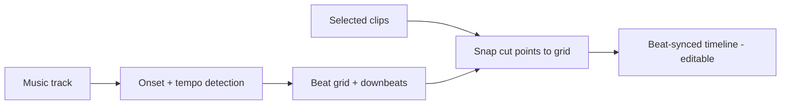

**5. Serving.** On-device (lightweight); precompute the beat grid once per track and cache. No cloud needed for the common path.

**6/7/8.** Monitor alignment error + keep rate; failure modes = rubato/tempo-changing music (fix: local tempo tracking, not one global BPM), silence/ambient tracks (fix: fall back to fixed-interval cuts). Extension: learn per-genre cut styles from creator behavior.

---

### 11.6 Design D6 — YouTube recommendation (the classic bonus)

**Prompt:** *"Design YouTube's video recommendation system."* Not Create-specific, but a *very* common Google ML-design prompt — have it ready.

```mermaid
flowchart LR
    U[User + context] --> RET[Candidate generation - two-tower retrieval, ANN over millions]
    RET --> RANK[Ranking - heavy model, hundreds of candidates]
    RANK --> RERANK[Re-rank: diversity, freshness, policy, fairness]
    RERANK --> Serve[Top-N feed]
    Serve -.logs.-> Train[(Training data: watch, like, skip)]
    Train --> RET
    Train --> RANK
```

- **Two-stage:** **candidate generation** (two-tower embeddings + ANN/ScaNN, recall-oriented, millions→hundreds) → **ranking** (heavy multi-task model predicting watch-time/CTR/satisfaction, precision-oriented) → **re-rank** (diversity, freshness, policy, fairness).
- **Labels & bias:** implicit feedback (watch time, skips) with **position/selection bias** → debias (IPS, position features). Optimize **satisfaction**, not just watch-time (avoid clickbait/engagement traps — Google-explicit).
- **Serving:** precompute embeddings, ANN index, feature store, real-time features, tight latency budget; A/B everything with guardrails (long-term retention, not just CTR).
- **Metrics:** offline Recall@K/nDCG; online watch-time, satisfaction surveys, retention, guardrails.

---

## 12 · LLMs, multimodal & agents

The role names "AI editing frameworks," and Create's newer surfaces use **Gemini** ("Nano Banana" image editing, Gemini "Omni"). You have genuine LLM-systems depth (RAG, multi-agent/MCP, LLM eval) — bring it, framed for editing.

### 12.1 Multimodal LLMs, briefly

- A multimodal LLM (Gemini-class) ingests **text + image + audio + video** into a shared token space and reasons across them. For editing, that enables **prompt-driven edits**: "make this brighter, cut the boring middle, add upbeat music" → the model interprets intent over the actual footage.
- The productization concerns are the ones you know: **grounding** (act on *this* video, not hallucinate), **latency/cost** (big model → cloud, cache, stream), **safety** (prompt-injection from user text, output filters), **eval** (LLM-as-judge + human), **guardrails** (PII, policy).

### 12.2 Where your existing chapters plug in

If the ML-domain round drifts into LLM/RAG/optimization territory, lean on the companion chapters in this pack:

- **[03 LLMs](03_llms.md)**, **[07 RAG](07_rag.md)**, **[27 RAG evaluation](27_rag_evaluation.md)** — retrieval, eval harnesses, LLM-as-judge (you built these at ResMed).
- **[09 Model optimization](09_model_optimization.md)** — quantization/distillation (ties §10).
- **[34 MCP deep dive](34_mcp_deep_dive.md)** — your TrueBalance platform work (agentic tooling, tool-calling).
- **[06 Fine-tuning](06_fine_tuning.md)**, **[16 System design](16_system_design.md)** — general depth.

### 12.3 Prompt-driven editing — a mini design

*"Add a 'describe the edit you want' box."* → intent parse (multimodal LLM grounded on the clip) → map to a **plan of editing ops** (trim, cut, color, music, caption) → execute deterministic ops + call generative where needed (§8/§11.4) → preview → creator confirms. Keep the LLM as the **planner/orchestrator** over deterministic tools (an agent pattern you've built with MCP), not the pixel-pusher — reliability + auditability. Say that; it's a mature take.

---

## 13 · Behavioral · Googleyness & Leadership

Scored as its **own dimension** at committee. Google probes: **comfort with ambiguity, collaboration, bias to action, intellectual curiosity, humility, and (at Staff) leadership/mentorship + conflict navigation.** Use **STAR** (Situation, Task, Action, Result), keep it to ~2 minutes, lead with *your* actions ("I", not "we"), and end with a **result + a reflection** ("what I'd do differently").

### 13.1 Your story bank (each answers several questions)

| Tag | Story (from §2.2) | Signals it proves |
|-----|-------------------|-------------------|
| **DEPTH** | Train/serve parity gap (4001 vs 28 features) | technical depth, debugging, bias to action, impact |
| **RELIABILITY** | Recsys rescue (OOM, ABI, KMS) + deep-dive | ownership, reliability, teaching/multiplier |
| **DESIGN** | KG replacing regex parser (100% coverage) | design judgment, ambiguity, rigor |
| **MATRIX** | NatWest MLOps under FCA, re:Invent | cross-functional, delivery under constraints |
| **LEADERSHIP** | Internal AI dev platform + mentoring | technical leadership, influence, multiplier |
| **CONFLICT** | (prep one: a disagreement you resolved with data) | collaboration, conflict navigation |
| **FAILURE** | (prep one: a genuine miss + what you changed) | humility, growth |

### 13.2 Eighteen questions with how-to-answer notes

**Leadership & influence**
1. *Tell me about a time you set technical direction for a team.* → **LEADERSHIP**: you built the platform components *and* set the patterns/best practices others adopted. Emphasize you changed how the team ships.
2. *Describe influencing a decision without authority.* → **DESIGN/MATRIX**: you convinced stakeholders to replace the regex parser with a KG by *showing* 100% coverage + tests, not by mandate.
3. *A time you mentored someone.* → **LEADERSHIP**: mentored engineers on MCP patterns; be specific about the person's growth.
4. *How do you drive alignment across teams that disagree?* → **MATRIX**: NatWest — engineers, DS, compliance; you aligned on shared goals/metrics first.

**Ambiguity & bias to action**
5. *A time requirements were unclear — what did you do?* → **DESIGN**: vague "replace the parser" → you scoped entities/predicates, built a test harness, shipped incrementally.
6. *Tell me about a time you took initiative beyond your role.* → **RELIABILITY**: nobody asked you to author the canonical deep-dive; you did, and it became the team reference.
7. *A time you had to make a call with incomplete data.* → **DEPTH**: kept the old model hot for rollback *while* shipping the fix — decisive but safe.

**Impact & ownership**
8. *Your most impactful project?* → **DEPTH** or **MATRIX**; quantify (ROC-AUC 0.84; 29.7%→68%; re:Invent).
9. *A time you improved reliability/quality.* → **RELIABILITY**: OOM + ABI + KMS.
10. *How do you handle production incidents?* → root-cause discipline: reproduce, isolate, fix the *class* of bug (containerize to kill ABI drift), add monitoring so it can't recur.

**Collaboration & conflict**
11. *A disagreement with a colleague — how resolved?* → **CONFLICT** (prep): frame as data-driven, respectful, outcome-focused.
12. *Working with a difficult stakeholder?* → **MATRIX**: compliance in FCA/HIPAA — reframe constraints as design inputs.
13. *A time you received hard feedback.* → **FAILURE/humility**: what you changed.

**Growth & curiosity**
14. *A time you failed.* → **FAILURE** (prep a real one): own it, no blame, concrete change, no rationalizing.
15. *How do you stay current?* → concrete: Anthropic certs, LangGraph, this prep; you *build* to learn (MCP tooling, OSS).
16. *Something you learned recently and applied.* → MCP/agentic tooling → shipped platform components.

**Googleyness / values**
17. *Why Google / why YouTube Create?* → product conviction (§3): "AI that gives everyday creators pro-level editing in one tap"; the research→production bridge is exactly your strength; India is a launch market you understand.
18. *How do you balance speed vs quality?* → you don't false-dichotomize: ship with a rollback path (old model hot), monitor, iterate — *safe* speed.

### 13.3 "Why this role" — your 60-second answer (rehearse verbatim)

> *"Three reasons. First, the problem: putting pro-level editing in one tap for everyday creators is real, hard, and human — and India is a launch market I understand. Second, the fit: the role is explicitly about bridging specialized research and robust production — Veo and Imagen are extraordinary, but someone has to make them reliable, safe, and fast enough for a phone. That's exactly what I do: I take models and make them survive production. Third, the level: I already set technical direction and mentor at TrueBalance; I want to do that at Google's scale, on a product millions of creators touch."*

### 13.4 Behavioral anti-patterns (Google-specific)

- **"We" with no "I".** They can't score a team. Own your actions.
- **No result / no number.** Quantify or it didn't land.
- **Blaming others** in the failure question. Instant red flag.
- **Rambling.** 2 minutes, structured. Practice out loud.
- **Arrogance without humility.** Staff = confident *and* coachable.

---

## 14 · Staff-level leadership & influence

The two "3-year" minimums (technical leadership, matrixed org) and the "influence/coach a distributed team, define product strategy" responsibility mean **leadership is a graded requirement, not a soft extra.** Here's how to show L6, not L5.

### 14.1 The L5 → L6 shift (say the right altitude)

| Dimension | L5 answer (down-level risk) | L6 answer (what to say) |
|-----------|-----------------------------|--------------------------|
| Scope | "I built the service" | "I set the direction that multiple engineers built against, and the standard other teams adopted" |
| Ambiguity | "I was given the spec and delivered" | "The mandate was vague; I framed the problem, sequenced it, and got buy-in on the plan" |
| Influence | "My manager decided" | "I drove consensus across DS/eng/compliance with data, without owning them" |
| Impact | "It worked" | "It moved a business metric and changed how the team operates" |
| Multiplier | "I did it well" | "I made others faster — deep-dives, mentoring, reusable platform" |

### 14.2 Your leadership evidence, framed at L6

- **Direction & standards:** *"I didn't just build the platform components — I set the patterns for how we build MCP tooling, and mentored the team onto them. That's leverage: the next ten integrations are faster because of the standard."*
- **Consensus without authority:** *"Replacing the regex parser wasn't my call to mandate. I built a test harness that proved 100% field coverage on 170K records, and let the evidence make the decision for the room."*
- **Matrixed delivery:** *"At NatWest, nothing shipped until engineers, data scientists, and FCA-compliance agreed. I led by aligning everyone on shared metrics and a staged plan first — the platform later showcased at re:Invent."*
- **Reliability leadership:** *"When releases kept breaking on a host-Python ABI mismatch, I didn't just patch it — I containerized the deploy to kill the *class* of failure, then wrote the deep-dive so the whole team internalized the pattern."*

### 14.3 Product-strategy signal (the JD asks for it)

Be ready to reason about *what Create should build next* and why — that's the "influence feature roadmaps" line. A safe, strong take:

> *"I'd bias the roadmap toward **trust and speed** over feature count, because the competitor is CapCut and the moat is delight. Concretely: make 'Edit with AI' conservative-but-reliable so creators trust it, invest in on-device latency so the timeline never stalls, and make generative safe-by-construction with SynthID and labels so we never trade creator trust for a flashy demo. The flywheel is creator accept/reject data — every feature should feed it."*

---

## 15 · Questions to ask them

Good questions are a *signal*, not filler — they show seniority and genuine interest. Tailor per round.

**For the hiring manager / team**
- How does Create split work with the **Advanced Capabilities** team — where does research hand off to production, and where does the friction live today?
- What does "great" look like for this role in 6 and 12 months?
- What's the hardest **reliability or latency** problem the team is fighting right now?
- How do you balance the **on-device vs cloud** roadmap given the Android/iOS split?

**For the ML/domain interviewer**
- How do you currently evaluate a subjective feature like "a good auto-edit" — human eval, online metrics, both?
- What's the retraining/feedback loop from creator edits, and how do you handle fairness across languages and demographics?
- How is the generative stack (Veo/Imagen) served today, and what are the cost/latency constraints?

**For the Googleyness/leadership interviewer**
- How does the team make decisions when eng, product, and research disagree?
- What kind of technical leadership has been most valuable on this team?

**For the recruiter (do this early)**
- ⚠️ The posting lists a Master's/PhD minimum — **how is that applied for a candidate with 8 years and Staff-level impact but a Bachelor's?** (Get this answered before investing the full loop — see §2.4.)
- What's the level (L6) and India comp band, and what does the loop look like?

---

## 16 · Cheatsheet — morning-of revision

**The role in one breath.** Staff (L6) AI/ML, YouTube Create — Android-first AI video-editing app; my edge is the **research→production bridge** + reliability at scale. Two design rounds decide the level. Don't down-level myself: talk **org-scope, cost, trade-offs, rollback**.

**Feature → ML.** captions→ASR+forced-alignment · beat-sync→onset/tempo · cleanup→source-separation · cut-out→segmentation+matting+temporal · Edit-with-AI→multimodal understanding+edit-policy · generative bg→Imagen 3→Veo 2 (diffusion, cloud, SynthID).

**Metrics.** imbalanced→**PR-AUC** · ranking→**MRR/nDCG/Recall@K** · calibration→**ECE/Brier** (temp scaling) · segmentation→**mIoU+boundary-F1+flicker** · ASR→**WER/CER** (slice per language) · gen-image→**FID/CLIP+human** · gen-video→**FVD+coherence+human** · detection→**mAP**. Offline is a proxy — tie to **online + A/B + guardrails**.

**Diffusion.** network predicts **noise ε** (regression) · **latent** diffusion = run in VAE latent, decode once (~8–48× cheaper) · **CFG scale** = prompt-adherence vs diversity · latency → **DDIM/distillation** · video → temporal coherence + FVD · **inpainting** = the *editing* primitive · **SynthID** watermark + AI label.

**On-device.** **LiteRT/TFLite**, delegates CPU→GPU→NNAPI→NPU · **PTQ** (calibration set) vs **QAT** (recovers accuracy) · INT8 mobile sweet spot · **distillation** big→small · fragmentation → tiered delegates + fallback + **graceful degradation** · budget: 30fps ⇒ ~10–15ms/frame for the model.

**System-design spine.** clarify → success metric → data → model(baseline→better) → training/eval → serving(on-device/cloud) → monitoring(drift/cost/safety/rollback) → trade-offs/scale. Always: baseline first, numbers, on-device split, online+guardrails, failure modes.

**Coding.** clarify → brute→optimal → state complexity → clean code → test → scale follow-up. Patterns: heap/quickselect (top-K), trie (autocomplete), DP (edit distance/alignment), intervals (timeline), BFS/DFS, sliding window. **Narrate constantly.**

**Behavioral.** STAR, 2 min, "I" not "we", result+reflection. Stories: train/serve gap (DEPTH), recsys rescue (RELIABILITY), KG (DESIGN), NatWest (MATRIX), platform+mentoring (LEADERSHIP). Prep a real **failure** + a **conflict**.

**Comp (L6 India).** ~₹1.7 cr avg total; range ~₹1.5–2.6 cr; equity-heavy. Negotiate **total comp + level**, not base. Clears the ₹55 L floor easily.

**Numbers from my résumé.** ROC-AUC **0.84**; **4001→28** feature parity gap; lender match **29.7%→68%** over 109K; KG **169,879/169,879** fields, **107** tests; **8 years**; Code Jam qualifier.

**Honesty guardrails.** recommender *model* = colleague's (I operate/harden the service); platform = team's (I built Slack + Docs + PR components + mentored); no GCP/Vertex prod; no diffusion/video-gen in prod (transferable CV + productionization). B.Tech, not MS — own it.

---

## 17 · Study plan

A 3-week plan (compress to 1 week by doing the ⭐ items only).

| Days | Focus | Deliverable |
|------|-------|-------------|
| D-21 → D-19 | ⭐ §1–4 (role, fit, product, loop). Resolve the **degree question** with recruiter. Line up a **referral**. | Can recite JD, fit map, "why this role" (§13.3) |
| D-18 → D-16 | ⭐ §11 framework + D1, D2, D3 — do each **out loud on a whiteboard** | 3 designs at ~40 min each |
| D-15 → D-13 | §11 D4, D5, D6; §8 diffusion | 3 more designs; diffusion drill (§8.6) |
| D-12 → D-10 | ⭐ §10 on-device (study hard — your differentiator); §7 CV/video | on-device + CV drills |
| D-9 → D-8 | §9 ASR/audio; §6 ML foundations | audio + eval drills |
| D-7 → D-5 | ⭐ §5 coding — 2 problems/day, timed, narrated | ~10 problems clean |
| D-4 → D-3 | ⭐ §13–14 behavioral — write & rehearse all 7 stories out loud | STAR bank memorized |
| D-2 | Mock loop: 1 coding + 1 design + 1 behavioral with a friend | feedback incorporated |
| D-1 | ⭐ §16 cheatsheet only. Light. Sleep. | calm |
| Day of | Re-read §16. Eat. Water. Breathe. | — |

**Practice rule:** designs and behavioral must be done **out loud**, ideally with someone interrupting you — silent reading badly overestimates readiness.

---

## Appendix A · Mock system-design dialogue — "Edit with AI"

*A compressed transcript of how the D2 design should actually flow in the room. **I** = interviewer, **C** = candidate. Notice how the candidate clarifies before designing, quantifies, and repeatedly zooms out to Staff scope.*

> **I:** Design the feature that turns raw footage into a finished first-draft edit.
>
> **C:** Let me clarify scope first. Input is a set of raw clips the creator shot — say 3 to 20 clips, seconds to a couple minutes total — plus optionally a chosen music track and maybe a style prompt. Output is an **editable timeline**: selected and ordered clips, trimmed, cut to the beat, with auto-captions. Is this for Shorts (vertical, <60s) primarily?
>
> **I:** Yes, Shorts-first.
>
> **C:** Good, that bounds output length and helps latency. Two more: is a latency of tens of seconds acceptable — I'm assuming yes, it's a deliberate "make me an edit" action, not real-time — and does it need to work offline?
>
> **I:** Tens of seconds is fine. Assume online.
>
> **C:** Then I'll put the heavy understanding in the **cloud** and only pre-compute cheap things on-device. Before I draw boxes: the **success metric** matters most here, because "a good edit" is subjective. My primary online metric is **draft-kept rate** — did the creator publish the AI draft with few edits? Plus publish rate and retention. Offline I'll use human-rated quality on a golden set, decomposed into component metrics: shot-detection F1, highlight AUC, beat-alignment error. And a hard guardrail: **never** output an empty or broken timeline.
>
> **I:** Makes sense. How do you know what a good edit is — where's the training signal?
>
> **C:** That's the crux, so I'd stage it. **Phase 1: heuristics** — no learning. Detect shots, score each by quality (blur/shake/exposure), face presence, motion and audio energy; pick the top segments, order chronologically or by a simple narrative rule, trim to the beat grid. This ships and starts collecting data. **Phase 2:** the creator's accept/reject/edit of each draft becomes my label — that's the flywheel — plus I can bootstrap from professionally-edited videos as positive exemplars. Then I learn the shot-scoring and selection with a learn-to-rank model. **Phase 3:** an RL policy on the compose step, reward = kept/published.
>
> **I:** Draw the system.
>
> **C:** *(draws the D2 diagram: shot detection → per-shot features + ASR → select/rank → compose-to-beat → assemble → editable draft, with a feedback store looping back)*. The pipeline is a **DAG of services** behind a job queue, because it's an async multi-second action — the client shows progress and I can retry stages independently. I cache per-clip features keyed by a content hash, so if the creator regenerates the draft or tweaks the music, I don't re-run the expensive understanding.
>
> **I:** What's the most expensive part and how do you control cost?
>
> **C:** Video understanding — running models over frames. I never run a heavy model on every frame; I sample keyframes or shot-representative frames, run there, and interpolate. I cache aggressively, and I gate the full pipeline on device/account tiers. At Google scale I'd also want a cost budget per draft as an explicit SLO and dashboards on cost/draft, because a feature like this can quietly become a GPU cost center — that's the kind of cross-team trade-off I'd raise with infra and product early.
>
> **I:** What worries you about quality?
>
> **C:** Trust. A confidently bad auto-edit is worse than a modest one — it teaches the creator not to use the feature. So early on I bias conservative: safe cuts, keep obvious highlights, always editable with a one-tap undo. I'd also slice quality by demographics — the saliency model must not systematically "highlight" some faces over others — that's both a fairness bar and a product-trust bar. And I'd A/B the whole feature with retention and complaint-rate guardrails, not just kept-rate, to catch novelty effects.
>
> **I:** How does this touch other teams?
>
> **C:** It's a bridge role by nature: I depend on the ASR team for captions, the audio team for beat detection, and potentially the generative team if we let it *add* generated B-roll. My job is to define clean interfaces and eval contracts with each, and to own the end-to-end reliability so a hiccup in one component degrades gracefully — e.g., if beat detection fails, fall back to fixed-interval cuts rather than failing the whole draft. That end-to-end ownership across teams is what I'd see as the Staff-level part of this.

*Why this scores well: clarify-before-design, an explicit metric before boxes, a phased model plan with a data flywheel, quantified cost control, fairness + trust framing, graceful degradation, and repeated cross-team/Staff-scope zoom-outs.*

---

## Appendix B · Résumé project deep-dive drills (the ML/RRK round)

The Role-Related-Knowledge round drills *your* projects. For each, expect: "walk me through it," then "why that choice," then "what would you do differently," then "how would it work at Google scale." Prep answers to these. **Honesty contract (§0) applies to every line.**

### B.1 Withdrawal-prediction service + train/serve parity gap

- *Walk me through it.* Loan-withdrawal prediction, full lifecycle on AWS: data prep → training → evaluation → real-time serving on Lambda + SQS, ARM64/ECR-containerized, fork-based CI, S3-versioned artifacts, out-of-time ROC-AUC 0.84.
- *The interesting part.* It looked great offline and collapsed live. Root cause: **train/serve skew** — 4,001 features offline but only 28 keys reproducible at serve time. I rebuilt the serving feature path to parity and kept the prior version hot for rollback.
- *Likely drills:* Why out-of-time eval? (trend drift) · Why ROC-AUC and is it the right metric? (be ready to argue PR-AUC if positives are rare) · How did you detect the skew? (offline/online prediction distribution divergence + feature-availability audit) · How prevent it? (a feature contract / shared feature definitions, ideally a feature store serving both paths) · Google-scale version? (a real feature store, online/offline consistency by construction, canary + shadow).

### B.2 Recommendation-service reliability (operate/harden — *not* the model)

- *Framing (honesty):* the recommender **model** is a colleague's; **I operate and harden the service.** I resolved an OOM in the model-load path, containerized a fragile deploy that was breaking releases on a host-Python ABI mismatch, migrated the data loader to KMS-encrypted inputs, and authored the team's canonical deep-dive.
- *Likely drills:* How did you find the OOM? (heap profiling of the load path, lazy/streamed load) · Why did containerizing fix releases? (pinned the runtime ABI — killed the *class* of failure) · What's in the deep-dive and why write it? (multiplier — the team internalizes the pattern).
- *Do not claim:* you built/trained the model or its MRR.

### B.3 SMS knowledge-graph layer (replaced a regex parser)

- *Walk me through it.* 7 entity types, 29 predicates, 85+ canonical field mappings; replaced a brittle regex parser at **100% field coverage** on 100K+ records (169,879/169,879 fields), 107 tests, migrated to a standalone CI-guarded repo.
- *Likely drills:* Why a KG over regex/ML extraction? (structure + coverage + maintainability; regex was unmaintainable, and rules were auditable/deterministic vs an ML extractor that needs labels) · How did you validate 100%? (field-level test harness over production records) · Where would ML help? (entity resolution, fuzzy predicates) · Scale version? (ontology governance, incremental ingestion).

### B.4 Lender-ID matching 29.7% → 68%

- *Walk me through it.* Credit-bureau data hides the lender in 98% of records; I built a **7-strategy, confidence-ranked matcher**, lifting match rate 29.7%→68% across 109K records with **zero regressions**, and designed a temporal-clustering successor projected at 4–6× precision.
- *Likely drills:* What are the strategies and how ranked? (exact→normalized→fuzzy→heuristics, ranked by precision, highest-confidence wins) · How did you guarantee zero regressions? (a frozen labeled/verified set as a gate) · Why confidence-ranked vs one model? (interpretability + precision control) · The temporal-clustering idea? (co-occurrence over time to disambiguate).

### B.5 NatWest MLOps platform (matrixed, FCA-regulated)

- *Walk me through it.* End-to-end on AWS SageMaker: training, inference, monitoring, drift detection, CI/CD, automated retraining — under FCA regulation, across cross-border teams; showcased at AWS re:Invent.
- *Likely drills:* How does regulation change ML design? (auditability, lineage, explainability, approval gates, reproducibility) · Drift detection method? (PSI/KS on features + prediction monitoring) · Retraining safety? (shadow → canary → promote, rollback) · The matrixed part? (aligning eng/DS/compliance on shared metrics first).

### B.6 Internal AI developer platform (team's; my components + mentoring)

- *Framing (honesty):* the platform is **the team's**; I built the **first Slack integration**, a **Google Docs skill** (34/34 tests), and a **PR-automation skill** on MCP, and mentored engineers on the patterns.
- *Likely drills:* What is MCP and why? (standard tool-calling interface for agents; see [34_mcp_deep_dive.md](34_mcp_deep_dive.md)) · How do you test agentic tools? (deterministic tool contracts + integration tests, 34/34) · The leadership angle? (set the pattern → the next integrations are faster).

---

## Appendix C · Rapid-fire ML/AI Q&A (40)

Short, crisp answers — the kind the domain round fires off. Cover-and-recall.

**Fundamentals**
1. *Bias vs variance?* Underfit vs overfit; trade off via capacity, regularization, data.
2. *Precision vs recall?* P = of predicted-positive how many right; R = of actual-positive how many caught. Trade via threshold.
3. *When is accuracy a bad metric?* Class imbalance — use PR-AUC/F1.
4. *ROC-AUC vs PR-AUC?* PR-AUC is honest under heavy imbalance.
5. *What is calibration and how to fix it?* Predicted prob ≈ true freq; fix with temperature/Platt/isotonic; measure ECE.
6. *L1 vs L2 regularization?* L1 sparse (feature selection), L2 shrinks smoothly.
7. *Bagging vs boosting?* Bagging reduces variance (parallel, RF); boosting reduces bias (sequential, XGBoost).
8. *Cross-validation pitfalls in time series / video?* Leakage — split by time / by creator, not randomly.

**Deep learning**
9. *Why do we need activation functions?* Non-linearity; else it's linear regression.
10. *Vanishing gradients — fixes?* ReLU, residuals, normalization, better init.
11. *BatchNorm vs LayerNorm?* BN over batch (CNNs), LN over features (transformers, small batches).
12. *Dropout — what and why?* Random unit-drop → regularization/ensemble effect.
13. *Why residual connections?* Gradient highway; enables deep nets.
14. *Adam vs SGD?* Adam adaptive/fast-converging; SGD+momentum often generalizes better.

**Attention / transformers**
15. *Self-attention in one line?* Each token attends to all others via QK^T softmax, weights V.
16. *Complexity of attention?* O(n²) in sequence length — the scaling pain.
17. *Why positional encoding?* Attention is permutation-invariant; positions must be injected.
18. *MHA vs MQA vs GQA?* Multi-head → multi-query (shared KV, cheaper) → grouped (middle ground); KV-cache size.
19. *Why is ViT data-hungry vs CNN?* No locality/translation bias to learn from small data.

**CV / video**
20. *IoU?* Intersection/union of masks/boxes; mIoU averages classes.
21. *Why does per-frame video segmentation flicker?* No temporal consistency; fix via flow propagation / temporal loss / VOS memory.
22. *Matting vs segmentation?* Matting = soft alpha (hair/edges) vs hard mask.
23. *One-stage vs two-stage detection?* YOLO/SSD fast, single pass; Faster R-CNN accurate, region proposals.
24. *Optical flow — what for?* Per-pixel motion; track masks/features across frames.

**Diffusion / generative**
25. *What does a diffusion model predict?* The noise added at step t.
26. *Latent diffusion benefit?* Run in compressed latent → ~8–48× cheaper.
27. *Classifier-free guidance?* Blend cond/uncond predictions; scale trades adherence vs diversity.
28. *Inpainting?* Regenerate only a masked region — the editing primitive.
29. *Temporal coherence in video-gen?* Spatio-temporal attention / keyframe+interpolate / image-to-video conditioning; measure FVD.
30. *FID vs CLIP-score?* FID = distribution realism; CLIP = prompt adherence.

**ASR / audio**
31. *WER formula?* (S+I+D)/N.
32. *RNN-T vs attention ASR?* RNN-T streams (low latency); attention is batch (more accurate).
33. *Forced alignment?* Map transcript to time via DP/Viterbi — for caption timing.
34. *Source separation metric?* SI-SDR (+ PESQ/STOI for perceptual quality).

**On-device / MLOps**
35. *PTQ vs QAT?* Post-training (fast, calibration set) vs quantization-aware training (recovers accuracy).
36. *Knowledge distillation?* Small student learns from big teacher's soft targets.
37. *How detect data drift?* PSI/KS/Wasserstein on features; monitor prediction distributions.
38. *Shadow vs canary deploy?* Shadow = run silently, compare; canary = small % of live traffic.
39. *Feature store — why?* Consistent features across train/serve → kills train/serve skew.
40. *A/B test essentials?* Randomize by right unit, power analysis, primary + guardrail metrics, run long enough for novelty.

---

## Appendix D · More worked coding problems

### D.1 Number of islands (BFS/DFS on a grid)

*Trigger: connected regions — e.g., grouping contiguous selected frames/pixels.*

```python
def num_islands(grid: list[list[str]]) -> int:
    if not grid: return 0
    R, C = len(grid), len(grid[0])
    seen = set()
    def dfs(r, c):
        stack = [(r, c)]
        while stack:
            i, j = stack.pop()
            if 0 <= i < R and 0 <= j < C and grid[i][j] == "1" and (i, j) not in seen:
                seen.add((i, j))
                stack.extend([(i+1,j),(i-1,j),(i,j+1),(i,j-1)])
    count = 0
    for r in range(R):
        for c in range(C):
            if grid[r][c] == "1" and (r, c) not in seen:
                dfs(r, c); count += 1
    return count            # O(R*C) time and space
```

### D.2 Longest substring without repeating characters (sliding window)

```python
def length_of_longest_substring(s: str) -> int:
    last = {}                # char -> last index
    start = best = 0
    for i, ch in enumerate(s):
        if ch in last and last[ch] >= start:
            start = last[ch] + 1     # shrink window past the repeat
        last[ch] = i
        best = max(best, i - start + 1)
    return best              # O(n) time, O(min(n, alphabet)) space
```

### D.3 Coin change (DP — min coins)

```python
def coin_change(coins: list[int], amount: int) -> int:
    INF = amount + 1
    dp = [0] + [INF] * amount
    for a in range(1, amount + 1):
        for c in coins:
            if c <= a:
                dp[a] = min(dp[a], dp[a - c] + 1)
    return dp[amount] if dp[amount] != INF else -1   # O(amount*len(coins))
```

### D.4 Kth largest in a stream (min-heap of size k)

*Trigger: "top trending" maintained online.*

```python
import heapq

class KthLargest:
    def __init__(self, k: int, nums: list[int]):
        self.k = k
        self.h = nums[:]
        heapq.heapify(self.h)
        while len(self.h) > k:
            heapq.heappop(self.h)
    def add(self, val: int) -> int:
        heapq.heappush(self.h, val)
        if len(self.h) > self.k:
            heapq.heappop(self.h)
        return self.h[0]     # O(log k) per add
```

### D.5 LRU cache (hashmap + doubly linked list)

*Trigger: cache generated clips / per-clip features (D2/D4).*

```python
from collections import OrderedDict

class LRUCache:
    def __init__(self, capacity: int):
        self.cap = capacity
        self.od: OrderedDict = OrderedDict()
    def get(self, key: int) -> int:
        if key not in self.od: return -1
        self.od.move_to_end(key)
        return self.od[key]
    def put(self, key: int, value: int) -> None:
        if key in self.od: self.od.move_to_end(key)
        self.od[key] = value
        if len(self.od) > self.cap:
            self.od.popitem(last=False)   # evict LRU; all ops O(1)
```

---

## Appendix E · Attention & transformer refresher (30-minute version)

ViT (§7), ASR (§9), and diffusion text-encoders (§8) all ride on the transformer. Enough to hold a conversation:

**Self-attention.** For inputs packed into `X`, project to queries/keys/values: `Q = XW_Q`, `K = XW_K`, `V = XW_V`. Then

```
Attention(Q, K, V) = softmax( Q Kᵀ / √d_k ) V
```

Each token forms a query, matches it against every key (similarity), and takes a softmax-weighted sum of values. The `√d_k` keeps dot-products from saturating softmax. Cost is **O(n²·d)** in sequence length — the reason long sequences (long video/audio) are expensive and drive tricks like factorized/windowed attention.

**Multi-head.** Run `h` attentions in parallel on split projections, concatenate — lets the model attend to different relations at once. **MQA/GQA** share keys/values across heads to shrink the **KV-cache** (inference memory).

**Positional encoding.** Attention is permutation-invariant, so position is injected — sinusoidal (original), learned, or **RoPE** (rotary, rotates Q/K by position; strong length generalization).

**The block.** `x → LayerNorm → MHA → +residual → LayerNorm → MLP → +residual`. Stack N of them. Residuals + norm make depth trainable.

**Why it matters here.** ViT tokenizes image patches and runs this; video transformers factorize spatial vs temporal attention to survive O(n²); ASR encoders attend over spectrogram frames; diffusion conditions on text via **cross-attention** (queries from the image latent, keys/values from the text encoder). See [02_transformers.md](02_transformers.md) for the deep version (FlashAttention, ALiBi, YaRN, etc.).

---

## Appendix F · Glossary

| Term | One-line meaning |
|------|------------------|
| **ASR** | Automatic Speech Recognition — audio → text (captions) |
| **CFG** | Classifier-Free Guidance — diffusion knob for prompt adherence |
| **CTC** | Connectionist Temporal Classification — alignment-free ASR loss |
| **Distillation** | Train a small student to mimic a big teacher model |
| **Drift** | Input/label distribution changes vs training → model decays |
| **ECE** | Expected Calibration Error — are probabilities honest? |
| **FID / FVD** | Fréchet Inception/Video Distance — generative realism metrics |
| **Forced alignment** | Map a transcript to audio timestamps (DP/Viterbi) |
| **GHA** | Google Hiring Assessment — the online values questionnaire |
| **IoU / mIoU** | Intersection-over-Union — segmentation/detection overlap |
| **KV-cache** | Cached keys/values that speed autoregressive inference |
| **Latent diffusion** | Diffusion in a compressed VAE latent (cheap) |
| **LiteRT / TFLite** | Google's on-device inference runtime |
| **Matting** | Soft (alpha) foreground extraction — good hair/edges |
| **MIR** | Music Information Retrieval — beat/tempo detection |
| **MRR / nDCG** | Ranking-quality metrics |
| **NNAPI** | Android Neural Networks API — hardware acceleration |
| **PTQ / QAT** | Post-Training / Quantization-Aware quantization |
| **RNN-T** | RNN-Transducer — streaming ASR architecture |
| **RRK** | Role-Related Knowledge — Google's domain interview |
| **SynthID** | Google's invisible watermark for AI-generated media |
| **Train/serve skew** | Features differ between training and serving → live failure |
| **Veo / Imagen** | DeepMind text→video / text→image generative models |
| **ViT** | Vision Transformer — transformer over image patches |
| **WER** | Word Error Rate — ASR accuracy metric |

---

## 18 · Sources & disclaimer

**Job & interview**
- Live posting (verify): https://www.google.com/about/careers/applications/jobs/results/142537696034595526-staff-aiml-engineer/
- Google L6 guide: https://www.hellointerview.com/guides/google/l6
- L6 SWE questions: https://www.onsites.fyi/blog/article/google-L6-software-engineer-interview-questions
- Staff SWE guide: https://www.interviewstack.io/preparation-guide/google/software_engineer/staff
- Google ML interview: https://www.interviewquery.com/interview-guides/google-machine-learning-interview-questions · https://igotanoffer.com/blogs/tech/google-machine-learning-engineer-interview
- ML system design: https://www.systemdesignhandbook.com/guides/google-ml-system-design-interview/
- Process/timeline: https://ophyai.com/blog/company-guides/google-interview-guide · https://www.resumeadapter.com/companies/google/interview-process
- Googleyness: https://blog.fastapply.co/how-to-get-a-job-at-google-in-2026

**Comp (Levels.fyi)**
- L6 India: https://www.levels.fyi/companies/google/salaries/software-engineer/levels/l6/locations/india
- L6 overall: https://www.levels.fyi/companies/google/salaries/software-engineer/levels/l6

**YouTube Create & Google generative media**
- Product: https://www.youtube.com/intl/en_us/creators/create/youtube-create-app/
- Launch: https://techcrunch.com/2023/09/21/youtube-debuts-a-new-app-youtube-create-for-editing-videos-adding-effects-and-more/
- US rollout: https://www.androidauthority.com/youtube-create-us-availability-3421154/ · https://www.androidcentral.com/apps-software/youtube-create-arrives-in-the-us
- iOS: https://techcrunch.com/2025/06/27/youtubes-mobile-video-editor-is-coming-to-ios/ · https://ppc.land/youtube-create-finally-arrives-on-iphone-after-year-long-android-exclusivity/
- Edit-with-AI / features: https://support.google.com/youtube/answer/16631240?hl=en · https://www.anymp4.com/video-editing/youtube-create-ai-audio-cleanup.html
- Generative (Veo/Imagen/Dream Screen): https://deepmind.google/blog/empowering-youtube-creators-with-generative-ai/ · https://blog.youtube/news-and-events/veo-2-shorts/ · https://www.maginative.com/article/google-deepminds-veo-2-brings-ai-video-generation-to-youtube-shorts/

**Companion chapters in this repo:** [00 index](00_index.md) · [02 transformers](02_transformers.md) · [03 LLMs](03_llms.md) · [07 RAG](07_rag.md) · [09 optimization](09_model_optimization.md) · [16 system design](16_system_design.md) · [27 RAG eval](27_rag_evaluation.md) · [34 MCP](34_mcp_deep_dive.md)

### Disclaimer

- **Verify before quoting.** Google Careers is a JS SPA that truncated on fetch; the **exact minimum-vs-preferred split and the full preferred list are reconstructed from mirrors, not byte-verified**. Confirm on the live page — especially (a) whether any **Bachelor's + equivalent experience** path exists (none was found), and (b) which section the "3-year" and "entire ML stack" bullets fall under.
- **Unverified specifics:** on-device vs cloud split for individual Create features, and the exact ASR/segmentation/denoise **model names**, are **not published by Google** — reason from first principles, don't assert.
- Comp figures are Levels.fyi **indicative** (smaller India L6 sample).
- Fast-moving space — re-check model names/benchmarks/prices before the interview.
- Project narratives are one candidate's; keep to your **own** verified experience and the honesty contract (§0).
- Not affiliated with Google or YouTube. Prepared for personal interview preparation. Use at your own risk.

---

*Prepared 2026-07-13 · req 142537696034595526 · Staff AI/ML Engineer, YouTube Create (Bengaluru / Hyderabad).*


