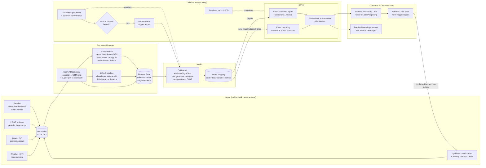

# Chapter 46 — Logic20/20: Offshore Senior ML Engineer (SDG&E "Veg Extension") — Full Interview Notebook

> **Why this chapter exists:** You have **two 45-minute video interviews (MS Teams, recorded, via SmartRecruiters)** with Logic20/20 for an **Offshore Senior Machine Learning Engineer** seat on the **SDG&E (San Diego Gas & Electric) vegetation-management / wildfire-mitigation** program.
> - **Round 1 — Fri Jul 17 2026, 8:00–8:45 AM PDT (≈ 8:30–9:15 PM IST) — Linh Nguyen** (Sr. Developer, Advanced Analytics — treat as the *technical / solutioning* deep-dive).
> - **Round 2 — Mon Jul 20 2026, 9:00–9:45 AM PDT (≈ 9:30–10:15 PM IST) — Christian White** (Senior Data Scientist, wildfire/geospatial risk — **she/her** per her published bio; treat as a *technical peer + project + working-style* round, **not** a soft behavioral chat).
>
> **The core challenge this chapter solves:** your 8 years are in **banking + healthcare**, not utilities/geospatial/LiDAR. This notebook (a) teaches you the **vegetation-management ML domain cold**, and (b) gives you **honest bridges** from your real work so the "you've never done utilities — why you?" question becomes your strongest moment, not your weakest.
>
> **Pairs with:** Ch.10 (MLOps/LLMOps), Ch.11 (AWS & Azure), Ch.14 (Monitoring & Drift), Ch.16 (System Design), Ch.29 (Ensemble Models), Ch.44 (Cognine Senior MLE — the sibling consulting-MLE chapter). This chapter assumes those and adds the Logic20/20 + wildfire-veg framing.
>
> **How to use it (you have ~1 day before Round 1):** Read §1–§5 tonight (situation, company, domain, role, positioning). Drill §7–§10 (architecture, technical topics, live-coding, system design) — that's the technical meat for Linh. Skim §11 (per-interviewer game plan), §12 (Q&A bank), and §14 (morning-of cheatsheet) the morning of each round. Re-read §15 (**do-NOT-state-as-fact**) before *both* calls — it stops you from confidently saying something the research shows is unverified.

---

## 1. The 90-second situation brief

| Item | Detail |
|------|--------|
| **Employer** | Logic20/20, Inc. — Seattle-HQ business & technology consulting firm (founded 2005, CEO Christian O'Meara), ~227 employees, ~$34M revenue, private/founder-led. Strong **Energy & Utilities** vertical + **Advanced Analytics** practice. Staff call themselves "Logicians"; brand word is **"clarity."** |
| **End client** | **SDG&E (San Diego Gas & Electric)** — a Sempra investor-owned utility; ~3.7M people, ~1.5M electric meters, ~4,100 sq mi of San Diego + southern Orange counties. Widely regarded as the **US wildfire-mitigation leader**. |
| **Role** | **Offshore Senior MLE** — India-based remote seat, **US Pacific working hours**, on the SDG&E vegetation/wildfire program. "Offshore" = staffing arrangement for the contract, not a named India delivery centre. |
| **Domain** | **Vegetation management for wildfire mitigation** — ML/computer-vision on **LiDAR + aerial/satellite imagery + weather + asset data** to score which trees/spans are most likely to cause an ignition, and prioritise trim/removal work. |
| **Rounds** | Two 45-min recorded Teams calls (§ header above). **Both are technical/domain.** |
| **Your edge** | 8 yrs *production* ML in **regulated, safety-critical, rare-event** domains (banking risk, medical devices); **calibrated tabular risk modelling (XGBoost/LightGBM)**; **CV (CNN/YOLO/OCR, ViT)**; deep **MLOps** (train/serve skew, drift/PSI, model registry, CI/CD, Terraform, Airflow) on **both AWS and Azure**. |
| **Your gap** | Zero geospatial / remote-sensing / LiDAR-point-cloud / utilities / wildfire experience. **Be transparent; bridge, don't bluff.** |

**The single sentence that frames your whole interview** (memorise, deliver in the first 2 minutes of each round):

> *"Strip away the domain and this is a **rare-event risk-prioritisation problem, fed by computer vision, operationalised with rigorous MLOps for a regulated client** — and that's exactly my last eight years: calibrated gradient-boosted risk models for loan default and clinical routing, CV pipelines with CNN/YOLO/ViT, all shipped and monitored on AWS and Azure. The domain — species growth, clearances, HFTD tiers — I can learn in weeks. The production-ML judgment that keeps a safety-critical model honest took me years, and I already have it."*

**Why the role fits despite the gap (the "aha" the research surfaced):** Logic20/20's actual utility ML work is **tabular risk scoring (their "Vegetation Risk Index / VRI") + CV on imagery + cloud MLOps**. Their published utility case study describes migrating asset-ignition-risk models to **serverless with independent feature ETL, model/data versioning, and a reusable inference pipeline** — a near-twin of your **XGBoost loan-withdrawal pipeline on AWS Lambda+SQS (ROC-AUC 0.84)** and your **train/serve-skew diagnosis (4,001 offline features vs 28 online keys)**. Lead with that parallel.

---

## 2. Logic20/20 in a few paragraphs (read slowly once)

**The firm.** Logic20/20 is a **delivery-focused, professional-services consultancy** — it drops senior people onto a client's problem and expects a working system under real deadlines. It is **not** a product startup or a research lab: it rewards engineers who can **scope, ship, and operate** quickly and safely. That is precisely your ResMed/TrueBalance/NatWest shape — say so. It has been named a *Consulting Magazine* "Best Firm to Work For" (2025) and a *Seattle Business Magazine* "Best Company" for ~10 consecutive years (Jan 2026), and in **Sep 2025 partnered with n8n** to scale AI-driven automation (a hook for your LangGraph/MCP/agent work).

**The Energy & Utilities practice** is organised into five pillars, all worth naming: **(1) Asset Investment, Planning & Operations; (2) Enhanced Asset & Vegetation Analytics; (3) Emergency Operations; (4) Digital & AI Foundations; (5) Regulatory Alignment.** They serve a heavy roster of North-American utilities — **SDG&E, PG&E, SCE, Sempra, SoCalGas**, Seattle City Light, PSE, Xcel, Exelon, National Grid, Evergy, Idaho Power and more. The California IOU concentration is why **wildfire / Wildfire-Mitigation-Plan (WMP)** work is central to the practice.

**The wildfire / vegetation products to know by name** (these frame the whole interview):

| Product / asset | What it is | Your hook |
|---|---|---|
| **Vegetation Risk Index (VRI)** | An **ML model** assigning ignition-risk scores across the territory (down to zones or individual trees) to replace **calendar-based** trimming with **risk-based** prioritisation; ingests **historical pruning data** as a feedback loop. | This is a **calibrated tabular risk model** → your XGBoost/LightGBM + probability-calibration wheelhouse. |
| **TreeVision** | Their **computer-vision** accelerator: runs on **public NAIP aerial imagery + Microsoft Azure** to detect **individual trees**, estimate density, and measure **proximity to infrastructure**; outputs **versioned GIS layers**. Builds a territory-wide tree baseline "in weeks." | Your **CNN/YOLO/OCR + ViT** CV experience + your **Azure** depth (Databricks/Data Factory/ML Studio) match this almost exactly. |
| **WMP AI Expert** | LLM-assisted authoring of California **Wildfire Mitigation Plans** aligned to requirements/evidence. | Your **RAG / LLM-eval / LangGraph / MCP** work. |
| **PSPS Decision Tool** | Models thresholds + asset risk for **Public Safety Power Shutoff** decisions. | Tabular risk + optimisation-under-uncertainty framing. |
| **Digital Twin / Post-Event Reporting** | Geospatial + asset-health + weather twin; regulator-ready EOC reports. | Data fusion + governed reporting. |

They fuse **satellite imagery, LiDAR, GIS, asset records, inspection/drone footage, weather** and justify spend with **Risk-Spend Efficiency (RSE)** and **Cost-Benefit Analysis** — the CPUC/Energy-Safety regulatory metrics. Know the terms **RSE** and **CBA**.

**Leadership worth naming (sparingly):** Adam Cornille (Sr. Director/MD, **AI & Analytics** — owns the org this role sits in), Kaitlyn Petronglo (Director, Advanced Analytics), Alex Lago (MD, Grid Operations), Mark Von Weihe (MD, National Utilities), Alexander Johnson (ML Architect). **Do not name-drop excessively** — one reference to "Adam Cornille's AI & Analytics practice" is plenty.

**Culture / Glassdoor (context, don't raise negatives):** stated values are **clarity, collaboration, integrity, inclusiveness, "One Team."** Glassdoor ≈ 3.1/5; interview experience mixed and informal/free-form — candidates report being **encouraged to interview the interviewers.** So *bring good questions* (§11.4) and *be crisp and self-directed* — that alone differentiates you.

---

## 3. The domain — SDG&E wildfire & vegetation management (the vocabulary you must own)

You will be quizzed, directly or by implication, on this world. Master the words in **bold**; you don't need to be an expert, you need to sound like someone who did the homework and thinks like an ML engineer about it.

### 3.1 Why wildfire dominates *everything* (the "why this matters" they want to hear)

- **Inverse condemnation** — under California law a utility can be held **strictly liable for property damage caused by its equipment, even without negligence.** One ignition can mean **billions** in liability. This is the financial engine of the whole market.
- **The disasters that built the market:** the **2018 Camp Fire** destroyed Paradise and pushed **PG&E into Chapter 11 bankruptcy (Jan 2019)** under ~$30B in wildfire liabilities. **SDG&E's own reckoning came earlier** — its lines ignited the **2007 Witch/Guejito/Rice fires** (~198,000 acres; 69-kV conductors slapping in Santa Ana winds), ~$4B in claims, **~$2.4B settled**. That decade-earlier trauma is why SDG&E "got religion" first and is now the mitigation leader.
- **The regulatory stack (memorise these acronyms):**
  - **WMP — Wildfire Mitigation Plan.** The legally required plan (now on a **2026–2028** three-year cycle with annual updates; the prior **2023–2025** plan was approved Oct 2023 and rated strong on vegetation). Covers risk modelling, grid hardening, **vegetation management**, inspections, situational awareness, PSPS, and quantified **RSE**.
  - **OEIS ("Energy Safety") — Office of Energy Infrastructure Safety.** The Wildfire Safety Division moved out of CPUC to OEIS on **July 1, 2021**. OEIS **reviews/approves/audits** the WMP (approved SDG&E's 2026–2028 base plan **Feb 3, 2026**).
  - **CPUC — California Public Utilities Commission.** Economic regulator; ratifies OEIS decisions and decides **cost recovery** (whether ratepayers reimburse the spend). **AB 1054 (2019)** created the ~$21B Wildfire Fund tied to a safety certification.
- **The tension to name out loud:** **safety vs reliability vs cost.** Over-trimming and over-shutting-off waste ratepayer money and anger customers (PSPS blackouts); under-doing it risks a catastrophic fire. **ML exists to optimise that trade-off with defensible, calibrated, per-segment risk scores.**

### 3.2 Vegetation-management specifics

**HFTD — High Fire-Threat District** (CPUC Fire-Threat Map, R.15-05-006): **Zone 1 / Tier 1** high-hazard, **Tier 2 = elevated** risk, **Tier 3 = extreme** risk. Tier 3 gets the most aggressive treatment and undergrounding priority. SDG&E deliberately **scoped WMP veg activities to the HFTD** — that scoping is itself a prioritisation/ML problem.

**Clearance law (know the numbers):**
- **GO 95, Rule 35** (CPUC General Order): baseline **18-inch radial clearance** for 750 V–22.5 kV.
- **Inside the HFTD:** recommended **12 ft at time of pruning** (2.4–72 kV); **4 ft outside** the HFTD. SDG&E uses **enhanced clearances exceeding 12 ft, up to ~25 ft** where feasible — because clearance must survive **at least one full annual growth cycle**.
- **PRC 4293** (Public Resources Code): 4-ft radial clearance year-round in State Responsibility Areas; **PRC 4292**: 10-ft pole clearance to bare soil.
- **NERC FAC-003**: transmission **Minimum Vegetation Clearance Distance (MVCD)** maintained *at all times*.

**Grow-in vs fall-in — the two risk archetypes (they may test this explicitly):**

```
   GROW-IN (clearance problem)                 FALL-IN (strike-tree problem)
   ───────────────────────────                 ────────────────────────────
        │ conductor                                  │ conductor
   ~~~~~●~~~~~~~~~~~~                            ~~~~~●~~~~~~~~~~~~
        ╱│╲  tree growing UP                        ╱│╲        🌳 tall/dead/leaning
       ╱ │ ╲ into clearance zone                   ╱ │ ╲      tree OUTSIDE the zone
      ╱  │  ╲ over the trim cycle                 ╱  │  ╲    that could FALL/throw a
     ▓▓▓▓▓▓▓▓▓                                   ▓▓▓▓▓▓▓▓▓   limb onto the line
   Driver: species growth rate,               Driver: tree height vs distance
   distance-to-conductor,                     ("reach"), lean, health/decay,
   time-since-last-trim, climate.             DBH, wind loading.
   → Managed by pruning cadence.              → Managed by hazard-tree removal
                                                (trees up to ~200 ft away can be hazards).
```

**Program mechanics:** *Pre-inspection* → identify work → *pruning/removal* ~2–3 months later (ANSI standards). HFTD trees get a **second annual inspection**. SDG&E **pre-inspects ~500,000 trees/year**. Plus **pole clearing** (10-ft radius, ~35,000 poles), **fuels management / defensible space**, QA/audit, and a **Tree Trimming Balance Account** for cost recovery. *(Treat the exact 500k / 35k figures as medium-confidence — see §15.)*

### 3.3 PSPS & the situational-awareness network (SDG&E is the US leader)

- **PSPS — Public Safety Power Shutoff:** proactively **de-energising** circuits in extreme fire weather. Decision blends **wind (sustained + gust), humidity, live/dead fuel moisture, field observations, fire-agency input.** Blackouts are politically costly → *minimising unnecessary shutoffs* is a modelling objective (optimisation under uncertainty).
- **The network:** **170+ (some sources 220+) weather stations** reporting ~every 10 min; an in-house **meteorology team**; **AI smoke-detection PTZ hilltop cameras** (part of statewide **ALERTCalifornia/ALERTWest**, ~1,200+ cameras — flagged ~3,600 fires in 2025, >50% before a 911 call; **Pano AI** is a commercial peer). **Fire Potential Index (FPI)** — a per-circuit daily fire-danger score (scale ~1–17: normal 1–11, elevated 12–14, extreme 15+) from wind, dewpoint depression, and fuel moisture.

### 3.4 WiNGS — SDG&E's flagship risk platform (know this by name)

**WiNGS = "Wildfire Next Generation System."** Cloud geospatial platform fusing infrastructure, real-time weather, historical ignitions, tree-strike analysis, fire modelling, PSPS probability, and critical-customer locations. **The formula to have on your tongue:**

> **Wildfire Risk = CoRE × LoRE** — **Consequence of Risk Events × Likelihood of Risk Events.**

It assigns a **quantified risk score to each grid segment** (conductor span) from ignition probability, **vegetation exposure**, asset condition, wind profiles, and customer vulnerability. **WiNGS-Planning** runs consequence simulation and recommends **undergrounding vs covered conductor**. SDG&E integrates **Technosylva's "Wildfire Analyst"** fire-spread engine and runs **>10M virtual wildfire simulations/day.** Vegetation is *one driver* feeding this bigger model — so a smart thing to say is: *"I'd position the vegetation risk score as a calibrated, span-keyed **feed into WiNGS**, not a replacement for it."*

### 3.5 Sensing programs (the data your model eats)

- **Drone inspection:** **DIAR** (2019–2022, 100,000+ inspections) then **RIDI** (Risk-Informed Drone Inspection, 2023–present; ~15k pole inspections yr 1, ~13k/yr, scoped to HFTD/WUI; **locations prioritised by data scientists using AI + outage/failure/PSPS history**). SDG&E trained inspection models on **>3.8M drone images.**
- **LiDAR:** centimetre-accurate 3-D models of poles/wires/vegetation for **clearance measurement** and NERC FAC-003 / CPUC compliance; used most on **transmission** + the distribution **FiRM (Fire Risk Mitigation) Program.**
- **Grid hardening (context for the model's recommendations):** **Strategic Undergrounding Program (2019–2032, ~1,500 miles)**, HFTD Tier 3/2 first; **covered (insulated) conductor** is the cheaper alternative the model weighs.

**Domain vocabulary to deploy naturally (say ~6–8 of these across the two rounds):** HFTD, Tier 2/Tier 3, GO 95 Rule 35, MVCD, grow-in vs fall-in, hazard tree, defensible space, PSPS, FPI, WMP, OEIS/CPUC, RSE, inverse condemnation, WiNGS, CoRE × LoRE, undergrounding vs covered conductor, VRI, RIDI/DIAR, NAIP, NDVI, canopy height model, SAIDI/SAIFI, WUI.

---

## 4. The role decoded — "Offshore Senior MLE (SDG&E: Veg Extension)"

Reverse-engineer the title into what they will actually test:

```
              "Offshore Senior MLE — SDG&E Veg Extension" — what they want
   ┌──────────────────────────────────────────────────────────────────────────────┐
   │  35%  PRODUCTION MLOps                    25%  RISK MODELLING (tabular)         │
   │  • Productionise/extend an existing        • Calibrated grow-in / fall-in       │
   │    veg-risk pipeline (their peer role's      probability per span/tree          │
   │    charter is exactly "MLOps                • XGBoost/LightGBM + SHAP + ECE      │
   │    productionisation")                      • Rare-event, imbalanced, ranked    │
   │  • Train/serve skew, drift, registry,        work-orders (precision@k)          │
   │    CI/CD, monitoring, cost                                                       │
   │                                                                                  │
   │  20%  COMPUTER VISION / GEOSPATIAL         20%  CONSULTING / DELIVERY / FIT      │
   │  • Detection & segmentation on aerial      • Offshore, US Pacific hours          │
   │    /satellite/drone imagery (TreeVision)   • Client-facing maturity, regulated   │
   │  • LiDAR clearance (honest ramp area)        (WMP/CPUC) documentation            │
   │  • Sensor fusion, CRS/tiling                • Ramp fast into a running program    │
   └──────────────────────────────────────────────────────────────────────────────┘
```

**"Veg Extension" — what it (probably) means, and how to handle it.** It is **undocumented** — do **not** assert a meaning. The most reasonable working hypothesis: an **extension of an existing SDG&E vegetation-management ML/data program** (more circuits, new imagery/LiDAR feeds, growth-rate modelling, or MLOps hardening) — i.e. **you'd join a running program, not build greenfield.** Secondary readings: a contract/SOW/staffing extension, or a scope/dataset expansion. **Ask the interviewer to define it** — that's a good, senior question and it protects you from guessing wrong.

**Senior + offshore + "extension" = they want low-ego, fast-ramping delivery.** Every answer should carry: *"I plug into an existing codebase quickly, ship a small safe change first, respect the incumbent design, and add value incrementally."* Not: *"I'll rebuild it my way."*

---

## 5. Positioning Sachin — resume → role, skill map, and signature stories

### 5.1 The skill-map table (rehearse saying this out loud)

| Technical area | Your real bridge (lead with these) | Honest gap (name it, offer to ramp) |
|---|---|---|
| **Production MLOps for geo-CV** | SageMaker **+ Azure ML Studio**, model registry, **drift/PSI monitoring**, Datadog, Terraform, Airflow, Docker/K8s, CI/CD; **FCA-regulated NatWest platform shown at AWS re:Invent** → governed/audited pipelines = WMP/CPUC analog. **Near 1:1 with the peer MLOps charter.** | GPU imagery-training *scale*; phenology-/season-aware retraining triggers. |
| **Tabular risk modelling (the bullseye)** | **XGBoost loan-withdrawal on AWS Lambda+SQS, ROC-AUC 0.84**; XAI loan-risk; **probability calibration**; **train/serve-skew diagnosis (4,001 vs 28 features)**. Ignition/strike risk = calibrated rare-event classification → your home turf. | Vegetation-growth dynamics; wildfire-consequence modelling specifics. |
| **Computer vision / imagery** | **YOLO in production** (ID verification), CNN, OCR, **ViT** (→ SegFormer backbone family). Detection of insulators/hardware/trees is the same modelling family. | Pixel-level **semantic segmentation** (U-Net/DeepLabv3+) not yet shipped; **multispectral/NDVI/remote-sensing** is new. |
| **LiDAR / point clouds** | **GraphSAGE/GNN** is a real conceptual bridge (DGCNN / superpoint methods are graph nets over point graphs); ViT/CNN training machinery transfers; clearance = deterministic 3-D geometry, not all model training. | **Biggest gap** — no PDAL/laspy/PointNet++/KPConv/RandLA-Net/PLS-CADD hands-on. Say so plainly. |
| **Geospatial data engineering** | Spark, Airflow, Snowflake, feature stores, S3/Athena, **Azure Data Factory + Databricks**. Tiled raster inference ≈ sharded batch; COG range-reads ≈ smart chunking; STAC ≈ a catalog. | New libs: GDAL/rasterio/geopandas/PostGIS/COG/STAC; **CRS discipline** (project to **UTM 11N** before any distance math). |
| **Evaluation** | Rare-event **PR-AUC over ROC-AUC**, calibration (ECE/Brier), cost-sensitive thresholds, **precision@k**. | Add segmentation/detection vocab: **IoU/mIoU/Dice, mAP@0.5 / @[.5:.95]**. |
| **Platform fit** | **Azure depth matches TreeVision (NAIP + Azure); AWS depth matches serverless case study.** Dual-cloud is a genuine differentiator. | — |
| **Domain / regulatory** | Regulated-ML instincts from FCA (banking) + HIPAA-class (healthcare). | GO 95 / PRC 4293 / FAC-003 / HFTD / grow-in vs fall-in — study §3 before Friday. |

### 5.2 The honest-gap sentence (memorise verbatim — it's your answer to Q51)

> *"I'll be transparent: I haven't worked in geospatial or utilities, and point-cloud/LiDAR modelling and the remote-sensing stack are genuine ramps for me. What I bring on day one is the core this program runs on — a **calibrated gradient-boosted risk model feeding prioritised work orders**, deployed and monitored for **drift and train/serve skew on AWS and Azure** — plus a **CV background (YOLO, ViT)** that's one step from segmentation. The domain — species growth, clearances, HFTD — is learnable in weeks. The production-ML rigor that keeps a safety-critical model honest is what I already do."*

### 5.3 Your six signature stories (project shorthand used throughout)

| # | Story | Use it for |
|---|-------|-----------|
| **P1** | **SMS knowledge-graph parser** (regex → KG, 7 entities/29 predicates, **100% field coverage on 100K+ records**, 107 tests) | Systems thinking; replacing brittle rules with structured/learned systems (mirrors *calendar-based → risk-based*); unifying messy multi-source data; entity resolution. |
| **P2** | **XGBoost loan-withdrawal pipeline** (AWS Lambda+SQS, ARM64/ECR, **ROC-AUC 0.84**; **train/serve skew 4,001 offline vs 28 online**; safe rollback) | *The* end-to-end story. Rare-event risk, calibration, the marquee production bug, event-driven serving. |
| **P3** | **Lender-ID evidence matcher** (7-strategy, confidence-ranked, **29.7% → 68%** across 109K tradelines, zero lost matches) | Metric-driven root-cause work; entity/evidence matching (≈ joining trees to spans/poles). |
| **P4** | **ResMed GenAI clinical query-routing** (LLM + RAG + code-gen over a clinical KB, HIPAA-class, human-in-the-loop) | GenAI/RAG (→ WMP AI Expert); **human-in-the-loop** (→ arborist review); regulated-domain communication. |
| **P5** | **NatWest MLOps platform** on SageMaker (FCA-regulated, training/inference/drift/CI-CD/auto-retrain, **shown at AWS re:Invent**) | Governed, audited, regulator-defensible ML = the CPUC/WMP analog. Client-facing at scale. |
| **P6** | **Sopra Steria CNN+YOLO+OCR ID-verification + XAI loan-risk** | Computer vision credibility; explainability to non-technical/audit stakeholders. |

**Rule:** *answer the question, then anchor to a project, then connect to their world.* Example: "*Accuracy is the wrong metric for rare ignitions [answer] — on my loan model I drove decisions off PR-AUC and a cost-weighted threshold, not the 0.84 ROC-AUC [P2] — and for a veg-risk model I'd rank spans by calibrated expected risk against the crews' actual weekly capacity [their world].*"

---

## 6. The reference architecture you MUST be able to draw

If you can whiteboard this in ~90 seconds and narrate the data flow, you pass the "can you architect it" bar. It deliberately mirrors **Logic20/20's stated pipeline** (automated ingestion → processing → deployment + metadata dashboard + retraining feedback loop) and **SDG&E's span-level WiNGS**. Drawable on either Azure or AWS — say which and give the service names.



**Narration script (say this out loud):**
> "Multi-modal, multi-cadence data lands in a lake — a slow LiDAR baseline, near-daily satellite growth signal, near-real-time weather and FPI, asset/GIS, and the label stream from ignitions, work orders, and pruning history. Processing on Spark/Databricks **reprojects everything to UTM 11N before any distance math**, tiles the rasters, and geo-joins to the span/pole. Two feature producers run: a **CV path** (segmentation + detection giving canopy encroachment %, hazard-tree counts, equipment defects with confidence) and a **LiDAR path** (classify points, fit the conductor catenary, compute 3-D clearance). Both write to a **feature store so offline equals online** — that's the train/serve-skew lesson I learned the hard way. A **calibrated XGBoost VRI** scores grow-in and fall-in risk per span with SHAP explanations, registered with full lineage. Serving is mostly **nightly batch over all spans**, with **event-driven rescoring** when new imagery or LiDAR arrives. Outputs prioritise work orders, feed a planner dashboard and WMP reporting, and feed the span score **into WiNGS** rather than replacing it. Arborists verify flagged spans and their verdicts become **new labels** — a closed loop. Around all of it: drift/PSI and per-slice monitoring, pre-season plus trigger-based retraining, and Terraform + CI/CD."

**The serving-pattern decision table (a favourite senior question):**

| Pattern | Use when | Here specifically |
|---|---|---|
| **Nightly batch** | Slow-moving phenomenon, score everything | **Default** — vegetation changes over weeks; score all spans nightly |
| **Event-driven (Lambda/SQS / Functions)** | New data lands, or red-flag fire-weather day | Rescore circuits when new imagery/LiDAR arrives, or on a high-FPI day |
| **Real-time endpoint** | Interactive, low-latency | Rarely needed here — don't over-engineer streaming for trees (maturity signal) |

---

## 7. Deep technical topics — with worked examples

### 7.1 LiDAR & point clouds (your honest ramp area — know the shape, don't fake depth)

**The pipeline:** (1) **classify each point** — ASPRS LAS codes worth quoting: `2=ground, 3/4/5 = low/med/high veg, 6=building, 13=wire-shield, 14=wire-conductor, 15=tower, 16=structure-connector`; (2) **extract conductors** and fit them; (3) **model the wire under load** (sag/blow-out); (4) **compute distance from every veg point to the nearest conductor**; (5) flag points inside the **MVCD** and tall trees whose height/lean means they could fall in.

**Tooling to name:** **PDAL** (JSON-pipeline point-cloud processing; ground filters **SMRF / PMF / CSF**), **LAStools** (`lasground`, `lasheight`, `lasclassify`), **laspy** (Python LAS/LAZ), **Open3D / CloudCompare**, **pgpointcloud** (PostGIS), and **PLS-CADD** (Power Line Systems / Bentley — the utility standard). PLS-CADD fits a **catenary curve** to the LiDAR conductor points, computes tension via **IEEE 738 / CIGRE** thermal methods, then **predicts wire position under wind/ice/operating-temperature** and compares that against vegetation points — so clearance is evaluated at **max operating temp / blow-out**, not just as-flown. That nuance ("clearance isn't a snapshot, it's the worst-case wire position") signals real understanding.

**Point-cloud ML models (differentiate them in one line each):**
- **PointNet** (2017) — first to consume raw points; shared MLPs + symmetric max-pool for permutation invariance; no local structure.
- **PointNet++** — hierarchical set-abstraction (farthest-point sampling + ball-query); the workhorse baseline.
- **KPConv** — kernel-point convolution; **most accurate for wire-point classification** in a 2024 benchmark (captures fine wire detail).
- **RandLA-Net** — random sampling + local aggregation; **efficient for corridor-scale** (millions of points); slightly less accurate than KPConv but faster.
- Sparse-voxel (MinkowskiNet/SparseConvNet), graph (DGCNN, SuperPoint Graphs, Point Transformer). Datasets: **DALES** (has a powerline class), Semantic3D, Toronto3D. Key practical tip: **remove ground points first** — it materially improves wire classification.

**Your bridge, stated honestly:** *"I haven't shipped point-cloud DL, so PDAL and KPConv/RandLA-Net are a ramp. But two things transfer: my GNN/GraphSAGE work — several point-cloud methods are graph nets over k-NN point graphs, so the message-passing intuition is the same — and the fact that much of the corridor pipeline (catenary fit, point-to-conductor distance, clearance thresholding) is **deterministic geometry**, not model training."*

### 7.2 Aerial / satellite / multispectral imagery (strong adjacency — YOLO is home turf)

**Architectures (name + when):**
- **Semantic segmentation** (per-pixel canopy/ground/conductor): **U-Net** (the remote-sensing default), **DeepLabv3+** (atrous conv + ASPP for multi-scale), **SegFormer** (transformer encoder + light MLP decoder — and its backbone is the **ViT family you know**).
- **Instance segmentation / crown delineation:** **Mask R-CNN** (per-tree crowns → per-tree height/clearance); **Detectree2**; **DeepForest** (RetinaNet, pretrained on ~30M crowns, fine-tuned on 10k hand-labelled) for RGB crown boxes; **SAM** to bootstrap masks.
- **Detection:** **YOLO** for real-time powerline/asset/defect detection — *this is your production experience.* There's a 2025 paper doing exactly YOLO-based powerline detection for VM.

**Which to pick for what:** segmentation for **canopy coverage / encroachment area**; detection (YOLO) for **discrete objects** (equipment defects — matches Logic20/20's insulator work; hazard trees); instance seg for **per-tree strike analysis**.

**Vegetation indices (memorise a couple of formulas):**
- **NDVI = (NIR − Red) / (NIR + Red)** — greenness/vigour; low/negative = dead/stressed.
- **NDMI / NDWI** — moisture / **fuel dryness** — *directly tied to ignition risk*.
- **Canopy Height Model: CHM = DSM − DTM** — tree height, the key input to fall-in "reach."

**Imagery providers & the trade-off (know the numbers):**

| Source | Resolution | Revisit | Role |
|---|---|---|---|
| **Maxar (Vantor)** | ~30 cm | up to ~15/day | Precision ("what exactly is here?") — expensive |
| **Planet / PlanetScope** | ~3 m | **daily** | Persistence / change detection — cheap, frequent |
| **Nearmap / Vexcel** | ~4.4–15 cm (aerial) | on schedule | Sharpest, but limited coverage, no tasking |
| **NAIP** (Logic20/20 uses this) | ~0.6–1 m (US aerial) | ~annual, **free** | Territory-wide tree baseline |
| **Sentinel-2** | 10 m | 5-day, **free** | Red-edge veg health, trend |
| **Landsat 8/9** | 30 m | free | Long archive for trend |

The core answer: **resolution vs revisit vs cost vs coverage.** A real program **tiers** them — broad cheap low-res for change screening → high-res tasking on flagged spans → drone/LiDAR on the highest-risk assets. **SAR** (Sentinel-1) is the bonus fact: it sees through cloud and at night.

**Your bridge:** *"Detection is home turf — I've run YOLO in production. Segmentation (U-Net/DeepLabv3+/SegFormer) is a short step, and SegFormer is a ViT backbone I've worked with. The genuinely new muscle is **multispectral indices and imagery providers** — that's domain knowledge I'd pick up fast."*

### 7.3 Encroachment / risk modelling — worked example (your strongest bridge)

**The problem:** turn CV/LiDAR outputs + tabular context into a **per-span (or per-tree) calibrated risk score** that prioritises trim/removal work under a fixed crew budget.

**A compact worked example you can reproduce out loud:**

1. **Framing.** It's **ranking/prioritisation, not classification** — the deliverable is "which 5% of spans to inspect/trim first," so optimise **PR-AUC, precision@k, lift**, not accuracy. Ignitions/strikes are *extremely* rare (a handful per hundreds of thousands of spans).
2. **Two targets.** *Grow-in* → growth-rate regression → **time-to-breach** of the clearance envelope before the next trim. *Fall-in* → strike probability from height-vs-distance reach, lean, health/decay, DBH, wind.
3. **Features (say the families):**
   - *Vegetation (from CV/LiDAR):* species, canopy height (CHM), distance-to-conductor, growth since last scan, NDVI/health, lean.
   - *Asset:* voltage, span length, conductor type/age, prior faults, right-of-way width.
   - *Environment:* wind exposure, slope/aspect, **HFTD tier**, fuel moisture, FPI history.
   - *History (labels/leaks):* past ignitions, prior encroachments, time-since-last-trim, work-order outcomes.
4. **Model.** **XGBoost/LightGBM** — handles heterogeneous tabular + missing values natively, gives **SHAP** and calibrates well after a held-out **Platt/isotonic** step; trees dominate wildfire-susceptibility literature (an Optuna-tuned LightGBM hit AUC>0.98 in CV). A neural net only earns its keep for **fusing imagery embeddings + tabular** (late-fusion / two-tower: CV embedding as a feature into the GBT).
5. **Calibration (your differentiator).** A "0.8 risk" span must ignite/encroach ~80% as often as implied, or you can't rank across circuits, aggregate to portfolio risk, or defend it to the CPUC. Report **reliability diagram, ECE, Brier**. Trees are often mis-calibrated → calibrate on held-out data.
6. **Decision.** **Expected risk = P(breach/strike) × consequence** (customers out, HFTD ignition potential). Because you can't trim everything, it's a **capacity-constrained ranking** — pick top-k by weekly crew capacity, not a fixed probability cutoff.
7. **The prioritisation formula on a slide:**

```
   RiskScore(span) = P_calibrated(grow-in breach OR fall-in strike | features)
                     × Consequence(customers, HFTD tier, fire-spread potential)

   Work list = argsort(RiskScore) [: crew_capacity_this_cycle]
   Report:  precision@k  = (# genuine hazards in top-k) / k
            "risk reduced per crew-hour"  ← speak Logic20/20's ROI language
```

**Your mapping (say it explicitly — this is the money moment with Linh):** *"My loan-withdrawal model [P2] is structurally the same: tabular features → gradient boosting → **calibrated probability** → ranked action list, deployed serverless on Lambda+SQS. The **train/serve skew I diagnosed — 4,001 offline features against 28 online keys — is the canonical geospatial failure mode**: you train on rich imagery-derived features that the online path can't reproduce. I'm already the person who catches that. And the grid is a graph — poles→spans→conductors→circuits — so my GraphSAGE work could propagate/smooth risk along feeders."*

### 7.4 Geospatial data engineering (new libs on familiar patterns)

**Name the stack fluently:** **GDAL/OGR** (the foundation) wrapped by **rasterio / fiona / geopandas / shapely / pyproj / rioxarray**; **PostGIS + pgpointcloud** for spatial storage (`ST_Distance`, `ST_DWithin`); **Cloud-Optimized GeoTIFF (COG)** (internal tiling + overviews → HTTP range-request just the window you need); **STAC** (SpatioTemporal Asset Catalog; `pystac / stackstac / odc-stac` turn queries into xarray cubes); **Dask** for parallelism; **tiled inference** (chip → run → stitch, handle seams with overlap + NMS).

**The CRS gotcha (a likely trap — nail it):** *"You cannot compute clearance distances in lat/lon (EPSG:4326). I'd reproject to a projected CRS in metres — for SDG&E's territory that's **UTM Zone 11N (NAD83)** or a California State Plane zone — before any distance math. Web Mercator (3857) is for tiles/display, not measurement."* That one sentence signals real geospatial literacy.

**Your bridge:** *"COG/STAC/GeoTIFF and CRS handling are new libraries for me, but they sit on the **same Spark/Airflow/S3/Databricks data-engineering patterns I run daily** — tiled raster inference is a sharded batch job, COG range-reads are smart chunking, STAC is a catalog. And CRS discipline is exactly the kind of correctness trap I'd flag on day one."*

### 7.5 Evaluation

- **Segmentation:** **IoU/Jaccard = TP/(TP+FP+FN)** per class; **mIoU** headline; **Dice/F1 = 2TP/(2TP+FP+FN)**. Pixel accuracy misleads under imbalance.
- **Detection:** **mAP@0.5** and **mAP@[0.5:0.95]** (COCO-style).
- **Rare-event risk (your strength):** **PR-AUC / average precision** over ROC-AUC; **recall at fixed precision** (or precision at the recall crews can action); cost-sensitive thresholds; **precision@k / work-order hit-rate**. For safety-critical veg, **recall usually beats precision** (a missed strike tree is worse than a false flag the arborist filters) — so tune the confidence threshold toward recall.
- **Label quality (raise it proactively — interviewers love it):** field-crew/arborist labels are noisy — **GPS geolocation drift** misaligns a labelled tree with its pixels/points; "hazard" vs "declining" varies by inspector; leaf-on/leaf-off changes appearance; positives are sparse. Mitigations: consensus labelling, geolocation snapping/co-registration, **active learning** on uncertain cases, and treating arborist "confirmed / no-action" outcomes as a **label feedback stream**.

### 7.6 MLOps for geospatial CV (your second-strongest bridge — near 1:1)

**What's different from generic MLOps — and how you already do it:**
- **TB-scale imagery/point clouds** → tiled ingest, COG storage, GPU inference with stitching, **change detection to avoid reprocessing** unchanged areas. (≈ your sharded Spark/batch pipelines.)
- **Drift is seasonal and physical by design** — vegetation *grows*, phenology shifts (leaf-on/off), sensors change, HFTD boundaries move. So monitoring must **separate "the world changed (real)" from "the model degraded."** Retraining aligns to **trim cycles + pre-fire-season**, plus **trigger-based** on PSI breach. (≈ your PSI/drift monitoring, Datadog, model registry.)
- **Human-in-the-loop:** arborists verify → QA + label loop; active learning routes uncertain/high-consequence cases first. (≈ your ResMed clinician-in-the-loop routing [P4].)
- **Regulator-defensible:** SHAP explanations, versioned model+data lineage, calibration reports, documented validation → defend "why this span was/wasn't prioritised" to CPUC. (≈ your FCA-regulated NatWest platform [P5].)

**Your line:** *"I already do the entire geospatial-MLOps kit under different labels — SageMaker and Azure ML, model registry, drift/PSI, Datadog, Terraform, Airflow, K8s, CI/CD — and I've run a governed, audited pipeline under a financial regulator, which is the direct analog of CPUC/WMP reporting. The only genuinely new pieces are GPU imagery scale and phenology-aware retraining triggers."*

---

## 8. Likely live-coding / "write this" moments (Python)

First rounds sometimes include a *small* coding or "talk through code" task. High-probability ones for this role — they grade **clean, testable, deterministic** code and that you **mention edge cases + tests**.

**(a) NDVI + a fuel-dryness flag from a multispectral array** (shows you understand the domain math):
```python
import numpy as np

def ndvi(nir: np.ndarray, red: np.ndarray, eps: float = 1e-6) -> np.ndarray:
    """NDVI in [-1, 1]. eps avoids divide-by-zero on no-data/black pixels."""
    nir = nir.astype("float32"); red = red.astype("float32")
    return (nir - red) / (nir + red + eps)

def stressed_vegetation_mask(nir, red, ndvi_low=0.2):
    """Low NDVI over vegetated pixels ~ dead/stressed fuel (higher ignition risk)."""
    v = ndvi(nir, red)
    return (v > 0) & (v < ndvi_low)   # >0 = vegetation, but low vigour
```

**(b) IoU + precision@k — the two metrics they care about:**
```python
import numpy as np

def iou(box_a, box_b):
    """box = (x1, y1, x2, y2). Returns intersection-over-union in [0,1]."""
    ax1, ay1, ax2, ay2 = box_a; bx1, by1, bx2, by2 = box_b
    ix1, iy1 = max(ax1, bx1), max(ay1, by1)
    ix2, iy2 = min(ax2, bx2), min(ay2, by2)
    inter = max(0, ix2 - ix1) * max(0, iy2 - iy1)
    area_a = (ax2 - ax1) * (ay2 - ay1)
    area_b = (bx2 - bx1) * (by2 - by1)
    union = area_a + area_b - inter
    return inter / union if union else 0.0

def precision_at_k(y_true, risk_score, k):
    """Of the top-k highest-risk spans we send crews to, how many are genuine hazards?"""
    order = np.argsort(risk_score)[::-1][:k]
    return float(np.mean(np.asarray(y_true)[order])) if k else 0.0
```

**(c) Calibrating an XGBoost risk score + ECE** (your differentiator, made concrete):
```python
import numpy as np
from sklearn.isotonic import IsotonicRegression

def calibrate(val_scores, val_labels):
    """Fit isotonic calibration on a HELD-OUT set (never on train)."""
    iso = IsotonicRegression(out_of_bounds="clip")
    iso.fit(val_scores, val_labels)
    return iso  # iso.predict(new_scores) -> calibrated probabilities

def expected_calibration_error(probs, labels, n_bins=10):
    probs, labels = np.asarray(probs), np.asarray(labels)
    edges = np.linspace(0, 1, n_bins + 1)
    ece = 0.0
    for lo, hi in zip(edges[:-1], edges[1:]):
        m = (probs > lo) & (probs <= hi)
        if m.any():
            ece += m.mean() * abs(labels[m].mean() - probs[m].mean())
    return ece
```

**(d) 3-D clearance distance (deterministic geometry — proves you get LiDAR without faking DL):**
```python
import numpy as np

def min_clearance(veg_points: np.ndarray, conductor_points: np.ndarray) -> float:
    """Min 3-D distance from any vegetation point to the conductor (metres).
    Inputs must already be in a PROJECTED CRS (e.g. UTM 11N), not lat/lon.
    O(N*M) brute force shown for clarity; use a KD-tree / cKDTree at scale."""
    from scipy.spatial import cKDTree
    tree = cKDTree(conductor_points)      # conductor as reference
    dists, _ = tree.query(veg_points, k=1)
    return float(dists.min())

# Encroachment = min_clearance < MVCD (e.g., GO 95 / FAC-003 threshold for the voltage class)
```

**(e) Tiled inference over a huge scene** (the "20000×20000 won't fit in GPU memory" question):
```python
def tiles(width, height, tile=1024, overlap=128):
    """Yield overlapping windows; overlap lets you blend/NMS across seams."""
    step = tile - overlap
    for y in range(0, height, step):
        for x in range(0, width, step):
            yield x, y, min(tile, width - x), min(tile, height - y)
# Run model per tile -> map detections back to geo-coords (keep the affine transform)
# -> global NMS to de-duplicate detections that straddle tile boundaries.
```

> **What they're grading:** naming, small pure functions, no hidden global state, **deterministic transforms so training == serving**, CRS awareness, and that you *say* "I'd add tests for nulls/empty input/dtype and a no-data mask." A classic DSA warm-up (two-sum, sliding-window, group-by/rolling in pandas) is also possible — keep Ch.20 warm.

---

## 9. One full system design — tailored to SDG&E (walk this exactly)

**Prompt (likely form):** *"Design an end-to-end vegetation-encroachment risk system for SDG&E on Azure (or AWS). Take ~10 minutes."*

**Step 1 — Clarify first (always; this IS the senior/consulting signal):** batch or real-time? Network-wide screen or high-risk deep-dive? Who consumes it — planners or arborists? **What's the label source** (confirmed ignitions? work-order outcomes? LiDAR clearance flags?)? Does it need to integrate with **WiNGS**? What imagery cadence exists today? Never dive into a design cold.

**Step 2 — Framing:** rare-event, capacity-constrained **ranking**; metrics **PR-AUC + precision@k**; baseline first ("distance-to-conductor + species growth rate" beats a fixed calendar — beat *that* before deep learning).

**Step 3 — Architecture:** draw §6. Narrate ingest (multi-modal, multi-cadence) → process (reproject UTM 11N, tile, geo-join) → CV + LiDAR feature producers → **feature store (offline==online)** → **calibrated XGBoost VRI** → registry → **nightly batch + event rescoring** → dashboard/WMP reporting + **feed into WiNGS** → arborist loop → labels.

**Step 4 — Features:** the four families from §7.3 (vegetation, asset, environment, history). Flag **point-in-time correctness** (don't use post-trim LiDAR or post-inspection work-order fields to predict inspection need — leakage) and **spatial leakage** (adjacent spans of the same circuit in both train and test).

**Step 5 — Model:** calibrated GBT; fuse CV outputs as **features/embeddings** (keep vision confidence as a feature, not a hard gate); SHAP per span.

**Step 6 — Validation:** **spatially-grouped, time-forward** splits (group by circuit/region; train on past seasons, test the next); **slice-based evaluation** so overall AUC can't hide a regression in one HFTD district; calibration on held-out; shadow → canary on a subset of circuits → arborist spot-check → promote via registry.

**Step 7 — Ops & cost:** drift/PSI (expect seasonal drift by design); pre-season + trigger retrain; **change detection to avoid reprocessing** unchanged tiles; GPU only for CV inference; batch on spot/scheduled compute; quantify **"risk reduced per crew-hour."**

**Step 8 — Integration & governance:** position the VRI as a **vegetation-driver feed into WiNGS**, not a replacement (crucial for an "extension" seat); SHAP + lineage + calibration reports for **CPUC/WMP defensibility**.

> This one walkthrough demonstrates *every* competency in §4 — framing, cloud, CV/LiDAR, tabular risk, MLOps, consulting judgment. If asked "design something," steer to this shape and anchor P2 + P5 + P6 throughout.

---

## 10. Batch vs real-time, data volume, and the other "senior maturity" answers

- **What actually needs real-time?** Almost nothing. Vegetation changes over weeks → **nightly/weekly batch**. Near-real-time only for **event-triggered rescoring** (new imagery/LiDAR, red-flag fire-weather day, storm response). *Don't over-engineer streaming for a slow phenomenon* — that restraint is a maturity signal.
- **Petabytes of LiDAR/imagery — how?** Change detection first (skip unchanged areas), tiered storage (Glacier/Archive for raw), spatial partitioning by circuit/tile, distributed processing (Spark/EMR/Databricks), **process-once/cache embeddings**, run expensive 3-D DL only on prioritised segments.
- **Integrate with WiNGS/FireSight rather than replace?** Output calibrated, **span-keyed** scores + features that WiNGS can consume. Respect the incumbent — this is exactly what a "Veg Extension" seat needs.

---

## 11. Per-interviewer game plan

### 11.1 Round 1 — Fri Jul 17, Linh Nguyen (technical / solutioning deep-dive)

**Who they are (state nothing as fact you can't back up):** listed on Logic20/20's Data & Analytics roster as **Sr. Developer, Advanced Analytics** (an IC title). A senior, hands-on DS/AI person on the practice that owns the SDG&E work. **Do not** reference "VP of AI at Q-Centrix," a Databricks-summit talk, or "leads a team of X" — those are unverified/likely a name-collision (§15).

**What they'll probe:** ML depth and *correctness* (not buzzwords); **framing a messy business problem as an ML problem**; **production/MLOps rigor**; cloud fluency (Azure + AWS); and **CV credibility** for the imagery domain.

**Game plan:** go deep and technical fast. Open with the **AWS-serverless / feature-ETL parallel** (your P2 + train/serve-skew story maps to their published case study). Have **P2 and P1** ready to whiteboard end-to-end (architecture, validation, failure modes). Be ready to reason **cold** about a CV-for-veg problem: labelling strategy, rare-defect class imbalance, precision/recall when a false negative = missed fire hazard, confidence thresholds, human-in-the-loop retraining. **Volunteer trade-offs and failure modes** (that's what "senior" sounds like). **Do NOT bluff LiDAR/point-cloud specifics** — use the honest-gap sentence.

**Rapport opener for Linh:**
> *"I read your team's writing on operationalising ML for utilities — the serverless migration with independent feature ETL and model/data versioning. That's almost exactly what I built at TrueBalance: an XGBoost risk pipeline on Lambda+SQS at 0.84 ROC-AUC, where I diagnosed a train/serve skew of 4,001 offline features against 28 online keys. That 'feature sharing and transparency' problem is one I've actually lived, so I'm excited to talk about how the veg program is wired."*

### 11.2 Round 2 — Mon Jul 20, Christian White (technical peer + project + working-style)

**Who they are:** **Senior Data Scientist** at Logic20/20, specialising in **environmental data science, wildfire mitigation, geospatial analysis, predictive modelling** (co-authored the "unified risk modeling for utility resilience" piece). **She/her** per her published bio. **This is NOT the CEO Christian O'Meara, and NOT a soft behavioral interviewer** — expect **domain + modelling** questions alongside collaboration/fit.

**What she'll probe:** the *domain problem* (fusing vegetation + asset + weather into a real-time grid-risk view feeding PSPS/wildfire decisions); **hands-on risk-scoring/prioritisation modelling**; **collaboration & consulting delivery** (ambiguity, stakeholder disagreement, tight deadlines, handoffs); **client-facing maturity** for a regulated US utility across timezones; and **motivation/longevity** (quietly assessing flight risk for a senior person taking an offshore seat).

**Game plan:** treat it as **technical-peer + behavioral hybrid.** Bring 2–3 crisp STAR stories (conflict, ambiguity, cross-team delivery) — **vary the examples from Round 1** (both are recorded; don't repeat P2 verbatim). Emphasise **regulated-environment delivery** (FCA/NatWest [P5], healthcare/ResMed [P4]) as the closest analog to WMP scrutiny. Show you're **low-ego, delivery-oriented, ramp-fast** (perfect for an extension seat). Be honest and specific on **offshore logistics** (US Pacific overlap, connectivity/backup, notice period).

**Rapport opener for Christian:**
> *"I went through your team's writing on risk-based vegetation management, and the framing that stuck with me was treating vegetation visibility as critical infrastructure. Coming from fintech and healthcare risk models, the parallel was striking — a Vegetation Risk Index scoring trees by genus, clearance, and pruning history is the same **calibrated-risk-plus-clean-feature-pipeline** problem I solve, just with wildfire stakes instead of loan default."*

### 11.3 Structure hedge (prepare both rounds to survive either mode)

The technical-vs-fit split is *inference*. Linh (who leads solutioning) could take a leadership/fit angle; Christian (a hands-on Senior DS) could go pure-technical on modelling. **So walk into both with deep technical stories AND behavioral STARs ready.**

### 11.4 Questions YOU ask (they reward this — "interview the interviewers")

**For Linh (technical):**
- "What does the current veg-risk stack look like — Databricks/Azure? Is it a GBT on tabular features, a CV pipeline, or fused — and where would I plug in?"
- "What's the **label source** for training — confirmed ignitions, work-order outcomes, or LiDAR clearance flags? How do you handle label delay?"
- "How do you validate spatially/temporally today, and monitor drift as vegetation grows?"
- "Satellite vs LiDAR vs drone — what's the current data mix, and the biggest data-quality pain?"
- "How does the veg model feed into WiNGS / the broader span-level risk model?"
- "What's the hardest open technical problem on the program right now?" *(great engagement signal)*

**For Christian (delivery/fit):**
- "How is the SDG&E delivery team structured across onshore/offshore, and what's the collaboration rhythm / overlap window?"
- "**What does 'Veg Extension' mean in practice** — is this scaling an existing delivery? What's the roadmap/contract horizon?"
- "What does a great first 90 days look like for this seat?"
- "How do you handle WMP/regulatory documentation and client reviews? How much direct SDG&E contact will I have?"
- "What's the growth path for a senior offshore MLE here?"

---

## 12. High-probability Q&A bank (drill out loud)

**Tags:** **[L]** likely Linh (technical) · **[C]** likely Christian (fit/domain) · **[Both]** either. **Anchor** = project to lead with (P1–P6 from §5.3).

### 12.1 Background & motivation
1. **[Both] "Walk me through your background."** — 90-sec funnel: 8 yrs *production* ML in *regulated, high-stakes* domains → through-line = **rare-event risk + CV + MLOps** → why that transfers to wildfire/veg → one sentence on Logic20/20 + utilities. *Anchor P2 + P5, mention P6.*
2. **[C] "Why this role / why wildfire vegetation management?"** — three genuine hooks: mission (public-safety impact), technical fit (the intersection of everything you've done), and you've *already* read into SDG&E's WMP/WiNGS + Logic20/20's VRI/TreeVision (shows prep). Avoid "I want to change domains for its own sake."
3. **[C] "Banking + healthcare → energy/utilities. What's the common thread?"** — **regulated, safety-critical, rare-event prediction with human-in-the-loop consumption and audit requirements.** FCA [P5] and clinical [P4] both demand explainability, drift monitoring, defensible decisions — same as CPUC/WMP.
4. **[L] "Pick the project you're proudest of and go deep."** — default **P2** (best end-to-end + a real hard bug) or **P1** (systems thinking, 100% coverage). STAR-lite: problem → constraints → what *you* did → measured result → what you'd change.

### 12.2 Core ML depth (framed to rare-event wildfire/strike risk) [L]
5. **"Ignitions/strikes are extremely rare — how do you model that imbalance?"** — accuracy is meaningless; **reframe as ranking**; PR-AUC/precision@k/lift; class weights / `scale_pos_weight`, focal loss, downsample-negatives-**then-recalibrate**, avoid naive SMOTE on geospatial; enrich positives with **proxy labels** (near-misses, prior encroachments). *Anchor P2/P3.*
6. **"Why ROC-AUC on your loan model, would you use it here?"** — ROC-AUC is insensitive to imbalance and threshold; report it as discrimination but drive decisions off **PR-AUC + cost-weighted threshold**. *Anchor P2.*
7. **"How do you pick the threshold to 'roll a truck' to a span?"** — cost-sensitive: cost of a missed strike (ignition/liability/PSPS) vs an unnecessary trim; **capacity-constrained top-k** usually beats a fixed cutoff.
8. **"Data leakage — define it + a real example, and how it'd bite a veg model."** — your **P2 train/serve skew** is the canonical version; veg example: using **post-trim LiDAR** or a **work-order-derived field** to predict inspection need; **spatial leakage** (adjacent spans in train+test). Volunteering spatial/temporal leakage unprompted reads as senior.
9. **"How do you split train/val/test for geospatial data — why not random?"** — random leaks via **spatial autocorrelation**; use **spatial blocking / group-k-fold by circuit/region** + **time-forward** splits (train past seasons, test next). Best = spatially-grouped, time-forward.
10. **"What is probability calibration and why does a risk index need it?"** — a 0.8 must mean ~80%; needed to rank across circuits, aggregate portfolio risk, defend to CPUC. **Platt/isotonic, reliability diagram, ECE, Brier**; trees are often mis-calibrated. *Your differentiator — connect to FCA [P5].*
11. **"Overfitting — detect & prevent here?"** — early stopping on a *proper* (spatial/temporal) val set; regularisation; monitor train-val gap; **check generalisation across geography and season**; SHAP/permutation to ensure it learns drivers not IDs ("does it just memorise 'this circuit always burns'?").
12. **"Missing/inconsistent data across LiDAR, satellite, asset, weather — handle it?"** — source-of-truth reconciliation, **entity resolution / join on span or pole ID** (≈ P3, P1), missingness patterns (LiDAR flown years ago on some circuits, never on others; MCAR vs MNAR), model-native missing handling in XGBoost vs imputation, never impute in a way that leaks. *Anchor P1/P3.*
13. **"Feature importance vs causal driver — explaining a flag to a client?"** — distinguish correlation/importance from causation; **SHAP local explanations** ("flagged: tree height within 3 ft of conductor + high fuel-moisture deficit + past ignition on circuit"), but caveat SHAP explains the model, not the world. *Anchor P6 (XAI).*

### 12.3 Computer vision & geospatial [L]
14. **"Object detection vs semantic vs instance segmentation — when for veg?"** — detection (YOLO) → discrete objects (hazard tree, insulator); semantic seg → per-pixel canopy/clearance area; instance seg (Mask R-CNN) → per-tree crowns for height/clearance. *Anchor P6.*
15. **"IoU, mAP, precision/recall for detection — what's 'good', how set IoU threshold?"** — define IoU/mAP@0.5/@[.5:.95]; for safety-critical veg, **recall > precision** (arborist filters false positives) → report **recall@fixed-precision**; tighten IoU when localisation must be precise (clearance).
16. **"A 20000×20000 tile won't fit in GPU memory — inference?"** — **tiling/sliding-window with overlap**, per-tile inference, **stitch + NMS across seams**, keep georeferencing so detections map back to span/pole; coarse pass + high-res crops; batching + mixed precision. *(See §8(e).)*
17. **"LiDAR point clouds — how, and how different from images?"** — unstructured 3-D (x,y,z + intensity); classify ground/veg/conductor (PointNet++/KPConv or classical+rules), build **CHM**, measure true **3-D clearance** — impossible in 2-D; this is where grow-in vs fall-in is computed. **Honesty flag** — geometry you get, point-cloud DL is a ramp.
18. **"Satellite vs LiDAR vs drone — recommend for a network-wide VRI."** — satellite = cheap/wide/frequent/multispectral (NDVI/fuel moisture, SAR through cloud/night) → **broad change screening**; LiDAR = cm 3-D clearance but expensive/single-time → **precise on high-risk spans**; drone = targeted defect detection. Recommend a **tiered pipeline** — mirrors Logic20/20's proactive tiering.
19. **"Transfer learning — train from scratch or fine-tune? Does ImageNet help on aerial?"** — almost always **fine-tune**; ImageNet gives low-level features but overhead/aerial + multispectral differ (nadir, 4+ bands) → prefer **remote-sensing-pretrained backbones (SatMAE/Prithvi-style)** or self-supervised pretraining on the client's own unlabelled imagery; adapt the input conv for >3 bands. *Anchor ViT + P4.*
20. **"Annotation is expensive — get labels efficiently?"** — **active learning** (label most-uncertain tiles), **weak/programmatic labels** from work orders + prior LiDAR flags, **pre-label then human-correct**, arborist-in-the-loop QA with inter-annotator agreement. *Anchor P1.*
21. **"Class imbalance in segmentation (mostly background)?"** — **Dice/Tversky/focal loss** over plain CE; sample rare-class tiles more; evaluate **per-class IoU**, not global pixel accuracy.

### 12.4 Tabular risk modelling [L]
22. **"Design the feature set for a span-level veg-risk model."** — the four families (§7.3): vegetation, asset, environment, history; emphasise **temporal** (growth since last LiDAR) and that the target is calibrated grow-in/fall-in. Directly analogous to loan-risk feature engineering.
23. **"XGBoost vs LightGBM vs a neural net — pick & defend."** — GBTs win for heterogeneous tabular + missing values + SHAP + calibration + fast retrain (LightGBM for speed/categoricals, XGBoost for maturity); NN only to **fuse imagery embeddings + tabular** (late-fusion). *Anchor P2/P6.*
24. **"Walk through your loan-withdrawal XGBoost pipeline end-to-end — map each stage to a veg system."** — *the money question.* Narrate P2 (ingest → features → train/val 0.84 → **train/serve skew 4,001 vs 28** → fix → Lambda+SQS serving → monitoring), then map: nightly batch scoring of all spans + event-driven rescoring when new imagery lands.
25. **"Fuse the CV outputs with the tabular model — how?"** — two-stage: CV → per-span evidence (canopy encroachment %, hazard-tree count, defect flags + confidence) → **features/embeddings into the GBT VRI**; keep vision confidence a feature not a gate; calibrate the fused score. Cite Logic20/20's own CV→confidence-scored-tabular pattern.
26. **"Your matcher went 29.7%→68% — what did you change?"** — *Anchor P3*: error analysis on failure buckets → feature/logic fixes → evaluation discipline. Signals metric-driven root-cause, not hyperparameter roulette.

### 12.5 MLOps / production (your strongest area) [L, some C]
27. **"Vegetation grows — your model drifts by construction. Monitor & handle it?"** — distinguish **data drift** (canopy grows, new imagery vintage) from **concept drift** (new trim standard/species); **PSI/KL per feature, prediction-distribution monitoring, delayed-label performance tracking**; **seasonal retrain + trigger on PSI breach**; lean on proxy/leading indicators because labels lag. *Anchor P2/P5.*
28. **"Train/serve skew — define it + the worst you've debugged."** — *your signature:* **P2, 4,001 vs 28.** Root cause (offline computed features the online path couldn't reproduce), detection (offline/online score divergence), fix (**feature store as single source of truth** + contract tests). Top-3 answer — have it crisp.
29. **"Retraining cadence — how do you decide when?"** — hybrid **scheduled (pre-season) + triggered (drift/perf)**; retrain into a **registry with versioning**, **shadow/challenger** before promotion, **canary + auto-rollback** on regression. *Anchor P5.*
30. **"Validate a new model before it replaces prod?"** — offline (spatial/temporal holdout, calibration, **per-slice** checks) → **shadow** → **canary on a subset of circuits** → **arborist spot-check** of top-flagged spans → promote via registry with sign-off. Emphasise slice-based (overall AUC can hide a district regression).
31. **"Design the CI/CD for these models."** — git → CI runs unit + **data-validation (Great Expectations-style contracts, `scale_pos_weight` sanity, calibration + no-leakage checks)** → containerise (Docker/ECR) → **Terraform/IaC** → orchestrate batch (Airflow) + event (Lambda/SQS) → monitor (CloudWatch/Datadog). Name your real stack.
32. **[Both] "How do arborists/field crews fit the loop?"** — model **prioritises & routes, humans decide & act**; arborist verdicts become **new labels** (closed loop); UI surfaces **explanation + confidence + imagery** so a certified arborist can trust/override. *Anchor P4 (clinical HITL).*
33. **[L/C] "Cost — cloud spend and crew cost?"** — cloud: batch on spot/scheduled, cache embeddings, right-size GPU, **change-detection to skip unchanged tiles**; operational: the model's whole point is **cutting truck rolls / aerial-inspection cost** → quantify **"risk reduced per dollar."** Speak their ROI language.
34. **[L] "Make predictions explainable & auditable for a CPUC/WMP filing?"** — SHAP per span, versioned model+data lineage, calibration reports, documented validation → defend "why this span was/wasn't prioritised." Direct parallel to **FCA governance [P5].**

### 12.6 System design [L, sometimes C at high level]
35. **"Design an end-to-end veg-encroachment risk system for SDG&E on Azure/AWS."** — *walk §9 exactly.* Clarify → frame → §6 architecture → features (point-in-time + spatial leakage) → calibrated GBT + CV fusion → spatial/temporal + slice validation → drift/retrain/cost → **feed WiNGS, don't replace** + governance.
36. **"Integrate with WiNGS/FireSight rather than replace it?"** — output calibrated, span-keyed scores + features WiNGS can consume; respect the incumbent (key for an extension seat).
37. **"Batch vs real-time — what actually needs real-time?"** — mostly batch; event-triggered rescoring only; don't over-engineer streaming for trees.
38. **"Petabytes of LiDAR/imagery — handle the volume?"** — change detection, tiered storage, spatial partitioning, distributed processing, process-once/cache, expensive DL only on prioritised segments.

### 12.7 Consulting / client-facing / behavioral [C]
39. **"Hardest production ML problem you've faced?"** — **P2 train/serve skew** (dramatic, technical, resolved, measurable): symptom → investigation → root cause (4,001 vs 28) → fix (feature parity + store + tests) → lesson.
40. **"Working with a demanding client/stakeholder — managing expectations?"** — **P5 (NatWest, FCA, re:Invent)** or **P4 (clinicians)**; translate ML into their risk/ROI language, set realistic accuracy expectations early ("~80% detection, arborist confirms" — matches their framing), demoable increments.
41. **"Offshore, US Pacific hours, US client — timezone gap & async?"** — confirm willingness to **overlap US Pacific business hours** (positive + explicit); concrete practices: overlap window for standups/demos, crisp written async updates, over-communicate blockers, record decisions; reference prior US-client work (Tiger/NatWest, ResMed US). *Partly a screening answer — be reassuring + specific.*
42. **"A time you disagreed technically with a teammate/client?"** — low-drama real example (pushing back on a random train/test split, or shipping an uncalibrated model); data-driven persuasion + disagree-and-commit; about the decision, not the person.
43. **"A project/model that failed — what did you learn?"** — one honest example with a real process change (added monitoring/validation discipline). Not a humblebrag.
44. **"You'll join an existing SDG&E delivery mid-stream — how do you ramp fast?"** — read the pipeline+docs, pair with current engineers, **ship a small safe change first** to learn the deploy path, ask about data contracts + label source early, respect the incumbent design. Signals low-ego, fast-ramp.
45. **"Everything is 'high priority' and the client keeps adding scope — prioritise?"** — tie to risk/impact + WMP deadlines; make trade-offs explicit; protect production reliability over new features; comfort with **SAFe / PI planning** (Logic20/20 uses it).

### 12.8 Offshore / logistics [C]
46. **"Salary expectations / current comp?"** — this is an **India-market offshore seat billed by a US consultancy** — do **not** anchor to US numbers. Deflect to "I'd like to understand the level/scope first; my expectation is in the range of X," consistent with your floor. *(Verify the comp basis with the recruiter separately — see §13 note.)*
47. **"Notice period / availability?"** — honest (your standard is ~60 days) + note flexibility/possible early release. **Do not claim "immediate" if untrue** (past friction from misstating availability).
48. **"Comfortable camera-on, recorded, on Teams during PDT hours?"** — yes, clearly; confirm reliable setup + backup connectivity (a prior remote-setup issue makes this worth pre-empting).

### 12.9 Gotcha / weakness questions — honest reframes [Both]
49. **"You have zero utilities/geospatial/LiDAR/wildfire experience — why hire you?"** — the **three-beat** answer: (1) **name the gap plainly**; (2) **reframe the actual job** (rare-event risk-prioritisation + CV + rigorous MLOps for a regulated client = your last 8 years); (3) **show you're already closing it** (reference WiNGS, grow-in/fall-in, satellite-vs-LiDAR trade-offs, VRI). Close: *"Domain I learn in weeks; the production-ML judgment that keeps a safety-critical model honest took years, and I have it."* (Full script = §5.2.)
50. **"Have you worked with LiDAR point clouds / 3-D before?"** — honest "not point-cloud DL in production," then bridge (you understand the geometry, have ViT/CNN foundations, know the tooling landscape) + "I'd pair and ramp." Never fake depth.
51. **"Azure or only AWS? SDG&E may be on a specific stack."** — AWS depth (SageMaker/Lambda/S3/Athena — P2/P5) + working Azure (**Databricks, Data Factory, ML Studio, Azure OpenAI**) → matches **TreeVision on Azure**; patterns are portable (feature store, registry, CI/CD, IaC). Ask what stack the program uses.
52. **"How much of your work is genuinely production vs POC?"** — lead with production evidence: Lambda/SQS live scoring (P2), SageMaker platform at NatWest (P5, external showcase), production GenAI at ResMed (P4). You're a shipper, not a demoer.
53. **"Safety-critical, judged on rare events you can't fully validate — comfortable with that ambiguity?"** — yes; draw on FCA/clinical stakes; emphasise humility (calibration, HITL, recall-leaning thresholds, monitoring) and that the human expert makes the final high-stakes call.
54. **"This is offshore and could feel like 'just execution' — okay not owning the client relationship end-to-end?"** — team player who also leads technically; happy to execute excellently within a running program while proactively surfacing improvements. Reassure on ego/fit.

---

## 13. Market context — the "informed outsider" talking points

Deploy 3–4 of these across the two rounds to show you understand the *business*, not just the math:

1. **Lead with the liability logic.** "Inverse condemnation makes California utilities strictly liable for equipment-caused fire damage even without negligence — after the Camp Fire pushed PG&E into a ~$30B bankruptcy, veg/wildfire ML stopped being cost-optimisation and became existential risk management. SDG&E learned that early with the 2007 Witch Fire, which is why it's the mitigation leader."
2. **Respect SDG&E's head start.** "They already run 10M+ wildfire simulations a day, trained inspection models on 3.8M+ drone images, and operate the densest utility weather network in the US. This isn't greenfield — the value-add is engineering rigor and extending a mature program."
3. **Bridge from CV honestly.** "My CNN+YOLO+OCR work is the same CV stack utilities use for pole/insulator/conductor defect detection, and per-circuit fire-risk scoring (FPI-style) is a calibrated tabular problem — my XGBoost + calibration wheelhouse."
4. **Talk sensor fusion & cadence like an insider.** "The interesting ML challenge is fusing a slow LiDAR baseline, near-daily satellite growth signals, real-time weather, and messy field records at different resolutions — and keeping offline features consistent with what's online. I've been burned by train/serve skew before, so I'd watch that hard."
5. **Know the vendor landscape.** "The market splits satellite-first predictive players — **AiDash, Overstory** (Overstory even counts PG&E and six of the ten largest American utilities), **LiveEO** — against LiDAR/physics digital-twin players like **Neara** and **Sharper Shape**, with **Technosylva** doing the fire-spread modelling SDG&E actually runs. Logic20/20 sits at the **data-integration/analytics** layer — that's where TreeVision on NAIP + Azure fits, and where an MLE fusing CV into the risk model adds value."
6. **Speak reliability + regulatory language.** "Everything ladders to **SAIDI/SAIFI** on reliability and to the **WMP** filed with **OEIS**, with **CPUC** deciding cost recovery. I'd start by reading SDG&E's public WMP so my models map to the metrics they're accountable for."
7. **Frame PSPS as optimisation.** "PSPS is the clearest optimisation problem here — de-energise enough to prevent ignition but shed as little load as possible, because blackouts carry real public and regulatory cost. Good per-segment risk models let you cut *less* while staying safe."

> **Comp reality note (for you, not the interview):** this is an **offshore India seat** billed by a US consultancy; **no India/INR figure is published**, and US numbers (~$110k avg) are irrelevant to the offer. This may sit below your **55 LPA floor** and conflicts with your Berlin/relocation plan — **verify the INR/monthly rate + engagement type (FTE vs contract) with the recruiter before over-investing.** In the behavioral round, keep answers about the *work*; don't volunteer relocation intentions.

---

## 14. Morning-of cheatsheet (skim 10 min before each call)

**Say early (both rounds):** *"Strip away the domain and this is rare-event risk-prioritisation, fed by computer vision, operationalised with rigorous MLOps for a regulated client — which is exactly my last eight years."*

**Numbers to have ready:** your own — ROC-AUC **0.84**, **29.7%→68%**, **100% field coverage / 100K+ records**, **4,001 vs 28** features. Theirs/domain — GO 95 Rule 35 = **18-inch** clearance; HFTD **Tier 2/3**; **CoRE × LoRE**; FPI **1–17**; NDVI = **(NIR−Red)/(NIR+Red)**; CHM = **DSM − DTM**; PSI **0.1/0.2** thresholds.

**Draw-able diagrams:** the §6 reference architecture (Azure or AWS); the grow-in vs fall-in sketch (§3.2).

**Decision tables in your head:** serving pattern (§6); imagery satellite-vs-LiDAR-vs-drone tiering (§7.2); drift type → detection method (§7.6).

**Domain words to drop (6–8):** HFTD, grow-in/fall-in, GO 95 Rule 35, MVCD, PSPS, WMP, OEIS/CPUC, WiNGS, CoRE×LoRE, VRI, NAIP, NDVI, canopy height model, SAIDI/SAIFI, UTM 11N.

**Round 1 (Linh):** technical-first; open with the serverless/feature-ETL parallel; whiteboard P2 + P1; reason cold about CV-for-veg; volunteer trade-offs; **don't bluff LiDAR.**

**Round 2 (Christian):** technical-peer + fit; open with the risk-based-veg parallel; **new** STAR stories (not P2 again); regulated-domain delivery (P5/P4); offshore logistics honest + specific; low-ego ramp-fast.

**Tone:** senior = calm, concrete, failure-mode-aware, scopes to ship. Answer → anchor to a project → connect to their world → mention how it's monitored.

**Logistics:** Teams link tested (from the calendar attachment), **camera + mic on** (mandatory), strong internet + backup (hotspot ready), quiet room, water, resume open. Interviews are recorded — that's normal, be yourself. If an interviewer is >5 min late, contact Mariangel Acuna. Reply to each interview email to **confirm attendance** (not the automated summary).

---

## 15. ⚠️ Do NOT state these as fact (honesty guardrails — read before both calls)

The research was fact-checked; these are the things that *sound* citable but are **unverified or wrong**. Asserting them could embarrass you with a domain expert.

- **Do NOT claim any Logic20/20 published case study "is the SDG&E project."** All their case studies are **client-anonymised**, and at least two profiles (**"600k customers / 20,000 sq mi"** and **"16M people / 100,000 circuit-miles"**) **do not match** SDG&E (~3.7M people, ~4,100 sq mi). If referencing their work, say *"your published utility case study"* — never *"your SDG&E project."*
- **Do NOT attribute the "12.5 million records" analysis or the "~80% accuracy" drone-CV study to SDG&E** — the pages say "a large California utility" / a PG&E-scale utility.
- **Do NOT assert a meaning for "Veg Extension"** — it's undocumented. **Ask** the interviewer.
- **Do NOT call Linh Nguyen a people-manager** ("leads a team"), or reference **"VP of AI at Q-Centrix"** or a **Databricks-summit talk** — these are from an unverifiable LinkedIn summary / likely a **name-collision** with a different Linh Nguyen. Safe fact: *Sr. Developer, Advanced Analytics at Logic20/20.*
- **Do NOT treat the Monday round as behavioral/soft** — Christian White is a **Senior Data Scientist in wildfire/geospatial**; prepare it as technical/domain.
- **Do NOT name-drop John Blachford / Thomas Loeber as "on the panel"** or state their exact current titles/employers (Loeber appears to have moved on; surname spelled Blachford/Blatchford). One light reference is fine; don't over-name people.
- **Do NOT quote precise Glassdoor stats** (2.46/5 difficulty, 28.6% positive) or "~21.8-day process" — approximate aggregator estimates.
- **Treat SDG&E WMP line items** (~500,000 trees, ~35,000 poles, 183 miles covered conductor) as **medium-confidence** — fine to reference softly ("on the order of half a million trees a year"), not as exact filed figures.
- **Vendor internals (AiDash/Overstory/Neara/TreeVision) are proprietary** — describe mechanisms as "how these systems generally work," not confirmed architectures. Overstory's current claim is **"six of the ten largest utilities in the Americas"** (not "3 of top 5").

---

## 16. Disclaimer & sources

**Disclaimer:** Company facts (Logic20/20 size/leadership/products; SDG&E programs; the wildfire-veg domain; interviewer roles) are from public sources as of **July 2026** and were fact-checked, but **verify anything you intend to quote as a hard number, and treat interviewer identities/round structure as inferences to confirm live.** The role scope is reverse-engineered from the invite + public material, not an official JD. Adapt all stories to your genuine experience. Not affiliated with Logic20/20, SDG&E, or any company named. Use your judgment; honesty about the gap is a strength — bluffing is not.

**Primary sources (selected):**
- Logic20/20: [Energy & Utilities](https://logic2020.com/industries/energy-utilities/) · [Vegetation Management](https://logic2020.com/industries/energy-utilities/utilities-vegetation-management/) · [Wildfire Mitigation](https://logic2020.com/industries/energy-utilities/wildfire-mitigation/) · [Operationalizing ML case study](https://logic2020.com/insight/operationalizing-machine-learning-intelligence-for-utility/) · [Utility risk-management case study](https://logic2020.com/insight/case-study-utility-risk-management/) · [CV-aided asset management](https://logic2020.com/insight/mitigating-wildfire-risk-with-computer-vision-aided-asset-management-and-machine-learning/) · [Unified risk modeling](https://logic2020.com/insight/unified-risk-modeling-for-utility-resilience/) · [Leadership](https://logic2020.com/company/leadership/) · [Data & Analytics team (TheOrg)](https://theorg.com/org/logic2020/teams/data-and-analytics-team)
- SDG&E / regulatory: [2026–2028 WMP](https://www.sdge.com/2026-2028-wildfire-mitigation-plan) · [Energy Safety approval Feb 2026](https://energysafety.ca.gov/news/2026/02/03/energy-safety-issues-approval-of-san-diego-gas-and-electrics-2026-2028-wildfire-mitigation-base-plan/) · [Tree safety & VM](https://www.sdge.com/safety/tree-safety-and-vegetation-management) · [GO 95 Rule 35](https://ia.cpuc.ca.gov/gos/GO95/go_95_rule_35.html) · [CPUC Fire-Threat Maps](https://www.cpuc.ca.gov/industries-and-topics/wildfires/fire-threat-maps-and-fire-safety-rulemaking) · [RIDI drone program](https://www.sdge.com/major-projects/risk-informed-drone-inspection-program) · [WiNGS recognition](https://www.sdgenews.com/article/sdge-recognized-wildfire-mitigation-predictive-modeling-technology) · [Wildfire & Climate Resilience Center](https://www.prnewswire.com/news-releases/sdge-advances-climate-preparedness-with-launch-of-state-of-the-art-wildfire-and-climate-resilience-center-302286619.html) · [Technosylva/SDG&E](https://technosylva.com/customers/sdge/)
- Technical/domain: [KPConv/RandLA-Net wire benchmark](https://link.springer.com/article/10.1007/s12145-024-01310-w) · [PLS-CADD veg mgmt technote](https://www.powline.com/technotes/Transmission_&_Distribution_Line_Vegetation_Management_in_PLS-CADD.pdf) · [ITCD / DeepForest](https://besjournals.onlinelibrary.wiley.com/doi/full/10.1111/2041-210X.13472) · [Wildfire-susceptibility GBTs](https://arxiv.org/html/2405.01607v4) · [TreeVision / UAI](https://utilityanalytics.com/using-machine-learning-to-improve-vegetation-management-in-power-line-corridors/) · [Overstory](https://www.overstory.com/blog/rethinking-vegetation-management-on-electric-utility-corridors-combining-ai-satellite-data) · [AiDash](https://www.aidash.com/intelligent-vegetation-management/) · [Neara](https://neara.com/vegetation-encroachment-clearance/)
- Interview/market: [InterviewQuery — Logic20/20](https://www.interviewquery.com/interview-guides/logic2020-data-scientist) · [Glassdoor — Logic20/20](https://www.glassdoor.com/Reviews/Logic20-20-Reviews-E351052.htm) · [PG&E bankruptcy](https://calmatters.org/economy/2019/02/next-california-wildfire-pge-victims-bankruptcy-law/) · [Inverse condemnation](https://www.petersonlawgroup.com/blog/inverse-condemnation-california-courts-hold-utilities-liable-for-wildfire-damages/)

---

*Chapter 46 · prepared 2026-07-16 for interviews on 2026-07-17 (Linh Nguyen) and 2026-07-20 (Christian White). Good luck — you've done the homework most candidates won't.*
