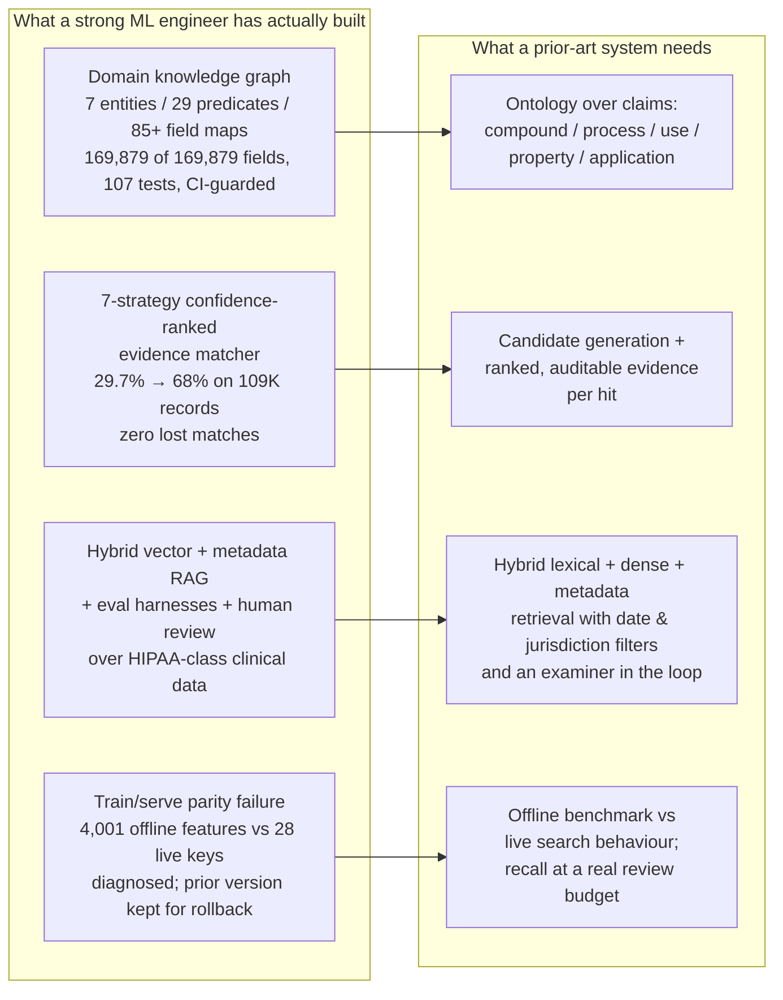

# Chapter 48 — Prior-Art & Patent-Novelty AI: Orientation, Discovery Questions & Interview Strategy

> **Why this chapter exists:** You have been pointed at a problem in a domain you do not know — "we file a lot of patents, sometimes something similar already exists, we want a system that checks, and if so tells us what could be tweaked" — plus a vague reference to "some statistics work we already follow." This chapter is about how to walk into that conversation without either bluffing or being useless: what the problem actually is underneath the vocabulary, the three questions that pin the brief down, how to spend thirty minutes with a panel, and the specific things that will sink you if you say them.

> **Patent & prior-art AI pack — Chapters 48–52.** A self-contained series on building and evaluating AI systems for **patent prior-art search, novelty assessment and design-around analysis** — the problem of deciding whether an invention already exists in the literature, and what could be changed if it does. Written for an ML/AI engineer with no patent-law or chemistry background who has to become useful in that domain quickly.
>
> **[48 · Orientation & strategy](48_patent_prior_art_ai_orientation.md) — [49 · Domain primer](49_patent_domain_primer_for_ai.md) — [50 · System design](50_prior_art_novelty_system_design.md) — [51 · Measurement & evaluation](51_novelty_measurement_and_evaluation.md) — [52 · Q&A bank](52_patent_ai_qa_bank.md)**
>
> **Suggested order:** 48 for the shape of the problem and the questions to ask, 49 for the domain vocabulary, 50 for the architecture, 51 for the statistics, 52 to rehearse.
>
> **Standing caveat:** nothing here is legal advice. Novelty, inventive step and infringement are legal determinations made by qualified attorneys and examiners. Everything in this pack is about building **decision-support** that makes a human expert faster, never a system that decides.

---

> **Scope of this chapter.** Everything you need in the ninety minutes before a first technical conversation about prior-art AI: what is verifiably true about the domain and about the kind of organisation that buys this, what the project probably is, and exactly how to spend the time. Nothing here is a script to recite — it is a map, so that you can navigate when the conversation goes somewhere you did not plan for.
>
> **Honesty rule that governs the whole pack:** assume you have **no patent-law, IP-prosecution or chemistry background**, and never speak anything here as domain experience. Every factual claim carries a confidence marker, and claims that were checked and *failed* are listed explicitly so they are never repeated in a room where someone knows better.

---

## 1.1 The situation, in one table

| | |
|---|---|
| **The format** | Typically 30 minutes, two or three people on the call. With three interviewers that is realistically **8–11 minutes of your own airtime.** Budget accordingly: the failure mode is monologuing. |
| **Who is usually in the room** | An internal AI/data lead from the business (decides fit and value case), an external technical consultant or architect (decides whether you can build it), and a commercial/recruiting layer (decides everything you should *not* discuss in the technical half). |
| **The problem, as relayed** | "We file a lot of patents; sometimes something similar already exists; we want a system that checks whether it does, and if so, what can be tweaked." Plus, often, a reference to "some statistics work we're already following" — **content unknown.** Pinning that down is your job in the first five minutes. |
| **What it really is** | Recall-critical retrieval over tens of millions of long, deliberately obfuscated documents, with an auditable evidence trail, extreme class imbalance, a hard confidentiality boundary on the query, and a legal decision at the end that a machine is not allowed to make. |
| **Your honest position** | Zero patent-law background. Zero chemistry background. Deep, production-proven background in exactly the machine components the problem needs: knowledge-graph construction over messy text, confidence-ranked entity resolution, hybrid retrieval, and evaluation under class imbalance. |
| **What you are actually selling** | Not domain knowledge. **The machinery, plus the discipline to measure it honestly in a domain where every published number is low.** |

**The single strongest move available to you — make it in the first ninety seconds:** name the transferable machine, with numbers, and claim nothing about patents. Something in this shape, populated with your own evidence:

> "I've built the machine this problem needs, in a different domain. A domain knowledge graph — 7 entity types, 29 predicates, 85+ canonical field mappings — that replaced a brittle regex parser and reached 100% field coverage on 100,000 production documents, 169,879 of 169,879 fields, with 107 tests in CI. And on top of that, a seven-strategy, confidence-ranked evidence matcher for entity resolution where the identifying information is deliberately hidden: match rate went from 29.7% to 68% across 109,000 records **with zero lost matches**. Prior-art screening is that same shape — recall-critical retrieval over messy text, with an evidence trail a human expert has to be able to audit."

That is the pitch. It is true, it is specific, it carries numbers, and it claims nothing about patents. The "zero lost matches" clause is doing more work than it looks: prior art is a domain where *losing* a true positive is the expensive error, and an engineer who already ships with a no-regression guarantee on recall is speaking the right language before anyone has said the word "recall".

**Three things about their world worth having on your tongue** (all obtainable in an hour from primary sources — see §1.2):

- **Order of magnitude of filings.** A large chemical or materials filer might submit on the order of **a thousand new patent applications a year**, against R&D spend in the low billions of euros and several thousand R&D staff. That is the throughput any screening system has to serve, and it is small enough that a *human-in-the-loop* design is affordable — a crucial point when someone proposes full automation.
- **Clearance research is a named, standing cost.** Large filers routinely describe clearance searching in their public reporting as a standing cost control, and describe AI as a lever against the cost of established processes. If the company you are talking to says something like that in its report, you have found the value case in the company's own words — quote it back, because it is the least flattering and most credible way to show you did the reading.
- **They probably already have an internal search platform.** Many R&D-intensive manufacturers run an in-house natural-language search system over hundreds of millions of documents — patents, external scientific literature, and decades of digitised internal research reports — usually built internally, because the mix of licensed external content, proprietary internal archives and structure search is hard to assemble from any single vendor product. **Your first design question should therefore be whether you would be building *on* that platform or *beside* it.** Duplicating it is the fastest way to fail.

---

## 1.2 Research hygiene: confidence markers and the ledger of failed checks

You will be assembling a picture of a company, a domain and a literature in a very short window, mostly from sources of uneven quality. The discipline that keeps this from backfiring is to attach a marker to every claim *while you are collecting it*, not afterwards.

| Marker | Meaning | Behaviour in the call |
|---|---|---|
| **CONFIRMED** | Verified at a primary source (official report, company register, publisher page, standards body, code repository). | Safe to state as fact. |
| **LIKELY** | Multiple converging secondary sources, or a snippet of a login-walled page. | Use as a hypothesis: "my understanding is…" |
| **UNVERIFIED** | Could not be checked. Typically anything about a small intermediary's client relationships, unposted job descriptions, or internal project names. | **Do not assume. Ask.** |
| **REFUTED** | Actively checked and found false. | Never say it. Saying a refuted thing out loud is worse than saying nothing. |

**Where the primary sources actually are.** For a listed manufacturer: the annual/combined management report (filings count, R&D spend, R&D headcount, collaborations, and the intangible-assets line covering know-how and patents), the EPO's annual patent-index and technology dashboard (European applications and applicant rank), and WIPO's PCT yearly review (published PCT applications). For the technical stack: the company's own current job advertisements, which are the single most reliable public statement of what a large enterprise is actually building this quarter. For people and entities: national company registers, publisher DOI pages, and public code repositories.

**Three failure modes of this research, which cost more than they save:**

1. **Name collisions.** Common surnames collide constantly in academic literature. Before you compliment anyone on a paper, confirm the *same* person wrote it — matching institution and date, not just the name. Praising work someone did not do is fatal in a room of researchers, and it is the single easiest own goal in this kind of preparation.
2. **Third-party analytics blogs.** Patent-analytics vendors and SEO blogs circulate precise-looking portfolio totals — "*n* patents across *m* families", quoted to the last digit — with no stated methodology and no extraction date. **Do not cite those.** Most large filers do not publish a total portfolio size at all — their reports give annual filings only. If portfolio size comes up, the correct and more impressive answer is: *"They don't publish one — the report gives annual filings only. That itself matters for the design, because a novelty index needs a defined denominator."*
3. **Reading a number without reading its definition.** See §1.3.

**Keep an explicit ledger of things you checked and could not confirm**, and carry it into the room, because the honest version of each of these is *more* impressive than the confident version:

| Claim you will be tempted to make | Status | The honest form |
|---|---|---|
| "Examiners recall about 78% of relevant art" | A ~0.78 figure circulates but could not be traced to a primary study | "A figure that circulates is around 0.78 — I haven't been able to trace it to a primary study, so I'd treat it as folklore." |
| "PANORAMA reports a 92.5% human baseline" | **REFUTED.** The paper reports **no** human baseline; 92.5% is the accuracy of its own claim-extraction parser | Quote the model numbers only, and say the paper has no human baseline. |
| "Kelly–Papanikolaou–Seru–Taddy apply a sample-splitting variance correction" | Could not be verified in the public NBER working paper; the paywalled journal version may differ | "The public working paper doesn't show it; I'd want to check the published version." |
| "CLEF-IP prior-art search tops out at MAP 0.125" | CONFIRMED for the 2011 task (Mahdabi & Crestani, time-aware random walk) — but it is one benchmark, one era | State the benchmark and year, not "prior-art search is a 0.125 problem". |
| Any specific EPC sub-range or selection-invention threshold cited as settled law | Case law is fact-specific; the commonly quoted "purposive selection" tests are contested | "There is a line of case law here; I'd need an attorney to apply it." |

---

## 1.3 Why prior art is a genuine cost centre in an R&D-intensive company

### The economics, in the shape you should carry into the room

| Quantity | Typical order of magnitude for a large chemical/materials filer | Why it matters to the design |
|---|---|---|
| New patent applications filed per year | ~1,000 (routinely swinging ±20% year on year) | Sets the throughput of the *screening* system: a few thousand searches a year is human-reviewable, so optimise for expert throughput, not full automation. |
| R&D expenditure | Low billions of euros, the large majority spent inside the operating divisions rather than central research | Tells you the buyer is a division, not a lab — the value case must be phrased in divisional P&L terms. |
| R&D employees | Several thousand | These are the people writing invention disclosures. They are your *upstream* user, distinct from the IP professionals downstream. |
| External research collaborations | A few hundred universities and institutes | Every collaboration is a confidentiality surface and a co-ownership question — relevant the moment you propose sending text anywhere. |
| Share of recent filings tagged to digitalisation and AI | Can be a fifth or more of a chemical company's own portfolio | The company is not naive about AI; do not pitch it as a novelty. |
| Balance-sheet carrying value of "know-how, patents and production technologies" | Billions of euros, moving by hundreds of millions a year through disposals, transfers and currency | If you ever quote this, quote the **year-end** figure, not the opening one, and know that a large fall is usually divestment, not expiry. |

### The counting-definitions point — ninety seconds that buys a lot of credibility

The three headline patent counts for the same company in the same year routinely **disagree in direction**: the company's own "new patents filed" figure can be down sharply while its EPO application count is down by a different amount and its published PCT applications are *up*. Almost certainly they count different objects:

- **Company "new patents filed"** — usually first filings or invention families, on the company's own internal definition, and often excluding businesses that were divested mid-year.
- **EPO applications** — applications at one office in one year, attributed to a consolidated corporate group. (Applicant rankings consolidate groups, so a ranked list routinely mixes pure-play firms with conglomerates whose subsidiaries in unrelated industries roll up into the parent. A group's rank therefore says very little about the filing behaviour of any one business inside it, which makes rank a poor input to any sizing argument.)
- **WIPO published PCT applications** — *publications*, which carry roughly an 18-month lag from priority. A rise here is largely a reflection of filings made a year and a half earlier.

**Frame this as a definitional question, not a reconciliation you have already performed.** It is exactly the kind of point a statistically trained interviewer engages with, it demonstrates that you read primary sources rather than summaries, and it lands the design implication for free: *any novelty index needs a defined denominator and a defined vintage, and the three public counts cannot supply it.*

### What already exists inside a company like this

Assume all four of the following are present before you propose anything:

- **An internal R&D knowledge platform.** Natural-language search — often chat-shaped, increasingly with reasoning and deep-research modes — over a corpus that can span a hundred million-plus global patents, tens of millions of scientific documents plus abstracts licensed from external providers, a century-plus of digitised internal research, and chemical structure and ontology layers. This is the incumbent. Your system either sits on it, sits beside it with a different index, or does not get built.
- **Outsourced IP operations.** High-volume IP work (docketing, formalities, first-pass searching) is frequently outsourced. The recurring stated pain in that market is that volume work crowds out *"work on patent analytics and designing new services"* — which is precisely the gap an AI system is being bought to fill. Ask who does the searching today and whether they are internal.
- **An IP-analytics hiring pattern.** Large filers advertise "Data Scientist / AI Engineer — Intellectual Property" roles attached to an IP-intelligence function, and the postings name the use cases explicitly: **document classification, entity extraction, auto-summarisation, and talk-to-data**. The business framing in those postings is usually some version of *IP is what secures protected revenues and licensing income for the division.* If your engagement is anywhere near this, that sentence is your value case, already written by the customer.
- **A named enterprise agentic stack.** The stack you see in European industrial job ads right now is remarkably consistent: **Python, a managed cloud AI platform (Azure AI Foundry is common in European industry), hosted model APIs, Hugging Face, LangGraph, Docker, Kubernetes, Databricks, MCP-standard tool wrappers, LLM-as-a-judge evaluations, and observability aimed at hallucination detection.** If you have built MCP tool servers and agent plumbing in production, say "MCP" and mean it — companies are hiring for it by name, and it is an *engineering* credential you can state without any claim about patents.

**And a governance layer.** Expect published Responsible AI principles, a central data-and-AI office, an AI inventory that flags prohibited applications, mandatory human-oversight requirements for consequential decisions, and explicit EU AI Act plus GDPR alignment. **Any answer you give about sending text to a model must respect this** — see the confidentiality trap in §1.6, which is the highest-leverage thing you can raise unprompted.

### The build-vs-buy question you should raise yourself

There is a mature commercial market here — chemistry-structure search (CAS/MARPAT via SciFinder, which is the only credible route to Markush-structure search), curated abstracting (Derwent DWPI), analytics platforms (PatSnap, Amplified), invention-suggestion tools (Iprova), and a free open baseline (PQAI), on top of free data (EPO OPS, PATSTAT, Espacenet, Google Patents, Lens.org, SureChEMBL, PubChem). Vendors publish real numbers — IPRally, for instance, publishes retrieval metrics you can hold your own baseline against.

The honest architecture position, which you should state before they ask: **do not rebuild MARPAT.** Structure search over Markush claims is decades of curation you cannot replicate; buy it, wrap it, and spend your engineering on the parts nobody sells — the internal disclosure corpus, the element-level coverage matrix, the evidence trail, and evaluation against the company's own review budget. Chapter 50 works this through.

---

## 1.4 What transfers, and what does not

The whole positioning of this engagement rests on one distinction, and you should say it out loud early:

> **The machinery transfers. The legal judgement does not.**

Retrieval, ranking, entity resolution, ontology construction, calibration, drift monitoring, human-in-the-loop review design — these are domain-agnostic and you have them. Novelty, inventive step, enablement and infringement are legal determinations made by qualified people under specific statutes, and no amount of ML experience earns you an opinion on them. Saying this clearly does two things: it pre-empts the "do you have patent experience?" probe before it is asked, and it signals that you understand the liability shape of the product, which is the thing a mature buyer worries about most.



Every arrow in that diagram is defensible without knowing what a Markush claim is. **If you only get one whiteboard moment, draw this.**

### 1.4.1 Build a vocabulary ↔ evidence map before the call

Do this as a preparation exercise: list the vocabulary tiers the panel is likely to use, and against each one put the *single* thing you have genuinely done. Not a list — one hook per tier, so you can reach for it in a sentence.

| Tier | Vocabulary a senior technical panel will recognise instantly | A genuine hook (example, from my own work) |
|---|---|---|
| 1 — MLOps | experiment tracking, model registry, model packaging and signatures, artifact versioning, drift monitoring, automated retraining | a drift-monitoring utility auto-provisioning Datadog dashboards from Snowflake feature statistics; SageMaker multi-container endpoints; a SageMaker MLOps platform with automated retraining at NatWest |
| 2 — forecasting / anomaly detection | time-series forecasting libraries, backtesting harnesses, outlier/anomaly-detection toolkits | time-series anomaly detection on Prometheus/Grafana at Sopra Steria — say it plainly; it is a small credential and overclaiming it costs more than it earns |
| 3 — Spark / distributed | PySpark, partitioning, shuffles, map-reduce, EMR/Databricks | Deequ data-quality checks on Azure Databricks at Tiger Analytics; Airflow batch plus realtime paths |
| 4 — statistical rigour | identification, cohort/year fixed effects, model uncertainty, asymmetric loss, A/B testing, calibration | probability calibration, ECE/Brier, PR-AUC vs ROC-AUC, **out-of-time** evaluation (an XGBoost model scored out-of-time at ROC-AUC 0.84 — say "out-of-time"; a statistically trained listener will notice) |
| 5 — GenAI | LangChain/LangGraph, RAG, prompt engineering, LLM-as-judge, guardrails | hybrid vector + metadata retrieval at ResMed, LLM-as-judge eval harnesses, MCP tool servers in production |

**On cloud mismatch:** if the organisation's primary cloud differs from yours, say so plainly and move on — "AWS-primary; Azure through Databricks and Data Factory" is a complete answer. Pretending otherwise is a two-question bluff at best.

### 1.4.2 What a statistically trained panellist will probe, in order

If there is a PhD-level quantitative person on the call — an econometrician, a statistician, a computational scientist — the interview changes shape. They will not be impressed by architecture diagrams. They will be impressed by whether you can say **what a number means and what would make it wrong.** Expect probes roughly in this order:

1. **"How would you evaluate it?"** This is home ground for that person. They want an estimator, not a dashboard. Answer with a **recall target tied to a review budget**, not F1.
2. **Distribution and identification thinking.** Fixed effects, cohorts, confounds, background distributions. If you say "cosine similarity above 0.8 means duplicate", you will be asked what the background distribution is — and they will be right to (§1.6).
3. **MLOps mechanics.** Model registry, artifacts, versioning, monitoring, automated retraining, CI/CD for ML. Versioned artifacts, containerised serving and a rollback-to-prior-version story land directly here.
4. **Scale reasoning** — *why* distributed, not which API. Have the canonical number ready: a **full pairwise similarity matrix over ~9 million patents is on the order of 30 TB**, which is why the standard construction sparsifies by zeroing similarities below ρ = 0.05 — and that single threshold zeroes **93.4%** of pairs. That is the honest answer to "how big does this get?": it gets impossible, and the literature's answer is a principled sparsification whose cutoff you should be able to defend.

---

## 1.5 The thirty-minute plan, minute by minute

This is a plan for **a short panel conversation about a domain you do not know**. The objective is not to demonstrate patent knowledge you do not have. It is to leave the room with (a) the brief pinned down, (b) one memorable piece of transferable evidence, and (c) a reputation for being the person who raised the confidentiality constraint before anyone else did.

```mermaid
gantt
    title 30-minute panel call — target allocation
    dateFormat mm
    axisFormat %M
    section Open
    Their intros + logistics        :00, 2m
    Your 90-second self-intro       :02, 2m
    section Discovery
    Three discovery questions       :04, 5m
    section Core
    Depth on whichever track opened :09, 12m
    section Their turn
    Their probes / your evidence    :21, 6m
    section Close
    Close + next steps              :27, 3m
```



### 0:00–2:00 — Their intros

Camera on. Note down who says what, and which of them owns which decision. **Write down the exact words they use for the problem** — "novelty check", "prior art", "freedom to operate", "landscaping" and "invalidity" are five different products with five different recall bars, and whichever noun they use is your anchor for the rest of the call. Have blank paper and a pen for exactly this.

### 2:00–3:30 — Your self-intro (~120 words)

Use this as a template; the bracketed parts are yours, the *structure* is the part that works.

> "Thanks. I'm [name] — senior ML engineer, [N] years, based in [city]. Three things that are probably relevant here. First, knowledge graphs and entity resolution over messy text: my last one replaced a brittle regex parser with a 7-entity, 29-predicate graph and took field coverage to 100% on a hundred thousand production documents, 107 tests in CI. Second, retrieval — hybrid vector-plus-metadata RAG over clinical records, with evaluation harnesses and human review, because the domain was regulated. Third, I've been burned by the gap between offline and live: I diagnosed a train/serve parity failure and kept the previous model serving so we could roll back. I have no patent-law or chemistry background. So I'd like to spend most of this call understanding what you actually need."

Why it works: three concrete, numbered claims; one regulated-domain signal; one production-*failure* signal, which buys more credibility with a senior technical audience than any success story; an explicit honesty statement that pre-empts the obvious objection; and a hand-off that invites them to talk. **Then stop talking.**

### 3:30–9:00 — The three discovery questions

Ask them in this order. Each one is designed so that *any* answer materially changes what you say for the next fifteen minutes. These three questions are the reusable core of this chapter — they work for almost any ill-specified AI engagement, not just this one.

**Q1 — Pin down "the statistics work."**

> "You mentioned there's existing statistics work you're following. Can you point me at it? I ask because 'patent novelty statistics' usually means one of three quite different things: an **index over the portfolio** — backward-similarity/forward-similarity in the Kelly–Papanikolaou–Seru–Taddy sense; a **combinatorial measure** over classification and citations — first-time CPC pairs, originality/generality Herfindahls; or **retrieval evaluation** — recall at a fixed review budget. They have different owners, different data, and different acceptance tests."

Naming KPST is not showing off — it is the single most-cited construction in this space, its data and Stata replication code are public, and it lets them say "yes, that one" or "no, ours is simpler" in five seconds. If they say the third, you are on home turf immediately.

*Have ready, if they push:* KPST weight terms by **backward-IDF** —

```
BIDF(w, p) = log[ (# patents prior to p) / (1 + # prior docs containing w) ]
```

— so a term is scored by how novel it was *at the time*, and for a pair, both sides use the **earlier** patent's weights. That is a leave-the-future-out construction against look-ahead leakage, and it is the detail that shows you have read the paper rather than the abstract. **Caveat honestly:** the widely repeated claim that KPST include a *sample-splitting variance correction* could not be verified in the public working paper. If asked, say that.

*Adjacent constructions worth naming if the conversation stays on indices:* Hall's Herfindahl-based correction to originality/generality (the raw measures are biased by the number of citations); Uzzi et al.'s atypicality via journal-pair co-citation z-scores against a rewired null; Trajtenberg's citation-weighted importance; and the reproducibility critiques of these measures (Verhoeven et al.; Arts et al. on text-based novelty). Chapter 51 works through all of them.

**Q2 — Pin down the decision and its cost asymmetry.**

> "Who acts on the output, and at what point in the filing workflow? A novelty screen before an inventor writes a disclosure, a clearance/FTO search before launch, and portfolio landscaping are three different systems. And what does a mistake cost in each direction — a missed piece of prior art versus fifty false positives in someone's review queue?"

This is the question that turns a demo into a spec, and it is the one most engineers skip.

Prior art is an extreme class-imbalance problem. If ten truly relevant documents exist in a ten-million-document corpus, prevalence is 10⁻⁶. Even a false-positive rate of 10⁻⁴ then yields:

```
true positives at recall 0.9   ≈ 9
false positives                ≈ 10^7 × 10^-4 = 1,000
precision                      ≈ 9 / 1,009  ≈ 0.9%
```

**ROC-AUC will look excellent while the review queue is 99% noise.** That single derivation, done out loud, is worth more than any architecture slide, because it tells the panel you will not hand them a beautiful metric attached to an unusable product.

The defensible design therefore fixes a **recall target** and reports the **review cost** required to reach it:

| Use case | Who acts | Recall bar | Cost of the error that matters |
|---|---|---|---|
| Novelty pre-screen before a disclosure is written | R&D scientist | ~0.80 is often enough | Wasted drafting effort; recoverable |
| Prosecution support / examiner-response prep | IP professional / attorney | high, but bounded by budget | Office actions, amendments, delay |
| Freedom-to-operate / clearance before launch | Attorney, with commercial sign-off | 0.95+, and the residual risk must be stated | Injunction, product withdrawal, damages — unrecoverable |
| Landscaping / portfolio analytics | Strategy, R&D management | low; coverage matters more than recall | A wrong strategic read, discovered slowly |

Say plainly that these are four products, and that you would not ship one system pretending to be all four.

**Q3 — Pin down the corpus and the confidentiality boundary.**

> "What can the system see? Does it sit on top of the internal research search platform you already have, or beside it? Does it need the chemical structure layer — Markush claims — or is this a text-only problem to start? And where does inference have to run, given that the input is often an unpublished invention disclosure?"

That last clause is the one that will get you taken seriously. It signals that you understand that **the input to a novelty check is frequently the most confidential document the company owns** — and that a careless disclosure can itself destroy the novelty of the invention you were trying to protect. If nobody else on the call has raised it, you just did, and you did it before being asked.

*Bonus question if there is room:*

> "How do you handle the 18-month publication blackout? A structurally unsearchable window is a hard ceiling on any recall claim we make."

This is the best single question in the chapter. Applications publish about eighteen months after their priority date, so at any moment there is a rolling cohort of filings that exist, that are prior art the day they publish, and that **no system on earth can retrieve today**. It means every recall number you ever quote is conditional on a corpus with a known hole in it; it means the right output is a dated, versioned answer rather than a verdict; and it means someone has to decide what happens when a search is re-run six months later and the answer changes. Ask how they handle re-running.

### 9:00–21:00 — The middle twelve minutes

Do not plan *content* here — plan **tracks**. Whichever answer came back to Q1 determines which one you take.

| If Q1 lands on… | Spend the middle on… | Assets that back you up |
|---|---|---|
| **Index / measurement** (they have an econometric novelty score) | Cohort normalisation and confounds. Similarity distributions are not comparable across years or CPC classes: KPST report median pairwise similarity **7.8%**, mean 10.2%, **p90 17.6%, p95 22.9%** — so 0.23 is already the 95th percentile. Their historically-important-patent mean rank moves **0.74 → 0.96** once patents are ranked *within* cohort. Argue for percentile-within-cohort rules, never absolute thresholds. | probability calibration, ECE/Brier, out-of-time evaluation, A/B testing, PSI for drift on the score distribution |
| **Retrieval / search** (they want better hits) | Hybrid architecture and honest baselines. BM25, with its `b` length-normalisation, stays competitive because the failure mode in patents is *cross-domain vocabulary mismatch*, not lexical matching. Dense retrieval beats BM25 in-domain (nDCG@100 **0.3381 vs 0.2929**) and collapses to parity out-of-domain (**0.0592 vs 0.0589**). Fuse with reciprocal rank fusion; don't replace. Chunk by claim element, not by page. | hybrid vector + metadata retrieval in a regulated domain; pgvector/FAISS/Chroma/Pinecone; Iceberg; feature stores |
| **Evaluation / "are we missing art?"** | Ground truth and stopping rules. Three independent label sources, each biased differently: examiner **X/Y citations** (X = novelty-destroying alone; Y = obvious in combination), patent **interferences** (examiner-certified same-invention pairs — only ~133 usable gold pairs exist), and expert ratings. Metric: **PRES** evaluated at an `N_max` equal to the real review budget. Missed-art estimate: **Chao1** over an ensemble of retrievers, `f̂₀ = f₁²/(2f₂)`, reported with its log-normal CI — and state its killer assumption out loud: if your retrievers are correlated (all built on the same embedding), `f₁` collapses and you will confidently conclude you missed nothing. Pair it with Lincoln–Petersen/Chapman two-reviewer capture–recapture, and a stated stopping rule (target-recall, knee, or a Cormack–Grossman-style batch rule). | evaluation harnesses + LLM-as-judge + human-in-the-loop over regulated data; a confidence-ranked evidence matcher with a zero-lost-match guarantee |
| **"We don't have one yet"** | Then *you* propose the shape, in this order: retrieval baseline → labelled slice → recall-at-budget → *then and only then* a model. Add the kill criteria up front — if the hybrid baseline cannot beat the incumbent search on a labelled slice of a few hundred queries, the project stops rather than escalating to a bigger model. | pipeline discipline: out-of-time evaluation, versioned artifacts, rollback to the prior serving version |

Whichever track you are on, **keep every answer under 90 seconds and end it with a question.** Three people, thirty minutes: monologuing is the failure mode, and it is the one most easily avoided.

### 21:00–27:00 — Their probes

Two are near-certain. Have the honest answer, not the confident one.

- ***"Do you have patent experience?"*** → **"No. I have no patent-law or chemistry background, and I wouldn't pretend the domain vocabulary transfers for free. What does transfer is the machinery — knowledge graph construction over messy text, confidence-ranked entity resolution, hybrid retrieval, and evaluation under class imbalance. I'd expect the first month to be mostly sitting with whoever does the searching today."** The last sentence is the one that converts the admission into a plan.

- ***"Why should we use an LLM here at all?"*** → Give them falsifying evidence rather than enthusiasm. A fine-tuned BERT on the **PatentMatch** dataset (6,259,703 claim–paragraph pairs, X-citations positive, A-citations negative) reaches **54%** accuracy on balanced X-vs-A discrimination — barely above chance. **PANORAMA** (arXiv:2510.24774, 8,143 US examination records) shows LLMs pick the right prior art from 8 candidates **77.3%** of the time against a **5.6%** random baseline, but judge novelty and non-obviousness at **45.4%** against a **32.3%** random baseline. *(The paper reports **no** human baseline — the 92.5% figure sometimes quoted alongside it is the accuracy of its own claim-extraction parser. Do not call it a human score.)* On CLEF-IP 2011 prior-art search, published results top out around **MAP 0.125**. The conclusion is an architecture constraint, not a mood: **LLMs are excellent at reading and explaining a candidate, and weak at deciding novelty.** That is the argument for keeping the human in the loop — which is also what a corporate Responsible AI policy will require anyway.

If there is time, the follow-up that lands well: draw the allowed/forbidden split — LLM allowed for query expansion, claim-element decomposition, candidate summarisation, evidence-quote extraction and explanation; forbidden for the novelty verdict, the obviousness combination, and anything that touches an unpublished disclosure outside the boundary. Chapter 50 has the full table.

### 27:00–30:00 — The close

> "Two things before we run out of time. One — is there anything about my background you want me to go deeper on in writing? I'd rather send you something specific than a generic follow-up. Two — what's the next step, and what's the timeline? And on the commercial and location side, I'll follow up separately so we don't spend the technical time here on it."

That last clause does three jobs: it respects their time, it signals that you know who owns what, and it moves commercial questions off a call where they would cost you technical minutes.

### Questions worth asking, whoever is in the room

Keep four in your pocket and use whichever fits; each is a real question whose answer changes the design.

- "Is the statistics work an **index** someone is publishing, or a **retrieval system** someone is querying?" — the single highest-information question available.
- "For evaluation, would you rather I optimise a ranking metric against examiner citations, or recall-at-fixed-review-cost against a labelled set the IP team validates? They pull in different directions."
- "Which division or business unit is this for?" — org structures in large manufacturers repeat titles across divisions, and a confident wrong guess about someone's remit is an unforced error. Asking is normal.
- "Who is the user — an IP professional running a clearance search, or an R&D scientist checking an idea before writing a disclosure? The recall bar and the interface are completely different for those two."

---

## 1.6 The traps list

| Do **not** say | Say instead | Why |
|---|---|---|
| Anything asserting patent-law expertise — opining on what is or is not novel, obvious, or infringing | "I know the categories exist — X is novelty-destroying alone, Y in combination, E is earlier-filed-later-published under Art. 54(3) EPC and hits novelty but not inventive step — and I know I'd need an attorney to apply them." | Knowing that the *vocabulary exists* reads as diligence. Applying it reads as unlicensed and reckless, in a room that may include people who work with patent counsel daily. |
| "We'd send the invention disclosure to a public model API and…" | "Unpublished disclosures can't leave the boundary — a public disclosure can itself destroy novelty. That argues for in-region inference on the enterprise AI platform you already run." | This is the single fastest way to lose a chemical company. It is also the trap with the most upside if you flag it *before* they do. |
| "We can get you 95% recall" — or any recall or precision number, before you have seen data | "I can't quote a recall number before I've seen the corpus and a labelled slice. What I can tell you is what the published numbers look like, so we set the target honestly." | Every credible number in this field is low. Promising to beat an examiner in a first call is disqualifying. If you cite the circulating ~0.78 examiner-recall figure at all, say "a figure that circulates is", never "examiners recall". |
| "Cosine similarity above 0.8 means it's basically the same patent" | "In the published patent corpora, median pairwise similarity is ~7.8% and the 95th percentile is ~22.9% — so absolute thresholds are meaningless without the background distribution for that year and that CPC class. I'd use a percentile-within-cohort rule." | Any statistically trained interviewer will test exactly this. An unexamined threshold is the clearest possible signal that you have not looked at the distribution. |
| "Tanimoto 0.85 means the molecules are equivalent" | "0.85 comes from Patterson et al. (1996) and was largely undone by Martin, Kofron & Traphagen (2002) — only ~30% of compounds at ≥0.85 Tanimoto to an active are themselves active. And Tanimoto is hard-bounded by `T ≤ min(a,b)/max(a,b)`, so any fixed threshold silently size-filters." | Only raise the chemistry layer if *they* do. If they do, this is the highest-value forty seconds available — it shows you read the primary literature rather than the folklore. |
| "Your portfolio is about N patents" — or any sourced-sounding total | "Most filers don't publish a portfolio total; the report gives annual filings only. That's actually a design question: what's the denominator?" | Circulating totals come from undated third-party analytics blogs with no methodology. Citing one back to the company that owns the portfolio is embarrassing. |
| Complimenting an interviewer on a paper, a repo or an employer you have not verified is theirs | Reference something you *checked* — a named paper with a DOI, or nothing at all. | Name collisions are routine in academic literature. Praising phantom work is fatal, and researchers catch it instantly. |
| Naming an internal project, tool or vendor you believe they use | Nothing. Ask instead: "What's already in place?" | Internal project names circulate second-hand and are frequently wrong or stale. Referencing one as if you know it converts diligence into presumption in a single sentence. |
| "We'll just fine-tune an LLM on all the patents" | "I'd start with a lexical + dense hybrid baseline and a labelled slice, because that's the thing whose failure I can measure. Model choice is the last decision, not the first." | See the PatentMatch / PANORAMA numbers in §1.5. The evidence says the hard part is not the model. |
| Salary, visa, relocation, notice period — during the technical portion | "Can I pick that up with you separately, after this?" | Thirty minutes and two technical stakeholders. Spending any of it on commercials is a self-inflicted wound. |
| Litigating a previous rejection, a past bad call, or an earlier process with the same intermediary | Nothing. Just be visibly, boringly reliable this time. | Raising a past objection makes the concern feel live. Retiring it silently is strictly better. |
| "I built an internal chat assistant, so I know agents" — offered as a patent credential | "I've built MCP tool servers in production — Jira, GitHub, Jenkins, Athena, Grafana, Slack behind one NL interface, with isolated git workspaces per task. I mention it because your posted agentic stack specifies MCP by name." | Same fact, honestly scoped: an *engineering* credential for their stack, not a domain credential. |

---

## 1.7 The cheat card

One page, printed, on the desk: the three discovery questions, the numbers below, and the four-item map from §1.4.

```
FORMAT: 30 min · panel of 2-3 · your airtime ~8-11 min · answers <90s each

OPEN:  KG (169,879/169,879 fields, 107 tests) · hybrid RAG in a regulated
       domain · train/serve parity failure + rollback · "no patent-law or
       chemistry background" · hand back the floor.

ASK:   1. Which "statistics work"? index / combinatorics / retrieval eval?
       2. Who decides, at what step, and what does each error cost?
       3. What corpus, structure layer or text-only, and where can
          inference run given unpublished disclosures?
       +  How do you handle the 18-month publication blackout?

NUMBERS: median pairwise similarity 7.8%, p90 17.6%, p95 22.9%
       · within-cohort ranking moves important-patent mean rank 0.74 -> 0.96
       · dense vs BM25 nDCG@100: 0.3381/0.2929 in-domain, 0.0592/0.0589 out
       · PatentMatch BERT 54% on balanced X-vs-A
       · PANORAMA prior-art 77.3% (random 5.6%), novelty 45.4%
         (random 32.3%) — NO human baseline in the paper
       · CLEF-IP 2011 prior-art search: MAP ~0.125
       · prevalence 10^-6 => FPR 10^-4 gives ~1% precision at recall 0.9
       · full pairwise over ~9M patents ~30 TB; rho<0.05 zeroes 93.4%
       · Chao1 f0 = f1^2 / (2 f2), report the log-normal CI, state the
         correlated-retriever assumption out loud

RECALL BARS: ~0.80 pre-screen · 0.95+ freedom-to-operate · landscaping
       is coverage, not recall. Always quote recall WITH its review budget.

NEVER: patent-law opinions · unpublished disclosures to a public API
       · promised recall numbers · a sourced-sounding portfolio total
       · "PANORAMA human baseline" · absolute cosine thresholds
       · "Tanimoto 0.85 = equivalent" · internal project names you
         cannot verify · salary/visa in the technical half
```

---

*Next: **[Chapter 49 — Patent Domain Primer](49_patent_domain_primer_for_ai.md)** for the law, data and chemistry vocabulary; **[Chapter 50](50_prior_art_novelty_system_design.md)** for the architecture you would draw; **[Chapter 51](51_novelty_measurement_and_evaluation.md)** for the statistics a quantitative interviewer will probe; **[Chapter 52](52_patent_ai_qa_bank.md)** for the question bank.*
