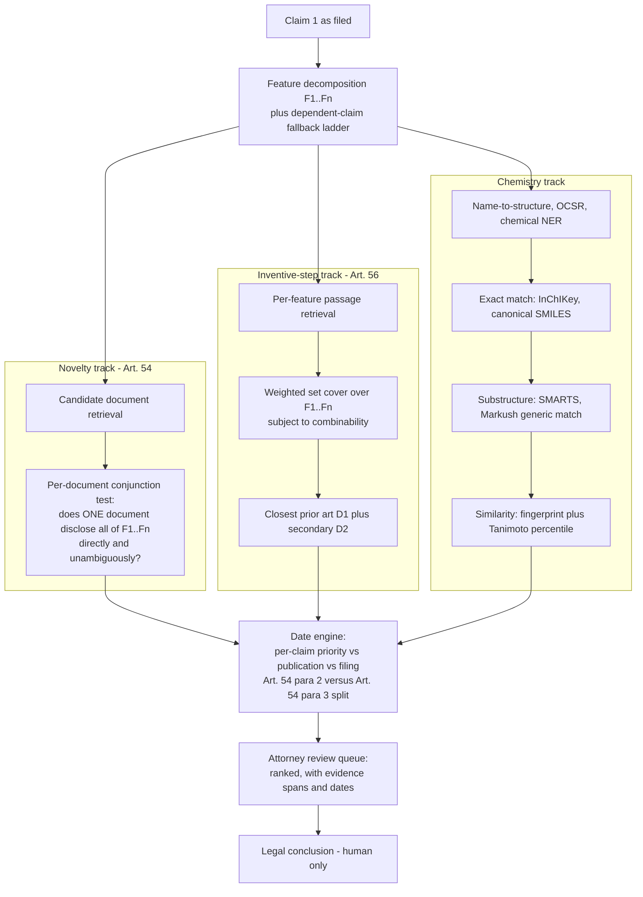

# Chapter 49 — Patent Domain Primer for an AI Architect: Law, Data & Chemistry

> **Why this chapter exists:** enough of the patent world to hold a credible conversation without ever claiming to have worked in it — the ten terms used correctly, why one document kills novelty and two attack inventive step, the 18-month blackout, Markush structures and Tanimoto, and the data/licensing map that decides what you are even allowed to index.

> **Patent & prior-art AI pack — Chapters 48–53.** A self-contained series on building and evaluating AI systems for **patent prior-art search, novelty assessment and design-around analysis** — the problem of deciding whether an invention already exists in the literature, and what could be changed if it does. Written for an ML/AI engineer with no patent-law or chemistry background who has to become useful in that domain quickly.
>
> **[48 · Orientation & strategy](48_patent_prior_art_ai_orientation.md) — [49 · Domain primer](49_patent_domain_primer_for_ai.md) — [50 · System design](50_prior_art_novelty_system_design.md) — [51 · Measurement & evaluation](51_novelty_measurement_and_evaluation.md) — [52 · Q&A bank](52_patent_ai_qa_bank.md) — [53 · Explain it simply](53_explaining_prior_art_ai_simply.md)**
>
> **Suggested order:** 48 for the shape of the problem and the questions to ask, 49 for the domain vocabulary, 50 for the architecture, 51 for the statistics, 52 to rehearse.
>
> **Standing caveat:** nothing here is legal advice. Novelty, inventive step and infringement are legal determinations made by qualified attorneys and examiners. Everything in this pack is about building **decision-support** that makes a human expert faster, never a system that decides.

---

You are being asked to reason about a system that decides whether an invention already exists. Assume you have no patent background and no chemistry background. Neither of those is fatal — but pretending otherwise is. This chapter gives you enough of the domain to (a) use the vocabulary correctly, (b) recognise when a requirement as stated is legally incoherent, and (c) ask the four or five questions that a competent architect asks before writing a line of code.

Everything here is *background you should know*, not experience you should claim. The correct sentence in the room is: **"I haven't worked in IP. Here's how I read the problem, and here are the things I'd need you to correct me on."**

A discipline that governs the whole pack: every factual claim taken from the literature carries a confidence marker, and claims that were checked and *failed* are listed explicitly in the uncertainty ledger at the end, so they are never repeated as fact.

---

## 1. The eleven terms, used correctly

| Term | What it actually means | The mistake to avoid |
|---|---|---|
| **Prior art** | Everything made available to the public — in any language, anywhere, by any means (written, oral, use, exhibition) — before the relevant date. EPC Art. 54(2). Not just patents. Not just English. A conference poster, a product on sale, a thesis in a university library. | Treating "prior art" as a synonym for "patents in our database". Non-patent literature (NPL) appears in roughly 1 in 5 EPO search reports — so ~80% of the time the answer is a patent, and 20% of the time your patent-only index structurally cannot find it. |
| **Novelty (EPC Art. 54)** | Is the claimed subject-matter part of the state of the art? Binary, feature-by-feature, **one document at a time**. The document must disclose all the claim's features *in combination*, directly and unambiguously. | Saying "novel" when you mean "inventive". Novelty is the cheap test; almost nothing fails it outright. |
| **Inventive step (EPC Art. 56)** | Is it obvious to the person skilled in the art having regard to the state of the art? You may **combine** documents plus common general knowledge. This is where 90% of applications actually die. | Thinking a similarity score speaks to inventive step. It does not. Obviousness is a reasoned argument about motivation, not a distance. |
| **Problem–solution approach** | The EPO's mandated three-step method for Art. 56 (Guidelines G-VII, 5): ① identify the **closest prior art**; ② derive the **objective technical problem** from the distinguishing features and their technical effect; ③ ask whether the skilled person **would** (not merely *could*) have arrived at the claimed solution. | Confusing "could" with "would" — the *could–would* distinction is the whole game. Also: the objective technical problem is reformulated *after* you find the closest prior art, so it is an output of search, not an input. |
| **Priority date** | The date that fixes what counts as prior art. Under the Paris Convention / EPC Art. 87–89 you get 12 months from a first filing to file elsewhere and keep the original date — but only for subject-matter actually disclosed in that first filing. | Using **filing date** where **priority date** is meant. A family can have several priorities, and different claims in one application can have *different* effective dates. Your date filter is per-claim, not per-document. |
| **Patent family** | The same invention filed in multiple offices. **DOCDB simple family** = documents sharing *exactly the same* priority combination. **INPADOC extended family** = documents linked directly or indirectly through *at least one* shared priority — much larger, much noisier. | Deduplicating by extended family. INPADOC families can chain together inventions that are not the same invention. Simple family for dedup; extended family for landscape/coverage questions. |
| **Kind code** | The suffix (A1, B1, U1 …) encoding publication stage and document type, per WIPO Standard ST.16. Same document number, different kind code = different content. | Indexing EP-A1 and EP-B1 as duplicates. The A document carries the *application* claims; the B document carries the *granted* (usually narrower) claims. |
| **IPC / CPC** | Hierarchical technical classification. **IPC** = WIPO's international scheme, ~75,000 subdivisions, sections A–H, revised annually. **CPC** = the EPO/USPTO joint extension of IPC, ~250,000 entries, revised several times a year, with an extra **Y** section for cross-cutting tech (Y02 = climate mitigation). Format e.g. `C07D 401/04`. | Treating classification codes as stable features. Both schemes are re-versioned and documents are reclassified retroactively, so a CPC-derived feature computed in 2023 is not the same feature in 2026. Any cohort or "first-time class pair" statistic must be pinned to a scheme version. |
| **X / Y / A / E / D / P** (search-report citation categories) | See §1.1 — these are the examiner's own labels and they are the closest thing the domain has to ground truth. | Treating all citations as equally relevant. Only X and Y carry a legal signal. |
| **FTO vs patentability vs invalidity** | Three different searches with three different objectives. See §1.2. | Building one pipeline and calling it "prior art search". The recall target, the date filter, and the unit of retrieval are all different. |
| **Selection invention / sub-range** | Carving a narrower range or a specific member out of a broader prior disclosure and claiming it as new. Guidelines G-VI, 8. | Assuming any narrowing is novel. See §5. |

### 1.1 Citation categories — the examiner's labels

These are defined in WIPO Standard ST.14 and, for the ISR, in [MPEP 1844](https://www.uspto.gov/web/offices/pac/mpep/s1844.html); the EPO's own gloss is in its [search-report training material](https://people.unica.it/liaisonoffice/files/2014/05/How-to-Interpret-EPO-Search-Reports.pdf).

| Code | Meaning | Legal effect |
|---|---|---|
| **X** | Taken alone, destroys novelty **or** inventive step | Single-document kill |
| **Y** | Destroys inventive step **when combined** with another Y | Combination attack |
| **A** | General state of the art, not prejudicial | Background only |
| **E** | Earlier filing, **published on or after** the search target's filing date | EPC Art. 54(3): counts for **novelty only**, never inventive step |
| **P** | Published between the claimed priority date and the filing date | Bites only if the priority claim turns out invalid |
| **D** | Already cited by the applicant in the description | Provenance flag, combined as D,X / D,Y / D,A |
| **T** | Theory/principle, published after filing | Explanatory, not prior art |
| **L** | Cited for another reason — e.g. to attack a priority claim or fix a publication date | Date/evidence plumbing |
| **O** | Non-written disclosure (oral, use, exhibition) | Combined as O,X / O,Y / O,A |
| **&** | Family member of another cited document | Used when the cited document is in a hard-to-read language |

Two engineering consequences. First: **E and P are pure date logic.** No embedding model represents them; they are a join on publication date, filing date and priority date, and they must be computed per claim. Second: **X/Y is your label set**, and it is skewed. Risch et al. built **PatentMatch** — 6,259,703 claim↔paragraph pairs, X citations as positives, A citations as negatives — and deliberately dropped Y because Y is "too close to X … to generate a good training signal". A fine-tuned `bert-base` on that task scored **54% / 52% accuracy**, i.e. barely above chance ([CEUR Vol-2909 paper 5](https://ceur-ws.org/Vol-2909/paper5.pdf)). That is the single most useful number to have in your head: the naive framing of this problem is *known* to be near-chance.

### 1.2 The three searches

| | **Patentability / novelty** | **Invalidity / validity** | **Freedom to operate (FTO)** |
|---|---|---|---|
| Question | Can we get a patent on this? | Can we kill *their* patent? | Can we sell this product without infringing? |
| Reads | The **whole document** — description, examples, drawings | The **whole document** | Only the **granted, in-force claims** |
| Date scope | Everything before our priority date | Everything before *their* priority date | Irrelevant — what matters is *in force today* |
| Geography | Worldwide, any language | Worldwide, any language | Only the jurisdictions we sell in |
| Recall target | Moderate (~0.8) — you'll amend anyway | Very high — one missed document loses the case | Very high — cost of a miss is an injunction |
| Unit of retrieval | Paragraph / passage | Paragraph / passage | Claim + legal status + expiry |

In most R&D-intensive manufacturers, FTO is not an ML problem at all in the first instance — it is a **named risk control**, sitting in the same register as export control or product safety. Clearance search typically has a named owner, a budget line, a turnaround SLA and a quantified failure cost (an injunction, a redesign, a licence negotiated from a weak position). That is your best entry point into a requirements conversation, because controls have owners you can interview, SLAs you can turn into latency budgets, and failure costs you can turn into the cost-asymmetry term in a decision threshold. Ask who owns it and what happens today when it is wrong.

**Architectural payoff:** these three need *different indexed units*. Prior art is the full text (the entire disclosure counts, not just the claims). FTO is the granted claim set joined to legal status. If someone proposes one index for both, that is the first thing to push back on.

---

## 2. "One document kills novelty, two attack inventive step" — and why that changes the retrieval objective

This is the most important sentence in the chapter, because it is the point where a legal rule dictates an ML objective function.

**Novelty is a single-document, set-containment problem.** Decompose claim 1 into features F₁…Fₙ. The system must find whether *any single document* discloses all of F₁…Fₙ **in combination**, directly and unambiguously. This is not "which document is most similar" — it is `max over documents of [entailment of a conjunction]`. A document that scores 0.9 cosine but is missing F₄ is worth **zero**. A document that scores 0.3 but contains all n features is decisive. Similarity ranking and novelty are, at the decision boundary, weakly correlated.

**Inventive step is a set-cover problem with a combinability constraint.** You need a closest-prior-art D1 plus one or more secondary documents D2… that between them cover the distinguishing features, *and* an argument that the skilled person would have consulted D2 and combined it. Formally: minimum-weight set cover over F₁…Fₙ, where the weight encodes "how plausible is this combination" (same technical field, cross-referenced, standard textbook knowledge).



Evidence that the naive framing fails:

- **LLMs judge novelty/non-obviousness at 45.4%** against a **32.3%** random baseline, while picking the right prior art from a shortlist of 8 candidates **77.3%** of the time against a 5.6% random baseline (PANORAMA, [arXiv:2510.24774](https://arxiv.org/html/2510.24774v1), 8,143 US examination records). *Retrieving* is tractable; *deciding* is not. The paper reports **no human baseline** — do not claim one.
- **BM25 stays competitive** because the dominant failure mode is cross-domain vocabulary mismatch, not lexical mismatch. DAPFAM: dense retrieval nDCG@100 **0.3381 vs BM25 0.2929** in-domain, collapsing to **0.0592 vs 0.0589** out-of-domain. Out-of-domain is exactly where invalidating art hides.
- **The one vendor that publishes on a real benchmark** is IPRally: a Graph Transformer trained on **31.7M examiner citations**, Recall@3 **0.4046** versus BM25's **0.1866** ([arXiv:2508.10496](https://arxiv.org/html/2508.10496v1)). Note that 0.40 is state of the art. Note also that BM25 gets 0.19 for free.

**Metric consequences.** Prior-art search is extreme class imbalance: if 10 relevant documents exist in a 10M-document corpus, prevalence is 10⁻⁶, so an excellent FPR of 10⁻⁴ still yields ~1% precision. ROC/AUC will look magnificent while the review queue is 99% noise. Use PR curves, fix a **recall target** (0.8 landscaping, 0.95+ FTO) and report the **review cost** to reach it. `PRES` (Magdy & Jones, SIGIR 2010) is the patent-specific metric and it takes `N_max` — the number of documents the searcher will actually read — as an explicit parameter, which forces the budget conversation into the metric.

---

## 3. The 18-month hole and Art. 54(3) secret prior art

Applications publish **18 months after the earliest priority date** (EPC Art. 93(1)(a); PCT Art. 21(2)(a)). Therefore:

> On any given day, roughly the last 18 months of the world's filings are invisible to every search system on earth, including yours, including the examiner's, including CAS's.

**Art. 54(3)** handles part of this: a European application filed *before* your filing date but published *on or after* it is still state of the art — **for novelty only**. EPC Art. 56 explicitly excludes 54(3) documents from inventive-step assessment. This is a genuine EPO/USPTO divergence worth knowing: under US 35 U.S.C. §102(a)(2), the equivalent earlier-filed-later-published art *can* be used for §103 obviousness. Same facts, different outcome, depending on office. If the system produces a single "novelty risk" score without a jurisdiction dimension, it is wrong in at least one jurisdiction.

### What this means for the data pipeline

**(a) Bitemporality is not optional.** Every document needs at least four dates — priority, filing, publication, and *ingestion* (when your system first saw it). "Was this document available to a searcher on date D?" is a query against publication date; "was it prior art against claim C?" is a query against priority date; "did our system know about it when it gave that verdict?" is a query against ingestion date. Only the third one lets you audit a past decision honestly.

**(b) As-of-date evaluation, or your offline numbers are fiction.** If you evaluate a 2019 search against today's corpus, you are scoring the system on documents that had not published in 2019. Your recall will be inflated and the inflation is not uniform — it is concentrated exactly in the fast-moving areas you care about. The corpus must be reconstructed by publication date for every evaluation point.

This is the one place where you can speak from real experience without stretching: **it is the same class of bug as a train/serve parity gap.** In my own case that was a train/serve parity gap I diagnosed at TrueBalance: a pipeline where 4,001 offline features met 28 real-time keys and live performance collapsed. The failure mode here is identical in shape — an offline environment that is richer than the serving environment, producing metrics that don't survive contact with production. Say it that way. Don't say you've done patent search.

**(c) A "clear" verdict has a shelf life.** Anything you clear today can be falsified by a publication up to 18 months later. The system therefore needs scheduled **re-scoring** of past verdicts and an alerting path back to the attorney who relied on the original answer. That is a workflow requirement, not an ML requirement, and it is usually the thing nobody specced.

**(d) An in-house filer holds an asset no vendor can replicate.** A large chemical filer might submit on the order of a thousand new applications a year, which means it is sitting on a substantial internal pipeline of **its own unpublished filings**. Those filings are Art. 54(3) art against its own *later* applications — the company can collide with itself, and neither the examiner nor any external tool can see it coming, because none of it has published. **Self-collision detection across the unpublished internal pipeline** is therefore a use case that is (i) high-value, because a self-collision found at drafting time is free and found at examination time is expensive, (ii) structurally impossible for CAS, Clarivate, IPRally or any other external vendor to offer, since the data does not exist outside the firewall, and (iii) purely an internal-data engineering problem — invention disclosures, draft specifications and docketing records joined on dates, not a new model. This is a good thing to raise, because it is the one part of the roadmap where an in-house team has a genuine and permanent advantage over buying.

**(e) Honest expectation-setting.** The output must never be "novel". The strongest defensible statement is:

> *"No prior art found in corpora {C₁…Cₖ} as of {date}, at estimated recall R with review budget N. The last ~18 months of filings are structurally unsearchable. This is a search result, not a legal opinion."*

Add the estimated-missed-art number. Chao1 over an ensemble of retrievers gives `N̂ = n + f₁²/(2f₂)` with a log-normal confidence interval — a computable answer to "how much did we miss?" ([arXiv:2404.01176](https://arxiv.org/pdf/2404.01176)). The trap: it assumes the retrievers are *independent*. If every retriever shares one embedding model, they all miss the same synonym-hidden document, `f₁` collapses, and the estimator confidently tells you you missed nothing.

---

## 4. The chemistry layer

Text retrieval is necessary and radically insufficient for a chemical company. A patent can cover a compound it never names, in a drawing with no text, described by a formula that covers 10²⁸ compounds.

### 4.1 Markush structures

A Markush claim is a generic structure: a core scaffold plus variable positions (R¹, R², …) each drawn from a list of alternatives. Barnard & Downs put it precisely: *"a Markush structure is an implicit representation of a set of specific molecules. In formal language terms, it is a grammar which specifies the rules by which valid sentences of a language (the individual compounds covered) may be generated"* ([Daylight MUG 1997](https://www.daylight.com/meetings/mug97/Barnard/970227JB.html)).

**Library size is a product, so it explodes.** 270 building blocks over 3 diversity points → 720,900 compounds. Virtual combinatorial libraries reach 10¹² and beyond. ChemAxon's `markushEnumerationCount()` returns exact counts only up to 20 digits and reports magnitude only above that — e.g. **10²⁸**. Full enumeration is therefore the wrong default. The right operations are:

1. **Generic-structure matching** — match a query structure against the Markush *grammar* directly (reduced graphs, R-group logic), never enumerating.
2. **Random enumeration sampling** — `randomMarkushEnumerations(k)` to build a statistical sample for similarity scoring, and then *report the sampling uncertainty*, which nobody does.

Curated Markush databases (CAS **MARPAT**, WIPO Patentscope's Markush index) are **manually created** and proprietary. That is the moat, and it is a human moat.

### 4.2 Representations, and what each is for

| Representation | What it is | Use it for | Trap |
|---|---|---|---|
| **SMILES** | Line notation for a specific molecule (Weininger, 1988) | Storage, interchange, model input | Not canonical across toolkits — RDKit's canonical SMILES ≠ OpenEye's. Never use raw SMILES as a join key. |
| **InChI** | IUPAC layered canonical string: formula / connections / H / charge / stereo / isotope | Canonical identity | Long, unreadable, and tautomers/mesomers can still split |
| **InChIKey** | 27-char hash of the InChI: 14-char **skeleton block**, then 8+ chars for the remaining layers, then version and protonation flags | The join key for exact chemical entity resolution | Salts, hydrates and stereoisomers give *different* keys but often the *same* skeleton block — which is a feature, not a bug (see below) |
| **SMARTS** | Substructure *query* language | "Does this document mention anything containing a sulfonamide?" | Writing SMARTS is a specialist skill; bad SMARTS silently over- or under-matches |
| **Fingerprints** | Bit vectors — MACCS (166 structural keys), path-based (Daylight), circular (Morgan/ECFP, radius 2 = ECFP4) | Fast similarity screening | Bit length matters enormously — SureChEMBL uses **256-bit Morgan radius 2**, where hash collisions inflate apparent similarity ([docs](https://chembl.gitbook.io/surechembl/chemical-search/similarity-search-tanimoto-coefficient-and-fingerprint-generation)) |
| **MCS** | Maximum common substructure | Explaining *why* two molecules are similar | NP-hard; RDKit's `rdFMCS` runs with a timeout, so results are non-deterministic under load |

### 4.3 Tanimoto, and the two things everybody gets wrong

`T = c / (a + b − c)`, where `a`, `b` are set bits and `c` shared bits.

**Wrong thing #1 — the size bias.** Since `c ≤ min(a,b)`, it follows algebraically that

```
T  ≤  min(a, b) / max(a, b)
```

A fragment can never be 0.85-similar to a molecule twice its size — the ceiling is 0.5. So **any fixed threshold silently filters by molecular size**. Holliday, Salim, Whittle & Willett analysed upper bounds for 14 coefficients and showed most are asymmetric ([doi:10.1021/ci034001x](https://doi.org/10.1021/ci034001x)). The Fligner–Verducci–Blower **Modified Tanimoto** corrects it, at the cost of diluting signal on sparse fingerprints. The same bound is also a *free lossless pruning filter*: for query size `a` at threshold `t`, only molecules with `b ∈ [t·a, a/t]` can qualify — Swamidass & Baldi build exact search on this, with sub-second search over 5M compounds and no accuracy loss ([doi:10.1021/ci600358f](https://doi.org/10.1021/ci600358f)).

**Wrong thing #2 — the 0.85 rule.** It originates in Patterson et al. (1996) as a *retrieval* heuristic on Daylight fingerprints. Martin, Kofron & Traphagen tested it against IC50 follow-ups on 115 HTS assays and found **only a 30% chance** that a compound ≥0.85 similar to an active is itself active ([doi:10.1021/jm020155c](https://pubs.acs.org/doi/10.1021/jm020155c)). Worse, the Tanimoto's achievable values are lumpy — Godden, Xue & Bajorath enumerated the complete distribution and found *"significant statistical preferences of certain Tc values"*, so **mean Tanimoto is not a meaningful summary statistic** ([doi:10.1021/ci990316u](https://doi.org/10.1021/ci990316u)).

**The correct move is percentile, not absolute.** Report a candidate's Tanimoto as its percentile within the background distribution *for that fingerprint, that bit length, and that corpus slice*. This is the same discipline the text literature arrived at independently: Kelly et al. find the median pairwise patent text cosine is 7.8% and the 95th percentile is 22.9% — so 0.23 is already "extremely similar" in patent text, and any intuition-based threshold is wrong by a factor of three. This is the kind of point a statistically-trained interviewer will engage with, because it is really an argument about reference distributions rather than about chemistry.

### 4.4 Worked mini-example: the same molecule, four ways

This is the core entity-resolution problem, and it is exactly the shape of ordinary large-scale entity resolution — canonicalise heterogeneous surface forms to one entity, with confidence-ranked evidence.

One compound. Here are five things a patent corpus will actually hand you:

| Surface form in the document | What it is | Resolves how? |
|---|---|---|
| `2-(acetyloxy)benzoic acid` | Systematic IUPAC name | **OPSIN** name-to-structure parser → SMILES |
| `Acetylsalicylsäure` | German trivial name | Multilingual synonym dictionary → CAS 50-78-2 → structure |
| `CC(=O)OC1=CC=CC=C1C(=O)O` vs `O=C(C)Oc1ccccc1C(O)=O` | Two SMILES for the same molecule (Kekulé vs aromatic, different atom order) | Canonicalise → identical InChIKey |
| A bitmap of the structure in Figure 3, no text | Drawing only | **OCSR** (optical chemical structure recognition) → SMILES, with error |
| `wherein R¹ is C₁–C₄ acyl and R² is H` on a benzoic-acid core | Markush claim that *covers* it without naming it | Generic-structure match — no exact identifier ever appears |

Only the first four are reachable by any identifier-based join. The fifth is the reason chemical prior-art search is a different discipline.

```python
from rdkit import Chem
from rdkit.Chem import inchi, rdFingerprintGenerator
from rdkit import DataStructs

forms = {
    "aspirin (Kekule)":   "CC(=O)OC1=CC=CC=C1C(=O)O",
    "aspirin (aromatic)": "O=C(C)Oc1ccccc1C(O)=O",
    "salicylic acid":     "OC(=O)c1ccccc1O",
}
mols = {k: Chem.MolFromSmiles(v) for k, v in forms.items()}
for k, m in mols.items():
    print(f"{k:22} {Chem.MolToSmiles(m):28} {inchi.MolToInchiKey(m)}")

gen = rdFingerprintGenerator.GetMorganGenerator(radius=2, fpSize=2048)
fps = {k: gen.GetFingerprint(m) for k, m in mols.items()}
print(DataStructs.TanimotoSimilarity(fps["aspirin (Kekule)"], fps["salicylic acid"]))
```

The two aspirin rows collapse to **one** canonical SMILES and **one** InChIKey (`BSYNRYMUTXBXSQ-UHFFFAOYSA-N`). Salicylic acid gets a different key — correctly, because it is a different compound with different patent history. The Tanimoto between them is whatever RDKit says: **run it, don't quote it from memory, and report it as a percentile of the corpus background rather than as an absolute.** Saying "I'd compute that rather than guess" is a better answer in the room than a number you half-remember.

**The stereochemistry corollary.** The InChIKey's first 14 characters are a hash of *connectivity only*. Ibuprofen and (S)-ibuprofen therefore share a skeleton block (`HEFNNWSXXWATRW`) and differ only in the second block. That is precisely how you find "the racemate is known, the single enantiomer might be a selection invention" candidates — group by skeleton block, then diff the stereo layer. *(The exact stereo suffix should be verified against the InChI Trust reference implementation before use — I have not verified it here.)*

### 4.5 The rest of the extraction stack

| Task | Tools | State of play |
|---|---|---|
| Name → structure | **OPSIN** (Lowe et al., JCIM 2011, [doi:10.1021/ci100384d](https://doi.org/10.1021/ci100384d)) | Mature, open, high accuracy on systematic names; fails on trivial/trade names, which need a dictionary |
| Chemical NER | ChemDataExtractor, LeadMine, tmChem; corpora: **CHEMDNER** (BioCreative IV), **ChEMU** (CLEF 2020/21, reaction extraction from patents) | Good on abstracts, harder on claims where entities are defined by reference |
| **OCSR** from images | OSRA, MolVec, Imago, DECIMER, MolScribe | Reported accuracies vary widely by source; treat vendor numbers as unverified and benchmark on your own document images |
| Reaction extraction | Reaction SMILES / RInChI; Lowe's [USPTO reaction dataset](https://figshare.com/articles/dataset/Chemical_reactions_from_US_patents_1976-Sep2016_/5104873) (~1.8M cleaned reactions from US patents 1976–2016) | The public baseline; formulation/composition extraction (ratios, wt%) is much less mature and is arguably where a specialty-chemicals company's value sits |

---

## 5. "What can we tweak" — translated into legal reality

The informal framing you will hear — *"if a similar patent exists, what can be tweaked"* — is a real question that IP professionals ask constantly. But every tweak has a legal name, a legal test, and a well-known way of failing.

| Tweak | Legal route | Where it usually dies |
|---|---|---|
| **Sub-range** (narrow a numerical range) | Selection invention, Guidelines G-VI, 8 | Current EPO practice asks: is the sub-range **narrow** relative to the known range, and **sufficiently far removed** from the known examples and end-points? The older third criterion ("purposive selection", T 198/84 / T 279/89) was dropped from the Guidelines and pushed into inventive step — *confirm the current state with your attorneys, this shifted around T 261/15 and I have not verified the current edition*. |
| **Purity** | Claim a higher-purity grade | Usually fails. T 990/96: a document disclosing a compound makes it available in **all** grades of purity obtainable by conventional purification — so a purity claim is novel only if conventional methods provably *cannot* reach it. |
| **Polymorph** | New crystal form | Novel if not inherently disclosed, but polymorph screening is routine, so it dies on **inventive step**. Also an Art. 83 sufficiency risk — you must characterise it reproducibly (XRPD peaks, DSC). |
| **Salt / co-crystal** | New salt form | Same problem: salt screening is standard practice. Plus a "two lists" hazard — picking one cation from list A and one anion from list B may not be individually disclosed for novelty, but the same logic bites you on added matter when amending. |
| **Formulation ratio** | Narrow the component ratios | Sub-range logic again, and you need a **technical effect across the claimed range** or the range looks arbitrary. |
| **Use claim** | Claim a new use of a known thing | Novelty of a use claim can rest on a newly discovered technical effect (G 2/88 line of cases). Second-medical-use is EPC Art. 54(4)/(5) — mostly irrelevant to industrial chemicals, very relevant to crop protection actives. |
| **Process claim** | Claim the route rather than the product | Product-by-process claims are only novel if the **product** is novel (T 150/82). A new route to a known compound protects the route, not the compound. |

### The hard constraint: Art. 123(2)

> A European patent application **may not be amended in such a way that it contains subject-matter which extends beyond the content of the application as filed.** (EPC Art. 123(2))

The test is the **gold standard**: the amendment must be **directly and unambiguously derivable** from the application as filed, using common general knowledge. Not "obvious from", not "consistent with" — derivable. Combine this with Art. 123(3) (a granted claim cannot be broadened) and you get the **inescapable trap**: an amendment that saves you from prior art but adds matter cannot be removed later without broadening, and the patent is revoked.

**This is the single most important architectural consequence in the whole chapter, and it inverts where the system's value sits:**

- **At prosecution time** (after filing), the set of available tweaks is *frozen*. The system cannot propose a tweak that isn't already supported in the specification as filed. A model that generates a clever narrowing which happens not to appear in the text has generated an Art. 123(2) violation, i.e. a way to lose the patent.
- **At drafting time** (before filing), the same analysis is enormously valuable: run the prior-art landscape *before* the application is written, identify which features are anchored to existing art, and make sure the fallback ladder — the sub-ranges, the preferred embodiments, the individual R-group members — is **written into the specification** so those positions exist later.

So the correct product framing is: *this is a drafting-support system that also serves prosecution*, not a prosecution-rescue system. If the brief you are handed assumes the latter, that is worth surfacing early — politely, as a question rather than a correction.

### And the line you never cross

The system proposes **hypotheses with evidence**, ranked, with dates and spans. It never emits "this is novel", "this is obvious", "this is patentable", or "we have freedom to operate". Those are legal conclusions and only a qualified attorney makes them. The design pattern is a human-in-the-loop review queue with:

- ranked candidates, each with the **exact passage** and the **date fields** that make it prior art,
- a per-feature coverage map (which claim features are met by which document),
- an explicit "what we did not search" statement,
- and a calibrated confidence with a stated recall target, not a bare score.

That pattern — HITL review over a regulated-domain corpus, with evaluation harnesses and an audit trail — is genuinely something you have built (clinical report analysis on HIPAA-class data at ResMed; regulated MLOps for an FCA-supervised bank at Tiger). Say *that*. Don't say you've reviewed patents.

---

## 6. Data sources, and the licensing trap

| Source | What it is | Access | Best for | Trap |
|---|---|---|---|---|
| **EPO OPS** ([link](https://www.epo.org/en/searching-for-patents/data/web-services/ops)) | REST API over EPO bibliographic, full-text, legal-status, family data | Free registered tier with a quota; paid above *(exact quota unverified)* | Family resolution, legal status, INPADOC | Rate limits make it unusable as a bulk backfill mechanism |
| **DOCDB / INPADOC** | EPO's master bibliographic + family databases | Via OPS / PATSTAT / bulk | The authoritative family definition | Simple ≠ extended family; pick deliberately |
| **PATSTAT** ([link](https://www.epo.org/en/searching-for-patents/business/patstat)) | Bibliographic snapshot DB for statistics, biannual editions | **Licensed** (subscription) | Anything cohort- or trend-statistical | Snapshot editions — reproducibility requires pinning the edition |
| **Espacenet** ([link](https://worldwide.espacenet.com/)) | Free public search UI, 150M+ documents | Free UI, no bulk | Human verification of a hit | Not an API; scraping it violates terms |
| **Google Patents Public Data (BigQuery)** | Full text + CPC + citations for many jurisdictions | Free dataset, you pay BigQuery compute | Fast large-scale prototyping and cohort building | Coverage and full-text availability vary sharply by jurisdiction and era |
| **USPTO bulk / PatentsView** ([bulk](https://bulkdata.uspto.gov/), [PatentsView](https://patentsview.org/)) | Raw US bulk XML; PatentsView adds disambiguated inventors/assignees | Free | US-side ground truth, examiner citations | US-only; assignee disambiguation is itself an ER problem with error |
| **Lens.org** ([link](https://www.lens.org/)) | Aggregated patents + scholarly works | Free tier with attribution; institutional paid | Patent↔NPL linkage | Commercial-use terms must be read carefully |
| **SureChEMBL** ([link](https://www.surechembl.org/)) | Chemistry automatically extracted from patent text **and images** | Open | The only open patent-chemistry corpus at scale | Automated extraction → OCSR and NER errors propagate; 256-bit fingerprints by default |
| **PubChem** ([link](https://pubchem.ncbi.nlm.nih.gov/)) | ~10⁸ compounds, synonyms, cross-refs | Open | Name/synonym/identifier resolution backbone | Synonym lists are crowd-sourced and noisy |
| **ChEMU / CHEMDNER** | Annotated corpora for chemical NER and reaction extraction | Research licences, terms vary | Training/evaluating extraction models | ChEMU snippets derive from a commercial source — check the redistribution terms |
| **CAS SciFinder / MARPAT / PatentPak** | Human-curated substances, **Markush** search, substance-locations in patents | **Licensed, expensive** | The capability generic text/graph AI does not replicate | See below |
| **Reaxys** | Curated reactions and properties | **Licensed** | Reaction/route prior art | See below |
| **Derwent DWPI / Derwent Innovation** | **Manually rewritten** English abstracts over 120M+ patents, 62M+ invention families | **Licensed** | Cross-lingual recall; the rewritten abstracts are an editorial asset | See below |

### The licensing trap, stated plainly

Licensed patent content is not "data you have"; it is content you are permitted to *look at* under a negotiated contract. Three concrete failure modes:

1. **Bulk-loading licensed abstracts into an internal Elasticsearch or vector index** is, under most database licences, a redistribution/derivative-use breach — regardless of how narrow the internal audience is. "It's behind our firewall" is not a defence anyone has agreed to.
2. **Embeddings and fine-tuned weights derived from licensed text are plausibly derivative works**, and unlike an index they are not cleanly deletable when the contract terminates. Ask whether the licence has a delete-on-termination clause and whether it contemplates model artefacts at all. Most were drafted before this was a question.
3. **An LLM that quotes a DWPI abstract verbatim** in an answer is redistributing hand-written copyrighted editorial prose, not facts. Derwent's whole value proposition is that a human rewrote the abstract; that is exactly what makes it protectable.

On the EU side: the DSM Directive's text-and-data-mining exceptions distinguish Art. 3 (research organisations, cannot be contractually overridden) from Art. 4 (general/commercial, subject to a machine-readable rights reservation), implemented in Germany at §44b UrhG. A commercial actor relies on Art. 4 — and for a *negotiated database licence*, the contract terms generally govern the relationship anyway. **This is not legal advice and you should say so**; the architectural point is what matters:

> **Two-zone index.** An *open zone* (EPO/USPTO/WIPO/SureChEMBL/PubChem/Google Patents) that can be embedded, indexed, chunked and served to models. A *licensed zone* that is **query-through only** — federated at query time against the vendor's API, results rendered to the human reviewer, never persisted, never embedded, never in a training set. The retrieval layer must know which zone a result came from and enforce different handling downstream.

Large R&D organisations very often already run an internal search platform over a mixed corpus — decades of internal research reports, a large patent mirror, scientific literature, plus abstracts and structure collections bought from external providers — and that platform predates anyone asking the embedding question. So the first architecture question is not "what shall we build" but **where does the open/licensed boundary currently sit, and has anyone ever drawn it explicitly?** Which providers supply the bought-in content, and on what indexing terms, is usually knowable internally and almost never written down in a place engineers see. Asking is a legitimate architecture question, not a fishing expedition, and the answer determines whether half your planned corpus is embeddable at all.

---

## 7. What to ask, and what not to say

**Ask these.** Each one comes straight out of a section above, and each one signals that you understand the domain's shape without claiming to have worked in it.

1. Which of the three searches is this — patentability, invalidity, or FTO? The recall target and the indexed unit are different for each.
2. Is this a **drafting-time** tool or a **prosecution-time** tool? Because Art. 123(2) means the tweak space is frozen at filing, and the value is much higher before.
3. Which jurisdictions? Art. 54(3) secret prior art counts for novelty only at the EPO, but 35 U.S.C. §102(a)(2) art can support obviousness in the US.
4. Does the scope include the organisation's **own unpublished pipeline** for self-collision? That is data no vendor can match.
5. Is the chemistry layer in scope, or is this text-only? If chemistry is in scope: are we matching against **Markush claims** generically, or only against enumerated compounds? Those are different systems.
6. What is the review budget — how many documents will an attorney or IP professional actually read per case? That number sets `N_max` and therefore the metric.
7. What is the ground truth? Examiner X/Y citations optimise for the examiner's **precision-oriented** behaviour ("one X document is enough to refuse claim 1"), which is the wrong objective for an invalidity search that needs near-exhaustive recall.
8. What licensed content sits inside the existing internal search platform, and what are the terms on indexing and embedding it? Where does the boundary sit between the open zone and the query-through zone?
9. If there is "statistics work already under way" in this area, what does it refer to — the innovation-economics text-similarity literature (Kelly/Papanikolaou/Seru/Taddy-style backward similarity), the classification-combinatorics literature (Trajtenberg/Fleming/Verhoeven), or recall-estimation from IR? They imply different estimators and are frequently conflated.
10. Who is the human on the other end of the queue — patent attorney, IP information professional, or bench chemist? That determines the entire interface.

**Do not say:**

- "The model will tell us if it's patentable." It cannot; that is a legal conclusion.
- "We'll just embed everything and do semantic search." Out-of-domain dense retrieval collapses to BM25 parity (nDCG@100 0.0592 vs 0.0589), and out-of-domain is where invalidating art lives.
- "0.85 Tanimoto means they're the same compound." 30% hit rate, and the metric is size-biased by construction.
- "We got 95% AUC." At 10⁻⁶ prevalence that means nothing; show the PR curve and the review cost at the recall target.
- Anything implying you have patent, IP, or chemistry experience. You have knowledge-graph construction, entity resolution at scale, hybrid retrieval, evaluation harnesses, calibration, train/serve parity forensics, and human-in-the-loop review over regulated data. Every one of those maps onto a named problem in this chapter. That mapping is your case — not a borrowed CV line.

---

## Uncertainty ledger

Items in this chapter that are **not** fully verified and should be checked before you assert them:

| Item | Status |
|---|---|
| Current EPO test for sub-range novelty (whether the third "purposive selection" criterion is fully abandoned, post-T 261/15) | **Unverified** — confirm against the current Guidelines edition; frame as a question to the attorneys |
| Kind codes outside the EP series (DE, CN, JP) | **Not covered here** — this chapter sketches only the EP kind codes; verify any national kind code against WIPO Standard ST.16 and the EPO kind-code concordance |
| EPO OPS free-tier quota size | **Unverified** |
| Ibuprofen stereo InChIKey suffix | **Unverified** — the 14-char skeleton-block behaviour is certain; the exact suffix is not |
| OCSR accuracy figures for DECIMER/MolScribe/OSRA | **Unverified** — vendor and paper numbers diverge; benchmark locally |
| "Examiners recall ~0.78" | **Indicative only** — treat as folklore until traced to a primary study |
| PANORAMA "92.5% human baseline" | **Refuted** — the paper benchmarks no humans. 92.5% is the expert-verified accuracy of its own claim-extraction parser. Never present it as a human score |
| "Feature-level passage retrieval precision ~17%" | **Refuted / unsourceable** — PANORAMA's paragraph-identification task (PI4PC, 5 candidates) reports GPT-4o ≈ 63% against a 27.1% random baseline |
| EU DSM Art. 3/4 and §44b UrhG applicability to embeddings and model weights | **Genuinely unsettled law** — flag it as a question for your legal team, never as an answer |
