# Chapter 50 — Reference Architecture: An Invention-Disclosure Novelty & Design-Around System

> **Why this chapter exists:** This is the whiteboard chapter — the one to be able to draw from memory. Requirements before boxes, the full pipeline, hybrid retrieval channel by channel, the element × document coverage matrix, the "what can we tweak" module, where the LLM belongs and where it must not, the agent/MCP tool layer, security and compliance, build-vs-buy, and a phased plan with explicit kill criteria. Everything else in the pack supports this chapter.

> **Patent & prior-art AI pack — Chapters 48–53.** A self-contained series on building and evaluating AI systems for **patent prior-art search, novelty assessment and design-around analysis** — the problem of deciding whether an invention already exists in the literature, and what could be changed if it does. Written for an ML/AI engineer with no patent-law or chemistry background who has to become useful in that domain quickly.
>
> **[48 · Orientation & strategy](48_patent_prior_art_ai_orientation.md) — [49 · Domain primer](49_patent_domain_primer_for_ai.md) — [50 · System design](50_prior_art_novelty_system_design.md) — [51 · Measurement & evaluation](51_novelty_measurement_and_evaluation.md) — [52 · Q&A bank](52_patent_ai_qa_bank.md) — [53 · Explain it simply](53_explaining_prior_art_ai_simply.md)**
>
> **Suggested order:** 48 for the shape of the problem and the questions to ask, 49 for the domain vocabulary, 50 for the architecture, 51 for the statistics, 52 to rehearse.
>
> **Standing caveat:** nothing here is legal advice. Novelty, inventive step and infringement are legal determinations made by qualified attorneys and examiners. Everything in this pack is about building **decision-support** that makes a human expert faster, never a system that decides.

---

The goal of this chapter is not to present a finished product — it is to show that within the span of a single design conversation you can decompose a vaguely-stated problem into a system with named components, named failure modes, named metrics, and an honest boundary around what the machine is allowed to decide.

---

## 1. Requirements before boxes

Do not draw a single box until the users and the acceptance criteria are on the board. This is the part most engineers skip, and the part that senior stakeholders on both the domain side and the modelling side will notice you skipping.

### 1.1 Three users, three different definitions of "good"

| User | What they bring | What they want back | "Good" means | Failure they fear |
|---|---|---|---|---|
| **Inventor / R&D scientist** | A messy invention disclosure: a few paragraphs, a scheme, a table of experimental results, sometimes a draft claim | "Is this worth an attorney's time? And if it's blocked, what's the nearest thing that isn't?" | Answer in minutes, in their own language, with the closest 10 documents *and the reason* they're close | Being told "novel" and then losing six months to an office action |
| **IP counsel / patent attorney** | The disclosure plus commercial context | An element-by-element claim chart with citable spans, dates and citation categories | Every asserted disclosure is a verbatim, locatable passage; no invented citations; explicit "not found" cells | An unsupported assertion that survives into prosecution or, worse, into litigation |
| **Professional patent searcher (in-house search function)** | Search strategy expertise, Markush/structure skill | A recall-instrumented candidate pool they can audit, extend and re-run | A measured recall estimate at a stated review budget, not a ranked list with no denominator | A black box that silently drops the one family that mattered |

The three definitions conflict. The scientist wants a short list; the searcher wants a defensible long list. Resolve it in the architecture, not in the prompt: **one recall-first retrieval layer, three different views over it.**

### 1.2 The two jobs

- **Job A — pre-filing novelty triage.** Input: an unfiled internal disclosure. Output: an element-level evidence matrix over candidate prior art, a triage verdict (`likely blocked` / `likely clear` / `needs professional search`), and an explicit abstention when the system's own evidence is thin.
- **Job B — design-around / "what can we tweak".** Input: the same disclosure plus the retrieved landscape. Output: a *ranked set of hypotheses* about which claim element is carrying the novelty and which parameter directions are unoccupied, each with the evidence that supports it, for counsel to accept or reject.

Job B is almost always the part that gets emphasised when someone describes this problem informally — "we file a lot of patents, sometimes something similar already exists, and we want to know what can be tweaked." Job B is worthless without Job A, because a design-around suggestion is only as good as the landscape it was computed against. Say that explicitly.

### 1.3 Non-functional constraints — these drive the design more than the models do

| Constraint | Consequence for the architecture |
|---|---|
| **Confidentiality of unfiled disclosures** | An unfiled disclosure is not merely sensitive — under the EPC an enabling public disclosure before filing destroys novelty. The disclosure text must never reach a third-party API, never be logged outside the tenant, never be embedded by a service with retention. This single constraint decides model hosting. |
| **EU data residency / GDPR / EU AI Act** | Inference in an EU region; inventor names are personal data; a documented risk classification and human-oversight design before build, not after |
| **Recall-first** | The operating point is set by a recall target and a review budget, not by F1. Metrics are PRES and recall@budget, not precision@10 |
| **Auditability** | Every retrieval, every tool call, every LLM output, every human decision is logged with the corpus snapshot ID. If a patent is litigated in 2034, someone must be able to reconstruct what the system saw in 2026 |
| **Latency tolerance** | Minutes, not milliseconds. A triage run may take 3–10 minutes. This is enormously freeing: it buys cross-encoder reranking over thousands of candidates, multi-pass agentic search, and structure enumeration that no interactive search product can afford |
| **Multilinguality** | EP full text is EN/DE/FR; CN/JP/KR prior art is real. Machine translation is a retrieval channel, not a nicety |
| **Scale** | ~150M+ patent documents worldwide plus non-patent literature. Once decades of internal research reports and lab records are in scope, an in-house corpus of this kind runs into the hundreds of millions of documents |

> **An honest framing to use out loud, if you are coming from outside the domain:** "I have not worked on patents or chemistry. What I have built is the machinery this problem is made of — a domain knowledge graph replacing a brittle regex parser, a confidence-ranked multi-strategy entity matcher, hybrid vector+metadata RAG with evaluation harnesses over HIPAA-class data, and calibrated scoring with humans in the loop. I'll show you the architecture in those terms, and I'll flag every place where I'd need a patent attorney to tell me I'm wrong."

---

## 2. The framing that de-risks the project

State this before the diagram:

> **This is a recall-first, human-in-the-loop decision-support system. It is not an automated novelty decision.**

Four reasons, in order of how much they matter in the room:

1. **Legal.** Novelty and inventive step are legal determinations made by an examiner or a court under a specific statutory framework (Art. 54 / Art. 56 EPC). A system that outputs "novel: yes" is asserting a legal conclusion it has no standing to make. A system that outputs "no single retrieved document discloses element E4; here are the 12 documents that come closest and the passages we checked" is doing work an attorney actually wants.
2. **Statistical.** The published evidence says the machine cannot make this call. On PANORAMA ([arXiv:2510.24774](https://arxiv.org/html/2510.24774v1)), LLMs pick the correct prior-art document from 8 candidates **77.3%** of the time (random 5.6%) but judge novelty/non-obviousness at **45.4%** against a **32.3%** random baseline — a 13-point edge over guessing. Its paragraph-identification task tops out near 63% against a 27.1% baseline. (The paper reports no human baseline; do not claim one.) On PatentMatch (6,259,703 claim–paragraph pairs, X citations as positives, A as negatives), a fine-tuned `bert-base` scores 54% / 52% accuracy — "only slightly better than random guessing," in the authors' words.
3. **Regulatory.** Decision-support with meaningful human oversight is a categorically easier conversation with an enterprise AI governance function than an automated decision system, and it aligns with the responsible-AI principles most large companies have now published — accountability, transparency, and human oversight that prevents autonomous consequential decisions.
4. **Adoption.** Attorneys will not use a tool that tries to replace their judgement. They will use a tool that fills in the first draft of an artefact they already produce by hand — a claim chart.

The corollary: **the deliverable is evidence, not a verdict.** Every downstream design decision follows from that.

---

## 3. The pipeline

```mermaid
flowchart TD
    subgraph ING["1 · Ingestion (batch, nightly / weekly)"]
        A1["EPO OPS + EP full-text<br/>DOCDB / INPADOC"]
        A2["PATSTAT<br/>bibliographic + legal status"]
        A3["USPTO / WIPO / CNIPA bulk"]
        A4["NPL: Crossref, PubMed,<br/>publisher licences"]
        A5["Internal: invention disclosures,<br/>research reports, ELN"]
    end

    ING --> B["2 · Normalisation<br/>family dedup (DOCDB simple + INPADOC extended)<br/>date normalisation: priority / filing / publication<br/>language detect + MT"]

    B --> C["3 · Structural parsing<br/>claims vs description vs examples<br/>independent/dependent tree<br/>claim-element segmentation<br/>CPC / IPC codes"]

    C --> D["4 · Chemistry extraction<br/>chem-NER → OPSIN (name→structure)<br/>OCSR on images → structure<br/>normalise: canonical SMILES + InChIKey<br/>Morgan/ECFP fingerprints · Markush parse"]

    C --> E["5 · Entity + relation extraction<br/>compound · composition · process step ·<br/>parameter · property · application · actor"]

    D --> F
    E --> F["6 · KNOWLEDGE GRAPH<br/>canonical entities, predicates,<br/>provenance span on every edge"]

    F --> G["7 · Multi-index store"]
    C --> G
    D --> G

    subgraph IDX["7 · Indexes"]
        G1["BM25 / learned sparse<br/>(OpenSearch)"]
        G2["Dense vectors<br/>claim-element + paragraph<br/>(pgvector / FAISS)"]
        G3["Structure index<br/>fingerprint + substructure<br/>+ Markush matcher"]
        G4["Graph store"]
        G5["Metadata: CPC, dates,<br/>assignee, jurisdiction, status"]
    end
    G --> IDX

    H["8 · Invention disclosure<br/>(unfiled, tenant-only)"] --> I["9 · Query understanding (LLM)<br/>→ structured claim elements<br/>→ synonyms + IUPAC/trade/CAS variants<br/>→ CPC scope hypotheses<br/>→ structure & Markush queries<br/>→ date cut-off"]

    I --> J["10 · Multi-strategy candidate generation<br/>(one query per element × per channel)"]
    IDX --> J
    J --> K["11 · Fusion (Reciprocal Rank Fusion)<br/>dedup to family level"]
    K --> L["12 · Re-ranking<br/>cross-encoder → LLM evidence extraction<br/>with span citations, per element"]
    L --> M["13 · Element × document matrix<br/>+ calibrated novelty / inventive-step signals<br/>+ recall estimate (Chao1) + stopping rule"]
    M --> N["14 · Evidence report<br/>quotes, dates, X/Y/A-style categories,<br/>abstentions made explicit"]
    N --> O["15 · Attorney / searcher review UI<br/>accept · reject · add art · re-run"]
    O --> P["16 · Feedback store<br/>labelled pairs, corrected decompositions"]
    P --> Q["17 · Continuous evaluation<br/>gold sets · PRES · recall@budget · calibration"]
    Q -.retrain / re-tune.-> L
    O --> R["18 · Design-around module<br/>(§7)"]
    M --> R
```



### 3.1 Technology choices, with alternatives

| Layer | Choice | Why | Alternative / when |
|---|---|---|---|
| Ingestion | EPO OPS + EP full-text bulk, PATSTAT for bibliographic/legal status, DOCDB for simple families | Primary-source, licensable, family logic is authoritative | Google Patents Public Data on BigQuery for fast prototyping; not a production dependency |
| Orchestration | Airflow (batch), event-driven for internal disclosures | Idempotent, backfillable, snapshot-versioned — you must be able to say "corpus as of 2025-11-30" | Databricks Workflows if the organisation has standardised there |
| Lexical index | OpenSearch/Elasticsearch, BM25 with tuned `b` | `b` is the explicit knob for the length confound; patent claim sets vary by an order of magnitude in length | Learned sparse (SPLADE) as a second sparse channel, not a replacement |
| Dense index | pgvector for <100M vectors with metadata joins; FAISS/HNSW sharded above that | Metadata filtering (CPC, date) must be *pre*-filter, not post-filter, or recall collapses | Pinecone only if self-hosting is off the table — it usually is here, on confidentiality grounds |
| Embeddings | Start with a patent-domain encoder (PatentSBERTa-class) as a baseline; select empirically | Ascione & Sterzi found *no clear superiority of contextual over static* on patent similarity — a well-trained word2vec+TF-IDF beat a thinly fine-tuned SBERT because it saw 48M abstracts vs 3,432 claim pairs | For the chemistry encoder, select on a chemistry-specific benchmark — **ChemTEB** (Chemical Text Embedding Benchmark) is the public one — rather than a general-purpose leaderboard. Proposing a domain benchmark by name is a strong, specific move |
| Chemistry | RDKit (fingerprints, canonicalisation), OPSIN (IUPAC name → structure), an OCSR model for structure images, a Markush matcher | Text alone cannot see a molecule; a large share of chemical prior art is disclosed as a generic structure | CAS MARPAT / SciFinder for curated Markush — buy this, don't build it (§11) |
| Graph | Property graph (Neo4j) or RDF if the organisation already maintains ontologies | Provenance on every edge is non-negotiable | If an internal ontology stack exists, conform to it — this is a question, not an assumption |
| LLM | EU-region hosted, or self-hosted open-weights for anything touching unfiled disclosures | Confidentiality constraint decides this, not benchmark scores | If the organisation has standardised on an agentic stack — Azure AI Foundry, LangGraph, MCP, AKS and Databricks are a common enterprise combination — conform to it |
| Serving | Containerised, autoscaled; async job queue (minutes-scale) | Matches the latency budget; lets reranking be generous | — |

---

## 4. Retrieval design: why hybrid, and how the channels combine

### 4.1 Why pure vector search loses on patents

Three independent lines of evidence, all worth naming:

1. **Out-of-domain collapse.** On DAPFAM, dense retrieval beats BM25 comfortably in-domain (nDCG@100 0.3381 vs 0.2929) and then collapses to parity out-of-domain (0.0592 vs 0.0589). Prior art is *definitionally* out-of-domain — the invalidating document is often in another CPC section, described in another field's vocabulary. That is exactly the regime where the dense advantage evaporates.
2. **Lexical precision is real, and so is its hole.** Arts, Cassiman & Gomez validated keyword-set Jaccard against domain experts (including two chemical-industry R&D engineers): correlation 0.838 with expert similarity ratings. But the errors are structured — false positives (3.5% of ratings above J > 0.25) are driven by generic vocabulary (`method`, `system`, `device`, `apparatus`, `process`, `material`), and false negatives (1.6% below J < 0.50) are driven purely by synonymy. That synonym-shaped hole is wider in chemistry than anywhere else: the same compound appears as an IUPAC name, a trade name, a CAS number, a SMILES string, an image, and a Markush description. Embeddings patch that hole; BM25 patches the embedding's precision hole.
3. **Deliberate degradation is legally structured.** Applicants and drafters use broadening language on purpose. There is no reformulation of the query that recovers a term the drafter chose never to use.

### 4.2 Chunking a 10,000-token document

Patents are not prose. Index at four granularities, not one:

| Unit | Built from | Used for | Note |
|---|---|---|---|
| **Claim element** | Independent claim split at the preamble/transition/element boundaries | The primary retrieval unit for element-wise novelty | This is the unit that makes §6 possible |
| **Claim (independent)** | Whole claim | Whole-invention similarity, interference-style matching | Ascione & Sterzi's 133 examiner-certified interference pairs are the gold standard for calibrating this |
| **Paragraph** | Description + worked examples | Evidence retrieval — the disclosure of an element usually lives in the description, not the claim | PatentMatch is literally a claim→paragraph supervision set |
| **Family** | Deduped DOCDB simple family | The final result unit — never show a user 6 members of the same family as 6 hits | Family dedup is the single cheapest precision win in the whole system |

Watch the encoder's token limit: a 512-token model truncates a long chemical claim set, silently. Chunk deliberately; do not let the tokenizer chunk for you.

### 4.3 Long context vs retrieval

Long context does not replace retrieval here — you cannot put 150M documents in a prompt, and even a 1M-token window holds ~100 patents. But long context changes the *last* stage: once you have 50 candidate families, a long-context model can read the full text of each and do element alignment without further chunking. Use it as a reranker/extractor, never as a searcher.

**Multi-vector / late interaction (ColBERT-style)** is the right middle ground for the second-stage rerank: token-level matching gives you a cheap, inspectable rationale for *why* a document matched, which single-vector cosine cannot. Cost is index size (order-of-magnitude larger); the minutes-scale latency budget absorbs it.

### 4.4 The channels

Each claim element generates queries into every channel. Recall targets are set per channel and measured, not assumed.

| # | Channel | Query form | Index | Recall@1000 target (family-level) | Why it exists |
|---|---|---|---|---|---|
| 1 | BM25, element-level | element text + expanded synonyms | sparse | 0.55 | Exact terminology, defined terms, trade names |
| 2 | BM25, whole-disclosure | full disclosure as a bag of terms | sparse | 0.40 | The classic query-by-document baseline; surprisingly hard to beat |
| 3 | Dense, element-level | element embedding | HNSW | 0.60 | Synonymy, paraphrase, cross-field language |
| 4 | Dense, claim-level | independent-claim embedding | HNSW | 0.45 | Whole-invention similarity |
| 5 | **Structure: similarity** | InChIKey → fingerprint, Tanimoto | fingerprint index | 0.70 on chemistry-bearing elements | Text-blind to molecules |
| 6 | **Structure: substructure / Markush** | scaffold or generic-structure query | Markush matcher | 0.60 | The genuinely hard chemistry case |
| 7 | Graph expansion | KG neighbourhood of extracted entities | graph | 0.30 | Finds documents sharing a *relation*, not a word |
| 8 | Metadata sweep | CPC subgroup × date window × assignee | metadata | — (used as a filter and a completeness check) | Guarantees you have not missed a whole subclass |
| 9 | Citation expansion | forward/backward citations, X/Y links of top hits | graph | 0.25 | Cheap, high-precision snowballing |

**Fusion: Reciprocal Rank Fusion.** `RRF(d) = Σ_c w_c / (k + rank_c(d))`, with `k ≈ 60`. RRF is the right default because it needs no score calibration across channels whose scores are not commensurable (a Tanimoto of 0.7 and a BM25 of 18.3 mean nothing to each other). Learn the `w_c` later, from feedback, once you have labels; do not start there.

**Query expansion** is where the LLM does its most valuable work: given an element, generate IUPAC ↔ trade ↔ common-name variants, functional paraphrases ("chelating agent" ↔ specific chelators), CPC scope hypotheses, and known drafting euphemisms. Crucially, expansion is *generative but harmless* — a bad expansion costs recall-neutral noise that reranking removes; it cannot fabricate a citation.

### 4.5 Structure search as a first-class channel — the chemistry details worth knowing

- Tanimoto on binary fingerprints: `T = c / (a + b − c)`.
- It is **hard-bounded by molecule size**: `T ≤ min(a,b)/max(a,b)`. A fragment can never be 0.85-similar to a molecule twice its size (the ceiling is 0.5). Any fixed threshold is therefore a silent size filter. The same bound is a *lossless pruning rule*: for a query with `a` bits and threshold `t`, only molecules with `b ∈ [t·a, a/t]` can qualify — Swamidass & Baldi exploit this for roughly `O(|D|^0.6)` search behaviour.
- **Do not quote the 0.85 rule.** Its origin is Patterson et al. (1996); Martin, Kofron & Traphagen (2002) showed there is only a ~30% chance that a compound ≥0.85 Tanimoto-similar to an active is itself active. Calibrate per fingerprint, per corpus, and report precision/recall at the chosen threshold.
- The Tanimoto distribution is **lumpy** — Godden, Xue & Bajorath showed certain values are statistically preferred because `c/(a+b−c)` is a ratio of small integers, so *mean* Tanimoto is not a meaningful summary. Report a percentile against the background distribution for that fingerprint and that corpus.
- Fingerprint parameters are not portable: SureChEMBL uses 256-bit Morgan radius-2, where collisions inflate apparent similarity. A threshold tuned on ECFP4/2048 is a different quantity.
- **Markush structures are grammars, not sets.** As Barnard & Downs put it, a Markush structure "is a grammar which specifies the rules by which valid sentences of a language (the individual compounds covered) may be generated." Library size is the *product* of alternatives per diversity point and reaches 10¹²+. Do not enumerate by default: match against the generic structure, and use random enumeration only to build a statistical sample, reporting the sampling uncertainty. Curated Markush databases (CAS MARPAT, WIPO Patentscope) are manually built — a strong buy signal.

---

## 5. What "the statistics work" probably is — and the question to ask

Almost every R&D organisation that has touched patent analytics already has "some kind of statistics work they are following" — a novelty or similarity measure somebody computes, usually inherited from an economics or scientometrics paper. That phrase maps onto four distinct literatures that disagree about the estimator. Ask which one; showing you know they are different is worth more than guessing right.

| Candidate | Core construct | Watch out for |
|---|---|---|
| **Kelly, Papanikolaou, Seru & Taddy** (AER:Insights 2021) | TF-**BIDF** — IDF computed only over patents *prior* to the focal patent; a pair is weighted by the **earlier** patent's vintage. Backward similarity `BS` (novelty, inverse), forward similarity `FS` (impact), quality `q = FS/BS`, shipped as a log ratio with a top-decile breakthrough flag | Sums, not averages, so they scale with filing volume — year fixed effects are mandatory. Distribution: median pairwise cosine 7.8%, mean 10.2%, p90 17.6%, p95 22.9%; they zero everything below 5%, which is 93.4% of pairs. **An often-repeated claim that the paper contains a sample-splitting bias correction could not be verified in the public NBER working paper — treat as unverified.** |
| **Arts, Hou & Gomez** (Research Policy 2021) | First-ever-used stemmed keywords / bigrams / trigrams / unordered keyword *pairs*, weighted by future reuse; plus *average* 5-year backward/forward cosine on raw frequency vectors | No IDF at all; stemming and a 32,255-word hand stoplist will mangle IUPAC names. Their `bsim`-analogue is a mean, KPST's is a sum — not the same quantity |
| **Classification combinatorics** | Trajtenberg/HJT originality & generality = `1 − Σ s²`; Fleming recombinant familiarity; Verhoeven et al. first-time CPC pairs; Uzzi z-scores against a degree-preserving rewired null | Hall's exact correction: `E[HHI\|N] = (1−1/N)η + 1/N`, so the unbiased estimator is `γ̂ = N/(N−1)·G`. This is the cleanest estimator-bias story in the field and exactly the kind of point a statistically-trained interviewer will engage with |
| **Recall-oriented retrieval statistics** | PRES, capture–recapture, TAR stopping rules | Almost never used in the innovation literature — and it is the only one of the four that actually answers "did we miss something?" |

**The synthesis to offer:** the first three measure novelty *of a population, retrospectively, for research*. The product question is *prospective and per-document*, which makes it a recall problem, and the fourth literature is the one that governs the acceptance criteria. Both matter — use KPST-style within-cohort percentile normalisation to make similarity scores interpretable (an absolute cosine threshold is meaningless without the background distribution for that CPC and that year), and use PRES/Chao1 to say when to stop.

---

## 6. Element-wise novelty: the feature × document matrix

This is the product insight. Explain it in three sentences, then draw it.

> Novelty (EPC Art. 54) requires that **one single document** disclose **every** element of the claim. Inventive step (Art. 56) is about whether a **small combination** of documents makes the claim obvious. So the right primitive is not "how similar is this patent to that patent" — it is a **coverage matrix**: elements down the rows, candidate documents across the columns.

### 6.1 Construction

1. **Decompose.** LLM segments the draft independent claim (or the disclosure, if no claim exists) into elements `E1…En`, each a single technical feature. Show the decomposition to the user and let them edit it — this is the highest-leverage HITL point in the system, because everything downstream is conditioned on it.
2. **Retrieve per element.** Every channel in §4.4 is queried per element, not per document. This is why recall survives: a document that discloses only E4 will never rank highly for the whole disclosure, but it will rank first for E4 — and it is precisely the document that makes the claim obvious in combination.
3. **Align and extract.** For each (element, candidate) pair, a cross-encoder scores, then an LLM extracts the **exact span** that allegedly discloses the element, or returns `NOT_FOUND`. No span, no cell. The span is stored with document ID, section, and character offsets.
4. **Render.**

```
                                      D1          D2          D3          D4          D5
                                   EP1234A1    US987B2     WO456A1     JP789A      Zhang2019
                                   pub 2016    pub 2011    pub 2019    pub 2014    NPL 2019
                                   cat: X?     cat: A?     cat: E?     cat: Y?     cat: Y?
  E1  Pd on carbon catalyst          ● 0.94      ● 0.88      ○ 0.31      ● 0.91      ● 0.86
  E2  gamma-alumina support          ● 0.90      ○ 0.22      ● 0.86      ● 0.77      ◐ 0.58
  E3  reaction T 180-220 C           ◐ 0.61      ● 0.93      ● 0.90      ○ 0.18      ● 0.89
  E4  Ce promoter at 0.4-0.6 wt%     ○ 0.12      ○ 0.09      ○ 0.07      ○ 0.11      ○ 0.14
  E5  H2:CO molar ratio 2.2-2.4      ◐ 0.55      ○ 0.20      ◐ 0.58      ● 0.84      ◐ 0.49
  ---------------------------------------------------------------------------------------
  elements disclosed (● only)          2           2           2           3           2
  elements disclosed (● or ◐)          4           2           4           3           4

  ●  disclosed - verbatim or clear equivalent span extracted   ◐  arguably disclosed - span found, alignment uncertain
  ○  not found in this document                                 all cells carry: span, section, offsets, model confidence
```

### 6.2 Reading the matrix

- **No full column.** No single document shows ● across all of E1–E5 → *no anticipation found by this system, at this recall level*. That is the correct, carefully-hedged statement. Not "it's novel."
- **Minimal covering set.** Solve a small set-cover: `{D4, D2}` covers E1, E2, E3, E5 — but E4 is uncovered by every document in the pool. **E4 is the point of novelty.** That is the single most actionable output of the whole system and it hands directly to §7.
- **Combination ≠ obviousness.** A two-document cover is a *hypothesis* about inventive step, not a finding. Whether the skilled person would combine them is a legal judgement requiring motivation-to-combine reasoning. The system surfaces the cover and stops.
- **Date logic the models cannot see.** Every column needs date columns and a category, because the categories are load-bearing and no embedding represents them:

| Category | Meaning | Why it changes the answer |
|---|---|---|
| **X** | Alone destroys novelty or inventive step | The only category that can fill a whole column |
| **Y** | Destroys inventive step *in combination* | The multi-document cover case |
| **A** | State of the art, not prejudicial | Useful context, not a blocker |
| **E** | Filed earlier, published on/after the filing date — Art. 54(3) EPC | **Counts against novelty but never against inventive step.** Also: invisible during the 18-month publication lag |
| **P** | Published between priority and filing date | Only relevant if the priority claim fails |
| **D / O / T / L / &** | Applicant-cited / non-written / theory / other / family member | Bookkeeping, but `&` matters for hard-to-access languages |

Encode this as deterministic rules over PATSTAT dates. Never let a language model reason about dates.

- **Abstention is a first-class cell value.** A cell with a weak span and low confidence renders as "uncertain — review", never as ●. Systems that cannot say "I don't know" get abandoned by attorneys after the first bad chart.

### 6.3 Calibration and stopping — the parts that make it defensible

- **Calibrate the cell scores.** Raw cross-encoder logits are not probabilities. Fit isotonic or Platt scaling on a held-out labelled set; report ECE and Brier. Everything downstream (recall estimation, stopping) assumes "a large sample of cells with score p contains a fraction p of true disclosures" — that assumption is routinely violated by uncalibrated scores.
- **Estimate what you missed.** Run the channels as a committee and record which channel first surfaced each confirmed-relevant family. Chao1: `N̂ = n + f₁²/(2f₂)` (or `f₁(f₁−1)/(2(f₂+1))` when `f₂ = 0`), with the log-normal CI `[n + (N̂−n)/Q, n + (N̂−n)·Q]`. **The assumption that breaks it:** if all your retrievers share an embedding, they miss the same synonym-hidden document together, `f₁` collapses, and you will confidently conclude you missed nothing. Channel diversity is therefore not a nice-to-have — it is what makes the recall estimate honest.
- **Stop on a bound, not a point estimate.** Yang, Lewis & Frieder are blunt: stopping when a point estimate equals the recall goal misses the goal ~50% of the time. Stop when the *lower* confidence bound crosses the target.
- **Report PRES, not MAP.** `PRES = 1 − [ (Σᵢ rᵢ)/n − (n+1)/2 ] / N_max`, where `N_max` is the number of documents the reviewer will actually read. `N_max` is a business decision — 20 for scientist triage, 500 for a freedom-to-operate search — and PRES is not comparable across different `N_max`.
- **And say the honest thing about guarantees:** the TAR rules with real statistical guarantees (CMH hypergeometric certification misses a 95% recall target in only 0.59% of runs) deliver only ~17% work saving over exhaustive review. Guarantees cost you most of the efficiency. That trade-off belongs to the business, not the model.

---

## 7. The design-around module: "what can we tweak"

This is Job B. It runs *after* the matrix exists, and it never runs on an empty landscape.

### 7.1 Step 1 — find the differentiator

Two convergent signals:

- **From the matrix:** the elements not covered by the minimal covering set. Above, that is E4.
- **From a leave-one-out delta:** for each element `w`, compute `Δ_w = BS(E) − BS(E \ {w})`, where `BS` is a backward-similarity score over the retrieved landscape. Elements with large positive `Δ_w` are *anchoring the disclosure to prior art*; elements with `Δ_w ≈ 0` are already differentiating. This gives a ranking of "which element is doing the work," and it is computable with the machinery already built.

### 7.2 Step 2 — map the white space

For each tweakable dimension, project the retrieved landscape onto the parameter axis and find the unoccupied intervals. Rendered as a table the attorney can read:

| Dimension | Disclosure | Occupied by prior art (with source) | Unoccupied | Notes |
|---|---|---|---|---|
| Reaction temperature | 180–220 °C | 150–200 (D2, cl.1), 190–260 (D3, ex.4) | 145–150, none above 260 in pool | Narrow range within a broad disclosed range is a known selection-invention question — **legal call, not mine** |
| H₂:CO ratio | 2.2–2.4 | 1.0–2.3 (D4), 2.5–3.0 (D1 ex.7) | 2.3–2.5 | Very narrow gap; likely fragile |
| Promoter identity | Ce | La, Y, Zr (D1 Markush R³) | Ce absent from every enumerated R³ set in pool | Strongest candidate |
| Promoter loading | 0.4–0.6 wt% | 0.1–0.3 (D2), 1.0–5.0 (D5) | 0.3–1.0 | — |
| Scaffold / substituent | — | Markush claim D1 covers ~10⁸ compounds; sampled 10⁴ | Regions with max Tanimoto < 0.45 to any sampled member | Report sampling uncertainty explicitly |

### 7.3 Step 3 — generate candidates, doubly constrained

The LLM proposes tweaks under **two hard constraints**:

1. **Constrained by the landscape** — a candidate must fall in an unoccupied region as computed above, not in whatever the model imagines.
2. **Constrained by support in the specification** — you cannot claim what your own disclosure does not support. A tweak that has no basis in the internal disclosure or the experimental data is not a patentable amendment; it is a sufficiency and added-matter problem. So every candidate must cite the internal passage or data table that supports it, or be flagged `NO SUPPORT — requires new experiments`. That flag is arguably the most useful output the module produces, because it converts an IP question into an R&D work item.

### 7.4 Step 4 — re-run novelty on each candidate, and correct for multiplicity

Each candidate goes back through §4 and §6 as a fresh disclosure. Then the statistical caveat that must be said out loud:

> This is a search over many candidate tweaks. The maximum novelty gain over `m` candidates is upward-biased by multiplicity. Before claiming a tweak clears the art, either hold out a validation slice of prior art that was not used to compute the white space, or apply a max-statistic correction. Otherwise you are reporting the winner of a lottery.

### 7.5 The empirical prior worth borrowing

Uzzi et al. found that the highest-impact papers are **not** maximally novel: a conventional core with one atypical element produced 9.11 hits per 100 versus 2.05 for papers low on both dimensions. Summarise each candidate by its median z (conventionality) and 10th-percentile z (tail novelty) over CPC-pair or substructure-pair co-occurrence, z-scored against a degree-preserving rewired null. The target quadrant is high conventionality with one atypical element — which is exactly the shape of a good design-around. Handle never-before-seen pairs as a censored category (sd = 0, z undefined), not by dropping them; those are the most interesting cases.

**Output contract:** a ranked list of hypotheses, each with (a) the element it changes, (b) the white-space evidence, (c) the support-in-spec citation or the missing-experiment flag, (d) the re-run coverage matrix, (e) a confidence band. Counsel decides. The system never says "file this."

---

## 8. Where the LLM belongs — and where it must not

| Role | Allowed? | Control |
|---|---|---|
| **Query planner** — turn a messy disclosure into elements, synonyms, CPC hypotheses, structure queries | ✅ Core value | Bad plans cost recall-neutral noise, not wrong answers. Log every generated query |
| **Query expansion / translation** | ✅ | Expansions are additive; reranking filters them |
| **Evidence extractor** — locate and quote the span that discloses an element | ✅ with enforcement | Extracted span must match the source document **character-for-character**. Verify programmatically; reject the output if it doesn't. This kills citation hallucination at the architecture level, not the prompt level |
| **Report writer** | ✅ | Every sentence carries a citation ID resolvable to a stored span; sentences without one are stripped before rendering |
| **Design-around ideation** | ✅ constrained | Must be inside computed white space *and* carry a support citation |
| **Reranker (as scorer)** | ⚠️ with caution | Fine, but it needs calibration, and its scores are inputs to a human decision, not the decision |
| **The novelty oracle** | ❌ **Never** | PANORAMA: 45.4% vs 32.3% random. PatentMatch BERT: 54% on a balanced task. This is not a prompt-engineering gap |
| **Date / category reasoning** | ❌ | Deterministic rules over PATSTAT fields |
| **Deciding to stop searching** | ❌ | Statistical stopping rule with a confidence bound |

**Hallucination controls, concretely:** span-match verification; retrieval-grounded generation only (the model never answers from parametric memory — no document, no cell); mandatory abstention token; a separate LLM-as-judge evaluator scoring groundedness on a sampled slice of every run, tracked over time like any other production metric; and prompt-injection mitigation, because patent full text is adversary-writable third-party content flowing into a prompt — treat every retrieved passage as untrusted input, never as instruction.

> **Where transferable experience maps — the connection worth making explicitly, using mine as the worked example:** guardrails (prompt-injection mitigation, PII redaction), LLM-as-judge, evaluation harnesses and human review over HIPAA-class clinical data at ResMed; hybrid vector + metadata retrieval on AWS; a GenAI query-routing assistant that turned clinicians' natural-language questions into retrieval-guided code. The pattern — LLM plans and explains, deterministic layer decides — is the same pattern.

---

## 9. The agent / MCP layer

A common enterprise agentic stack is Python + Azure AI Foundry + LangGraph + **MCP** + AKS + Databricks, with LLM-as-a-judge evals and hallucination observability. If the organisation has standardised on something like that, build to it rather than beside it.

```text
# Deterministic tool layer — typed in, typed out, no free-text side effects
patent.search_lexical(query, cpc_scope[], date_before, langs[], k)      -> [FamilyHit]
patent.search_dense(text, k, filter{cpc, date, jurisdiction})           -> [FamilyHit]
patent.search_structure(query, mode=similarity|substructure|markush,
                        threshold, k)                                   -> [FamilyHit]
patent.get_family(pub_number, kind=docdb|inpadoc)                       -> Family
patent.get_fulltext(pub_number, section=claims|description|examples)    -> Sections
patent.get_dates(pub_number)                                            -> {priority, filing, publication}
patent.get_legal_status(pub_number, jurisdictions[])                    -> Status
chem.name_to_structure(text)            # OPSIN                         -> SMILES|null
chem.image_to_structure(image_ref)      # OCSR                          -> SMILES|null + confidence
chem.normalise(structure)                                               -> {InChIKey, canonical_SMILES, fp}
chem.markush_count(claim_ast)                                           -> exact|magnitude
chem.markush_sample(claim_ast, n, seed)                                 -> [SMILES]   # seeded = reproducible
kg.neighbours(entity_id, predicate, depth)                              -> Subgraph
eval.record(run_id, step, inputs_hash, outputs_hash, corpus_snapshot)   -> void
```

Design rules, each with a reason:

- **Deterministic tools, seeded sampling.** Same inputs + same corpus snapshot ⇒ same outputs. Without this, an audit trail is decorative.
- **Per-task isolated workspaces.** Each disclosure gets its own workspace and its own credential scope; two disclosures from different business units never share a session, cache, or vector namespace.
- **Every tool call is an audit record** — arguments, result hashes, corpus snapshot ID, model version, latency, cost, and the human decision it fed.
- **The agent plans; it does not conclude.** LangGraph state machine with explicit nodes (plan → search → fuse → rerank → extract → assess coverage → decide continue/stop → report), a bounded step budget, and mandatory human checkpoints after decomposition and before report issue.

> **Where transferable experience maps:** at TrueBalance I built parts of an internal Claude developer assistant on MCP — the first Slack integration, a Google Docs skill (34/34 tests), a PR skill that writes titles and descriptions from diffs, isolated git workspaces per task, and a single natural-language interface over Jira, GitHub, Jenkins, AWS Athena/EC2, Grafana and Slack. Same shape: a deterministic tool layer under a planning model, with isolation and audit as first-class concerns.

---

## 10. Security and compliance architecture

| Requirement | Mechanism |
|---|---|
| Unfiled disclosures never leave the tenant | Disclosure text is processed only by models deployed inside the company's own EU tenant (self-hosted open weights, or an EU-region endpoint under an enterprise agreement). Third-party APIs may see *published* patent text only — and even then, the *query* leaks intent, so route expansions through the internal model too |
| No training on our data | Contractual (explicit no-training, no-retention clause) **and** technical (private endpoint, zero-retention configuration, egress allow-list, DLP scan on any outbound call). Contract alone is not a control |
| Data residency | EU regions only; document the inference path in the AI inventory entry |
| Per-project access control | Disclosures are scoped to project/business-unit ACLs, enforced at the index level as a pre-filter on every query. A user must not be able to discover the *existence* of another unit's disclosure via a similarity hit |
| Personal data | Inventor names are personal data — GDPR minimisation, retention policy, and redaction in any non-essential surface |
| Audit trail | Immutable, append-only log: query, corpus snapshot, retrieved set, extracted spans, model + prompt version, human decision, timestamp. Retained for the life of the patent family plus the litigation horizon |
| Why the audit log matters | If a patent is later litigated or opposed, the question "what prior art did you see, and when" becomes discoverable and consequential. A system that cannot reconstruct its 2026 state is a liability, not an asset. Conversely, a clean record of a diligent, documented search is an asset |
| EU AI Act | The design is decision-support with human oversight, log-keeping, technical documentation, and transparency to users — all of which are the right defaults regardless of classification. **The classification itself is a call for the organisation's AI governance function and its legal team, and I'd want it in writing before build, not after.** GPAI obligations sit with the model provider; the deployer obligations sit with the deploying organisation |
| Enterprise AI governance | Most large enterprises now run a central AI inventory, a published set of responsible-AI principles, and a risk-assessment gate before deployment. Register the system, map the design against the principles (accountability, transparency, human oversight, data protection), and route it through the risk assessment early — a decision-support framing makes all three straightforward, an automated-decision framing does not |

---

## 11. Build vs buy

Say this unprompted. It is the most senior-sounding thing in the chapter.

| Option | Genuinely strong at | Cannot do |
|---|---|---|
| **CAS SciFinder / MARPAT** | Curated Markush search, substance indexing, PatentPak — decades of manual curation no model reproduces | Your unfiled disclosures; your internal reports |
| **Clarivate Derwent AI Search** | 160M+ records; the moat is DWPI's *manually rewritten* abstracts stating novelty and use in standard English | Same |
| **IPRally** | Graph Transformer over document-level knowledge graphs, trained on 31.7M examiner citations; Recall@3 0.4046 vs BM25 0.1866 — **the only vendor publishing reproducible metrics on a real benchmark (PatentSemTech/SIGIR 2025)** | Same |
| **PatSnap, Amplified, Patlytics, Iprova** | Broad coverage, workflow, drafting, claim charts | Accuracy claims are **unfalsifiable** — no published, reproducible retrieval metrics |
| **IP-services outsourcing providers** | Absorb docketing and routine search volume so scarce internal capacity can go to analytics | Not a system |

**Buy the corpus and the curated chemistry. Build the three things nobody can sell you:**

1. **Unfiled internal disclosures.** Legally, they cannot go to a vendor cloud. Anything that touches them must be internal. This alone justifies the build.
2. **Your own unpublished corpus** — internal research reports, ELN data, negative results. A company with a century of laboratory archives is sitting on a corpus that no vendor has and no competitor can replicate. That internal half is the differentiator.
3. **The element-level workflow and its feedback loop.** Every accept/reject an attorney makes on a matrix cell is a labelled example of "does this passage disclose this feature" — the single proprietary supervision signal in the entire problem, and the only asset that compounds.

**And be explicit about the overlap.** Many R&D-intensive companies have already built an enterprise natural-language search platform over exactly this corpus — literature, patents and internal research reports, often hundreds of millions of documents, built in-house precisely because no vendor offered the combination of capability and control they needed. Where that is the case, the honest opening question is not "should we build a search engine." It is: **if the organisation already runs an enterprise search platform over the same corpus, the first question is whether this is a module on top of it rather than a second silo.** The hypothesis to offer: a general search platform answers "find me things about X"; this system answers "does any single document disclose *all* of my features, and which one do I change." Different primitive, different output artefact — but it should sit on the existing retrieval layer wherever it can. Ask, don't assume.

---

## 12. Phased delivery

### Weeks 0–2: build the ruler before the thing it measures

No model work. Assemble three independent gold sets, each with a different bias:

- **Examiner X/Y citations** from EPO search reports on ~200–500 historical in-house filings in one CPC area (examiner-certified, but precision-oriented and incomplete).
- **Interference-style same-invention pairs** (Ascione & Sterzi's construction yields 133 gold pairs — small, historical, but expert-certified at maximum similarity).
- **Expert ratings** from 2–3 in-house searchers, stratified across similarity bands (0; 0.05–0.25; 0.25–0.50; 0.50–0.75; >0.75) because uniform sampling produces mostly unrelated pairs — reweight to the population when reporting. Measure agreement with **Krippendorff's alpha** on ordinal ratings (not Cronbach's alpha, which measures scale consistency, not agreement).

Baseline to beat: **BM25 + CPC filter + date filter.** Publish that number first.

### Weeks 3–6: the thin slice

Scope: **one division, one CPC area, text-only, no chemistry channel, no design-around.**

| Deliverable | Target |
|---|---|
| Element decomposition + coverage matrix for a disclosure | End-to-end in < 10 minutes |
| Family-level Recall@100 against held-out examiner X/Y citations | ≥ 0.80, and ≥ +10 points over the BM25+CPC baseline |
| PRES at `N_max` = the searcher's real review budget | Reported, with the baseline alongside |
| Span verification | 100% of asserted disclosures character-match the source |
| Attorney assessment | 5 attorneys review 20 charts; ≥ 60% say the decomposition was usable with light editing |
| Chao1 missed-art estimate | Reported with CI on every run |

Gate: if the recall lift over BM25+CPC is not there, stop and say so.

### Months 2–6: v1

Chemistry channel (OPSIN, OCSR, fingerprints, Markush matching against a licensed curated source); the knowledge graph and entity layer; internal disclosure ingestion behind the tenant boundary; the design-around module in beta with counsel in the loop on every output; the review UI with feedback capture; MLflow-style experiment tracking, model registry and versioned corpus snapshots; calibration monitoring (ECE, Brier) and drift monitoring on retrieval score distributions; EU-hosted models; the full audit log; registration in the enterprise AI inventory.

**One operational lesson I'd design in from day one:** at TrueBalance I shipped an XGBoost pipeline with strong offline metrics (out-of-time ROC-AUC 0.84) that degraded in production because the offline feature set (~4,001 features) did not match what was actually available at serve time (28 real-time keys) — a train/serve parity gap. The patent analogue is exact and easy to walk into: an offline evaluation run against the *full current* corpus, versus a production run that is date-filtered, scope-filtered and ACL-filtered. Same bug class. So: evaluate against a point-in-time corpus snapshot with the same filters production applies, and treat point-in-time correctness as a tested invariant, not a convention. That is the same discipline as KPST's backward-IDF — compute weights only from what existed before the focal document.

### What would make me kill it

- The recall lift over `BM25 + CPC + date` is not material at equal review budget after two honest iterations. Then the answer is better search strategy tooling, not ML.
- Attorneys reject the element decomposition often enough that they re-do it by hand. The chart is the product; if the chart is wrong, nothing downstream matters.
- Legal will not permit unfiled disclosures in the system. Then the scope collapses to published art only, the confidentiality moat disappears, and a commercial tool is probably the better buy.
- An existing enterprise search platform already covers the retrieval layer and integration is blocked for organisational reasons. Then this is a duplicate corpus with a duplicate cost.
- The design-around outputs cannot be made to satisfy support-in-specification. A tweak with no basis in the disclosure is not an invention, it is a liability.

---

## 13. Questions that change the architecture

Ask these — they demonstrate more than any answer.

1. Which of the two jobs is the priority — pre-filing triage, or design-around? They share a pipeline but have opposite precision/recall postures.
2. What is "the statistics work" you're already following — KPST-style text similarity, classification combinatorics, or something internal? Are you validating against examiner citations?
3. Is there already an enterprise search platform over this corpus? Does this sit on top of it or beside it, and what does it not do today?
4. Do unfiled invention disclosures enter the system? That one answer determines the entire model-hosting and tenancy design.
5. Who is the primary user — the inventor, IP counsel, or the professional searchers? And who signs off that the output is good?
6. Chemical structure: is Markush search in scope for v1? If yes, which curated source are we licensing?
7. What is the review budget in documents per disclosure? PRES is meaningless without `N_max`.
8. What population do the reported filing numbers actually count? A large chemical filer might report on the order of a thousand new patents a year in its annual report, while the EPO records a different number of European applications and WIPO a different number of published PCT applications again — those count different objects at different stages of the same pipeline. I'd want to know which population this system is scoped to before sizing anything.
9. Has the EU AI Act classification been made by the AI governance function, and does it exist in writing?

---

## 14. If you only get four minutes at the whiteboard

Draw, in this order:

1. **Two boxes and an arrow:** `disclosure → evidence`, and say the framing sentence — *recall-first, human-in-the-loop, decision support, not a novelty oracle*.
2. **The pipeline spine, five boxes:** `ingest+normalise → parse into claim elements (+ chemistry to InChIKey) → multi-index (BM25 | dense | structure | graph | metadata) → fuse (RRF) + rerank with span extraction → element × document matrix`.
3. **The matrix**, 5 rows × 4 columns, with one row empty. Point at the empty row: *"That's the point of novelty, and that's the input to the design-around module."*
4. **Three numbers:** PANORAMA novelty 45.4% vs 32.3% random (why the LLM doesn't decide); DAPFAM dense 0.0592 vs BM25 0.0589 out-of-domain (why hybrid); `T ≤ min(a,b)/max(a,b)` (why chemistry needs its own channel and its own calibration).
5. **One sentence on the boundary:** *"Everything the model writes must resolve to a character-exact span in a real document, or it doesn't render."*

Then stop talking and ask question 4.
