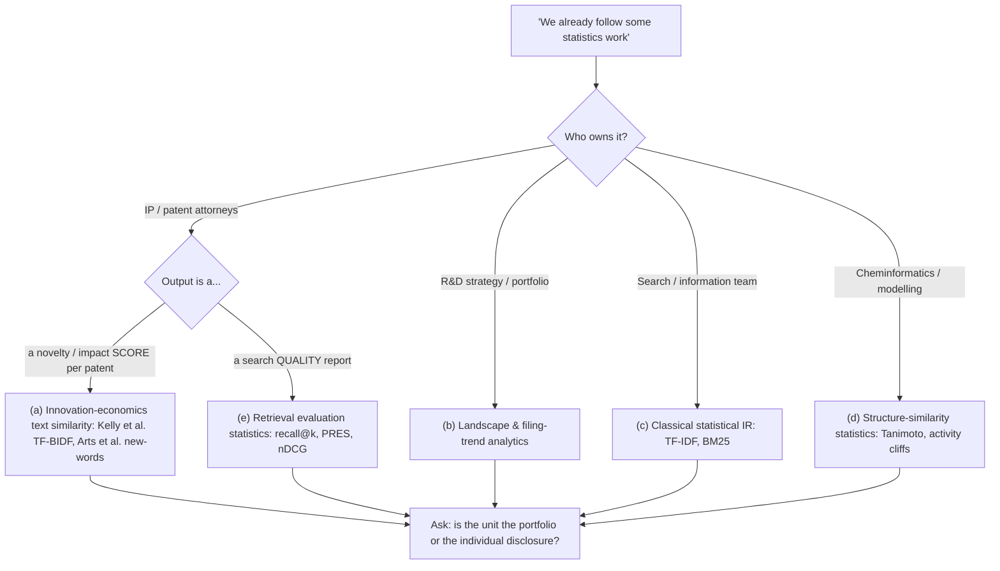
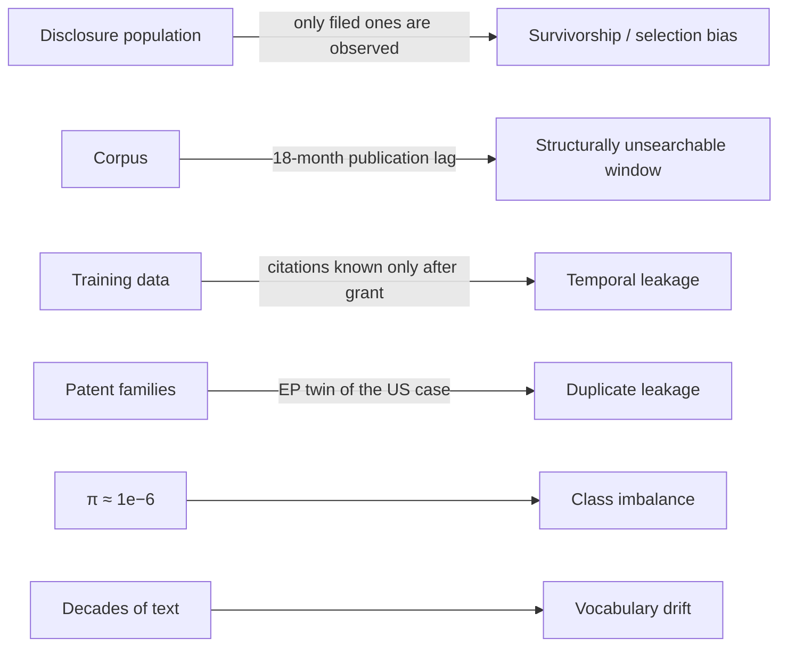

# Chapter 51 — Measuring Novelty: Statistics, Calibration & Proving a Prior-Art System Works

> **Why this chapter exists:** This is the quantitative half of the pack. Chapter 50 gives you an architecture; this chapter tells you what to *measure*, how to turn a similarity number into a defensible decision, and how to prove — to a statistically literate audience — that the thing actually works. It covers the five different literatures that hide behind the word "statistics" in this domain, the innovation-economics text-novelty estimators in full, calibration and cost-asymmetric thresholds, retrieval evaluation including the patent-native PRES metric, how to estimate the recall you cannot observe, and the traps that are specific to patent data.
>
> **Patent & prior-art AI pack — Chapters 48–52.** A self-contained series on building and evaluating AI systems for **patent prior-art search, novelty assessment and design-around analysis** — the problem of deciding whether an invention already exists in the literature, and what could be changed if it does. Written for an ML/AI engineer with no patent-law or chemistry background who has to become useful in that domain quickly.
>
> **[48 · Orientation & strategy](48_patent_prior_art_ai_orientation.md) — [49 · Domain primer](49_patent_domain_primer_for_ai.md) — [50 · System design](50_prior_art_novelty_system_design.md) — [51 · Measurement & evaluation](51_novelty_measurement_and_evaluation.md) — [52 · Q&A bank](52_patent_ai_qa_bank.md)**
>
> **Suggested order:** 48 for the shape of the problem and the questions to ask, 49 for the domain vocabulary, 50 for the architecture, 51 for the statistics, 52 to rehearse.
>
> **Standing caveat:** nothing here is legal advice. Novelty, inventive step and infringement are legal determinations made by qualified attorneys and examiners. Everything in this pack is about building **decision-support** that makes a human expert faster, never a system that decides.

---

> **Scope.** This is the quantitative chapter. A brief for this kind of work very often contains a sentence like *"there is some statistics work we already follow, unclear what."* That sentence is the single highest-leverage ambiguity in the whole engagement. This chapter (a) enumerates the five things "statistics" plausibly means here, with the formula for each and the one question that disambiguates it; (b) goes deep on the innovation-economics text-novelty literature, because that is the most likely referent and the one a quantitatively trained stakeholder will probe; (c) shows how to turn a similarity number into a defensible decision; and (d) lays out how you would *prove the system works*, including how to estimate the recall you cannot observe.
>
> **Honesty boundary, stated once.** Most engineers arriving at this problem have no patent, IP-law, or chemistry background. Nothing in this chapter should be spoken as domain experience if it is not. Everything here is either published literature (cited, with URLs) or a method that transfers from ordinary ML practice — probability calibration, evaluation harnesses, hybrid retrieval, entity resolution, train/serve parity, drift monitoring. The move is to *bring the measurement discipline*, ask for the domain, and say so explicitly.

---

## 1. Decision tree: when they say "statistics", they probably mean one of five things

These five are genuinely different literatures with different estimators. Guessing wrong wastes the meeting.



| # | Reading | What it actually is | Core formula | Question it answers | The one confirming question to ask |
|---|---|---|---|---|---|
| (a) | **Innovation-economics text similarity** — Kelly, Papanikolaou, Seru & Taddy (AER:Insights 2021); Arts, Hou & Gomez (Research Policy 2021) | Each patent becomes a weighted term vector; novelty = *dissimilarity to the preceding 5 years*, impact = similarity to the following 5 years | `q_j = FS_j / BS_j` (shipped as a log ratio) | "Is this filing unusual relative to the state of the art, and did it go on to matter?" | *"When you say novelty score — is it a scalar per patent computed against a time window, or a ranked list of specific documents?"* A scalar means (a). A list means (c)/(e). |
| (b) | **Landscape / portfolio statistics** | Counts, shares, CAGR, CPC-class concentration, competitor overlap, family geography | Herfindahl `H = Σ s_i²`; YoY growth; white-space = empty cells in CPC × assignee × year | "Where are we and our competitors filing, and where is the white space?" | *"Is the current statistics work reported at portfolio level to R&D management, or per-disclosure to attorneys?"* |
| (c) | **Classical statistical IR** — TF-IDF, BM25 | Probabilistic relevance models. Literally "statistical language models" — the name causes exactly this confusion | BM25 (below) | "Which documents match this text?" | *"Is the incumbent a Boolean/keyword search in a commercial database, or a scored ranking?"* |
| (d) | **Chemistry similarity statistics** | Fingerprint Tanimoto distributions, Markush enumeration counts, activity-cliff/SALI significance testing | `T = c / (a + b − c)`; `SALI_ij = \|A_i − A_j\| / (1 − sim(i,j))` | "Is this *molecule/composition* already covered?" | *"Does the disclosure carry structures — SMILES, Markush claims — or is this text-only?"* This is the question that most changes the architecture. |
| (e) | **Evaluation statistics for search quality** | Recall@k, MAP, nDCG, MRR, PRES, capture–recapture, TAR stopping rules | PRES, Chao1 (below) | "How good is our current search, and how would we know if a new system is better?" | *"Do you have a labelled set — search-report X/Y citations, or attorney-adjudicated pairs — that we could score against today?"* |

**How to use this live.** Do not lecture through all five. Say: *"'Statistics' in this space usually means one of about five different things, and they need different estimators — text-similarity novelty indices, portfolio analytics, retrieval scoring, structure similarity, or search-quality evaluation. Which one is the group already running?"* That single sentence establishes you have read the field without claiming the field.

BM25, since it is the baseline you will be asked to beat and it keeps refusing to lose:

```
score(q, d) = Σ_{t ∈ q}  IDF(t) · [ f(t,d) · (k1 + 1) ]
                         ---------------------------------------------
                         [ f(t,d) + k1 · (1 − b + b · |d| / avgdl) ]

IDF(t) = log[ (N − n(t) + 0.5) / (n(t) + 0.5) + 1 ]
k1 ∈ [1.2, 2.0]   (term-frequency saturation)
b  = 0.75          (length normalisation: b=0 none, b=1 full)
```
Robertson & Zaragoza (2009), *The Probabilistic Relevance Framework: BM25 and Beyond*, FnTIR 3(4):333–389, [doi:10.1561/1500000019](https://doi.org/10.1561/1500000019).

Two parameters matter for patents specifically: `k1` saturates term frequency, which is essential because claim language repeats terms for legal reasons rather than semantic ones; `b` is the explicit knob for the fact that claim sets differ in length by an order of magnitude. BM25's failure mode is vocabulary mismatch — it has exactly zero recall on a synonym it has never seen, which in chemistry means IUPAC name vs trade name vs CAS number vs Markush description. That is the argument for *fusing* it with a dense retriever, not replacing it.

---

## 2. TF-BIDF and the Kelly–Papanikolaou–Seru–Taddy construction

Reference: NBER WP 25266, [full public working paper PDF](https://www.nber.org/system/files/working_papers/w25266/revisions/w25266.rev0.pdf); published as *Measuring Technological Innovation over the Long Run*, AER: Insights 3(3), [doi:10.1257/aeri.20190499](https://doi.org/10.1257/aeri.20190499). Data and Stata replication code: [github.com/KPSS2017](https://github.com/KPSS2017/Measuring-Technological-Innovation-Over-the-Long-Run-Extended-Data), formal package [doi:10.3886/E119043V1](https://doi.org/10.3886/E119043V1).

### 2.1 The construction, step by step

```
(1) Term frequency, length-normalised:
        TF_{p,w} = c_{pw} / Σ_k c_{pk}

(2) Backward IDF — the distinctive idea:
        BIDF_{w,p} = log [ (# patents issued PRIOR to p)
                           -------------------------------------------------- ]
                          [ 1 + (# documents PRIOR to p containing term w) ]

(3) Pair weighting uses the EARLIER patent's vintage, t = min(i, j):
        TFBIDF_{w,i,t} = TF_{w,i} · BIDF_{w,t}

(4) Unit-normalise over the union of terms in the pair:
        V_{i,t} = TFBIDF_{i,t} / || TFBIDF_{i,t} ||

(5) Similarity:
        ρ_{i,j} = V_{i,t} · V_{j,t}          ∈ [0, 1]

(6) Backward similarity (novelty, inverted), τ = 5 years:
        BS_j^τ = Σ_{i ∈ B(j,τ)} ρ_{j,i}      B = patents filed in the τ years BEFORE j

(7) Forward similarity (impact):
        FS_j^τ = Σ_{i ∈ F(j,τ)} ρ_{j,i}      F = patents filed in the τ years AFTER j

(8) Quality:
        q_j^τ = FS_j^τ / BS_j^5
```

### 2.2 Why the denominator uses only *prior* documents

This is the question a statistically trained interviewer will actually ask, so know the answer cold.

Standard IDF is computed over the entire corpus, which includes the future. KPST's worked example: Tesla's 1888 AC-motor patent (US 381,968) was among the first documents to use the term *"alternating current."* Compute IDF over 1840–2016 and that term is common, so it gets crushed to a near-zero weight — the model de-emphasises precisely the phrase that made the patent novel. The paper calls this "a misleading, and quite inverted, portrayal of the patent's innovativeness."

BIDF fixes it by construction: term weights are a *point-in-time* estimate using only the documents that existed when the focal patent was filed. It is a **leave-the-future-out** construction. The `1 +` in the denominator is a Laplace guard so a genuinely first-ever term does not divide by zero.

The second, subtler piece: for a *pair*, both sides are weighted by the **earlier** patent's BIDF (`t = min(i,j)`). If you weighted an 1888↔1990 pair with 1990 weights, "alternating current" contributes nothing after 102 years of diffusion, and you destroy your ability to measure the 1888 patent's influence. The consequence is that ρ is deliberately **vintage-dependent and not a single global index** — you cannot precompute one TF-IDF matrix and reuse it.

`ρ` is closely related to a Pearson correlation, differing in that TFBIDF is not mean-centred before the dot product; since TFBIDF is non-negative, `ρ ∈ [0,1]`.

### 2.3 The "bias correction" — what is actually in the paper, and what is not

**State this carefully in interview, because getting it wrong in front of a statistically trained audience is worse than not raising it.**

The public NBER working paper contains **no sample-splitting or leave-out variance correction for similarity estimates.** The word "bias" appears twice, both times about *citation truncation*, not estimation error. (The published AER:Insights version and its supplemental appendix are paywalled and were not checked — so treat "there is no split-sample correction anywhere in KPST" as **unverified**; treat "there is none in the public working paper" as verified.)

What the paper *does* contain, and what people usually mean when they say "the bias correction":

1. **Backward IDF** — a leave-the-future-out correction against look-ahead leakage (§2.2).
2. **Earlier-patent vintage weighting** — a correction for the systematic down-weighting of pioneering terms.
3. **Removal of year fixed effects and within-cohort ranking** — the correction for mechanical time-series drift.

On (3), the paper is explicit: *"time-series fluctuations … are also affected by mechanical factors, such as shifts in language; the fact that the retrospective document frequency measure is changing over time so terms become less novel over time; and the fact that the number of patents is rapidly expanding over time."* Note `BS` and `FS` are **sums**, not averages, so they scale with filing volume — the year effects are not optional.

The empirical payoff, on ~250 historically important patents (their Table 3), is the number to remember:

| Measure | Unconditional mean percentile rank | After removing year FE | Ranked *within* cohort |
|---|---|---|---|
| 5-yr text quality | 0.74 | 0.77 | ~0.96 |
| 5-yr citations | 0.33 | 0.67 | ~0.96 |
| Full-sample citations | 0.53 | — | ~0.96 |

Everything only becomes comparable inside a cohort. Hold that thought for §4.3.

**If asked "where is the rigorous bias correction in this literature?", the honest, verified answer is Bronwyn Hall's, not Kelly's.** See §3.1.

### 2.4 Calibration anchors you need before choosing any threshold

From KPST, for pairs filed 0–20 years apart:

| Statistic | Value |
|---|---|
| Median pairwise similarity | 7.8% |
| Mean | 10.2% |
| p90 | 17.6% |
| p95 | 22.9% |
| Pairs zeroed by their 5% sparsity cutoff | 93.4% |
| Share of ρ > 5% pairs linked by a citation | 0.007% |

A cosine of **0.23 is already the 95th percentile.** Anyone who proposes "flag anything above 0.5" has not looked at the background distribution. Also note the last row: the text-similarity network is vastly denser than the citation network — KPST read this as text "automating the citation process," and it is the cleanest published argument for text over citations in prior-art work.

### 2.5 Limits — say these out loud, they are your credibility

- **English-only, bag-of-words.** No chemical entity recognition. A novel substituted-pyrimidine IUPAC name becomes noise; "glyphosate" survives because it is frequent.
- **It measures textual, not legal, novelty.** Nothing in `BS_j` encodes Art. 54(3) EPC, priority-date logic, or claim scope. A low `BS` is a *hypothesis about* novelty, never a conclusion.
- **Sums, not averages** → volume-sensitive; contrast Arts et al., whose backward cosine is an *average* and therefore invariant to filing volume. `bsim5` and `backward_cosine` are not the same quantity and differ by roughly the window's patent count. Do not compare them.
- **The 5% truncation is fine for index construction and wrong for recall-oriented search.** You cannot discard the tail you have not inspected.
- **Early-corpus noise.** BIDF is estimated from very few prior documents in early years.
- **It cannot run on a private corpus alone.** Your organisation's internal filings cannot supply the prior-art denominator; the full patent corpus must.

### 2.6 The cheaper, fully open alternative

Arts, Hou & Gomez — data at [Zenodo 3515985](https://zenodo.org/records/3515985), code at [github.com/sam-arts/respol_patents_code](https://github.com/sam-arts/respol_patents_code):

```
new_word_reuse_p = Σ_{i=1..n} (1 + u_i)

  n   = # keywords / bigrams / trigrams / unordered keyword PAIRS
        first used in history by patent p
  u_i = # FUTURE patents that reuse new item i
  "1 +" credits the introducing patent itself
```

Corpus: title + abstract + claims, 6,252,916 US grants 1969–2018; vocabulary 1,362,971 stems; median 56 unique keywords per patent. They ship precomputed `100_most_similar_patents` (625M rows) and `1000_most_similar_patents` (6.25B rows) — a **ready-made candidate generator** you can benchmark against on day one, for free. Their pipeline drops hapax tokens as presumed typos and removes a hand-curated 32,255-keyword stoplist while deliberately keeping technical terms.

Their earlier expert validation (Arts, Cassiman & Gomez, SMJ 2018, [full text](https://lirias.kuleuven.be/retrieve/551665/)) is the study worth stealing wholesale: Jaccard on keyword sets vs expert ratings, correlation **0.838**; inter-expert average inter-item correlation 0.812; two of the raters were chemical-industry R&D engineers. And they quantify the failure modes: **false positives 3.5%** of ratings at J > 0.25, driven by low-content words (*method, system, device, apparatus, process*) shared across unrelated applications; **false negatives 1.6%** at J < 0.50, driven by synonyms — *"system for monitoring errors"* vs *"defect inspection method and apparatus."* That synonym hole is the entire case for adding embeddings, and it is widest in chemistry.

---

## 3. Other novelty operationalisations, with formulas

| Measure | Formula | Unit | Failure mode |
|---|---|---|---|
| **Trajtenberg–Jaffe–Henderson originality / generality** | `G_i = 1 − Σ_j s_ij²` (s = share of citations by class) | Patent | Sensitive to classification granularity; end-of-sample truncation |
| **Hall's bias correction** | `γ̂_i = (N_i / (N_i − 1)) · G_i` | Patent | Invalid if "general" patents also attract more citations |
| **Uzzi atypicality** | `z = (obs − mean_rand) / sd_rand` over a degree-preserving rewired null | Class/journal pair | Null preserves degree but not subject matter; undefined for never-before-seen pairs |
| **Verhoeven et al. recombinant novelty** | Indicator: ∃ a pair of the patent's classes that has never co-occurred on any prior patent | Patent | Class-pair space fills over time → not comparable across decades |
| **Fleming familiarity** | Component / combination familiarity, modelled with negative binomial **plus dispersion models** | Patent | First-time combination partly measures *examiner* behaviour |
| **Jensen–Shannon divergence over topics** | `JSD(P,Q) = ½KL(P‖M) + ½KL(Q‖M)`, `M = (P+Q)/2` | Document pair | LDA topics not identified across refits |

### 3.1 Hall's multinomial correction — the cleanest bias example in this literature

Hall, Jaffe & Trajtenberg (2001), NBER WP 8498, [PDF](https://www.nber.org/system/files/working_papers/w8498/w8498.pdf), Appendix 2.

```
Sample Herfindahl:      HHI = Σ_j (N_j / N)²
Population:             η   = Σ_j λ_j²

Even though E[N_j / N] = λ_j, Jensen's inequality gives:
        E[HHI | N] = (1 − 1/N)·η + 1/N            → HHI is biased UPWARD

Unbiased:               η̂ = (N·HHI − 1) / (N − 1)

For generality G_i = 1 − Σ_j (N_ij / N_i)²:
        E[G_i | N_i] = ((N_i − 1) / N_i) · γ_i    → bias is exactly −γ_i / N_i
        γ̂_i = (N_i / (N_i − 1)) · G_i

True standard errors are N/(N−1) larger than naive ones.
```

Why this matters in the room: it is a *concrete, exact, small-sample estimator bias in a ratio of counts* — precisely the kind of thing a statistically trained reader respects, and it is one line of code. If someone shows you generality/originality numbers computed off citation counts with `N` in single digits, they are systematically understating originality.

### 3.2 The Uzzi result that maps directly onto "what can we tweak?"

Uzzi et al., *Science* 2013, [PDF](https://www.kellogg.northwestern.edu/faculty/uzzi/htm/papers/science-2013-uzzi-468-72.pdf). Each document gets a distribution of pair-level z-scores from its references; summarise by the **median z** (conventionality) and the **10th-percentile z** (tail novelty). The 2×2 on hit rate (top-5% cited, per 100 papers, background ≈ 5):

| | High tail novelty | Low tail novelty |
|---|---|---|
| **High conventionality** | **9.11** | 5.82 |
| **Low conventionality** | 5.33 | 2.05 |

The empirically best position is *not* maximal novelty. It is a **conventional core with one atypical element** — which is exactly the design brief for a tweakable patent claim. The patent analogue: for each pair of the disclosure's CPC subgroups, compare observed co-occurrence that year against a Monte-Carlo rewiring that preserves each patent's class count and each class's usage. Two caveats to state: (i) never-co-occurring pairs give `sd = 0` and undefined z — that is the *most* novel case, so treat it as a censored category, never drop it; (ii) the number of randomisations used in the original is **unverified** (Uzzi's supplement was not retrievable), so do not quote one.

### 3.3 The tweak estimator — flag it as a synthesis, not a citation

No paper in this literature builds "what can we tweak" directly. The natural construction, which you should present *as your own synthesis*:

```
For each component w of the disclosure (keyword, CPC subgroup, or R-group position):
        Δ_w = BS(K) − BS(K \ {w})        # leave-one-out marginal contribution

Large positive Δ_w  →  w is what anchors this filing to the prior art
                    →  w is the tweak candidate

Then score candidate substitutions w → w' by
  (i) does it create a first-time class pair?  (ii) its Uzzi z-score
  (iii) chemistry layer: how much does max-Tanimoto-to-nearest-prior-art drop?
```

**Say the caveat before they say it:** this is a maximum taken over many candidate tweaks, so the reported novelty gain is upward-biased by multiplicity. Hold out a validation slice of prior art, or apply a max-statistic correction, before claiming a tweak clears the art. Raising this unprompted is worth more than the estimator itself.

---

## 4. Turning a similarity into a decision

### 4.1 A cosine is not a probability

Everything downstream — expected-cost thresholds, recall estimation, review budgets — assumes that a score of `p` means "a fraction `p` of documents scored `p` really are novelty-destroying." Raw cosine, raw XGBoost margin, and raw neural scores all violate this routinely.

```
Platt scaling:      p̂ = σ(a·s + b),  a,b fit by MLE on a held-out set
                    (2 parameters; safe on small labelled sets; assumes
                     a monotone logistic link)

Isotonic:           p̂ = PAV(s), a monotone step function
                    (non-parametric; needs more data; overfits the tails —
                     the tails are exactly where prior art lives)

Brier:              BS = (1/n) Σ (p̂_i − y_i)²
                    Murphy decomposition: BS = reliability − resolution + uncertainty
                    (reliability = calibration error; resolution = discrimination)

ECE:                ECE = Σ_b (n_b / n) · | acc(b) − conf(b) |
                    Report bin counts. With 10⁻⁶ prevalence, most equal-width
                    bins are empty; use equal-FREQUENCY bins or you are
                    reporting noise.
```

**This is familiar ground for anyone who has shipped a scored decision system.** In my own case that means probability calibration, ROC-AUC / PR-AUC / ECE / Brier as working tools, and an XGBoost credit model shipped at out-of-time ROC-AUC 0.84 where the *decision* mattered more than the ranking. The honest sentence is: *"I have not calibrated a patent-novelty score. I have calibrated credit-risk scores where the threshold decided whether money moved, and the discipline transfers directly: the score has to mean something before you can attach a cost to it."*

**One trap specific to this domain:** calibrate *within cohort*. A single global Platt fit across CPC sections and decades is a Simpson's-paradox generator. Either fit per-cohort or include cohort as a feature in the calibrator.

### 4.2 Asymmetric costs and the right form of the decision

The naive framing is a binary classifier with a threshold. The real object is a **ranked list and a review-depth decision**, which changes the maths.

```
Binary form (if you must):
        E[C(τ)] = c_FN · π · (1 − TPR(τ)) + c_FP · (1 − π) · FPR(τ)

  π  = prevalence of relevant documents. If 10 truly relevant documents sit
       in a 10M-document corpus, π = 1e−6.
  Precision at any operating point = π·TPR / (π·TPR + (1−π)·FPR)
       → at π = 1e−6, even FPR = 1e−4 gives precision ≈ 1%.
  Youden's J = TPR − FPR implicitly assumes c_FN = c_FP and is therefore WRONG here.

Review-depth form (correct for this problem):
        E[C(k)] = c_review · k + c_miss · (1 − R(k))

        Optimal k:  c_review = c_miss · dR/dk
        → keep reviewing while  P(next document is X-relevant) > c_review / c_miss
```

Worked illustration — **these euro figures are placeholders to be elicited, not facts**:

| Parameter | Illustrative value | Source needed from the organisation |
|---|---|---|
| `c_review` — marginal cost of one more document reviewed | ~€150 (≈ one attorney/searcher hour amortised over several docs) | IP department's internal rate |
| `c_miss` — cost of a wasted filing on non-novel subject matter | ~€40,000 (drafting + EP/PCT fees + national phase + prosecution) plus opportunity cost | IP department's own average |
| **Implied stopping rule** | `c_review / c_miss = 0.00375` → keep reviewing while the next document has **≥ 0.375%** probability of being novelty-destroying | — |

That single derived number is a better artefact than any model. It converts "how deep should we search?" from a matter of taste into arithmetic — and it is exactly the kind of point a statistically-trained interviewer will engage with, because it is a loss function made explicit rather than assumed.

Note also that `c_miss` is **not one number**. Freedom-to-operate (risk of infringing someone else's live patent) has a far higher `c_miss` than landscaping. Ask for the cost matrix by use case:

| Use case | Typical recall target | Cost asymmetry |
|---|---|---|
| Landscaping / trend scanning | ~0.80 | mild |
| Novelty check before drafting | ~0.90 | moderate |
| Freedom-to-operate / clearance | 0.95+ | extreme |

In most large filers, clearance is already framed internally as a *risk control* — the way the organisation avoids patent and licensing disputes before they happen — rather than as a search task. That is the vocabulary to borrow when you talk about the FTO end of the cost matrix: you are not making search faster, you are lowering the probability of an expensive dispute.

### 4.3 Per-cohort normalisation — non-negotiable

Raw similarity is not comparable across technology fields or across time. Two independent literatures converge on the same fix: KPST remove year fixed effects and rank within cohort (0.74 → 0.96, §2.3); Arts, Cassiman & Gomez and Ascione & Sterzi both restrict comparisons to patents filed in the **same civil year**, explicitly because classification and technological trends shift fast.

```python
# The rule that should govern every threshold in the system.
# Never: "flag if cosine > 0.5"
# Always: "flag the top q% of the cohort-conditional background distribution"

def cohort_percentile(score, cohort_scores):
    """cohort = (CPC subclass) x (filing-year window). Background distribution
    is recomputed per cohort; a fixed absolute cutoff is meaningless."""
    return (cohort_scores < score).mean()

# Then, and only then, map percentile -> calibrated probability -> expected cost.
```

The same logic applies on the chemistry side: Godden, Xue & Bajorath ([doi:10.1021/ci990316u](https://doi.org/10.1021/ci990316u)) enumerated the complete achievable distribution of Tanimoto values for binary fingerprints and found significant *statistical preference* for certain Tc values — because `Tc = c/(a+b−c)` is a ratio of small integers, some values are reachable in far more ways than others. Consequence: **mean Tanimoto is not a sound summary statistic**, and thresholds do not port between fingerprint types or bit lengths. Report the percentile within the background distribution for that fingerprint and that database. (The folk claim that Tc sits around ~0.3 even for distant molecules is **unverified** — it does not appear in the Godden abstract. Do not quote it.)

Two more chemistry facts that are worth having ready if the disclosure carries structures:

```
Tanimoto:            T = c / (a + b − c)
Hard size bound:     T ≤ min(a,b) / max(a,b)
```
That bound is both a bias (a fragment can never be 0.85-similar to a molecule twice its size — the max is 0.5, so any fixed threshold silently size-filters) and a free lossless pruning rule (only molecules with `b ∈ [t·a, a/t]` can qualify), which Swamidass & Baldi ([doi:10.1021/ci600358f](https://doi.org/10.1021/ci600358f)) turned into sub-second exact search over 5M compounds at ~O(|D|^0.6).

And the "0.85 rule" is dead: Martin, Kofron & Traphagen ([doi:10.1021/jm020155c](https://doi.org/10.1021/jm020155c)) found only a **30% chance** that a compound ≥0.85 Tanimoto-similar to an active is itself active, across IC50 follow-ups to 115 HTS assays. It originates as a *retrieval* heuristic (Patterson et al. 1996), not a bioactivity guarantee. Calibrate per fingerprint, per dataset.

---

## 5. Evaluation design: proving it works

### 5.1 Ground truth, three channels with three different biases

| Source | What it labels | Volume | Bias to declare |
|---|---|---|---|
| **EPO/PCT search-report X and Y citations** | X = destroys novelty alone; Y = destroys inventive step in combination | Millions; PatentMatch ships 6,259,703 claim–paragraph pairs (X = positive, A = negative; Y deliberately excluded) | It is *what the examiner found*, not what exists. And examiner search is **precision-oriented** — one X kills claim 1, so reports carry ~5 citations. Training on it optimises the wrong objective for a recall-oriented commercial search. |
| **Patent interferences** | Examiner-certified *same invention* — maximum-similarity gold labels | Only **133** usable pairs / 260 applications after filtering (Ascione & Sterzi, [arXiv:2403.16630](https://arxiv.org/pdf/2403.16630)) | Tiny; and interference practice ended with the AIA, so it is historical |
| **Attorney adjudication** | Whatever you define | You pay for it | Costly; needs a protocol (§6) |

Two more channels for **backtesting outcomes rather than documents**: granted-vs-refused, and EPO **oppositions/revocations**. Design: does the novelty score, computed at the priority date with a point-in-time index, predict (i) receipt of at least one X citation, (ii) refusal, (iii) opposition filed, (iv) revocation? Report AUC *and* the calibration curve, per CPC cohort. This is a genuinely econometric framing and it uses labels the organisation already owns.

Also worth knowing so you do not overpromise: on PatentMatch, a fine-tuned `bert-base-uncased` scores **54%** and **52%** accuracy discriminating X from A citations — "only slightly better than random guessing" ([Risch et al., PatentSemTech 2021](https://ceur-ws.org/Vol-2909/paper5.pdf)). And on the LLM side, PANORAMA ([arXiv:2510.24774](https://arxiv.org/html/2510.24774v1), 8,143 US examination records) reports models picking prior art from 8 candidates at **77.3%** (random 5.6%) but judging *novelty/non-obviousness* at **45.4%** against a **32.3%** random baseline. **There is no human baseline in that paper** — the 92.5% figure that circulates is the expert-verified accuracy of its own claim-extraction parser, and presenting it as a human score is exactly the error an interviewer who has read the paper will catch. State these numbers if anyone in the room suggests "we'll just ask an LLM."

The only vendor publishing on a real benchmark is IPRally ([arXiv:2508.10496](https://arxiv.org/html/2508.10496v1), PatentSemTech @ SIGIR 2025): a Graph Transformer over rule-built invention graphs, trained on **31.7M examiner citations** from ~8.7M applications, reaching **Recall@3 0.4046 / nDCG@150 0.5564** against BM25's Recall@3 0.1866 and a Tree-LSTM's 0.3151 — while *beating much larger text encoders* (PaECTER 345M, Stella 435M, KaLM 494M) at 156M parameters. Two things to say about this: the graph structure buys more than parameter count, and **every other vendor's accuracy claim is unfalsifiable** because none publishes reproducible metrics. That is a fair, checkable observation, and it is exactly the kind of scepticism a panel wants to hear from someone they are considering putting in charge of the architecture.

### 5.2 Metrics, and why recall@100 beats precision@1

| Metric | Formula | Rewards | Verdict here |
|---|---|---|---|
| Precision@k | relevant in top k / k | reviewer experience | Report it, never claim validity on it |
| Recall@k | relevant in top k / total relevant | coverage | **Primary** |
| MRR | `(1/\|Q\|) Σ 1/rank_first` | first hit | Misleading — one hit does not clear an FTO |
| MAP | `(1/\|Q\|) Σ_q (1/R_q) Σ_k P@k · rel_k` | whole ranking | Fragile under incomplete judgements |
| nDCG@k | `DCG@k = Σ (2^rel_i − 1)/log₂(i+1)`, `nDCG = DCG/IDCG` | graded relevance | **Use with X=2, Y=1, A=0** — maps EPO categories onto graded relevance for free |
| PRES | see below | recall *and* rank, given a review budget | **The patent-native metric** |

```
PRES = 1 − [ (Σ_{i=1..n} r_i)/n − (n+1)/2 ] / N_max

  r_i   = rank at which the i-th relevant document is retrieved
  n     = total relevant documents
  N_max = the maximum number of documents the user will actually check

  Relevant docs not retrieved within N_max are treated as at the worst case.
  Range for recall R: from R (perfect ranking) down to n·R² / N_max (worst).
```
Magdy & Jones, SIGIR 2010, [doi:10.1145/1835449.1835551](https://doi.org/10.1145/1835449.1835551). *Caveat: the algebraic form above is assembled from Magdy's project page plus a secondary quotation — the ACM PDF was not retrievable. Verify against the original before putting it on a slide.*

`N_max` is the point of PRES: "a relevant document at rank 10 is very good when N_max=1000, good when N_max=100, but bad when N_max=15." It forces the review budget into the metric, and it makes PRES incomparable across different `N_max` — which is a feature, because it means someone has to state the budget.

**Why recall@100, not precision@1.** A missed X reference is not a ranking error, it is a wasted filing and, in the FTO case, a litigation exposure. A false alarm is an attorney hour. With those costs and π ≈ 10⁻⁶, precision@1 is a UX statistic and ROC-AUC will look excellent while the queue is 99% noise — only the PR curve moves. Set the operating point by fixing a **recall target** and reporting the review cost to reach it.

### 5.3 Estimating the recall you cannot observe

This is the hardest and most interesting part, and it is where you can genuinely add something. **No published statistics exist on the real-world recall of professional chemical prior-art search** — I could not source that number, and saying so is more useful than inventing one. (One figure that circulates for examiner recall is ~0.78; treat as **unverified** unless you can name the study.)

**Two independent searches → Lincoln–Petersen with Chapman correction:**

```
N̂ = n1·n2 / m                                       (biased up; undefined at m=0)

Chapman:  N̂ = (n1+1)(n2+1)/(m+1) − 1                (near-unbiased for m ≳ 7)

Var(N̂) = (n1+1)(n2+1)(n1−m)(n2−m) / [ (m+1)²(m+2) ]

Estimated misses = N̂ − (n1 + n2 − m)
```

**Many channels → Chao1**, as adapted to technology-assisted review by van Dijk et al. ([arXiv:2404.01176](https://arxiv.org/pdf/2404.01176)):

```
f_k = # relevant docs found by exactly k independent channels
n   = # distinct relevant docs found

f̂_0 = f1² / (2·f2)                    if f2 > 0
f̂_0 = f1(f1 − 1) / (2(f2 + 1))        if f2 = 0
N̂   = n + f̂_0

σ̂²  = f2 · [ ¼(f1/f2)⁴ + (f1/f2)³ + ½(f1/f2)² ]

Log-normal CI (asymmetric — do NOT use a symmetric one):
  Q  = exp{ 1.96 · sqrt( ln(1 + σ̂²/(N̂ − n)²) ) }
  CI = [ n + (N̂ − n)/Q ,  n + (N̂ − n)·Q ]
```

Their worked example: 2,481 documents, 120 truly relevant; after 500 review decisions `f1=40, f2=33, n=92` → `N̂ = 92 + 1600/66 = 116.24` against a truth of 120, 95% CI [103.11, 144.88].

**The operational trick:** you do not need multiple human searchers. Run an *ensemble* of retrievers round-robin and record which one first surfaced each relevant document — the ensemble supplies the capture histories.

**The assumption that will destroy you, and the reason to raise it first.** Capture–recapture requires the channels to be independent. If your four "independent" retrievers are all dense encoders over the same embedding, they miss the same synonym-hidden patent together, `f1` collapses, `f̂_0` collapses, and you will confidently report that you missed nothing. **Positive dependence biases `N̂` downward.** So the channels must be *architecturally* independent by construction:

| Channel | Independent because |
|---|---|
| BM25 lexical | pure surface form |
| Dense text embedding | distributional semantics |
| Structure / Tanimoto fingerprint | chemistry, no text at all |
| CPC-neighbourhood expansion | examiner classification |
| Citation-graph expansion | human citing behaviour |

*Caveat to state:* I found **no published application of capture–recapture to patent prior-art search specifically** — the verified precedents are systematic-review and eDiscovery TAR. Presenting it as "a method from an adjacent recall-critical field that I would adapt" is honest and still impressive.

**Stopping rules**, from Yang, Lewis & Frieder ([arXiv:2106.09871](https://arxiv.org/pdf/2106.09871)):

- **Knee method** (Cormack & Grossman): let `(i, Rel(i))` be the point of maximum perpendicular distance from the segment joining `(0,0)` and `(s, Rel(s))` on the gain curve. Then

```
ρ(s) = [ Rel(i) / i ]  ÷  [ (Rel(s) − Rel(i) + 1) / (s − i) ]
     = (Rel(i)/i) · (s − i) / (Rel(s) − Rel(i) + 1)
```

  Stop at the first `s` with `ρ(s) ≥ 156 − min(Rel(s), 150)` **and** `s ≥ 1000`. Targets recall **0.70** — insufficient for FTO. *(Mind the direction: on a flattening gain curve ρ(s) grows toward the threshold. Inverting the second slope — a common transcription error — makes the rule stop at the wrong point.)*
- **Target method**: sample until 10 relevant found, hide them from the learner, stop when all 10 are rediscovered — guarantees recall ≥ 0.70 at 95% confidence.
- **CMH hypergeometric certification** (Callaghan & Müller-Hansen): misses a 95% recall target in only **0.59%** of runs — but delivers only ~**17% work saving** over exhaustive review. *That trade-off is the honest headline: statistical guarantees on recall cost you most of the efficiency gain.* Say this before someone else discovers it in month six.
- **Model-based recall with a delta-method variance**: use the *ratio* estimator `Σ_{i∈R} p_i / Σ_{i∈C} p_i` — systematic model error partly cancels between numerator and denominator — and **stop on the lower confidence bound, not the point estimate.** Yang et al. put it bluntly: stopping when a point estimate equals the goal misses the goal ~50% of the time. This estimator is *entirely dependent on calibration*, which closes the loop back to §4.1.

---

## 6. Human evaluation

### 6.1 Adjudication protocol

Copy Arts, Cassiman & Gomez's design, which is the only one in this literature with published agreement statistics:

- Same-field experts (theirs included a chemical-engineering R&D engineer and a specialty-chemicals engineer with 20+ years); multiple experts rate the *same* pairs.
- ~65 pairs each, 15–45 minutes per pair, **randomised presentation order**.
- **Stratified sampling** across similarity bands (0; 0.05–0.25; 0.25–0.50; 0.50–0.75; >0.75) — uniform random sampling "would result in a very large share of patent pairs without any content in common and would make the exercise fruitless." **Then reweight to the population distribution when reporting**, because stratification is itself a sampling bias and they say so.
- Blind the adjudicator to which system produced each candidate.
- Rate on an ordinal scale with anchors tied to EPO categories (X / Y / A / irrelevant), not a vague 1–5.

### 6.2 Agreement

```
Cohen's kappa:        κ = (p_o − p_e) / (1 − p_e)        2 raters, nominal
Krippendorff's alpha: α = 1 − D_o / D_e                  any #raters, missing data,
                                                          nominal/ordinal/interval
```
Use **Krippendorff's α** — several chemists rating a variable number of pairs on an ordinal scale is exactly its use case. Krippendorff's own guidance: require α ≥ 0.800, treat 0.667 as the floor for tentative conclusions. Landis & Koch's κ bands (0.61–0.80 "substantial") are conventional, not principled.

Two things to flag: (i) the **kappa paradox** — under extreme prevalence κ collapses toward 0 even at 95% raw agreement, so always report raw agreement alongside; (ii) Arts et al. reported **Cronbach's α = 0.945** and average inter-item correlation 0.812, which measure *internal consistency of a rating scale*, not agreement, and are inflated by item count. If someone cites that 0.945 as an agreement figure, it is the wrong statistic.

### 6.3 Sample size for the pilot

```
Estimating recall to ±e at 95%:
        n = z²·p(1−p) / e²
        p = 0.90, e = 0.05  →  n ≈ 139 RELEVANT documents (not 139 total)
        p = 0.90, e = 0.03  →  n ≈ 385

Elusion to ±2% at 95%:  n = 2,399   (the "2399 rule" in TAR)

A/B on searcher time (two-sample, α=0.05, power=0.80):
        n_per_arm = 2·(1.96 + 0.8416)²·σ² / Δ² = 15.7·(σ/Δ)²
        Δ = 1.0σ  →  16 per arm
        Δ = 0.5σ  →  63 per arm

Use a WITHIN-SEARCHER crossover (same searcher, matched disclosures,
randomised order) — searcher-level variance in this task is large and
pairing removes it, cutting n by roughly the intraclass correlation.
```

### 6.4 A/B against the incumbent

The comparator is not "no system," it is the existing process: professional searchers plus a commercial database, and in many organisations an outsourced IP-services provider on top of that. The pattern to expect is that high-volume docketing and administrative work crowds out the analytical work, which is precisely the gap an assisted system has to fill.

| Endpoint | Definition | Why |
|---|---|---|
| **Primary: searcher-hours per disclosure at fixed recall** | Hold recall constant on a gold set; measure time | The only honest efficiency claim. "Faster" at unknown recall is meaningless |
| Prior art found *earlier* | Days from disclosure to first X-grade hit | Value is in killing bad filings before drafting cost |
| Decision reversals | Filings abandoned post-search that would previously have proceeded (and vice versa) | The actual money |
| Recall@N_max | on held-out search reports | Guards against a "fast because it gives up" system |
| Adjudicator agreement with system ranking | Krippendorff α on ordinal ratings | Guards against gaming |

Randomise at the **disclosure** level, block by CPC section and by searcher, and pre-register the primary endpoint. Explicitly measure automation bias as a safety endpoint: does the assisted arm stop searching earlier *and* miss more? Guardrail metric, not a success metric.

---

## 7. Statistical traps specific to this domain



**1. Survivorship / selection bias.** You only observe disclosures that were *filed*. Everything killed at internal review by a searcher who found the art is missing from your training data and from your evaluation set. So a model trained on filed applications learns "what gets filed," and its measured novelty distribution is truncated from below. Mitigation: ask whether the invention-disclosure system retains *rejected* disclosures with reasons. If it does, that is a uniquely valuable, almost certainly unused, labelled negative set — and it is the first question worth asking about their data.

**2. The 18-month truncation.** Applications publish 18 months after priority. For a disclosure being assessed today, everything filed in the last 18 months is invisible. Historical backtests do not have this problem — by the time you evaluate a 2015 filing, all its 2014 competitors have long published — so **backtested recall systematically overstates live recall**, and the gap is not small.

*Concrete, cheap, high-value proposal:* compute, over the organisation's own historical search reports, the distribution of `(focal filing date − cited document publication date)`. The probability mass below zero is the structurally unsearchable fraction. It is one SQL query against EPO data, nobody appears to have published it, and it puts a hard, honest ceiling on what any system — the incumbent, yours, or a vendor's — can promise. Offering to compute that number in week one is a stronger first deliverable than a prototype.

**3. Temporal leakage — the one I have real scar tissue on.** Train only on documents published before the priority date, and index only those. This is the same class of failure as the train/serve parity gap I diagnosed at TrueBalance: a pipeline computing **4,001 offline features** against **28 keys actually available in real time**, which looked excellent offline and collapsed in production; the prior model version was kept live for rollback while it was fixed.

The patent analogue is exact. Examiner citations exist only *after* grant. If you train a reranker on "documents that were later cited" and evaluate on the same, you are conditioning on the future. The offline number will be beautiful and the live system will underperform it, and nobody will know why for two quarters.

```python
# The only honest index for backtesting.
def point_in_time_corpus(corpus, priority_date):
    return corpus[corpus.publication_date < priority_date]

# And the only honest label set:
#   - examiner X/Y citations are available AFTER grant → never in the feature set
#   - IDF / BIDF weights recomputed with the pre-priority-date corpus only
#   - embedding encoders: see the look-ahead problem below
```

**The embedding look-ahead problem, which TF-BIDF does not have.** An SBERT model trained in 2024 has already seen the vocabulary of "new" 2023 chemical terms in its tokenizer and its weights. Its embeddings therefore encode post-priority-date information. TF-BIDF is immune by construction; embeddings are not, and this is unresolved in the literature. For a strict historical backtest you need an encoder trained on a pre-cutoff corpus — expensive, but it is the difference between a real evaluation and a flattering one. Naming this problem unprompted is a strong signal.

**4. Family and duplicate leakage.** Deduplicate at the **DOCDB simple family** (and consider INPADOC extended family) level in both training and evaluation. Otherwise "the system found the prior art!" means it found your own EP twin of the US case. Same-assignee self-citations need separate handling — they inflate scores and are useless as novelty evidence.

**5. Class imbalance.** π ≈ 10⁻⁶. Consequences already covered in §4.2: ROC-AUC is insensitive to prevalence and will look excellent regardless; use PR curves; never quote F1 as the objective; report precision *at the recall target*, not the reverse.

**6. Vocabulary drift.** Two published fixes and one open problem:

| Fix | Source | What it does |
|---|---|---|
| Point-in-time weighting (BIDF) | KPST | Lets you compare a 1990 and a 2026 patent on the same footing |
| Cohort restriction (same filing year) | Arts, Cassiman & Gomez; Ascione & Sterzi | Sidesteps classification revisions and trend shifts |
| Pre-cutoff-trained encoders | *unsolved* | The embedding look-ahead problem above |

Also: the USPC→CPC migration in 2015 rewrote classification history, so any measure built on "first-time class pair" is not comparable across that boundary without explicit handling.

**7. Document length as a first-class confound.** Handled by TF-IDF (length-normalised TF + L2), handled by BM25 (`b`), **not handled** by Jaccard (a set measure with a mechanical ceiling on overlap between a 10-keyword and a 200-keyword patent — Arts et al. impose a ≥10-keyword floor and find false positives concentrate in short patents), **not handled** by Tanimoto (provably bounded by size ratio), only partly handled by embeddings (mean pooling helps; 512-token truncation is a hard cliff for chemical claim sets). Report every similarity conditional on a length stratum, or residualise on log length, before setting a threshold — otherwise the system systematically favours short, vague patents.

---

## 8. Drift monitoring and production statistics

This is where ordinary MLOps experience is directly reusable and needs no embellishment. My own version of it: a Python/IaC drift-monitoring utility at ResMed that ingested data-scientist-authored thresholds and slice definitions and **auto-provisioned Datadog dashboards and alerts from Snowflake feature statistics** — so the DS who owned a model did not have to build monitoring by hand. The same pattern applies here, with three additions the patent domain forces.

**What drifts, specifically:**

| Signal | Metric | Why it drifts here |
|---|---|---|
| Input text distribution | PSI, KS on embedding-norm / token-length / OOV rate | New chemistries, new claim-drafting styles, new translation vendors |
| Corpus composition | Documents added per CPC × month; family dedup rate | Publication lags, database licence changes, new jurisdictions |
| Score distribution | Percentile drift of cohort-normalised scores | Vocabulary drift and BIDF weights moving under you |
| **Calibration** | **Rolling ECE and Brier on the delayed-label stream** | The one that actually breaks the expected-cost threshold |
| Reviewer behaviour | Review depth, accept rate, time per document | Automation bias creeping in |

```
Population Stability Index:
        PSI = Σ_i (p_i − q_i) · ln(p_i / q_i)
        Conventional bands: <0.10 stable, 0.10–0.25 moderate, >0.25 significant
        (These bands are folklore, not theory. Calibrate them on your own
         historical windows and say so.)
```

**Three domain-specific additions:**

1. **Delayed labels are free and nobody uses them.** Search reports arrive 6–18 months after filing. Every one is a retrospective label on a decision your system already made. Build the ingestion loop on day one: for each disclosure the system scored, when the search report lands, record which X/Y documents the system ranked and at what depth. That is a continuously refreshing, zero-cost evaluation set, and it turns "does it still work?" into a dashboard rather than an annual project. It also gives the drift monitor a *label-based* signal instead of only an input-distribution proxy.

2. **Monitor calibration, not just inputs.** PSI tells you the inputs moved. It does not tell you the decision degraded. Since the entire review-depth rule rests on `P(next doc is X-relevant) > c_review/c_miss`, the alert that matters is rolling ECE crossing a threshold on the delayed-label stream — at which point the calibrator is refit and the threshold recomputed. Alert on the *decision*, not the *distribution*.

3. **Keep the previous version servable and roll back on the metric, not the vibe.** Exactly the discipline applied when the offline/online feature gap surfaced at TrueBalance: the prior version stayed live while the parity bug was fixed. Here that means versioned indices (corpus snapshot + BIDF vintage + encoder checkpoint, all pinned together as one artefact), because a "reindex" silently changes every score in the system.

The framing that makes all three legible to an MLOps-literate audience: **the index and the calibrator are first-class model artefacts, not configuration.** Register them, version them, sign them, record the exact corpus snapshot and BIDF vintage in the artefact metadata, and keep a rollback path to the previous pair. If you cannot name which index version produced a score that an attorney acted on six months ago, you do not have an auditable system — and in an IP context that is a governance problem, not just an engineering one.

---

## 9. What to say, what to ask, and what not to say

**The 60-second version, if asked "how would you measure novelty and prove it works?"**

> "Three layers. First, measurement: novelty is a *ranking* problem, not a score — so the deliverable is a candidate list plus a calibrated probability that each candidate is novelty-destroying, normalised to a percentile within CPC-and-year, because raw similarity isn't comparable across fields or decades. Second, the decision: with a calibrated probability I can turn your cost asymmetry into arithmetic — if a wasted filing costs order-of-magnitude forty thousand euros and a reviewed document costs a hundred and fifty, you keep reviewing while the next document has more than about a third of a percent chance of being relevant. That's a number your attorneys can argue with, which is the point. Third, proof: recall against search-report X and Y citations at your actual review depth — PRES, not precision at one — plus an estimate of the recall I *can't* observe, using capture–recapture across architecturally independent retrieval channels. And I'd want to know your 18-month blind spot before promising anything, because that's a hard ceiling on any system, including a vendor's."

**Questions to ask — pick three or four, do not machine-gun them.**

1. *"When you say there's statistics work you already follow — is it a per-patent novelty index, portfolio landscape analytics, or search-quality evaluation? They're different literatures."*
2. *"Do the disclosures carry chemical structures — SMILES, Markush claims — or is this text-only? That changes the architecture completely."*
3. *"What's the cost asymmetry? Roughly what does a wasted filing cost versus an hour of attorney review? I'd want to derive the review-depth threshold from that rather than pick one."*
4. *"Is the target use case landscaping, novelty-before-drafting, or freedom-to-operate? The recall targets are 0.80, 0.90 and 0.95-plus, and they're different systems."*
5. *"Do you retain **rejected** invention disclosures with reasons? That's the most valuable labelled negative set in the building and it's usually thrown away."*
6. *"Has anyone computed the distribution of publication-date-minus-filing-date over your own search reports? That gives the structurally unsearchable fraction — I'd want that number before quoting a recall target."*
7. *"Who adjudicates disagreements between the system and a searcher, and would they be willing to rate a stratified sample so we can get a Krippendorff alpha on the gold set?"*

**Do not say:**

- Anything implying you have done patent search, IP work, or chemistry, if you have not.
- "Kelly et al. use sample splitting to correct estimation bias." **Unverified** in the public working paper. Say what *is* there — backward IDF, earlier-vintage pair weighting, year fixed effects — and if pushed on rigorous bias correction, cite Hall's multinomial Herfindahl correction, which is verified and exact.
- Absolute similarity thresholds without a background distribution.
- Any vendor accuracy claim as fact. Only IPRally publishes reproducible numbers.
- "We'll just use an LLM." PatentMatch BERT is at 52–54%; PANORAMA novelty judgement is at 45.4% against a 32.3% random baseline.

**The honest framing to have ready, more or less verbatim:**

> "I should be direct: I have no patent or chemistry background, and I'd be learning the legal semantics from your attorneys — the X/Y/E/P categories alone encode date logic that no similarity model represents. What I bring is the measurement discipline. I've built the knowledge graph and entity-resolution layer that turns messy documents into queryable structure, I've built hybrid vector-plus-metadata retrieval with evaluation harnesses in a regulated domain with human review, I've calibrated probabilities where the threshold decided whether money moved, and I've been burned badly enough by a train/serve parity gap that I now design the point-in-time index before I write the model. Those are the four things this problem is actually made of."
