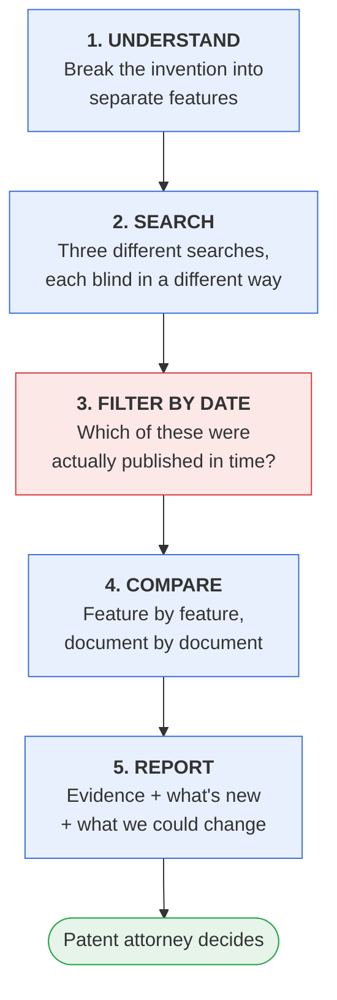
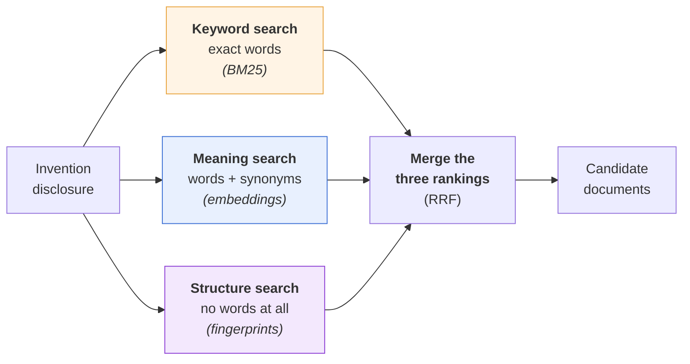
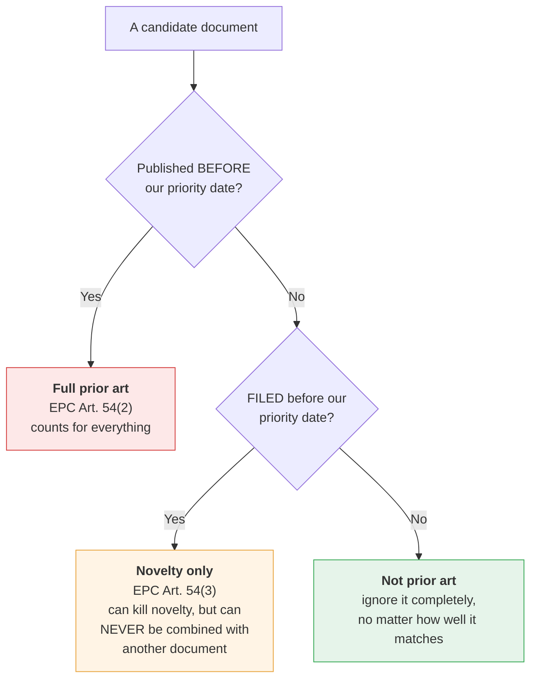

# Chapter 53 — Explain It Simply: The Whole System in Plain Words, with a Worked Example and Runnable Code

> **Why this chapter exists:** Chapters 49–51 are the depth. This one is the *explanation* — the version you say out loud. It walks the entire system in plain language, follows one invention all the way through, and every number quoted here is real output from [the runnable demo](../examples/prior_art_demo/) in this repository, not an illustration someone made up. If you can narrate this chapter, you can hold a whiteboard conversation about the system without notes.
>
> **Note on scope:** nothing here is legal advice, and the corpus in the demo is twelve fictional documents written for teaching. No conclusion about any real invention follows from it.

> **Patent & prior-art AI pack — Chapters 48–53.** A self-contained series on building and evaluating AI systems for **patent prior-art search, novelty assessment and design-around analysis** — the problem of deciding whether an invention already exists in the literature, and what could be changed if it does. Written for an ML/AI engineer with no patent-law or chemistry background who has to become useful in that domain quickly.
>
> **[48 · Orientation & strategy](48_patent_prior_art_ai_orientation.md) — [49 · Domain primer](49_patent_domain_primer_for_ai.md) — [50 · System design](50_prior_art_novelty_system_design.md) — [51 · Measurement & evaluation](51_novelty_measurement_and_evaluation.md) — [52 · Q&A bank](52_patent_ai_qa_bank.md) — [53 · Explain it simply](53_explaining_prior_art_ai_simply.md)**
>
> **Standing caveat:** novelty, inventive step and infringement are legal determinations made by qualified attorneys and examiners. Everything in this pack is about building **decision-support** that makes a human expert faster, never a system that decides.

---

## 1. The problem, in words anyone can follow

A company spends years and a lot of money on research. When researchers think they have invented something, they write it up and the company files a patent.

Filing is expensive. Drafting, official fees, translations, prosecution, then national validation — a single family can run into the tens of thousands of euros before anyone knows whether it will be granted. And the whole thing can be wasted for one reason: **somebody already described this.** Not necessarily a competitor's patent. It could be a conference poster, a supplier's catalogue, a PhD thesis in a university library, or the company's own earlier filing.

So before filing, somebody searches. Today that is a skilled professional with a commercial database, and it is slow.

The question the system answers is:

> **"Has anyone already described this invention — and if the answer is uncomfortably close, which part of it is actually new?"**

### The analogy that lands

It is a plagiarism checker, with three differences that change everything.

| Plagiarism checker | Prior-art checker |
|---|---|
| Looks for copied *text* | Looks for the same *idea*, however differently worded |
| Missing one source is embarrassing | Missing one document wastes a filing, or loses a lawsuit |
| Any match is a match | A match only counts if it was **published before your date** |
| One language, one vocabulary | The same molecule is written four different ways, sometimes only drawn |

Use the analogy to open, then immediately say what breaks it. That sequence — "here's the familiar shape, and here are the three ways this domain is harder" — is what makes you sound like you have thought about the problem rather than pattern-matched it.

---

## 2. The one sentence that frames the whole design

Say this before you draw anything:

> **"It's a recall-first, human-in-the-loop evidence system. It never decides novelty — it finds the documents, shows the exact sentences, and hands a patent attorney a first draft of the analysis they already do by hand."**

Three deliberate words:

- **Recall-first** — missing something costs vastly more than showing something irrelevant. A false alarm costs an attorney a few minutes. A miss costs a filing, or a court case.
- **Human-in-the-loop** — novelty is a legal determination. A system that prints "novel: yes" is making a claim it has no standing to make.
- **Evidence** — the deliverable is quoted sentences with dates attached, not a score.

Anyone can build something that returns plausible-looking patents. The hard part is knowing whether you missed the one that matters, and being able to prove what you did and did not look at.

---

## 3. The system in five steps



Step 3 is red on purpose. It is the step that is pure boring date arithmetic, it is the step nobody demos, and it is the step that decides whether the answer means anything at all.

### Step 1 — Break the invention into features

An invention is not one thing. It is a list of features that must **all** be present.

Our example disclosure:

> *A process for the selective hydrogenation of an unsaturated aldehyde, using **palladium** on a **gamma-alumina** support, with **cerium at 0.4–0.6 wt%**, at **180–220 °C**, at a **hydrogen-to-substrate ratio of 2.2–2.4**.*

Five features:

| | Feature |
|---|---|
| **E1** | palladium catalyst |
| **E2** | gamma-alumina support |
| **E3** | temperature 180–220 °C |
| **E4** | cerium promoter 0.4–0.6 wt% |
| **E5** | H₂:substrate ratio 2.2–2.4 |

**Why this matters so much.** The law says a document destroys novelty only if **one single document** discloses **every** feature. That single sentence changes the machine-learning problem completely:

> The question is **not** "which patent is most similar to mine". It is "does any *one* document contain *all five*?"
>
> A document that is 90% similar but missing feature 4 is worth **nothing**. A document that looks unrelated but happens to contain all five is **fatal**.

This is the single best thing you can say in the interview, because it is the point where the legal rule dictates the objective function, and most people building "AI patent search" never get there.

In production an LLM proposes this breakdown and **the attorney edits it before anything is searched**. That is the highest-leverage human checkpoint in the system — every result downstream is conditioned on getting this list right.

### Step 2 — Three searches, not one



Why three, in one line each:

- **Keyword search** is exact and unforgiving. It is perfect on catalogue numbers and chemical names — and it has *exactly zero* chance of finding a synonym it has never seen.
- **Meaning search** closes that hole. In our corpus the same support is written four ways: `gamma-alumina`, `gamma-aluminium oxide`, `aluminium oxide of the gamma phase`, `Al2O3 carrier of the gamma phase`. Only one of them contains the word "alumina". Keyword search cannot connect them; the concept layer normalises all four to one thing.
- **Structure search** reads no text at all. It compares molecules as sets of structural features. A patent can disclose a compound it never names in words — sometimes it is only in a drawing.

**Then merge with Reciprocal Rank Fusion.** RRF is worth being able to justify in one sentence, because it looks like a hack and is not:

```
score(document) = Σ  1 / (60 + rank in that channel)
                 channels
```

A BM25 score of 25.3 and a Tanimoto of 0.83 are on scales that have nothing to do with each other, and any normalisation you invent has to be re-tuned every time the corpus changes. RRF throws the scores away and uses only the **ranks**, so it needs no calibration at all. Learn weights later, from real feedback, once you have labels. Start here.

**The real reason for three channels is not coverage — it is honesty.** See §5.3.

### Step 3 — The date filter (the boring step that decides everything)

Three buckets, and they are pure arithmetic:



Why this cannot be left to a model: **no embedding represents a date comparison.** Ask a language model whether a document filed on 2026-08-01 is prior art against a priority date of 2026-03-01 and you are rolling dice on something a single `<` operator answers correctly every time. In the demo this is forty lines of ordinary Python in `corpus.py`, and it runs *before* anything is scored.

There is one more consequence worth raising unprompted, because it is a genuine limit rather than a bug: **applications are published 18 months after filing.** On any given day, roughly the last 18 months of the world's filings are invisible — to your system, to a commercial vendor's system, and to the patent examiner. Nobody can promise recall against documents that do not exist publicly yet. Saying this out loud, early, is what separates an honest system design from a sales pitch.

### Step 4 — The comparison grid

Now the piece that makes the whole thing click. Put **features down the side** and **documents across the top**, and fill each cell with whether that document discloses that feature — plus the sentence that proves it.

Here is the real output from the demo:

```
                                  EP3500007A1  JP2015000005 US8500003B1  NPL-JCAT-201 WO2019000004 EP3000006A1
                                  NOT ART      54(2)        54(2)        54(2)        54(2)        54(3)
------------------------------------------------------------------------------------------------------------
  E1  palladium catalyst          (●)          ●            ●            ●            ○            ●
  E2  gamma-alumina support       (●)          ●            ○            ●            ●            ●
  E3  reaction temperature        (○)          ◐            ◐            ○            ◐            ●
  E4  cerium promoter 0.4-0.6 wt% (●)          ○            ○            ○            ○            ●
  E5  H2:substrate ratio 2.2-2.4  (○)          ○            ○            ○            ○            ○
------------------------------------------------------------------------------------------------------------
  elements disclosed (● only)     3            2            1            2            1            4

  ● disclosed   ◐ arguably disclosed   ○ not found
  (brackets) = not prior art on the dates — shown, but must not be relied on
```

How to read it out loud, in four sentences:

1. **No column is full.** No single document discloses all five features, so no anticipation was found. Note the careful wording — that is *not* the same as "it is novel"; it means nothing was found in what was searched.
2. **Row E5 is completely empty.** Nobody discloses the hydrogen ratio. **That is the point of novelty** — the feature the filing currently rests on. It is the single most useful output of the whole system.
3. **Look at the first column.** `EP3500007A1` matches beautifully and is in brackets, because it was filed *after* our priority date. A system that ranked on similarity alone would have reported it as a perfect anticipation. It is not prior art at all.
4. **Look at the last column.** `EP3000006A1` discloses four of five features — but it is Art. 54(3). It can destroy novelty on its own, and it can *never* be combined with another document to argue obviousness. Same document, two different legal effects, depending on which question you are asking.

Every ● and ◐ carries the actual sentence. From the report:

```
  EP3000006A1  [54(3)]
    ● E4: "A catalyst comprising palladium on a gamma-alumina support and cerium
           in an amount of 0.35 to 0.75 wt%, used at a temperature of 175 to 225
           degrees C."
         -> the disclosed range 0.35–0.75 wt% encompasses the claimed 0.4–0.6 —
            this is the selection-invention question, and it is a legal call
```

**No span, no cell.** The system is never allowed to assert a disclosure without quoting the sentence it came from, verified character-for-character against the source document. That single architectural rule is what kills citation hallucination — not a better prompt.

### Step 5 — "So what can we change?"

Once you know which feature is carrying the novelty, you can ask where the unoccupied space is. Take each numeric feature, plot what the prior art occupies, and look for the gaps. Real output:

```
  E5: the claimed H2:substrate ratio (2.2–2.4) is UNOCCUPIED by any document
      in this pool — the strongest differentiator found
      occupied: 1.0–2.1 [JP2015000005A]

  E3: the claimed temperature (180–220 °C) lies wholly INSIDE a range already
      disclosed — this element does not differentiate on its own
      occupied: 150.0–260.0 [EP1000001A1, EP3000006A1, JP2015000005A,
                             US8500003B1, WO2019000004A1]

  E4: the claimed cerium loading (0.4–0.6 wt%) lies wholly INSIDE a range
      already disclosed — this element does not differentiate on its own
      occupied: 0.1–0.3 [WO2019000004A1], 0.35–0.75 [EP3000006A1]
      unoccupied gaps: 0.3–0.35
```

In plain English: *the temperature and the cerium loading are inside territory somebody already claimed; the hydrogen ratio is the one genuinely open dimension.*

**And then the sentence that keeps this honest**, which you should volunteer rather than wait to be asked:

> "A change is only useful if our own application already supports it. Under EPC Art. 123(2) you cannot add subject-matter later that was not directly and unambiguously derivable from what you filed. So a clever narrowing the model invents, that appears nowhere in our own text, isn't a rescue — it's an added-matter objection."

That has a real consequence for **when** the tool is valuable: by the time you are arguing with an examiner, the set of available changes is already frozen. The high-value moment is **before drafting** — run the landscape first, then make sure the fallback positions are actually written into the specification so they exist later. If someone briefs you for a "fix our rejected applications" tool, that is worth surfacing politely on day one.

---

## 4. The complete worked example, end to end

One invention, twelve documents, start to finish. All figures are real demo output.

**Retrieval.** The three channels return genuinely different rankings:

```
  bm25       US8500003B1(25.26)  JP2015000005A(24.58)  WO2019000004A1(24.26) ...
  concept    US8500003B1(29.34)  EP3500007A1(28.18)    JP2015000005A(27.67)  ...
  structure  EP3000006A1(1.00)   EP3500007A1(1.00)     NPL-JCAT-2019(1.00)   ...
```

Note that the structure channel puts `EP3000006A1` and `NPL-JCAT-2019-0112` at the top and **neither text channel returns them at all** at this depth. Chemistry found what words missed.

**Fusion and family de-duplication.** RRF merges the three, then documents from the same patent family collapse to one entry — `EP1000001A1` and `US9000002B2` are the same invention filed twice, and showing an attorney both as separate hits is the fastest way to lose their trust.

**Dates.** `EP3500007A1` → not prior art (filed 2026-08-01, after the 2026-03-01 priority date). `EP3000006A1` → Art. 54(3), novelty only.

**The grid.** As shown above. No anticipation. Point of novelty: **E5**.

**Inventive-step hypothesis.** The system also solves a small set-cover: which *combination* of documents jointly covers the features? It reports the combination and then stops, because whether the skilled person **would** have combined them is a legal argument about motivation, not a distance in a vector space.

**How much did we miss?** This is the question most systems cannot answer at all:

```
  found 8; estimated total 9.5 (95% CI 8.2–20.9); estimated missed 1.5
  singletons f1=3  doubletons f2=3
```

The method is the one ecologists use to count fish. Run several independent searches; if they barely overlap there is a lot you have not seen, and if they agree almost perfectly you are near the ceiling. Three documents were found by only one channel (`f1=3`) and three by exactly two (`f2=3`), which gives an estimate of roughly 1.5 documents still out there.

Note the confidence interval: **8.2 to 20.9**. It is wide, and it is asymmetric on purpose. Reporting "we found 8 of an estimated 9.5" without that interval would be far more confident than the data supports.

---

## 5. Three ideas that make you sound like you have built this

### 5.1 Similarity is not novelty

Everyone reaches for cosine similarity. Ask what the number means.

Across published patent corpora, the **median** similarity between two random patents is about **7.8%**, and the **95th percentile is only about 22.9%**. So a cosine of 0.23 is already "extremely similar" in this domain. Anyone proposing "flag anything above 0.5" has never looked at the background distribution, and their filter will fire on almost nothing.

The fix is to stop using absolute thresholds. Report a score as its **percentile within its own cohort** — same technology class, same time period — because similarity is not comparable across fields or across decades.

### 5.2 The metric everyone reaches for is the wrong one

Suppose ten genuinely relevant documents exist in a corpus of ten million. That is a base rate of one in a million.

Now suppose your model has an excellent false-positive rate of 0.01%. That still returns about a thousand irrelevant documents for the ten real ones — **roughly 1% precision.** Meanwhile ROC-AUC will look magnificent, because ROC-AUC is insensitive to how rare the positives are.

So: never quote AUC here. Fix a **recall target** — around 0.80 for landscape scanning, 0.95+ for freedom-to-operate, where a miss can mean an injunction — and report the **review cost** of hitting it. That converts an argument about model quality into an arithmetic question the business can actually answer.

### 5.3 The reason for three channels is honesty, not coverage

This is the subtle one, and it is the best thing in the chapter.

The recall estimate in §4 only works if the searches can fail **independently**. If your three "different" channels are all dense retrievers over the same embedding, they all miss the same synonym-hidden document *together*. Then the singleton count collapses, and the estimator confidently tells you that you missed nothing.

> **Channel diversity is a statistical requirement, not an engineering preference.** Keyword, meaning and structure fail for genuinely different reasons — which is exactly what makes the overlap between them informative.

If you say only one thing from this chapter that a senior person remembers, make it this.

---

## 6. Narrating it in three minutes

Rough script. Adapt the wording; keep the order.

> **The problem.** "Filing a patent is expensive, and it's wasted if someone already described the invention. Today a skilled searcher does that check by hand. The system helps them do it faster and proves what was checked."
>
> **The framing.** "I'd build it as recall-first, human-in-the-loop decision support. It never decides novelty — it finds documents, quotes the exact sentences, and hands an attorney a first draft of the analysis they already do."
>
> **The key insight.** "The legal rule shapes the machine-learning problem. Novelty needs *one* document disclosing *every* feature. So the primitive isn't 'which patent is most similar' — it's a grid: features down the side, documents across the top. A document that's 90% similar but missing feature four is worth nothing."
>
> **The pipeline.** "Break the invention into features. Search three ways — keyword, meaning, and chemical structure — because each is blind differently. Merge with reciprocal rank fusion, since the scores aren't comparable. Then apply the date rules, deterministically, never with a model. Then fill in the grid, with a quoted span behind every cell."
>
> **The payoff.** "An empty row in the grid is the point of novelty — the feature the filing rests on. That feeds the design-around step: plot what the prior art occupies on that axis and find the gaps. Any change still has to be supported by our own application as filed, so this is worth much more before drafting than after."
>
> **The honesty.** "Three things I'd say up front. The last eighteen months of filings are unpublished, so nobody can promise recall against them. Precision at this base rate is brutal, so I'd set a recall target and report review cost rather than quote AUC. And I'd want the retrieval channels to fail independently, because that's what makes the estimate of what we *missed* trustworthy."
>
> **The boundary.** "And unpublished invention disclosures never leave our control — a public disclosure can itself destroy novelty, so that decides model hosting before any benchmark does."

Then stop and ask a question. Suggested: *"Which of the three searches is this — patentability before filing, freedom-to-operate, or invalidity? They need different recall targets and different indexed units."*

---

## 7. The code

Everything above runs:

```bash
cd examples/prior_art_demo
python run_demo.py                    # the full evidence report
python run_demo.py --explain-tanimoto # the Tanimoto size bound, worked
python -m unittest discover -s tests -v   # 25 tests
```

Python 3.10+, **no third-party packages**, twelve fictional documents.

| File | What it teaches |
|---|---|
| [`priorart/text.py`](../examples/prior_art_demo/priorart/text.py) | Four spellings of one chemical collapsing to one concept |
| [`priorart/corpus.py`](../examples/prior_art_demo/priorart/corpus.py) | The date engine — Art. 54(2) vs 54(3) vs not prior art |
| [`priorart/retrieval.py`](../examples/prior_art_demo/priorart/retrieval.py) | BM25, concept and structure channels; Tanimoto; RRF |
| [`priorart/elements.py`](../examples/prior_art_demo/priorart/elements.py) | Feature decomposition, span extraction, numeric range logic |
| [`priorart/matrix.py`](../examples/prior_art_demo/priorart/matrix.py) | The grid, anticipation detection, set cover |
| [`priorart/recall.py`](../examples/prior_art_demo/priorart/recall.py) | Chao1 and Chapman — estimating what you missed |
| [`priorart/designaround.py`](../examples/prior_art_demo/priorart/designaround.py) | White-space mapping over numeric ranges |

Two details in the code worth mentioning if anyone digs, because both are real bugs that appeared while building it and both are the kind of thing that quietly ruins a production system:

- **A full stop broke a retrieval channel.** `"supported on gamma-alumina."` did not match the phrase `gamma alumina`, because the sentence-ending period was still attached. One punctuation character silently removed documents from an entire channel. Fixed in `text.py`, with a test.
- **A number was attributed to the wrong chemical.** In `"nickel (5 wt%) with cerium (0.2 wt%)"`, a naive "find a wt% figure in a sentence mentioning cerium" rule reports a cerium loading of 5 wt%. That phantom value then leaks into the white-space map, which is worse than having no map at all. Fixed with nearest-cue-wins attribution in `elements.py`, with a test.

Mentioning a bug you found and fixed is a stronger signal than any clean architecture diagram. It says you ran the thing.

---

## 8. The obvious questions, answered plainly

**"Why not just use ChatGPT?"**
Use one — as the reasoning and writing layer. But a chat model has no index of a hundred-million-plus patent documents, so it cannot retrieve; it invents plausible patent numbers, which is the worst possible failure here; it has a knowledge cutoff, and prior art has an 18-month publication lag on top of that; and it cannot do the date logic, which is a `<` comparison rather than a judgement. So: LLM for planning and explaining, over a retrieval system that owns correctness.

**"Can't the AI just tell us if it's novel?"**
On published benchmarks, models pick the right prior-art document from a shortlist of eight around 77% of the time — but judging novelty itself lands near 45% against a 32% random baseline. A 13-point edge over guessing is not a decision system. Retrieval, yes. Judgement, no. And that is a legal determination anyway.

**"What if it misses something?"**
Then it is worse than useless, because it manufactures false confidence. That is why the system estimates its own miss rate using capture–recapture across independently-failing channels, reports a confidence interval rather than a point estimate, and states explicitly what was not searched.

**"How do you stop it making up citations?"**
Architecturally, not by prompting. Every asserted disclosure must quote a span that matches the source document character-for-character; the check is programmatic, and output that fails it is dropped. No span, no cell.

**"How long would this take?"**
Two weeks building the evaluation set before any model — you cannot improve what you cannot measure. Then a six-week thin slice on one technology area, text-only, measured against a plain keyword-plus-classification baseline. If it cannot beat that baseline at equal review cost, the honest answer is better search tooling, not machine learning.

**"Why not just buy it?"**
Seriously consider it — several vendors do public-corpus patent search well, and one publishes reproducible metrics. The case for building is narrow and it is about data, not algorithms: no external vendor can index your **unpublished invention disclosures** or your internal research corpus, and those are exactly the documents that make an internal tool different from a commercial search engine. So: probably buy the public-corpus layer, build the internal-corpus and workflow layer. That hypothesis is worth nothing until you have seen the data and the licences.

---

*If you have time for one more chapter, read [51 · Measurement & evaluation](51_novelty_measurement_and_evaluation.md) — it is where the numbers in §5 come from, and it is the chapter that survives contact with a statistically-trained interviewer.*
