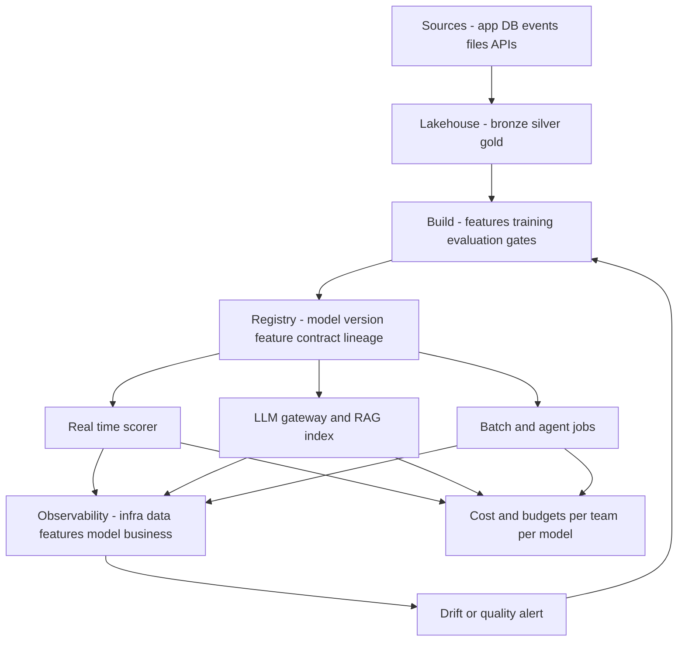
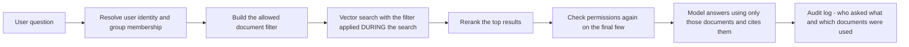
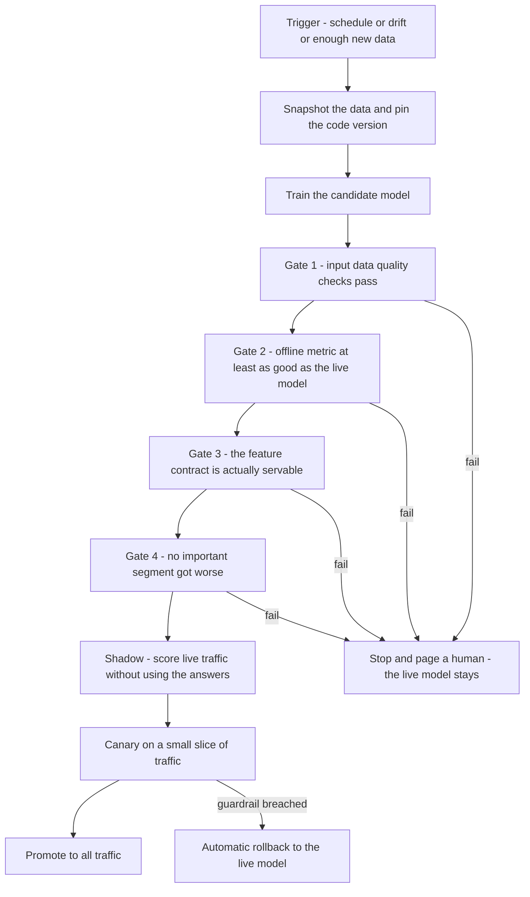

# Chapter 57 — Three System Design Answers, in Simple English

> **The short one.** [Chapter 55](55_smartsheet_r2_design_domain.md) and
> [Chapter 56](56_smartsheet_r2_simple_english.md) are long. This is the version you read when you
> have twenty minutes: **three system design questions, three answers, three diagrams.**
>
> These are the three most likely prompts for an AI/ML Ops design round. Each answer is built to be
> delivered in about 20 minutes. Every diagram comes twice — a Mermaid version to read, and an ASCII
> version narrow enough to type into a shared editor while you talk.

---

## How to open any design question

Do these three things before you draw anything. They take ninety seconds and they change how the
rest of the hour is scored.

1. **Say the problem back in one sentence.** "So — many teams want to ship AI features, and you want
   one safe road instead of ten private ones. Have I got that right?"
2. **Ask three to five questions.** Then **type the answers on the pad.** Writing them down is the
   signal, not the asking.
3. **State your numbers out loud.** "I'll assume a thousand requests a second at peak — stop me if
   that's wrong." A wrong number they correct is better than no number.

> **Say it like this, at the start:**
> "I'll ask a few questions first, write down what I'm assuming, then draw. If I assume something
> silly, cut me off early."

---

## Design 1 — "Design an AI/ML Ops platform so many teams can ship AI features safely"

**What they are really checking:** can you think in *planes* rather than in tools, and do you know
what makes a platform a platform — one paved road that many teams use, with guarantees.

### Questions to ask

| Question | Why it changes the design |
|---|---|
| How many teams and how many models? | 5 models needs a checklist. 500 needs a registry and automation. |
| Classical models, LLM features, or both? | Both means two serving paths, not one. |
| Latency budget for the worst case? | Decides serverless vs a warm box vs GPU. |
| Is there a cost ceiling per feature? | Cost is a design input here, not an afterthought. |
| Any tenants with data-residency rules? | Government or EU tenants restrict which models you may even call. |

**If they say "you decide," assume this and say so:** 10 teams, 60 models, mixed classical and LLM,
p95 under 300 ms for real-time scoring, a few million AI requests a day, cost must be predictable
per team.

### The diagram



The same thing, narrow enough to type:

```text
      SOURCES              LAKEHOUSE                 BUILD
  +--------------+     +---------------+     +-------------------+
  | app DB files |     | bronze  raw   |     | features          |
  | events  APIs | --> | silver  clean | --> | training runs     |
  +--------------+     | gold    ready |     | evaluation gates  |
                       +---------------+     +---------+---------+
                                                       |
                                                       v
  +-----------------------------------------------------------------+
  |  REGISTRY   model + version + feature contract + lineage         |
  +--------------------------------+--------------------------------+
                                   |
       +---------------------------+---------------------------+
       v                           v                           v
 +------------+            +---------------+           +--------------+
 | real-time  |            | LLM gateway   |           | batch and    |
 | scorer     |            | and RAG index |           | agent jobs   |
 +-----+------+            +-------+-------+           +------+-------+
       |                           |                          |
       +------------+--------------+------------+-------------+
                    v                           v
        +----------------------+     +------------------------+
        | OBSERVABILITY        |     | COST AND BUDGETS       |
        | infra data features  |     | per team, per model,   |
        | model business       |     | per tenant             |
        +----------+-----------+     +------------------------+
                   |
                   +---> drift alert ---> back to BUILD (retrain)
```

### Walking it — one or two sentences per box

**Lakehouse.** All data lands in one governed place, in three grades: raw, cleaned, and ready to
use. Governance sits across all three — who can read what, and where each column came from.

**Build.** Features, training runs and evaluation. The important part is not the training. It is
that every run writes down what data and what code produced it, so any model can be rebuilt.

**Registry.** The single answer to "what is in production, and what does it need to run?" Each model
version carries a **feature contract** — the exact list of inputs it expects, with types.

**Real-time scorer.** Loads a model version and its contract. If a required input is missing, it
**fails loudly** instead of quietly filling in a default.

**LLM gateway.** One door in front of every foundation model. It does routing, fallback when a
provider is down, caching, per-team token budgets, and logging with sensitive fields redacted.

**Observability.** Five layers: infrastructure, data, features, model, business. Different failures
show up at different layers, and the cheapest early alarm is the model's own output distribution,
because it needs no labels.

**Cost.** Every request is tagged with team, model and tenant. You cannot control a bill you cannot
break down.

### The three hard choices

| Choice | Options | What I'd pick and why |
|---|---|---|
| Where do LLM features run? | Managed model serving · a hosted model API · self-hosted on Kubernetes | Start with a managed API behind our own gateway. Self-hosting only pays off at steady, high volume — and the gateway means we can switch later without touching product code. |
| Feature store, or just a contract? | Full feature store · a serialised feature contract per model | Contract first. It is a week of work and it kills the biggest class of bug. A feature store is right when several teams reuse the same features — build it when that is true, not before. |
| One shared vector index, or one per tenant? | Shared with filters · index per tenant | Shared with filters, until a tenant's contract forbids it. Index-per-tenant is operationally heavy at hundreds of tenants. |

> **Say it like this:**
> "I'd deliberately not build a feature store in year one. The contract gets ninety percent of the
> benefit for a tenth of the effort, and I'd rather spend that time on the promotion gates."

### What breaks, and the control for it

| Failure | Control |
|---|---|
| A model is served inputs it never saw in training | Feature contract + hard fail + a CI check that blocks promotion |
| Nobody knows which model is live | Registry is the only deploy source; no manual pushes |
| Drift alerts fire daily and are ignored | Alert on the model's output distribution and on segments, not on every feature |
| One team's runaway job blows the bill | Per-team budgets in the gateway, plus spend anomaly alerts |
| A provider outage takes the feature down | Gateway falls back to a second model, then to a cached or rules-based answer |

> **Closing line:** "Ninety days: lakehouse, registry, contracts and the gateway. Six months:
> automated retraining with gates. What I would *not* build in year one is a feature store or our own
> serving stack — both are answers to problems we would not have yet."

---

## Design 2 — "A user asks a question in plain English and gets an answer from their own data. Design it."

**What they are really checking:** do you understand that in a multi-customer product, **permissions
are the hard part of retrieval**, not the model.

> **Name the crux in your first sentence.** "The retrieval is standard. The part I'd spend the time
> on is making sure the search itself can never return a document this user isn't allowed to see."

### Questions to ask

- Are permissions per document, or per row inside a document?
- How fast must a permission change take effect — seconds, or is a minute acceptable?
- How often does the underlying content change? (If constantly, index freshness is a real problem.)
- Do any customers require their data to stay in a specific region?
- Do we need to show citations? (It changes chunking and storage.)

### The diagram



```text
  question
     |
     v
  [ who is asking? resolve user + groups ]
     |
     v
  [ build allowed-document filter ]
     |
     v
  +----------------------------------------------+
  |  VECTOR SEARCH with the filter applied        |
  |  DURING the search, not after it              |
  +----------------------+-----------------------+
                         v
              [ rerank: top 50 -> top 8 ]
                         v
        [ check permissions AGAIN on those 8 ]
                         v
        [ model answers, citing only those 8 ]
                         v
        [ audit log: user, question, doc ids ]
```

### The one thing to explain properly: filter *during*, not *after*

This is the whole answer, and it is the part most candidates get wrong.

| Approach | What happens | Verdict |
|---|---|---|
| **Post-filter** — search everything, then drop what the user can't see | You ask for 10 results, get 10, drop 7, and answer from 3. The user silently gets a worse answer. Worse, the ranking was computed over data they cannot see. | Wrong |
| **Pre-filter** — narrow to allowed documents, then search | Correct results, but on a big index a naive pre-filter can be slow | Right idea |
| **Filtered search** — the index honours the permission filter while it searches | Correct *and* fast. Most serious vector stores support this. | What I'd use |

> **Say it like this:**
> "Post-filtering looks fine in a demo and fails quietly in production, because you asked for ten
> documents and answered from three. I'd push the permission filter into the search itself, and then
> check permissions a second time on the final few before they reach the prompt. Belt and braces —
> the second check is cheap and it catches a stale filter."

**Keeping permissions fresh.** Permissions are copied into the index as metadata, so they can go
stale. Two controls: re-sync on every permission-change event, and treat the second check before the
prompt as the real gate. Also invalidate cached answers when permissions change — a cached answer is
a permission leak with a timestamp.

**Keeping content fresh.** Content changes constantly, so index on change events, not on a nightly
job. Track "how old is the oldest un-indexed change" as a metric with an alert on it.

### What breaks, and the control for it

| Failure | Control |
|---|---|
| A user sees content from another customer | Tenant id is a mandatory filter, enforced in code not convention — plus an automated leak test in CI that queries as user A for user B's known document and must get nothing |
| A user sees a document they lost access to yesterday | Re-check permissions after retrieval; invalidate cached answers on permission change |
| Answers get worse as the index grows | Track retrieval recall on a small golden set, weekly |
| The model invents a fact | Only answer from retrieved text, always cite, and measure how often the answer is actually supported by its sources |
| The bill grows faster than usage | Cache, cap results per query, and only rerank the shortlist |

> **Closing line:** "The thing I'd build on day one is the leak test — a test that asks as one user
> for another user's document and fails the build if anything comes back. Everything else is
> recoverable. That one is not."

---

## Design 3 — "Automate retraining. How do you stop a bad model shipping itself?"

**What they are really checking:** whether you have actually watched automation ship something bad.
Answer it as an engineer who has, not as someone describing a diagram.

> **Open with the real story:**
> "I'll answer this through something I hit. I owned a loan-propensity model — trained offline,
> served in real time. Offline it looked healthy. In production it collapsed. The training pipeline
> built four thousand and one features; the live request carried twenty-eight keys. The transform
> filled the rest with defaults, so the model was scoring a nearly constant vector — and *nothing
> errored*. That is why I design the gates the way I do."

### The diagram



```text
  trigger: schedule / drift / enough new data
      |
      v
  snapshot data + pin code version   <-- so the run is reproducible
      |
      v
  train candidate
      |
      v
  GATE 1  data quality              --fail--> stop, page, keep champion
  GATE 2  metric >= champion        --fail--> stop, page, keep champion
  GATE 3  contract is servable      --fail--> stop, page, keep champion
  GATE 4  no segment got worse      --fail--> stop, page, keep champion
      |
      v
  shadow  (score live traffic, use nothing)
      |
      v
  canary  (small slice of real traffic)  --breach--> auto rollback
      |
      v
  promote to 100 percent
```

### Why each gate exists

**Gate 1 — data quality.** Bad input makes a bad model with a perfectly good-looking metric. Check
row counts, freshness, null rates and schema before training, not after.

**Gate 2 — metric versus the live model.** Compare on the same held-out period. "Better than last
time" is not the bar; "at least as good as what is running" is.

**Gate 3 — is it servable?** This is the gate that would have caught my bug. Take the feature list
the model was trained on and assert it is a subset of what the live request actually carries. If it
is not, the model cannot be served correctly — so it must not be promoted.

**Gate 4 — segments.** An overall metric can improve while one important customer segment gets much
worse. Check the segments that matter separately.

**Shadow, then canary.** Shadow proves it runs on real traffic and produces sane outputs, with no
risk. Canary exposes a small slice and watches guardrail metrics. Only then, full traffic.

> **Say it like this, about failing:**
> "Every gate fails *closed*. The candidate is stopped and the current model keeps serving. A loud
> failure on one deploy is much better than a quiet wrong answer on every request — and the plausible
> wrong answer is the dangerous one, because people act on it."

### What breaks, and the control for it

| Failure | Control |
|---|---|
| A worse model passes because labels are late | Do not gate on outcomes that take weeks to mature — gate on data quality, contract and the output distribution, and review accuracy later |
| The retrain runs on data corrupted by an upstream change | Gate 1, plus alerting on the input tables themselves |
| Rollback is theoretical and nobody has tested it | Practise it. Keep the previous version warm and make rollback one command |
| The retrain silently stops running | Alert on *absence* — if no successful run in N days, page |
| Two retrains race and both promote | One promotion lock; the registry is the only path to production |

> **Closing line:** "The trigger matters far less than the gates. I'd rather retrain monthly with
> four gates that fail closed than nightly with none. And I'd add the contract gate first, because
> that is the one that has actually bitten me."

---

## The last thing

If you only remember one sentence from this file, make it this one, because it works in all three
answers:

> **"I'd rather it fail loudly than answer quietly with something wrong."**

That single idea is the feature contract in Design 1, the second permission check in Design 2, and
every gate in Design 3. Say it once, early. Then let the rest of the hour point back at it.
