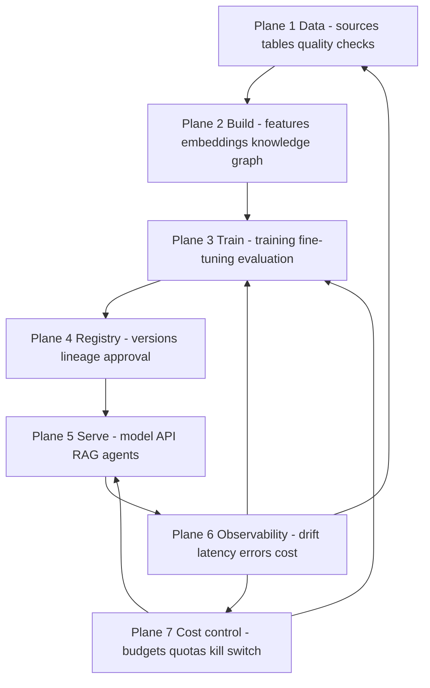
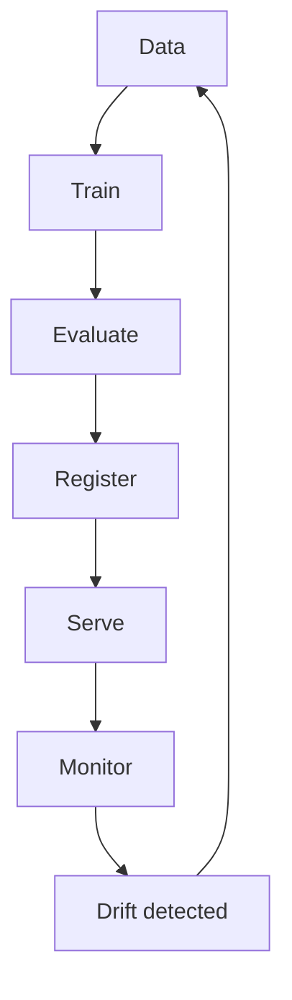
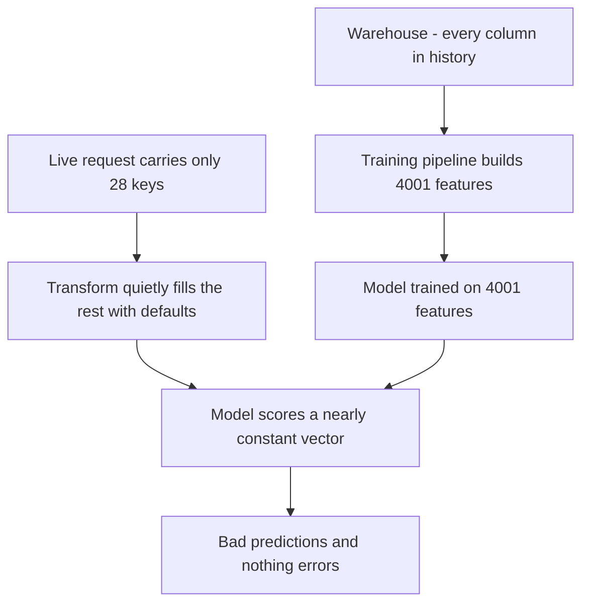
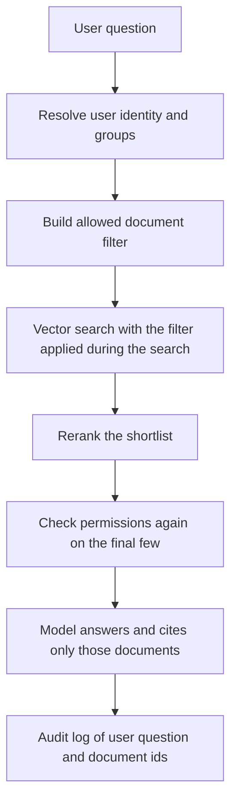
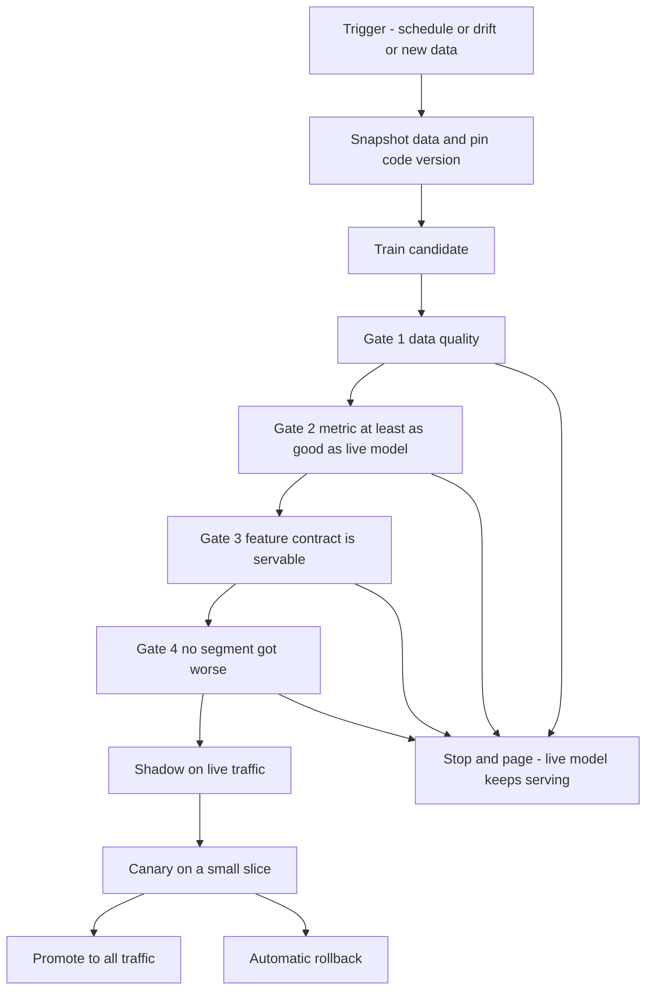
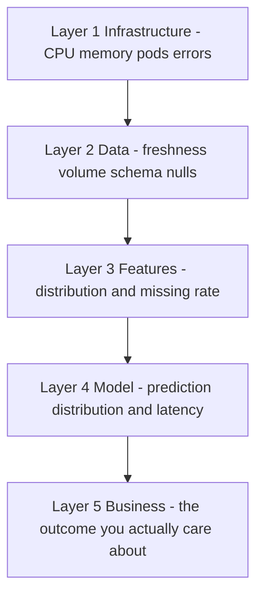

# Chapter 58 — The Diagrams, on Their Own

> **Why this file exists.** Chapters 55 and 56 are large files (1.2 MB and 450 KB). GitHub stops
> rendering rich content — Mermaid included — in files that big, which is why the diagrams there show
> as raw code. This file is small and uses the most conservative Mermaid syntax available: no
> subgraphs, no chained arrows, no edge labels, short plain labels. If Mermaid renders anywhere in
> this repository, it renders here.
>
> **The ASCII versions are the ones that matter.** In the interview you will be typing into a shared
> text editor, not embedding pictures. Every diagram below appears twice: Mermaid to read, and ASCII
> under 76 columns to type. Learn the ASCII ones.

---

## 1. The platform — seven planes

Draw this and almost any platform question lands inside one of the boxes.



```text
      SOURCES              LAKEHOUSE                 BUILD
  +--------------+     +---------------+     +-------------------+
  | app DB files |     | bronze  raw   |     | features          |
  | events  APIs | --> | silver  clean | --> | training runs     |
  +--------------+     | gold    ready |     | evaluation gates  |
                       +---------------+     +---------+---------+
                                                       |
                                                       v
  +-----------------------------------------------------------------+
  |  REGISTRY   model + version + feature contract + lineage         |
  +--------------------------------+--------------------------------+
                                   |
       +---------------------------+---------------------------+
       v                           v                           v
 +------------+            +---------------+           +--------------+
 | real-time  |            | LLM gateway   |           | batch and    |
 | scorer     |            | and RAG index |           | agent jobs   |
 +-----+------+            +-------+-------+           +------+-------+
       |                           |                          |
       +------------+--------------+------------+-------------+
                    v                           v
        +----------------------+     +------------------------+
        | OBSERVABILITY        |     | COST AND BUDGETS       |
        | infra data features  |     | per team, per model,   |
        | model business       |     | per tenant             |
        +----------+-----------+     +------------------------+
                   |
                   +---> drift alert ---> back to BUILD (retrain)
```

**Say it while you draw:** "Seven planes — data, build, train, registry, serve, observability, and
cost sitting across the whole thing. Every question you ask me will land in one of these boxes, so
tell me which one you want to go deep on."

---

## 2. The lifecycle is a loop, not a line



```text
   data --> train --> evaluate --> register --> serve --> monitor
     ^                                                       |
     |                                                       v
     +---------------- drift detected <----------------------+
```

**Say it:** "The reason it is a loop is that the world moves. A model is not finished when it ships;
it starts decaying the moment it ships."

---

## 3. Train/serve skew — the bug worth telling

This is your 4,001-versus-28 story as a picture.



```text
  TRAINING PATH                         SERVING PATH
  warehouse: all history                live request: 28 keys
        |                                      |
        v                                      v
  build 4,001 features              transform fills the missing
        |                           4,000-ish with DEFAULTS
        v                                      |
  model expects 4,001                          v
        \______________________________________/
                            |
                            v
            scores a near-constant vector
                            |
                            v
            wrong answers, and NOTHING errors
```

**The fix, in four words each:** contract next to the model · hard fail on missing · CI blocks
promotion · emit missing-rate metric.

**Say it:** "Two different data planes, two different authors, no shared definition of a feature. So
skew is the default state of an ML system — parity is something you actively maintain."

---

## 4. Answering questions over customer data, with permissions



```text
  question
     |
     v
  [ who is asking? resolve user + groups ]
     |
     v
  [ build allowed-document filter ]
     |
     v
  +----------------------------------------------+
  |  VECTOR SEARCH with the filter applied        |
  |  DURING the search, not after it              |
  +----------------------+-----------------------+
                         v
              [ rerank: top 50 -> top 8 ]
                         v
        [ check permissions AGAIN on those 8 ]
                         v
        [ model answers, citing only those 8 ]
                         v
        [ audit log: user, question, doc ids ]
```

**The sentence that wins this question:** "Post-filtering looks fine in a demo and fails quietly in
production — you asked for ten documents and answered from three. Push the permission filter into
the search itself, then check again on the shortlist before anything reaches the prompt."

---

## 5. Retraining, with gates that fail closed



```text
  trigger: schedule / drift / enough new data
      |
      v
  snapshot data + pin code version   <-- so the run is reproducible
      |
      v
  train candidate
      |
      v
  GATE 1  data quality              --fail--> stop, page, keep champion
  GATE 2  metric >= champion        --fail--> stop, page, keep champion
  GATE 3  contract is servable      --fail--> stop, page, keep champion
  GATE 4  no segment got worse      --fail--> stop, page, keep champion
      |
      v
  shadow  (score live traffic, use nothing)
      |
      v
  canary  (small slice of real traffic)  --breach--> auto rollback
      |
      v
  promote to 100 percent
```

**Say it:** "Every gate fails closed. The candidate stops and the current model keeps serving. A loud
failure on one deploy beats a quiet wrong answer on every request."

---

## 6. Monitoring in layers — which alarm fires first



```text
  LAYER                        catches                     speed
  ------------------------------------------------------------------
  5 business outcome     the thing you care about          slowest
  4 model                prediction drift, latency         fast, no labels
  3 features             missing rate, distribution        fast
  2 data                 freshness, volume, schema         fastest
  1 infrastructure       CPU, memory, errors               fastest
  ------------------------------------------------------------------
  Rule: the higher the layer, the more it matters and the later it tells you.
  So alarm low for speed, and review high for truth.
```

**Say it:** "Prediction-distribution monitoring is the cheapest early alarm there is, because it
needs no labels. Anything that depends on labels is a post-mortem tool, not a monitor."

---

## If the Mermaid still does not render

It is not your setup and it is not worth another minute of your time before the call. Use the ASCII
blocks — those are plain text and always display, and they are the ones you will actually type into
the shared editor. The Mermaid versions are a convenience for reading, nothing more.
